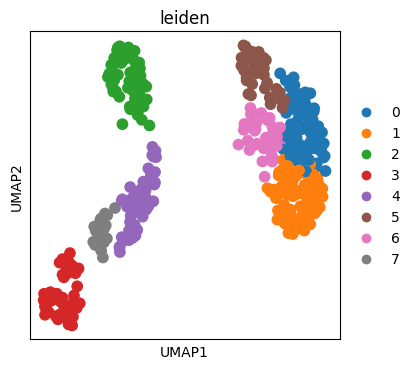
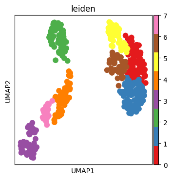
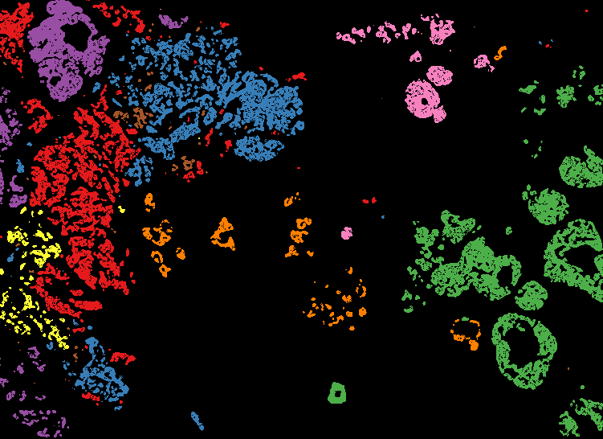

.. code:: ipython3

    import skny as sk
    import stlearn as st
    import scanpy as sc
    import matplotlib.pyplot as plt
    import matplotlib
    import numpy as np
    import pandas as pd

.. code:: ipython3

    xenium_path = "/Volumes/Project/home/sakai/CODEX/data/breast_sample"

.. code:: ipython3

    # Load public data (breast)
    adata = st.ReadXenium(feature_cell_matrix_file=f"{xenium_path}/cell_feature_matrix.h5",
                         cell_summary_file=f"{xenium_path}/cells.csv.gz",
                         library_id="example of Xeniuma data",
                         image_path=None,
                         scale=1,
                         spot_diameter_fullres=10
                         )
    
    # Gridding at 10μm interval
    N_COL = int((adata.obs.imagecol.max() - adata.obs.imagecol.min()) / 10)
    N_ROW = int((adata.obs.imagerow.max() - adata.obs.imagerow.min()) / 10)
    grid = st.tl.cci.grid(adata, n_row=N_ROW, n_col=N_COL, n_cpus=30, verbose=False)

.. code:: ipython3

    grid = sk.pp.calculate_distance(
        grid, pos_marker_ls=['CDH1'], 
    )

.. code:: ipython3

    sk.pl.clustering_heatmap(grid)

.. raw:: html

    
                            

            <script type="text/javascript">                require(["plotly"], function(Plotly) {                    window.PLOTLYENV=window.PLOTLYENV || {};                                    if (document.getElementById("6e9d0c99-a2cd-47ed-8b9c-7ed02140ebe2")) {                    Plotly.newPlot(                        "6e9d0c99-a2cd-47ed-8b9c-7ed02140ebe2",                        [{"colorscale":[[0.0,"#440154"],[0.1111111111111111,"#482878"],[0.2222222222222222,"#3e4989"],[0.3333333333333333,"#31688e"],[0.4444444444444444,"#26828e"],[0.5555555555555556,"#1f9e89"],[0.6666666666666666,"#35b779"],[0.7777777777777778,"#6ece58"],[0.8888888888888888,"#b5de2b"],[1.0,"#fde725"]],"hoverinfo":"text","text":[["BACE2 (-120.0, -90.0]\u003cbr\u003e \n    Mean density=0.023\u002f\u03bcm\u003csup\u003e2\u003c\u002fsup\u003e\u003cbr\u003e \n    Z-score=2.271","BACE2 (-90.0, -60.0]\u003cbr\u003e \n    Mean density=0.011\u002f\u03bcm\u003csup\u003e2\u003c\u002fsup\u003e\u003cbr\u003e \n    Z-score=1.058","BACE2 (-60.0, -30.0]\u003cbr\u003e \n    Mean density=0.003\u002f\u03bcm\u003csup\u003e2\u003c\u002fsup\u003e\u003cbr\u003e \n    Z-score=0.337","BACE2 (-30.0, 0.0]\u003cbr\u003e \n    Mean density=-0.002\u002f\u03bcm\u003csup\u003e2\u003c\u002fsup\u003e\u003cbr\u003e \n    Z-score=-0.199","BACE2 (0.0, 30.0]\u003cbr\u003e \n    Mean density=-0.004\u002f\u03bcm\u003csup\u003e2\u003c\u002fsup\u003e\u003cbr\u003e \n    Z-score=-0.44","BACE2 (30.0, 60.0]\u003cbr\u003e \n    Mean density=-0.005\u002f\u03bcm\u003csup\u003e2\u003c\u002fsup\u003e\u003cbr\u003e \n    Z-score=-0.526","BACE2 (60.0, 90.0]\u003cbr\u003e \n    Mean density=-0.008\u002f\u03bcm\u003csup\u003e2\u003c\u002fsup\u003e\u003cbr\u003e \n    Z-score=-0.85","BACE2 (90.0, 120.0]\u003cbr\u003e \n    Mean density=-0.009\u002f\u03bcm\u003csup\u003e2\u003c\u002fsup\u003e\u003cbr\u003e \n    Z-score=-0.901","BACE2 (120.0, 150.0]\u003cbr\u003e \n    Mean density=-0.008\u002f\u03bcm\u003csup\u003e2\u003c\u002fsup\u003e\u003cbr\u003e \n    Z-score=-0.751"],["TENT5C (-120.0, -90.0]\u003cbr\u003e \n    Mean density=0.021\u002f\u03bcm\u003csup\u003e2\u003c\u002fsup\u003e\u003cbr\u003e \n    Z-score=2.082","TENT5C (-90.0, -60.0]\u003cbr\u003e \n    Mean density=0.014\u002f\u03bcm\u003csup\u003e2\u003c\u002fsup\u003e\u003cbr\u003e \n    Z-score=1.39","TENT5C (-60.0, -30.0]\u003cbr\u003e \n    Mean density=0.0\u002f\u03bcm\u003csup\u003e2\u003c\u002fsup\u003e\u003cbr\u003e \n    Z-score=0.036","TENT5C (-30.0, 0.0]\u003cbr\u003e \n    Mean density=0.001\u002f\u03bcm\u003csup\u003e2\u003c\u002fsup\u003e\u003cbr\u003e \n    Z-score=0.112","TENT5C (0.0, 30.0]\u003cbr\u003e \n    Mean density=-0.005\u002f\u03bcm\u003csup\u003e2\u003c\u002fsup\u003e\u003cbr\u003e \n    Z-score=-0.491","TENT5C (30.0, 60.0]\u003cbr\u003e \n    Mean density=-0.007\u002f\u03bcm\u003csup\u003e2\u003c\u002fsup\u003e\u003cbr\u003e \n    Z-score=-0.74","TENT5C (60.0, 90.0]\u003cbr\u003e \n    Mean density=-0.007\u002f\u03bcm\u003csup\u003e2\u003c\u002fsup\u003e\u003cbr\u003e \n    Z-score=-0.672","TENT5C (90.0, 120.0]\u003cbr\u003e \n    Mean density=-0.008\u002f\u03bcm\u003csup\u003e2\u003c\u002fsup\u003e\u003cbr\u003e \n    Z-score=-0.82","TENT5C (120.0, 150.0]\u003cbr\u003e \n    Mean density=-0.009\u002f\u03bcm\u003csup\u003e2\u003c\u002fsup\u003e\u003cbr\u003e \n    Z-score=-0.897"],["AGR3 (-120.0, -90.0]\u003cbr\u003e \n    Mean density=0.019\u002f\u03bcm\u003csup\u003e2\u003c\u002fsup\u003e\u003cbr\u003e \n    Z-score=1.87","AGR3 (-90.0, -60.0]\u003cbr\u003e \n    Mean density=0.014\u002f\u03bcm\u003csup\u003e2\u003c\u002fsup\u003e\u003cbr\u003e \n    Z-score=1.372","AGR3 (-60.0, -30.0]\u003cbr\u003e \n    Mean density=0.006\u002f\u03bcm\u003csup\u003e2\u003c\u002fsup\u003e\u003cbr\u003e \n    Z-score=0.603","AGR3 (-30.0, 0.0]\u003cbr\u003e \n    Mean density=0.001\u002f\u03bcm\u003csup\u003e2\u003c\u002fsup\u003e\u003cbr\u003e \n    Z-score=0.08","AGR3 (0.0, 30.0]\u003cbr\u003e \n    Mean density=-0.004\u002f\u03bcm\u003csup\u003e2\u003c\u002fsup\u003e\u003cbr\u003e \n    Z-score=-0.423","AGR3 (30.0, 60.0]\u003cbr\u003e \n    Mean density=-0.008\u002f\u03bcm\u003csup\u003e2\u003c\u002fsup\u003e\u003cbr\u003e \n    Z-score=-0.81","AGR3 (60.0, 90.0]\u003cbr\u003e \n    Mean density=-0.009\u002f\u03bcm\u003csup\u003e2\u003c\u002fsup\u003e\u003cbr\u003e \n    Z-score=-0.893","AGR3 (90.0, 120.0]\u003cbr\u003e \n    Mean density=-0.009\u002f\u03bcm\u003csup\u003e2\u003c\u002fsup\u003e\u003cbr\u003e \n    Z-score=-0.898","AGR3 (120.0, 150.0]\u003cbr\u003e \n    Mean density=-0.009\u002f\u03bcm\u003csup\u003e2\u003c\u002fsup\u003e\u003cbr\u003e \n    Z-score=-0.901"],["CEACAM8 (-120.0, -90.0]\u003cbr\u003e \n    Mean density=0.019\u002f\u03bcm\u003csup\u003e2\u003c\u002fsup\u003e\u003cbr\u003e \n    Z-score=1.887","CEACAM8 (-90.0, -60.0]\u003cbr\u003e \n    Mean density=0.013\u002f\u03bcm\u003csup\u003e2\u003c\u002fsup\u003e\u003cbr\u003e \n    Z-score=1.258","CEACAM8 (-60.0, -30.0]\u003cbr\u003e \n    Mean density=0.007\u002f\u03bcm\u003csup\u003e2\u003c\u002fsup\u003e\u003cbr\u003e \n    Z-score=0.675","CEACAM8 (-30.0, 0.0]\u003cbr\u003e \n    Mean density=0.002\u002f\u03bcm\u003csup\u003e2\u003c\u002fsup\u003e\u003cbr\u003e \n    Z-score=0.198","CEACAM8 (0.0, 30.0]\u003cbr\u003e \n    Mean density=-0.005\u002f\u03bcm\u003csup\u003e2\u003c\u002fsup\u003e\u003cbr\u003e \n    Z-score=-0.478","CEACAM8 (30.0, 60.0]\u003cbr\u003e \n    Mean density=-0.008\u002f\u03bcm\u003csup\u003e2\u003c\u002fsup\u003e\u003cbr\u003e \n    Z-score=-0.844","CEACAM8 (60.0, 90.0]\u003cbr\u003e \n    Mean density=-0.009\u002f\u03bcm\u003csup\u003e2\u003c\u002fsup\u003e\u003cbr\u003e \n    Z-score=-0.909","CEACAM8 (90.0, 120.0]\u003cbr\u003e \n    Mean density=-0.009\u002f\u03bcm\u003csup\u003e2\u003c\u002fsup\u003e\u003cbr\u003e \n    Z-score=-0.895","CEACAM8 (120.0, 150.0]\u003cbr\u003e \n    Mean density=-0.009\u002f\u03bcm\u003csup\u003e2\u003c\u002fsup\u003e\u003cbr\u003e \n    Z-score=-0.891"],["RORC (-120.0, -90.0]\u003cbr\u003e \n    Mean density=0.018\u002f\u03bcm\u003csup\u003e2\u003c\u002fsup\u003e\u003cbr\u003e \n    Z-score=1.8","RORC (-90.0, -60.0]\u003cbr\u003e \n    Mean density=0.011\u002f\u03bcm\u003csup\u003e2\u003c\u002fsup\u003e\u003cbr\u003e \n    Z-score=1.068","RORC (-60.0, -30.0]\u003cbr\u003e \n    Mean density=0.007\u002f\u03bcm\u003csup\u003e2\u003c\u002fsup\u003e\u003cbr\u003e \n    Z-score=0.748","RORC (-30.0, 0.0]\u003cbr\u003e \n    Mean density=0.006\u002f\u03bcm\u003csup\u003e2\u003c\u002fsup\u003e\u003cbr\u003e \n    Z-score=0.56","RORC (0.0, 30.0]\u003cbr\u003e \n    Mean density=-0.004\u002f\u03bcm\u003csup\u003e2\u003c\u002fsup\u003e\u003cbr\u003e \n    Z-score=-0.391","RORC (30.0, 60.0]\u003cbr\u003e \n    Mean density=-0.009\u002f\u03bcm\u003csup\u003e2\u003c\u002fsup\u003e\u003cbr\u003e \n    Z-score=-0.93","RORC (60.0, 90.0]\u003cbr\u003e \n    Mean density=-0.009\u002f\u03bcm\u003csup\u003e2\u003c\u002fsup\u003e\u003cbr\u003e \n    Z-score=-0.923","RORC (90.0, 120.0]\u003cbr\u003e \n    Mean density=-0.01\u002f\u03bcm\u003csup\u003e2\u003c\u002fsup\u003e\u003cbr\u003e \n    Z-score=-1.026","RORC (120.0, 150.0]\u003cbr\u003e \n    Mean density=-0.009\u002f\u03bcm\u003csup\u003e2\u003c\u002fsup\u003e\u003cbr\u003e \n    Z-score=-0.906"],["SERHL2 (-120.0, -90.0]\u003cbr\u003e \n    Mean density=0.02\u002f\u03bcm\u003csup\u003e2\u003c\u002fsup\u003e\u003cbr\u003e \n    Z-score=2.003","SERHL2 (-90.0, -60.0]\u003cbr\u003e \n    Mean density=0.011\u002f\u03bcm\u003csup\u003e2\u003c\u002fsup\u003e\u003cbr\u003e \n    Z-score=1.091","SERHL2 (-60.0, -30.0]\u003cbr\u003e \n    Mean density=0.005\u002f\u03bcm\u003csup\u003e2\u003c\u002fsup\u003e\u003cbr\u003e \n    Z-score=0.515","SERHL2 (-30.0, 0.0]\u003cbr\u003e \n    Mean density=0.003\u002f\u03bcm\u003csup\u003e2\u003c\u002fsup\u003e\u003cbr\u003e \n    Z-score=0.301","SERHL2 (0.0, 30.0]\u003cbr\u003e \n    Mean density=-0.002\u002f\u03bcm\u003csup\u003e2\u003c\u002fsup\u003e\u003cbr\u003e \n    Z-score=-0.246","SERHL2 (30.0, 60.0]\u003cbr\u003e \n    Mean density=-0.008\u002f\u03bcm\u003csup\u003e2\u003c\u002fsup\u003e\u003cbr\u003e \n    Z-score=-0.777","SERHL2 (60.0, 90.0]\u003cbr\u003e \n    Mean density=-0.009\u002f\u03bcm\u003csup\u003e2\u003c\u002fsup\u003e\u003cbr\u003e \n    Z-score=-0.934","SERHL2 (90.0, 120.0]\u003cbr\u003e \n    Mean density=-0.01\u002f\u03bcm\u003csup\u003e2\u003c\u002fsup\u003e\u003cbr\u003e \n    Z-score=-0.969","SERHL2 (120.0, 150.0]\u003cbr\u003e \n    Mean density=-0.01\u002f\u03bcm\u003csup\u003e2\u003c\u002fsup\u003e\u003cbr\u003e \n    Z-score=-0.984"],["EIF4EBP1 (-120.0, -90.0]\u003cbr\u003e \n    Mean density=0.021\u002f\u03bcm\u003csup\u003e2\u003c\u002fsup\u003e\u003cbr\u003e \n    Z-score=2.097","EIF4EBP1 (-90.0, -60.0]\u003cbr\u003e \n    Mean density=0.01\u002f\u03bcm\u003csup\u003e2\u003c\u002fsup\u003e\u003cbr\u003e \n    Z-score=1.021","EIF4EBP1 (-60.0, -30.0]\u003cbr\u003e \n    Mean density=0.002\u002f\u03bcm\u003csup\u003e2\u003c\u002fsup\u003e\u003cbr\u003e \n    Z-score=0.238","EIF4EBP1 (-30.0, 0.0]\u003cbr\u003e \n    Mean density=0.002\u002f\u03bcm\u003csup\u003e2\u003c\u002fsup\u003e\u003cbr\u003e \n    Z-score=0.202","EIF4EBP1 (0.0, 30.0]\u003cbr\u003e \n    Mean density=0.001\u002f\u03bcm\u003csup\u003e2\u003c\u002fsup\u003e\u003cbr\u003e \n    Z-score=0.074","EIF4EBP1 (30.0, 60.0]\u003cbr\u003e \n    Mean density=-0.006\u002f\u03bcm\u003csup\u003e2\u003c\u002fsup\u003e\u003cbr\u003e \n    Z-score=-0.584","EIF4EBP1 (60.0, 90.0]\u003cbr\u003e \n    Mean density=-0.009\u002f\u03bcm\u003csup\u003e2\u003c\u002fsup\u003e\u003cbr\u003e \n    Z-score=-0.908","EIF4EBP1 (90.0, 120.0]\u003cbr\u003e \n    Mean density=-0.011\u002f\u03bcm\u003csup\u003e2\u003c\u002fsup\u003e\u003cbr\u003e \n    Z-score=-1.055","EIF4EBP1 (120.0, 150.0]\u003cbr\u003e \n    Mean density=-0.011\u002f\u03bcm\u003csup\u003e2\u003c\u002fsup\u003e\u003cbr\u003e \n    Z-score=-1.085"],["ADAM9 (-120.0, -90.0]\u003cbr\u003e \n    Mean density=0.017\u002f\u03bcm\u003csup\u003e2\u003c\u002fsup\u003e\u003cbr\u003e \n    Z-score=1.744","ADAM9 (-90.0, -60.0]\u003cbr\u003e \n    Mean density=0.012\u002f\u03bcm\u003csup\u003e2\u003c\u002fsup\u003e\u003cbr\u003e \n    Z-score=1.189","ADAM9 (-60.0, -30.0]\u003cbr\u003e \n    Mean density=0.006\u002f\u03bcm\u003csup\u003e2\u003c\u002fsup\u003e\u003cbr\u003e \n    Z-score=0.582","ADAM9 (-30.0, 0.0]\u003cbr\u003e \n    Mean density=0.004\u002f\u03bcm\u003csup\u003e2\u003c\u002fsup\u003e\u003cbr\u003e \n    Z-score=0.447","ADAM9 (0.0, 30.0]\u003cbr\u003e \n    Mean density=-0.0\u002f\u03bcm\u003csup\u003e2\u003c\u002fsup\u003e\u003cbr\u003e \n    Z-score=-0.015","ADAM9 (30.0, 60.0]\u003cbr\u003e \n    Mean density=-0.007\u002f\u03bcm\u003csup\u003e2\u003c\u002fsup\u003e\u003cbr\u003e \n    Z-score=-0.712","ADAM9 (60.0, 90.0]\u003cbr\u003e \n    Mean density=-0.01\u002f\u03bcm\u003csup\u003e2\u003c\u002fsup\u003e\u003cbr\u003e \n    Z-score=-1.009","ADAM9 (90.0, 120.0]\u003cbr\u003e \n    Mean density=-0.011\u002f\u03bcm\u003csup\u003e2\u003c\u002fsup\u003e\u003cbr\u003e \n    Z-score=-1.102","ADAM9 (120.0, 150.0]\u003cbr\u003e \n    Mean density=-0.011\u002f\u03bcm\u003csup\u003e2\u003c\u002fsup\u003e\u003cbr\u003e \n    Z-score=-1.125"],["CTTN (-120.0, -90.0]\u003cbr\u003e \n    Mean density=0.016\u002f\u03bcm\u003csup\u003e2\u003c\u002fsup\u003e\u003cbr\u003e \n    Z-score=1.626","CTTN (-90.0, -60.0]\u003cbr\u003e \n    Mean density=0.011\u002f\u03bcm\u003csup\u003e2\u003c\u002fsup\u003e\u003cbr\u003e \n    Z-score=1.088","CTTN (-60.0, -30.0]\u003cbr\u003e \n    Mean density=0.007\u002f\u03bcm\u003csup\u003e2\u003c\u002fsup\u003e\u003cbr\u003e \n    Z-score=0.702","CTTN (-30.0, 0.0]\u003cbr\u003e \n    Mean density=0.007\u002f\u03bcm\u003csup\u003e2\u003c\u002fsup\u003e\u003cbr\u003e \n    Z-score=0.666","CTTN (0.0, 30.0]\u003cbr\u003e \n    Mean density=0.0\u002f\u03bcm\u003csup\u003e2\u003c\u002fsup\u003e\u003cbr\u003e \n    Z-score=0.001","CTTN (30.0, 60.0]\u003cbr\u003e \n    Mean density=-0.008\u002f\u03bcm\u003csup\u003e2\u003c\u002fsup\u003e\u003cbr\u003e \n    Z-score=-0.792","CTTN (60.0, 90.0]\u003cbr\u003e \n    Mean density=-0.011\u002f\u03bcm\u003csup\u003e2\u003c\u002fsup\u003e\u003cbr\u003e \n    Z-score=-1.059","CTTN (90.0, 120.0]\u003cbr\u003e \n    Mean density=-0.011\u002f\u03bcm\u003csup\u003e2\u003c\u002fsup\u003e\u003cbr\u003e \n    Z-score=-1.118","CTTN (120.0, 150.0]\u003cbr\u003e \n    Mean density=-0.011\u002f\u03bcm\u003csup\u003e2\u003c\u002fsup\u003e\u003cbr\u003e \n    Z-score=-1.113"],["C2orf42 (-120.0, -90.0]\u003cbr\u003e \n    Mean density=0.022\u002f\u03bcm\u003csup\u003e2\u003c\u002fsup\u003e\u003cbr\u003e \n    Z-score=2.168","C2orf42 (-90.0, -60.0]\u003cbr\u003e \n    Mean density=-0.001\u002f\u03bcm\u003csup\u003e2\u003c\u002fsup\u003e\u003cbr\u003e \n    Z-score=-0.08","C2orf42 (-60.0, -30.0]\u003cbr\u003e \n    Mean density=0.002\u002f\u03bcm\u003csup\u003e2\u003c\u002fsup\u003e\u003cbr\u003e \n    Z-score=0.247","C2orf42 (-30.0, 0.0]\u003cbr\u003e \n    Mean density=0.009\u002f\u03bcm\u003csup\u003e2\u003c\u002fsup\u003e\u003cbr\u003e \n    Z-score=0.904","C2orf42 (0.0, 30.0]\u003cbr\u003e \n    Mean density=0.003\u002f\u03bcm\u003csup\u003e2\u003c\u002fsup\u003e\u003cbr\u003e \n    Z-score=0.331","C2orf42 (30.0, 60.0]\u003cbr\u003e \n    Mean density=-0.006\u002f\u03bcm\u003csup\u003e2\u003c\u002fsup\u003e\u003cbr\u003e \n    Z-score=-0.638","C2orf42 (60.0, 90.0]\u003cbr\u003e \n    Mean density=-0.009\u002f\u03bcm\u003csup\u003e2\u003c\u002fsup\u003e\u003cbr\u003e \n    Z-score=-0.91","C2orf42 (90.0, 120.0]\u003cbr\u003e \n    Mean density=-0.011\u002f\u03bcm\u003csup\u003e2\u003c\u002fsup\u003e\u003cbr\u003e \n    Z-score=-1.13","C2orf42 (120.0, 150.0]\u003cbr\u003e \n    Mean density=-0.009\u002f\u03bcm\u003csup\u003e2\u003c\u002fsup\u003e\u003cbr\u003e \n    Z-score=-0.892"],["REXO4 (-120.0, -90.0]\u003cbr\u003e \n    Mean density=0.023\u002f\u03bcm\u003csup\u003e2\u003c\u002fsup\u003e\u003cbr\u003e \n    Z-score=2.3","REXO4 (-90.0, -60.0]\u003cbr\u003e \n    Mean density=0.002\u002f\u03bcm\u003csup\u003e2\u003c\u002fsup\u003e\u003cbr\u003e \n    Z-score=0.201","REXO4 (-60.0, -30.0]\u003cbr\u003e \n    Mean density=0.002\u002f\u03bcm\u003csup\u003e2\u003c\u002fsup\u003e\u003cbr\u003e \n    Z-score=0.191","REXO4 (-30.0, 0.0]\u003cbr\u003e \n    Mean density=0.007\u002f\u03bcm\u003csup\u003e2\u003c\u002fsup\u003e\u003cbr\u003e \n    Z-score=0.705","REXO4 (0.0, 30.0]\u003cbr\u003e \n    Mean density=0.001\u002f\u03bcm\u003csup\u003e2\u003c\u002fsup\u003e\u003cbr\u003e \n    Z-score=0.12","REXO4 (30.0, 60.0]\u003cbr\u003e \n    Mean density=-0.007\u002f\u03bcm\u003csup\u003e2\u003c\u002fsup\u003e\u003cbr\u003e \n    Z-score=-0.744","REXO4 (60.0, 90.0]\u003cbr\u003e \n    Mean density=-0.009\u002f\u03bcm\u003csup\u003e2\u003c\u002fsup\u003e\u003cbr\u003e \n    Z-score=-0.882","REXO4 (90.0, 120.0]\u003cbr\u003e \n    Mean density=-0.01\u002f\u03bcm\u003csup\u003e2\u003c\u002fsup\u003e\u003cbr\u003e \n    Z-score=-0.956","REXO4 (120.0, 150.0]\u003cbr\u003e \n    Mean density=-0.009\u002f\u03bcm\u003csup\u003e2\u003c\u002fsup\u003e\u003cbr\u003e \n    Z-score=-0.936"],["CXCL16 (-120.0, -90.0]\u003cbr\u003e \n    Mean density=0.018\u002f\u03bcm\u003csup\u003e2\u003c\u002fsup\u003e\u003cbr\u003e \n    Z-score=1.84","CXCL16 (-90.0, -60.0]\u003cbr\u003e \n    Mean density=0.005\u002f\u03bcm\u003csup\u003e2\u003c\u002fsup\u003e\u003cbr\u003e \n    Z-score=0.535","CXCL16 (-60.0, -30.0]\u003cbr\u003e \n    Mean density=0.004\u002f\u03bcm\u003csup\u003e2\u003c\u002fsup\u003e\u003cbr\u003e \n    Z-score=0.375","CXCL16 (-30.0, 0.0]\u003cbr\u003e \n    Mean density=0.003\u002f\u03bcm\u003csup\u003e2\u003c\u002fsup\u003e\u003cbr\u003e \n    Z-score=0.269","CXCL16 (0.0, 30.0]\u003cbr\u003e \n    Mean density=0.008\u002f\u03bcm\u003csup\u003e2\u003c\u002fsup\u003e\u003cbr\u003e \n    Z-score=0.829","CXCL16 (30.0, 60.0]\u003cbr\u003e \n    Mean density=-0.003\u002f\u03bcm\u003csup\u003e2\u003c\u002fsup\u003e\u003cbr\u003e \n    Z-score=-0.273","CXCL16 (60.0, 90.0]\u003cbr\u003e \n    Mean density=-0.01\u002f\u03bcm\u003csup\u003e2\u003c\u002fsup\u003e\u003cbr\u003e \n    Z-score=-0.95","CXCL16 (90.0, 120.0]\u003cbr\u003e \n    Mean density=-0.014\u002f\u03bcm\u003csup\u003e2\u003c\u002fsup\u003e\u003cbr\u003e \n    Z-score=-1.36","CXCL16 (120.0, 150.0]\u003cbr\u003e \n    Mean density=-0.013\u002f\u03bcm\u003csup\u003e2\u003c\u002fsup\u003e\u003cbr\u003e \n    Z-score=-1.265"],["DAPK3 (-120.0, -90.0]\u003cbr\u003e \n    Mean density=0.019\u002f\u03bcm\u003csup\u003e2\u003c\u002fsup\u003e\u003cbr\u003e \n    Z-score=1.852","DAPK3 (-90.0, -60.0]\u003cbr\u003e \n    Mean density=0.006\u002f\u03bcm\u003csup\u003e2\u003c\u002fsup\u003e\u003cbr\u003e \n    Z-score=0.598","DAPK3 (-60.0, -30.0]\u003cbr\u003e \n    Mean density=0.006\u002f\u03bcm\u003csup\u003e2\u003c\u002fsup\u003e\u003cbr\u003e \n    Z-score=0.646","DAPK3 (-30.0, 0.0]\u003cbr\u003e \n    Mean density=0.006\u002f\u03bcm\u003csup\u003e2\u003c\u002fsup\u003e\u003cbr\u003e \n    Z-score=0.621","DAPK3 (0.0, 30.0]\u003cbr\u003e \n    Mean density=0.003\u002f\u03bcm\u003csup\u003e2\u003c\u002fsup\u003e\u003cbr\u003e \n    Z-score=0.318","DAPK3 (30.0, 60.0]\u003cbr\u003e \n    Mean density=-0.007\u002f\u03bcm\u003csup\u003e2\u003c\u002fsup\u003e\u003cbr\u003e \n    Z-score=-0.651","DAPK3 (60.0, 90.0]\u003cbr\u003e \n    Mean density=-0.009\u002f\u03bcm\u003csup\u003e2\u003c\u002fsup\u003e\u003cbr\u003e \n    Z-score=-0.945","DAPK3 (90.0, 120.0]\u003cbr\u003e \n    Mean density=-0.013\u002f\u03bcm\u003csup\u003e2\u003c\u002fsup\u003e\u003cbr\u003e \n    Z-score=-1.311","DAPK3 (120.0, 150.0]\u003cbr\u003e \n    Mean density=-0.011\u002f\u03bcm\u003csup\u003e2\u003c\u002fsup\u003e\u003cbr\u003e \n    Z-score=-1.128"],["AHSP (-120.0, -90.0]\u003cbr\u003e \n    Mean density=0.023\u002f\u03bcm\u003csup\u003e2\u003c\u002fsup\u003e\u003cbr\u003e \n    Z-score=2.345","AHSP (-90.0, -60.0]\u003cbr\u003e \n    Mean density=-0.015\u002f\u03bcm\u003csup\u003e2\u003c\u002fsup\u003e\u003cbr\u003e \n    Z-score=-1.46","AHSP (-60.0, -30.0]\u003cbr\u003e \n    Mean density=-0.006\u002f\u03bcm\u003csup\u003e2\u003c\u002fsup\u003e\u003cbr\u003e \n    Z-score=-0.645","AHSP (-30.0, 0.0]\u003cbr\u003e \n    Mean density=-0.006\u002f\u03bcm\u003csup\u003e2\u003c\u002fsup\u003e\u003cbr\u003e \n    Z-score=-0.565","AHSP (0.0, 30.0]\u003cbr\u003e \n    Mean density=-0.001\u002f\u03bcm\u003csup\u003e2\u003c\u002fsup\u003e\u003cbr\u003e \n    Z-score=-0.116","AHSP (30.0, 60.0]\u003cbr\u003e \n    Mean density=-0.001\u002f\u03bcm\u003csup\u003e2\u003c\u002fsup\u003e\u003cbr\u003e \n    Z-score=-0.133","AHSP (60.0, 90.0]\u003cbr\u003e \n    Mean density=0.008\u002f\u03bcm\u003csup\u003e2\u003c\u002fsup\u003e\u003cbr\u003e \n    Z-score=0.754","AHSP (90.0, 120.0]\u003cbr\u003e \n    Mean density=-0.002\u002f\u03bcm\u003csup\u003e2\u003c\u002fsup\u003e\u003cbr\u003e \n    Z-score=-0.184","AHSP (120.0, 150.0]\u003cbr\u003e \n    Mean density=0.0\u002f\u03bcm\u003csup\u003e2\u003c\u002fsup\u003e\u003cbr\u003e \n    Z-score=0.004"],["NOSTRIN (-120.0, -90.0]\u003cbr\u003e \n    Mean density=0.016\u002f\u03bcm\u003csup\u003e2\u003c\u002fsup\u003e\u003cbr\u003e \n    Z-score=1.568","NOSTRIN (-90.0, -60.0]\u003cbr\u003e \n    Mean density=0.003\u002f\u03bcm\u003csup\u003e2\u003c\u002fsup\u003e\u003cbr\u003e \n    Z-score=0.264","NOSTRIN (-60.0, -30.0]\u003cbr\u003e \n    Mean density=-0.013\u002f\u03bcm\u003csup\u003e2\u003c\u002fsup\u003e\u003cbr\u003e \n    Z-score=-1.337","NOSTRIN (-30.0, 0.0]\u003cbr\u003e \n    Mean density=-0.019\u002f\u03bcm\u003csup\u003e2\u003c\u002fsup\u003e\u003cbr\u003e \n    Z-score=-1.876","NOSTRIN (0.0, 30.0]\u003cbr\u003e \n    Mean density=0.006\u002f\u03bcm\u003csup\u003e2\u003c\u002fsup\u003e\u003cbr\u003e \n    Z-score=0.583","NOSTRIN (30.0, 60.0]\u003cbr\u003e \n    Mean density=0.008\u002f\u03bcm\u003csup\u003e2\u003c\u002fsup\u003e\u003cbr\u003e \n    Z-score=0.834","NOSTRIN (60.0, 90.0]\u003cbr\u003e \n    Mean density=0.002\u002f\u03bcm\u003csup\u003e2\u003c\u002fsup\u003e\u003cbr\u003e \n    Z-score=0.152","NOSTRIN (90.0, 120.0]\u003cbr\u003e \n    Mean density=-0.003\u002f\u03bcm\u003csup\u003e2\u003c\u002fsup\u003e\u003cbr\u003e \n    Z-score=-0.308","NOSTRIN (120.0, 150.0]\u003cbr\u003e \n    Mean density=0.001\u002f\u03bcm\u003csup\u003e2\u003c\u002fsup\u003e\u003cbr\u003e \n    Z-score=0.121"],["RUNX1 (-120.0, -90.0]\u003cbr\u003e \n    Mean density=0.023\u002f\u03bcm\u003csup\u003e2\u003c\u002fsup\u003e\u003cbr\u003e \n    Z-score=2.252","RUNX1 (-90.0, -60.0]\u003cbr\u003e \n    Mean density=0.003\u002f\u03bcm\u003csup\u003e2\u003c\u002fsup\u003e\u003cbr\u003e \n    Z-score=0.315","RUNX1 (-60.0, -30.0]\u003cbr\u003e \n    Mean density=-0.007\u002f\u03bcm\u003csup\u003e2\u003c\u002fsup\u003e\u003cbr\u003e \n    Z-score=-0.749","RUNX1 (-30.0, 0.0]\u003cbr\u003e \n    Mean density=-0.005\u002f\u03bcm\u003csup\u003e2\u003c\u002fsup\u003e\u003cbr\u003e \n    Z-score=-0.518","RUNX1 (0.0, 30.0]\u003cbr\u003e \n    Mean density=0.009\u002f\u03bcm\u003csup\u003e2\u003c\u002fsup\u003e\u003cbr\u003e \n    Z-score=0.905","RUNX1 (30.0, 60.0]\u003cbr\u003e \n    Mean density=0.003\u002f\u03bcm\u003csup\u003e2\u003c\u002fsup\u003e\u003cbr\u003e \n    Z-score=0.272","RUNX1 (60.0, 90.0]\u003cbr\u003e \n    Mean density=-0.006\u002f\u03bcm\u003csup\u003e2\u003c\u002fsup\u003e\u003cbr\u003e \n    Z-score=-0.649","RUNX1 (90.0, 120.0]\u003cbr\u003e \n    Mean density=-0.008\u002f\u03bcm\u003csup\u003e2\u003c\u002fsup\u003e\u003cbr\u003e \n    Z-score=-0.821","RUNX1 (120.0, 150.0]\u003cbr\u003e \n    Mean density=-0.01\u002f\u03bcm\u003csup\u003e2\u003c\u002fsup\u003e\u003cbr\u003e \n    Z-score=-1.005"],["CEACAM6 (-120.0, -90.0]\u003cbr\u003e \n    Mean density=0.003\u002f\u03bcm\u003csup\u003e2\u003c\u002fsup\u003e\u003cbr\u003e \n    Z-score=0.285","CEACAM6 (-90.0, -60.0]\u003cbr\u003e \n    Mean density=0.012\u002f\u03bcm\u003csup\u003e2\u003c\u002fsup\u003e\u003cbr\u003e \n    Z-score=1.241","CEACAM6 (-60.0, -30.0]\u003cbr\u003e \n    Mean density=0.017\u002f\u03bcm\u003csup\u003e2\u003c\u002fsup\u003e\u003cbr\u003e \n    Z-score=1.749","CEACAM6 (-30.0, 0.0]\u003cbr\u003e \n    Mean density=0.008\u002f\u03bcm\u003csup\u003e2\u003c\u002fsup\u003e\u003cbr\u003e \n    Z-score=0.815","CEACAM6 (0.0, 30.0]\u003cbr\u003e \n    Mean density=-0.003\u002f\u03bcm\u003csup\u003e2\u003c\u002fsup\u003e\u003cbr\u003e \n    Z-score=-0.321","CEACAM6 (30.0, 60.0]\u003cbr\u003e \n    Mean density=-0.009\u002f\u03bcm\u003csup\u003e2\u003c\u002fsup\u003e\u003cbr\u003e \n    Z-score=-0.916","CEACAM6 (60.0, 90.0]\u003cbr\u003e \n    Mean density=-0.01\u002f\u03bcm\u003csup\u003e2\u003c\u002fsup\u003e\u003cbr\u003e \n    Z-score=-0.971","CEACAM6 (90.0, 120.0]\u003cbr\u003e \n    Mean density=-0.01\u002f\u03bcm\u003csup\u003e2\u003c\u002fsup\u003e\u003cbr\u003e \n    Z-score=-0.959","CEACAM6 (120.0, 150.0]\u003cbr\u003e \n    Mean density=-0.009\u002f\u03bcm\u003csup\u003e2\u003c\u002fsup\u003e\u003cbr\u003e \n    Z-score=-0.923"],["SCGB2A1 (-120.0, -90.0]\u003cbr\u003e \n    Mean density=0.002\u002f\u03bcm\u003csup\u003e2\u003c\u002fsup\u003e\u003cbr\u003e \n    Z-score=0.224","SCGB2A1 (-90.0, -60.0]\u003cbr\u003e \n    Mean density=0.016\u002f\u03bcm\u003csup\u003e2\u003c\u002fsup\u003e\u003cbr\u003e \n    Z-score=1.582","SCGB2A1 (-60.0, -30.0]\u003cbr\u003e \n    Mean density=0.016\u002f\u03bcm\u003csup\u003e2\u003c\u002fsup\u003e\u003cbr\u003e \n    Z-score=1.634","SCGB2A1 (-30.0, 0.0]\u003cbr\u003e \n    Mean density=0.006\u002f\u03bcm\u003csup\u003e2\u003c\u002fsup\u003e\u003cbr\u003e \n    Z-score=0.555","SCGB2A1 (0.0, 30.0]\u003cbr\u003e \n    Mean density=-0.003\u002f\u03bcm\u003csup\u003e2\u003c\u002fsup\u003e\u003cbr\u003e \n    Z-score=-0.346","SCGB2A1 (30.0, 60.0]\u003cbr\u003e \n    Mean density=-0.008\u002f\u03bcm\u003csup\u003e2\u003c\u002fsup\u003e\u003cbr\u003e \n    Z-score=-0.805","SCGB2A1 (60.0, 90.0]\u003cbr\u003e \n    Mean density=-0.009\u002f\u03bcm\u003csup\u003e2\u003c\u002fsup\u003e\u003cbr\u003e \n    Z-score=-0.924","SCGB2A1 (90.0, 120.0]\u003cbr\u003e \n    Mean density=-0.009\u002f\u03bcm\u003csup\u003e2\u003c\u002fsup\u003e\u003cbr\u003e \n    Z-score=-0.918","SCGB2A1 (120.0, 150.0]\u003cbr\u003e \n    Mean density=-0.01\u002f\u03bcm\u003csup\u003e2\u003c\u002fsup\u003e\u003cbr\u003e \n    Z-score=-1.003"],["CLDN4 (-120.0, -90.0]\u003cbr\u003e \n    Mean density=0.006\u002f\u03bcm\u003csup\u003e2\u003c\u002fsup\u003e\u003cbr\u003e \n    Z-score=0.597","CLDN4 (-90.0, -60.0]\u003cbr\u003e \n    Mean density=0.014\u002f\u03bcm\u003csup\u003e2\u003c\u002fsup\u003e\u003cbr\u003e \n    Z-score=1.439","CLDN4 (-60.0, -30.0]\u003cbr\u003e \n    Mean density=0.014\u002f\u03bcm\u003csup\u003e2\u003c\u002fsup\u003e\u003cbr\u003e \n    Z-score=1.426","CLDN4 (-30.0, 0.0]\u003cbr\u003e \n    Mean density=0.007\u002f\u03bcm\u003csup\u003e2\u003c\u002fsup\u003e\u003cbr\u003e \n    Z-score=0.723","CLDN4 (0.0, 30.0]\u003cbr\u003e \n    Mean density=-0.002\u002f\u03bcm\u003csup\u003e2\u003c\u002fsup\u003e\u003cbr\u003e \n    Z-score=-0.217","CLDN4 (30.0, 60.0]\u003cbr\u003e \n    Mean density=-0.009\u002f\u03bcm\u003csup\u003e2\u003c\u002fsup\u003e\u003cbr\u003e \n    Z-score=-0.854","CLDN4 (60.0, 90.0]\u003cbr\u003e \n    Mean density=-0.01\u002f\u03bcm\u003csup\u003e2\u003c\u002fsup\u003e\u003cbr\u003e \n    Z-score=-0.986","CLDN4 (90.0, 120.0]\u003cbr\u003e \n    Mean density=-0.011\u002f\u03bcm\u003csup\u003e2\u003c\u002fsup\u003e\u003cbr\u003e \n    Z-score=-1.055","CLDN4 (120.0, 150.0]\u003cbr\u003e \n    Mean density=-0.011\u002f\u03bcm\u003csup\u003e2\u003c\u002fsup\u003e\u003cbr\u003e \n    Z-score=-1.074"],["ESR1 (-120.0, -90.0]\u003cbr\u003e \n    Mean density=0.009\u002f\u03bcm\u003csup\u003e2\u003c\u002fsup\u003e\u003cbr\u003e \n    Z-score=0.899","ESR1 (-90.0, -60.0]\u003cbr\u003e \n    Mean density=0.016\u002f\u03bcm\u003csup\u003e2\u003c\u002fsup\u003e\u003cbr\u003e \n    Z-score=1.598","ESR1 (-60.0, -30.0]\u003cbr\u003e \n    Mean density=0.012\u002f\u03bcm\u003csup\u003e2\u003c\u002fsup\u003e\u003cbr\u003e \n    Z-score=1.215","ESR1 (-30.0, 0.0]\u003cbr\u003e \n    Mean density=0.005\u002f\u03bcm\u003csup\u003e2\u003c\u002fsup\u003e\u003cbr\u003e \n    Z-score=0.539","ESR1 (0.0, 30.0]\u003cbr\u003e \n    Mean density=-0.004\u002f\u03bcm\u003csup\u003e2\u003c\u002fsup\u003e\u003cbr\u003e \n    Z-score=-0.403","ESR1 (30.0, 60.0]\u003cbr\u003e \n    Mean density=-0.009\u002f\u03bcm\u003csup\u003e2\u003c\u002fsup\u003e\u003cbr\u003e \n    Z-score=-0.886","ESR1 (60.0, 90.0]\u003cbr\u003e \n    Mean density=-0.01\u002f\u03bcm\u003csup\u003e2\u003c\u002fsup\u003e\u003cbr\u003e \n    Z-score=-0.987","ESR1 (90.0, 120.0]\u003cbr\u003e \n    Mean density=-0.01\u002f\u03bcm\u003csup\u003e2\u003c\u002fsup\u003e\u003cbr\u003e \n    Z-score=-0.978","ESR1 (120.0, 150.0]\u003cbr\u003e \n    Mean density=-0.01\u002f\u03bcm\u003csup\u003e2\u003c\u002fsup\u003e\u003cbr\u003e \n    Z-score=-0.997"],["S100A14 (-120.0, -90.0]\u003cbr\u003e \n    Mean density=0.015\u002f\u03bcm\u003csup\u003e2\u003c\u002fsup\u003e\u003cbr\u003e \n    Z-score=1.496","S100A14 (-90.0, -60.0]\u003cbr\u003e \n    Mean density=0.013\u002f\u03bcm\u003csup\u003e2\u003c\u002fsup\u003e\u003cbr\u003e \n    Z-score=1.297","S100A14 (-60.0, -30.0]\u003cbr\u003e \n    Mean density=0.009\u002f\u03bcm\u003csup\u003e2\u003c\u002fsup\u003e\u003cbr\u003e \n    Z-score=0.901","S100A14 (-30.0, 0.0]\u003cbr\u003e \n    Mean density=0.005\u002f\u03bcm\u003csup\u003e2\u003c\u002fsup\u003e\u003cbr\u003e \n    Z-score=0.498","S100A14 (0.0, 30.0]\u003cbr\u003e \n    Mean density=-0.002\u002f\u03bcm\u003csup\u003e2\u003c\u002fsup\u003e\u003cbr\u003e \n    Z-score=-0.215","S100A14 (30.0, 60.0]\u003cbr\u003e \n    Mean density=-0.009\u002f\u03bcm\u003csup\u003e2\u003c\u002fsup\u003e\u003cbr\u003e \n    Z-score=-0.87","S100A14 (60.0, 90.0]\u003cbr\u003e \n    Mean density=-0.01\u002f\u03bcm\u003csup\u003e2\u003c\u002fsup\u003e\u003cbr\u003e \n    Z-score=-1.008","S100A14 (90.0, 120.0]\u003cbr\u003e \n    Mean density=-0.01\u002f\u03bcm\u003csup\u003e2\u003c\u002fsup\u003e\u003cbr\u003e \n    Z-score=-1.045","S100A14 (120.0, 150.0]\u003cbr\u003e \n    Mean density=-0.011\u002f\u03bcm\u003csup\u003e2\u003c\u002fsup\u003e\u003cbr\u003e \n    Z-score=-1.054"],["SCD (-120.0, -90.0]\u003cbr\u003e \n    Mean density=0.015\u002f\u03bcm\u003csup\u003e2\u003c\u002fsup\u003e\u003cbr\u003e \n    Z-score=1.517","SCD (-90.0, -60.0]\u003cbr\u003e \n    Mean density=0.014\u002f\u03bcm\u003csup\u003e2\u003c\u002fsup\u003e\u003cbr\u003e \n    Z-score=1.392","SCD (-60.0, -30.0]\u003cbr\u003e \n    Mean density=0.008\u002f\u03bcm\u003csup\u003e2\u003c\u002fsup\u003e\u003cbr\u003e \n    Z-score=0.841","SCD (-30.0, 0.0]\u003cbr\u003e \n    Mean density=0.004\u002f\u03bcm\u003csup\u003e2\u003c\u002fsup\u003e\u003cbr\u003e \n    Z-score=0.409","SCD (0.0, 30.0]\u003cbr\u003e \n    Mean density=-0.003\u002f\u03bcm\u003csup\u003e2\u003c\u002fsup\u003e\u003cbr\u003e \n    Z-score=-0.263","SCD (30.0, 60.0]\u003cbr\u003e \n    Mean density=-0.008\u002f\u03bcm\u003csup\u003e2\u003c\u002fsup\u003e\u003cbr\u003e \n    Z-score=-0.849","SCD (60.0, 90.0]\u003cbr\u003e \n    Mean density=-0.01\u002f\u03bcm\u003csup\u003e2\u003c\u002fsup\u003e\u003cbr\u003e \n    Z-score=-0.989","SCD (90.0, 120.0]\u003cbr\u003e \n    Mean density=-0.01\u002f\u03bcm\u003csup\u003e2\u003c\u002fsup\u003e\u003cbr\u003e \n    Z-score=-1.019","SCD (120.0, 150.0]\u003cbr\u003e \n    Mean density=-0.01\u002f\u03bcm\u003csup\u003e2\u003c\u002fsup\u003e\u003cbr\u003e \n    Z-score=-1.038"],["TACSTD2 (-120.0, -90.0]\u003cbr\u003e \n    Mean density=0.013\u002f\u03bcm\u003csup\u003e2\u003c\u002fsup\u003e\u003cbr\u003e \n    Z-score=1.291","TACSTD2 (-90.0, -60.0]\u003cbr\u003e \n    Mean density=0.013\u002f\u03bcm\u003csup\u003e2\u003c\u002fsup\u003e\u003cbr\u003e \n    Z-score=1.337","TACSTD2 (-60.0, -30.0]\u003cbr\u003e \n    Mean density=0.011\u002f\u03bcm\u003csup\u003e2\u003c\u002fsup\u003e\u003cbr\u003e \n    Z-score=1.067","TACSTD2 (-30.0, 0.0]\u003cbr\u003e \n    Mean density=0.006\u002f\u03bcm\u003csup\u003e2\u003c\u002fsup\u003e\u003cbr\u003e \n    Z-score=0.568","TACSTD2 (0.0, 30.0]\u003cbr\u003e \n    Mean density=-0.003\u002f\u03bcm\u003csup\u003e2\u003c\u002fsup\u003e\u003cbr\u003e \n    Z-score=-0.263","TACSTD2 (30.0, 60.0]\u003cbr\u003e \n    Mean density=-0.009\u002f\u03bcm\u003csup\u003e2\u003c\u002fsup\u003e\u003cbr\u003e \n    Z-score=-0.893","TACSTD2 (60.0, 90.0]\u003cbr\u003e \n    Mean density=-0.01\u002f\u03bcm\u003csup\u003e2\u003c\u002fsup\u003e\u003cbr\u003e \n    Z-score=-1.014","TACSTD2 (90.0, 120.0]\u003cbr\u003e \n    Mean density=-0.01\u002f\u03bcm\u003csup\u003e2\u003c\u002fsup\u003e\u003cbr\u003e \n    Z-score=-1.043","TACSTD2 (120.0, 150.0]\u003cbr\u003e \n    Mean density=-0.01\u002f\u03bcm\u003csup\u003e2\u003c\u002fsup\u003e\u003cbr\u003e \n    Z-score=-1.05"],["CDH1 (-120.0, -90.0]\u003cbr\u003e \n    Mean density=0.013\u002f\u03bcm\u003csup\u003e2\u003c\u002fsup\u003e\u003cbr\u003e \n    Z-score=1.274","CDH1 (-90.0, -60.0]\u003cbr\u003e \n    Mean density=0.012\u002f\u03bcm\u003csup\u003e2\u003c\u002fsup\u003e\u003cbr\u003e \n    Z-score=1.242","CDH1 (-60.0, -30.0]\u003cbr\u003e \n    Mean density=0.01\u002f\u03bcm\u003csup\u003e2\u003c\u002fsup\u003e\u003cbr\u003e \n    Z-score=0.984","CDH1 (-30.0, 0.0]\u003cbr\u003e \n    Mean density=0.008\u002f\u03bcm\u003csup\u003e2\u003c\u002fsup\u003e\u003cbr\u003e \n    Z-score=0.789","CDH1 (0.0, 30.0]\u003cbr\u003e \n    Mean density=-0.002\u002f\u03bcm\u003csup\u003e2\u003c\u002fsup\u003e\u003cbr\u003e \n    Z-score=-0.198","CDH1 (30.0, 60.0]\u003cbr\u003e \n    Mean density=-0.009\u002f\u03bcm\u003csup\u003e2\u003c\u002fsup\u003e\u003cbr\u003e \n    Z-score=-0.892","CDH1 (60.0, 90.0]\u003cbr\u003e \n    Mean density=-0.011\u002f\u03bcm\u003csup\u003e2\u003c\u002fsup\u003e\u003cbr\u003e \n    Z-score=-1.053","CDH1 (90.0, 120.0]\u003cbr\u003e \n    Mean density=-0.011\u002f\u03bcm\u003csup\u003e2\u003c\u002fsup\u003e\u003cbr\u003e \n    Z-score=-1.075","CDH1 (120.0, 150.0]\u003cbr\u003e \n    Mean density=-0.011\u002f\u03bcm\u003csup\u003e2\u003c\u002fsup\u003e\u003cbr\u003e \n    Z-score=-1.071"],["LYPD3 (-120.0, -90.0]\u003cbr\u003e \n    Mean density=0.014\u002f\u03bcm\u003csup\u003e2\u003c\u002fsup\u003e\u003cbr\u003e \n    Z-score=1.421","LYPD3 (-90.0, -60.0]\u003cbr\u003e \n    Mean density=0.013\u002f\u03bcm\u003csup\u003e2\u003c\u002fsup\u003e\u003cbr\u003e \n    Z-score=1.251","LYPD3 (-60.0, -30.0]\u003cbr\u003e \n    Mean density=0.009\u002f\u03bcm\u003csup\u003e2\u003c\u002fsup\u003e\u003cbr\u003e \n    Z-score=0.892","LYPD3 (-30.0, 0.0]\u003cbr\u003e \n    Mean density=0.007\u002f\u03bcm\u003csup\u003e2\u003c\u002fsup\u003e\u003cbr\u003e \n    Z-score=0.673","LYPD3 (0.0, 30.0]\u003cbr\u003e \n    Mean density=-0.002\u002f\u03bcm\u003csup\u003e2\u003c\u002fsup\u003e\u003cbr\u003e \n    Z-score=-0.184","LYPD3 (30.0, 60.0]\u003cbr\u003e \n    Mean density=-0.009\u002f\u03bcm\u003csup\u003e2\u003c\u002fsup\u003e\u003cbr\u003e \n    Z-score=-0.874","LYPD3 (60.0, 90.0]\u003cbr\u003e \n    Mean density=-0.01\u002f\u03bcm\u003csup\u003e2\u003c\u002fsup\u003e\u003cbr\u003e \n    Z-score=-1.029","LYPD3 (90.0, 120.0]\u003cbr\u003e \n    Mean density=-0.011\u002f\u03bcm\u003csup\u003e2\u003c\u002fsup\u003e\u003cbr\u003e \n    Z-score=-1.065","LYPD3 (120.0, 150.0]\u003cbr\u003e \n    Mean density=-0.011\u002f\u03bcm\u003csup\u003e2\u003c\u002fsup\u003e\u003cbr\u003e \n    Z-score=-1.085"],["KRT8 (-120.0, -90.0]\u003cbr\u003e \n    Mean density=0.013\u002f\u03bcm\u003csup\u003e2\u003c\u002fsup\u003e\u003cbr\u003e \n    Z-score=1.273","KRT8 (-90.0, -60.0]\u003cbr\u003e \n    Mean density=0.011\u002f\u03bcm\u003csup\u003e2\u003c\u002fsup\u003e\u003cbr\u003e \n    Z-score=1.141","KRT8 (-60.0, -30.0]\u003cbr\u003e \n    Mean density=0.009\u002f\u03bcm\u003csup\u003e2\u003c\u002fsup\u003e\u003cbr\u003e \n    Z-score=0.947","KRT8 (-30.0, 0.0]\u003cbr\u003e \n    Mean density=0.008\u002f\u03bcm\u003csup\u003e2\u003c\u002fsup\u003e\u003cbr\u003e \n    Z-score=0.824","KRT8 (0.0, 30.0]\u003cbr\u003e \n    Mean density=0.0\u002f\u03bcm\u003csup\u003e2\u003c\u002fsup\u003e\u003cbr\u003e \n    Z-score=0.031","KRT8 (30.0, 60.0]\u003cbr\u003e \n    Mean density=-0.009\u002f\u03bcm\u003csup\u003e2\u003c\u002fsup\u003e\u003cbr\u003e \n    Z-score=-0.856","KRT8 (60.0, 90.0]\u003cbr\u003e \n    Mean density=-0.011\u002f\u03bcm\u003csup\u003e2\u003c\u002fsup\u003e\u003cbr\u003e \n    Z-score=-1.078","KRT8 (90.0, 120.0]\u003cbr\u003e \n    Mean density=-0.011\u002f\u03bcm\u003csup\u003e2\u003c\u002fsup\u003e\u003cbr\u003e \n    Z-score=-1.127","KRT8 (120.0, 150.0]\u003cbr\u003e \n    Mean density=-0.012\u002f\u03bcm\u003csup\u003e2\u003c\u002fsup\u003e\u003cbr\u003e \n    Z-score=-1.156"],["SQLE (-120.0, -90.0]\u003cbr\u003e \n    Mean density=0.012\u002f\u03bcm\u003csup\u003e2\u003c\u002fsup\u003e\u003cbr\u003e \n    Z-score=1.212","SQLE (-90.0, -60.0]\u003cbr\u003e \n    Mean density=0.014\u002f\u03bcm\u003csup\u003e2\u003c\u002fsup\u003e\u003cbr\u003e \n    Z-score=1.382","SQLE (-60.0, -30.0]\u003cbr\u003e \n    Mean density=0.007\u002f\u03bcm\u003csup\u003e2\u003c\u002fsup\u003e\u003cbr\u003e \n    Z-score=0.717","SQLE (-30.0, 0.0]\u003cbr\u003e \n    Mean density=0.008\u002f\u03bcm\u003csup\u003e2\u003c\u002fsup\u003e\u003cbr\u003e \n    Z-score=0.792","SQLE (0.0, 30.0]\u003cbr\u003e \n    Mean density=0.001\u002f\u03bcm\u003csup\u003e2\u003c\u002fsup\u003e\u003cbr\u003e \n    Z-score=0.077","SQLE (30.0, 60.0]\u003cbr\u003e \n    Mean density=-0.008\u002f\u03bcm\u003csup\u003e2\u003c\u002fsup\u003e\u003cbr\u003e \n    Z-score=-0.768","SQLE (60.0, 90.0]\u003cbr\u003e \n    Mean density=-0.011\u002f\u03bcm\u003csup\u003e2\u003c\u002fsup\u003e\u003cbr\u003e \n    Z-score=-1.087","SQLE (90.0, 120.0]\u003cbr\u003e \n    Mean density=-0.011\u002f\u03bcm\u003csup\u003e2\u003c\u002fsup\u003e\u003cbr\u003e \n    Z-score=-1.142","SQLE (120.0, 150.0]\u003cbr\u003e \n    Mean density=-0.012\u002f\u03bcm\u003csup\u003e2\u003c\u002fsup\u003e\u003cbr\u003e \n    Z-score=-1.183"],["SEC24A (-120.0, -90.0]\u003cbr\u003e \n    Mean density=0.009\u002f\u03bcm\u003csup\u003e2\u003c\u002fsup\u003e\u003cbr\u003e \n    Z-score=0.899","SEC24A (-90.0, -60.0]\u003cbr\u003e \n    Mean density=0.013\u002f\u03bcm\u003csup\u003e2\u003c\u002fsup\u003e\u003cbr\u003e \n    Z-score=1.257","SEC24A (-60.0, -30.0]\u003cbr\u003e \n    Mean density=0.011\u002f\u03bcm\u003csup\u003e2\u003c\u002fsup\u003e\u003cbr\u003e \n    Z-score=1.128","SEC24A (-30.0, 0.0]\u003cbr\u003e \n    Mean density=0.008\u002f\u03bcm\u003csup\u003e2\u003c\u002fsup\u003e\u003cbr\u003e \n    Z-score=0.828","SEC24A (0.0, 30.0]\u003cbr\u003e \n    Mean density=0.001\u002f\u03bcm\u003csup\u003e2\u003c\u002fsup\u003e\u003cbr\u003e \n    Z-score=0.104","SEC24A (30.0, 60.0]\u003cbr\u003e \n    Mean density=-0.007\u002f\u03bcm\u003csup\u003e2\u003c\u002fsup\u003e\u003cbr\u003e \n    Z-score=-0.706","SEC24A (60.0, 90.0]\u003cbr\u003e \n    Mean density=-0.01\u002f\u03bcm\u003csup\u003e2\u003c\u002fsup\u003e\u003cbr\u003e \n    Z-score=-1.014","SEC24A (90.0, 120.0]\u003cbr\u003e \n    Mean density=-0.012\u002f\u03bcm\u003csup\u003e2\u003c\u002fsup\u003e\u003cbr\u003e \n    Z-score=-1.24","SEC24A (120.0, 150.0]\u003cbr\u003e \n    Mean density=-0.013\u002f\u03bcm\u003csup\u003e2\u003c\u002fsup\u003e\u003cbr\u003e \n    Z-score=-1.256"],["TUBB2B (-120.0, -90.0]\u003cbr\u003e \n    Mean density=0.01\u002f\u03bcm\u003csup\u003e2\u003c\u002fsup\u003e\u003cbr\u003e \n    Z-score=1.044","TUBB2B (-90.0, -60.0]\u003cbr\u003e \n    Mean density=0.014\u002f\u03bcm\u003csup\u003e2\u003c\u002fsup\u003e\u003cbr\u003e \n    Z-score=1.431","TUBB2B (-60.0, -30.0]\u003cbr\u003e \n    Mean density=0.01\u002f\u03bcm\u003csup\u003e2\u003c\u002fsup\u003e\u003cbr\u003e \n    Z-score=1.02","TUBB2B (-30.0, 0.0]\u003cbr\u003e \n    Mean density=0.006\u002f\u03bcm\u003csup\u003e2\u003c\u002fsup\u003e\u003cbr\u003e \n    Z-score=0.649","TUBB2B (0.0, 30.0]\u003cbr\u003e \n    Mean density=0.0\u002f\u03bcm\u003csup\u003e2\u003c\u002fsup\u003e\u003cbr\u003e \n    Z-score=0.026","TUBB2B (30.0, 60.0]\u003cbr\u003e \n    Mean density=-0.008\u002f\u03bcm\u003csup\u003e2\u003c\u002fsup\u003e\u003cbr\u003e \n    Z-score=-0.846","TUBB2B (60.0, 90.0]\u003cbr\u003e \n    Mean density=-0.011\u002f\u03bcm\u003csup\u003e2\u003c\u002fsup\u003e\u003cbr\u003e \n    Z-score=-1.098","TUBB2B (90.0, 120.0]\u003cbr\u003e \n    Mean density=-0.011\u002f\u03bcm\u003csup\u003e2\u003c\u002fsup\u003e\u003cbr\u003e \n    Z-score=-1.12","TUBB2B (120.0, 150.0]\u003cbr\u003e \n    Mean density=-0.011\u002f\u03bcm\u003csup\u003e2\u003c\u002fsup\u003e\u003cbr\u003e \n    Z-score=-1.107"],["LGALSL (-120.0, -90.0]\u003cbr\u003e \n    Mean density=0.008\u002f\u03bcm\u003csup\u003e2\u003c\u002fsup\u003e\u003cbr\u003e \n    Z-score=0.823","LGALSL (-90.0, -60.0]\u003cbr\u003e \n    Mean density=0.003\u002f\u03bcm\u003csup\u003e2\u003c\u002fsup\u003e\u003cbr\u003e \n    Z-score=0.327","LGALSL (-60.0, -30.0]\u003cbr\u003e \n    Mean density=0.006\u002f\u03bcm\u003csup\u003e2\u003c\u002fsup\u003e\u003cbr\u003e \n    Z-score=0.59","LGALSL (-30.0, 0.0]\u003cbr\u003e \n    Mean density=0.013\u002f\u03bcm\u003csup\u003e2\u003c\u002fsup\u003e\u003cbr\u003e \n    Z-score=1.286","LGALSL (0.0, 30.0]\u003cbr\u003e \n    Mean density=0.011\u002f\u03bcm\u003csup\u003e2\u003c\u002fsup\u003e\u003cbr\u003e \n    Z-score=1.09","LGALSL (30.0, 60.0]\u003cbr\u003e \n    Mean density=-0.003\u002f\u03bcm\u003csup\u003e2\u003c\u002fsup\u003e\u003cbr\u003e \n    Z-score=-0.308","LGALSL (60.0, 90.0]\u003cbr\u003e \n    Mean density=-0.01\u002f\u03bcm\u003csup\u003e2\u003c\u002fsup\u003e\u003cbr\u003e \n    Z-score=-1.04","LGALSL (90.0, 120.0]\u003cbr\u003e \n    Mean density=-0.015\u002f\u03bcm\u003csup\u003e2\u003c\u002fsup\u003e\u003cbr\u003e \n    Z-score=-1.469","LGALSL (120.0, 150.0]\u003cbr\u003e \n    Mean density=-0.013\u002f\u03bcm\u003csup\u003e2\u003c\u002fsup\u003e\u003cbr\u003e \n    Z-score=-1.3"],["ENAH (-120.0, -90.0]\u003cbr\u003e \n    Mean density=0.01\u002f\u03bcm\u003csup\u003e2\u003c\u002fsup\u003e\u003cbr\u003e \n    Z-score=0.988","ENAH (-90.0, -60.0]\u003cbr\u003e \n    Mean density=0.007\u002f\u03bcm\u003csup\u003e2\u003c\u002fsup\u003e\u003cbr\u003e \n    Z-score=0.661","ENAH (-60.0, -30.0]\u003cbr\u003e \n    Mean density=0.006\u002f\u03bcm\u003csup\u003e2\u003c\u002fsup\u003e\u003cbr\u003e \n    Z-score=0.574","ENAH (-30.0, 0.0]\u003cbr\u003e \n    Mean density=0.012\u002f\u03bcm\u003csup\u003e2\u003c\u002fsup\u003e\u003cbr\u003e \n    Z-score=1.196","ENAH (0.0, 30.0]\u003cbr\u003e \n    Mean density=0.008\u002f\u03bcm\u003csup\u003e2\u003c\u002fsup\u003e\u003cbr\u003e \n    Z-score=0.842","ENAH (30.0, 60.0]\u003cbr\u003e \n    Mean density=-0.004\u002f\u03bcm\u003csup\u003e2\u003c\u002fsup\u003e\u003cbr\u003e \n    Z-score=-0.433","ENAH (60.0, 90.0]\u003cbr\u003e \n    Mean density=-0.011\u002f\u03bcm\u003csup\u003e2\u003c\u002fsup\u003e\u003cbr\u003e \n    Z-score=-1.111","ENAH (90.0, 120.0]\u003cbr\u003e \n    Mean density=-0.013\u002f\u03bcm\u003csup\u003e2\u003c\u002fsup\u003e\u003cbr\u003e \n    Z-score=-1.34","ENAH (120.0, 150.0]\u003cbr\u003e \n    Mean density=-0.014\u002f\u03bcm\u003csup\u003e2\u003c\u002fsup\u003e\u003cbr\u003e \n    Z-score=-1.378"],["NPM3 (-120.0, -90.0]\u003cbr\u003e \n    Mean density=0.012\u002f\u03bcm\u003csup\u003e2\u003c\u002fsup\u003e\u003cbr\u003e \n    Z-score=1.166","NPM3 (-90.0, -60.0]\u003cbr\u003e \n    Mean density=0.007\u002f\u03bcm\u003csup\u003e2\u003c\u002fsup\u003e\u003cbr\u003e \n    Z-score=0.715","NPM3 (-60.0, -30.0]\u003cbr\u003e \n    Mean density=0.008\u002f\u03bcm\u003csup\u003e2\u003c\u002fsup\u003e\u003cbr\u003e \n    Z-score=0.777","NPM3 (-30.0, 0.0]\u003cbr\u003e \n    Mean density=0.011\u002f\u03bcm\u003csup\u003e2\u003c\u002fsup\u003e\u003cbr\u003e \n    Z-score=1.103","NPM3 (0.0, 30.0]\u003cbr\u003e \n    Mean density=0.005\u002f\u03bcm\u003csup\u003e2\u003c\u002fsup\u003e\u003cbr\u003e \n    Z-score=0.543","NPM3 (30.0, 60.0]\u003cbr\u003e \n    Mean density=-0.005\u002f\u03bcm\u003csup\u003e2\u003c\u002fsup\u003e\u003cbr\u003e \n    Z-score=-0.543","NPM3 (60.0, 90.0]\u003cbr\u003e \n    Mean density=-0.012\u002f\u03bcm\u003csup\u003e2\u003c\u002fsup\u003e\u003cbr\u003e \n    Z-score=-1.24","NPM3 (90.0, 120.0]\u003cbr\u003e \n    Mean density=-0.012\u002f\u03bcm\u003csup\u003e2\u003c\u002fsup\u003e\u003cbr\u003e \n    Z-score=-1.244","NPM3 (120.0, 150.0]\u003cbr\u003e \n    Mean density=-0.013\u002f\u03bcm\u003csup\u003e2\u003c\u002fsup\u003e\u003cbr\u003e \n    Z-score=-1.278"],["C6orf132 (-120.0, -90.0]\u003cbr\u003e \n    Mean density=0.007\u002f\u03bcm\u003csup\u003e2\u003c\u002fsup\u003e\u003cbr\u003e \n    Z-score=0.652","C6orf132 (-90.0, -60.0]\u003cbr\u003e \n    Mean density=0.014\u002f\u03bcm\u003csup\u003e2\u003c\u002fsup\u003e\u003cbr\u003e \n    Z-score=1.435","C6orf132 (-60.0, -30.0]\u003cbr\u003e \n    Mean density=0.011\u002f\u03bcm\u003csup\u003e2\u003c\u002fsup\u003e\u003cbr\u003e \n    Z-score=1.138","C6orf132 (-30.0, 0.0]\u003cbr\u003e \n    Mean density=0.009\u002f\u03bcm\u003csup\u003e2\u003c\u002fsup\u003e\u003cbr\u003e \n    Z-score=0.924","C6orf132 (0.0, 30.0]\u003cbr\u003e \n    Mean density=0.0\u002f\u03bcm\u003csup\u003e2\u003c\u002fsup\u003e\u003cbr\u003e \n    Z-score=0.007","C6orf132 (30.0, 60.0]\u003cbr\u003e \n    Mean density=-0.009\u002f\u03bcm\u003csup\u003e2\u003c\u002fsup\u003e\u003cbr\u003e \n    Z-score=-0.859","C6orf132 (60.0, 90.0]\u003cbr\u003e \n    Mean density=-0.011\u002f\u03bcm\u003csup\u003e2\u003c\u002fsup\u003e\u003cbr\u003e \n    Z-score=-1.075","C6orf132 (90.0, 120.0]\u003cbr\u003e \n    Mean density=-0.011\u002f\u03bcm\u003csup\u003e2\u003c\u002fsup\u003e\u003cbr\u003e \n    Z-score=-1.095","C6orf132 (120.0, 150.0]\u003cbr\u003e \n    Mean density=-0.011\u002f\u03bcm\u003csup\u003e2\u003c\u002fsup\u003e\u003cbr\u003e \n    Z-score=-1.128"],["FLNB (-120.0, -90.0]\u003cbr\u003e \n    Mean density=0.008\u002f\u03bcm\u003csup\u003e2\u003c\u002fsup\u003e\u003cbr\u003e \n    Z-score=0.789","FLNB (-90.0, -60.0]\u003cbr\u003e \n    Mean density=0.012\u002f\u03bcm\u003csup\u003e2\u003c\u002fsup\u003e\u003cbr\u003e \n    Z-score=1.152","FLNB (-60.0, -30.0]\u003cbr\u003e \n    Mean density=0.013\u002f\u03bcm\u003csup\u003e2\u003c\u002fsup\u003e\u003cbr\u003e \n    Z-score=1.316","FLNB (-30.0, 0.0]\u003cbr\u003e \n    Mean density=0.009\u002f\u03bcm\u003csup\u003e2\u003c\u002fsup\u003e\u003cbr\u003e \n    Z-score=0.941","FLNB (0.0, 30.0]\u003cbr\u003e \n    Mean density=-0.0\u002f\u03bcm\u003csup\u003e2\u003c\u002fsup\u003e\u003cbr\u003e \n    Z-score=-0.007","FLNB (30.0, 60.0]\u003cbr\u003e \n    Mean density=-0.009\u002f\u03bcm\u003csup\u003e2\u003c\u002fsup\u003e\u003cbr\u003e \n    Z-score=-0.877","FLNB (60.0, 90.0]\u003cbr\u003e \n    Mean density=-0.011\u002f\u03bcm\u003csup\u003e2\u003c\u002fsup\u003e\u003cbr\u003e \n    Z-score=-1.079","FLNB (90.0, 120.0]\u003cbr\u003e \n    Mean density=-0.012\u002f\u03bcm\u003csup\u003e2\u003c\u002fsup\u003e\u003cbr\u003e \n    Z-score=-1.151","FLNB (120.0, 150.0]\u003cbr\u003e \n    Mean density=-0.011\u002f\u03bcm\u003csup\u003e2\u003c\u002fsup\u003e\u003cbr\u003e \n    Z-score=-1.084"],["ANKRD30A (-120.0, -90.0]\u003cbr\u003e \n    Mean density=0.009\u002f\u03bcm\u003csup\u003e2\u003c\u002fsup\u003e\u003cbr\u003e \n    Z-score=0.869","ANKRD30A (-90.0, -60.0]\u003cbr\u003e \n    Mean density=0.013\u002f\u03bcm\u003csup\u003e2\u003c\u002fsup\u003e\u003cbr\u003e \n    Z-score=1.305","ANKRD30A (-60.0, -30.0]\u003cbr\u003e \n    Mean density=0.011\u002f\u03bcm\u003csup\u003e2\u003c\u002fsup\u003e\u003cbr\u003e \n    Z-score=1.11","ANKRD30A (-30.0, 0.0]\u003cbr\u003e \n    Mean density=0.01\u002f\u03bcm\u003csup\u003e2\u003c\u002fsup\u003e\u003cbr\u003e \n    Z-score=0.961","ANKRD30A (0.0, 30.0]\u003cbr\u003e \n    Mean density=-0.001\u002f\u03bcm\u003csup\u003e2\u003c\u002fsup\u003e\u003cbr\u003e \n    Z-score=-0.074","ANKRD30A (30.0, 60.0]\u003cbr\u003e \n    Mean density=-0.009\u002f\u03bcm\u003csup\u003e2\u003c\u002fsup\u003e\u003cbr\u003e \n    Z-score=-0.899","ANKRD30A (60.0, 90.0]\u003cbr\u003e \n    Mean density=-0.011\u002f\u03bcm\u003csup\u003e2\u003c\u002fsup\u003e\u003cbr\u003e \n    Z-score=-1.073","ANKRD30A (90.0, 120.0]\u003cbr\u003e \n    Mean density=-0.011\u002f\u03bcm\u003csup\u003e2\u003c\u002fsup\u003e\u003cbr\u003e \n    Z-score=-1.094","ANKRD30A (120.0, 150.0]\u003cbr\u003e \n    Mean density=-0.011\u002f\u03bcm\u003csup\u003e2\u003c\u002fsup\u003e\u003cbr\u003e \n    Z-score=-1.106"],["MLPH (-120.0, -90.0]\u003cbr\u003e \n    Mean density=0.009\u002f\u03bcm\u003csup\u003e2\u003c\u002fsup\u003e\u003cbr\u003e \n    Z-score=0.898","MLPH (-90.0, -60.0]\u003cbr\u003e \n    Mean density=0.012\u002f\u03bcm\u003csup\u003e2\u003c\u002fsup\u003e\u003cbr\u003e \n    Z-score=1.164","MLPH (-60.0, -30.0]\u003cbr\u003e \n    Mean density=0.012\u002f\u03bcm\u003csup\u003e2\u003c\u002fsup\u003e\u003cbr\u003e \n    Z-score=1.159","MLPH (-30.0, 0.0]\u003cbr\u003e \n    Mean density=0.01\u002f\u03bcm\u003csup\u003e2\u003c\u002fsup\u003e\u003cbr\u003e \n    Z-score=1.021","MLPH (0.0, 30.0]\u003cbr\u003e \n    Mean density=-0.0\u002f\u03bcm\u003csup\u003e2\u003c\u002fsup\u003e\u003cbr\u003e \n    Z-score=-0.04","MLPH (30.0, 60.0]\u003cbr\u003e \n    Mean density=-0.009\u002f\u03bcm\u003csup\u003e2\u003c\u002fsup\u003e\u003cbr\u003e \n    Z-score=-0.885","MLPH (60.0, 90.0]\u003cbr\u003e \n    Mean density=-0.011\u002f\u03bcm\u003csup\u003e2\u003c\u002fsup\u003e\u003cbr\u003e \n    Z-score=-1.07","MLPH (90.0, 120.0]\u003cbr\u003e \n    Mean density=-0.011\u002f\u03bcm\u003csup\u003e2\u003c\u002fsup\u003e\u003cbr\u003e \n    Z-score=-1.119","MLPH (120.0, 150.0]\u003cbr\u003e \n    Mean density=-0.011\u002f\u03bcm\u003csup\u003e2\u003c\u002fsup\u003e\u003cbr\u003e \n    Z-score=-1.128"],["FASN (-120.0, -90.0]\u003cbr\u003e \n    Mean density=0.008\u002f\u03bcm\u003csup\u003e2\u003c\u002fsup\u003e\u003cbr\u003e \n    Z-score=0.842","FASN (-90.0, -60.0]\u003cbr\u003e \n    Mean density=0.011\u002f\u03bcm\u003csup\u003e2\u003c\u002fsup\u003e\u003cbr\u003e \n    Z-score=1.107","FASN (-60.0, -30.0]\u003cbr\u003e \n    Mean density=0.011\u002f\u03bcm\u003csup\u003e2\u003c\u002fsup\u003e\u003cbr\u003e \n    Z-score=1.101","FASN (-30.0, 0.0]\u003cbr\u003e \n    Mean density=0.011\u002f\u03bcm\u003csup\u003e2\u003c\u002fsup\u003e\u003cbr\u003e \n    Z-score=1.083","FASN (0.0, 30.0]\u003cbr\u003e \n    Mean density=0.002\u002f\u03bcm\u003csup\u003e2\u003c\u002fsup\u003e\u003cbr\u003e \n    Z-score=0.151","FASN (30.0, 60.0]\u003cbr\u003e \n    Mean density=-0.009\u002f\u03bcm\u003csup\u003e2\u003c\u002fsup\u003e\u003cbr\u003e \n    Z-score=-0.851","FASN (60.0, 90.0]\u003cbr\u003e \n    Mean density=-0.011\u002f\u03bcm\u003csup\u003e2\u003c\u002fsup\u003e\u003cbr\u003e \n    Z-score=-1.095","FASN (90.0, 120.0]\u003cbr\u003e \n    Mean density=-0.012\u002f\u03bcm\u003csup\u003e2\u003c\u002fsup\u003e\u003cbr\u003e \n    Z-score=-1.16","FASN (120.0, 150.0]\u003cbr\u003e \n    Mean density=-0.012\u002f\u03bcm\u003csup\u003e2\u003c\u002fsup\u003e\u003cbr\u003e \n    Z-score=-1.178"],["EPCAM (-120.0, -90.0]\u003cbr\u003e \n    Mean density=0.008\u002f\u03bcm\u003csup\u003e2\u003c\u002fsup\u003e\u003cbr\u003e \n    Z-score=0.794","EPCAM (-90.0, -60.0]\u003cbr\u003e \n    Mean density=0.011\u002f\u03bcm\u003csup\u003e2\u003c\u002fsup\u003e\u003cbr\u003e \n    Z-score=1.072","EPCAM (-60.0, -30.0]\u003cbr\u003e \n    Mean density=0.011\u002f\u03bcm\u003csup\u003e2\u003c\u002fsup\u003e\u003cbr\u003e \n    Z-score=1.061","EPCAM (-30.0, 0.0]\u003cbr\u003e \n    Mean density=0.012\u002f\u03bcm\u003csup\u003e2\u003c\u002fsup\u003e\u003cbr\u003e \n    Z-score=1.194","EPCAM (0.0, 30.0]\u003cbr\u003e \n    Mean density=0.002\u002f\u03bcm\u003csup\u003e2\u003c\u002fsup\u003e\u003cbr\u003e \n    Z-score=0.162","EPCAM (30.0, 60.0]\u003cbr\u003e \n    Mean density=-0.009\u002f\u03bcm\u003csup\u003e2\u003c\u002fsup\u003e\u003cbr\u003e \n    Z-score=-0.864","EPCAM (60.0, 90.0]\u003cbr\u003e \n    Mean density=-0.011\u002f\u03bcm\u003csup\u003e2\u003c\u002fsup\u003e\u003cbr\u003e \n    Z-score=-1.097","EPCAM (90.0, 120.0]\u003cbr\u003e \n    Mean density=-0.011\u002f\u03bcm\u003csup\u003e2\u003c\u002fsup\u003e\u003cbr\u003e \n    Z-score=-1.147","EPCAM (120.0, 150.0]\u003cbr\u003e \n    Mean density=-0.012\u002f\u03bcm\u003csup\u003e2\u003c\u002fsup\u003e\u003cbr\u003e \n    Z-score=-1.174"],["MYO5B (-120.0, -90.0]\u003cbr\u003e \n    Mean density=0.007\u002f\u03bcm\u003csup\u003e2\u003c\u002fsup\u003e\u003cbr\u003e \n    Z-score=0.746","MYO5B (-90.0, -60.0]\u003cbr\u003e \n    Mean density=0.01\u002f\u03bcm\u003csup\u003e2\u003c\u002fsup\u003e\u003cbr\u003e \n    Z-score=1.041","MYO5B (-60.0, -30.0]\u003cbr\u003e \n    Mean density=0.011\u002f\u03bcm\u003csup\u003e2\u003c\u002fsup\u003e\u003cbr\u003e \n    Z-score=1.149","MYO5B (-30.0, 0.0]\u003cbr\u003e \n    Mean density=0.012\u002f\u03bcm\u003csup\u003e2\u003c\u002fsup\u003e\u003cbr\u003e \n    Z-score=1.169","MYO5B (0.0, 30.0]\u003cbr\u003e \n    Mean density=0.002\u002f\u03bcm\u003csup\u003e2\u003c\u002fsup\u003e\u003cbr\u003e \n    Z-score=0.174","MYO5B (30.0, 60.0]\u003cbr\u003e \n    Mean density=-0.009\u002f\u03bcm\u003csup\u003e2\u003c\u002fsup\u003e\u003cbr\u003e \n    Z-score=-0.854","MYO5B (60.0, 90.0]\u003cbr\u003e \n    Mean density=-0.011\u002f\u03bcm\u003csup\u003e2\u003c\u002fsup\u003e\u003cbr\u003e \n    Z-score=-1.093","MYO5B (90.0, 120.0]\u003cbr\u003e \n    Mean density=-0.012\u002f\u03bcm\u003csup\u003e2\u003c\u002fsup\u003e\u003cbr\u003e \n    Z-score=-1.159","MYO5B (120.0, 150.0]\u003cbr\u003e \n    Mean density=-0.012\u002f\u03bcm\u003csup\u003e2\u003c\u002fsup\u003e\u003cbr\u003e \n    Z-score=-1.173"],["DSP (-120.0, -90.0]\u003cbr\u003e \n    Mean density=0.01\u002f\u03bcm\u003csup\u003e2\u003c\u002fsup\u003e\u003cbr\u003e \n    Z-score=0.961","DSP (-90.0, -60.0]\u003cbr\u003e \n    Mean density=0.011\u002f\u03bcm\u003csup\u003e2\u003c\u002fsup\u003e\u003cbr\u003e \n    Z-score=1.125","DSP (-60.0, -30.0]\u003cbr\u003e \n    Mean density=0.01\u002f\u03bcm\u003csup\u003e2\u003c\u002fsup\u003e\u003cbr\u003e \n    Z-score=1.029","DSP (-30.0, 0.0]\u003cbr\u003e \n    Mean density=0.01\u002f\u03bcm\u003csup\u003e2\u003c\u002fsup\u003e\u003cbr\u003e \n    Z-score=1.042","DSP (0.0, 30.0]\u003cbr\u003e \n    Mean density=0.001\u002f\u03bcm\u003csup\u003e2\u003c\u002fsup\u003e\u003cbr\u003e \n    Z-score=0.135","DSP (30.0, 60.0]\u003cbr\u003e \n    Mean density=-0.009\u002f\u03bcm\u003csup\u003e2\u003c\u002fsup\u003e\u003cbr\u003e \n    Z-score=-0.896","DSP (60.0, 90.0]\u003cbr\u003e \n    Mean density=-0.011\u002f\u03bcm\u003csup\u003e2\u003c\u002fsup\u003e\u003cbr\u003e \n    Z-score=-1.099","DSP (90.0, 120.0]\u003cbr\u003e \n    Mean density=-0.011\u002f\u03bcm\u003csup\u003e2\u003c\u002fsup\u003e\u003cbr\u003e \n    Z-score=-1.139","DSP (120.0, 150.0]\u003cbr\u003e \n    Mean density=-0.012\u002f\u03bcm\u003csup\u003e2\u003c\u002fsup\u003e\u003cbr\u003e \n    Z-score=-1.158"],["ELF3 (-120.0, -90.0]\u003cbr\u003e \n    Mean density=0.01\u002f\u03bcm\u003csup\u003e2\u003c\u002fsup\u003e\u003cbr\u003e \n    Z-score=0.97","ELF3 (-90.0, -60.0]\u003cbr\u003e \n    Mean density=0.011\u002f\u03bcm\u003csup\u003e2\u003c\u002fsup\u003e\u003cbr\u003e \n    Z-score=1.109","ELF3 (-60.0, -30.0]\u003cbr\u003e \n    Mean density=0.011\u002f\u03bcm\u003csup\u003e2\u003c\u002fsup\u003e\u003cbr\u003e \n    Z-score=1.089","ELF3 (-30.0, 0.0]\u003cbr\u003e \n    Mean density=0.01\u002f\u03bcm\u003csup\u003e2\u003c\u002fsup\u003e\u003cbr\u003e \n    Z-score=1.032","ELF3 (0.0, 30.0]\u003cbr\u003e \n    Mean density=0.001\u002f\u03bcm\u003csup\u003e2\u003c\u002fsup\u003e\u003cbr\u003e \n    Z-score=0.051","ELF3 (30.0, 60.0]\u003cbr\u003e \n    Mean density=-0.009\u002f\u03bcm\u003csup\u003e2\u003c\u002fsup\u003e\u003cbr\u003e \n    Z-score=-0.865","ELF3 (60.0, 90.0]\u003cbr\u003e \n    Mean density=-0.011\u002f\u03bcm\u003csup\u003e2\u003c\u002fsup\u003e\u003cbr\u003e \n    Z-score=-1.1","ELF3 (90.0, 120.0]\u003cbr\u003e \n    Mean density=-0.011\u002f\u03bcm\u003csup\u003e2\u003c\u002fsup\u003e\u003cbr\u003e \n    Z-score=-1.132","ELF3 (120.0, 150.0]\u003cbr\u003e \n    Mean density=-0.012\u002f\u03bcm\u003csup\u003e2\u003c\u002fsup\u003e\u003cbr\u003e \n    Z-score=-1.155"],["FOXA1 (-120.0, -90.0]\u003cbr\u003e \n    Mean density=0.01\u002f\u03bcm\u003csup\u003e2\u003c\u002fsup\u003e\u003cbr\u003e \n    Z-score=1.047","FOXA1 (-90.0, -60.0]\u003cbr\u003e \n    Mean density=0.01\u002f\u03bcm\u003csup\u003e2\u003c\u002fsup\u003e\u003cbr\u003e \n    Z-score=1.04","FOXA1 (-60.0, -30.0]\u003cbr\u003e \n    Mean density=0.01\u002f\u03bcm\u003csup\u003e2\u003c\u002fsup\u003e\u003cbr\u003e \n    Z-score=0.98","FOXA1 (-30.0, 0.0]\u003cbr\u003e \n    Mean density=0.011\u002f\u03bcm\u003csup\u003e2\u003c\u002fsup\u003e\u003cbr\u003e \n    Z-score=1.062","FOXA1 (0.0, 30.0]\u003cbr\u003e \n    Mean density=0.002\u002f\u03bcm\u003csup\u003e2\u003c\u002fsup\u003e\u003cbr\u003e \n    Z-score=0.17","FOXA1 (30.0, 60.0]\u003cbr\u003e \n    Mean density=-0.008\u002f\u03bcm\u003csup\u003e2\u003c\u002fsup\u003e\u003cbr\u003e \n    Z-score=-0.827","FOXA1 (60.0, 90.0]\u003cbr\u003e \n    Mean density=-0.011\u002f\u03bcm\u003csup\u003e2\u003c\u002fsup\u003e\u003cbr\u003e \n    Z-score=-1.097","FOXA1 (90.0, 120.0]\u003cbr\u003e \n    Mean density=-0.012\u002f\u03bcm\u003csup\u003e2\u003c\u002fsup\u003e\u003cbr\u003e \n    Z-score=-1.164","FOXA1 (120.0, 150.0]\u003cbr\u003e \n    Mean density=-0.012\u002f\u03bcm\u003csup\u003e2\u003c\u002fsup\u003e\u003cbr\u003e \n    Z-score=-1.21"],["OCIAD2 (-120.0, -90.0]\u003cbr\u003e \n    Mean density=0.01\u002f\u03bcm\u003csup\u003e2\u003c\u002fsup\u003e\u003cbr\u003e \n    Z-score=0.989","OCIAD2 (-90.0, -60.0]\u003cbr\u003e \n    Mean density=0.011\u002f\u03bcm\u003csup\u003e2\u003c\u002fsup\u003e\u003cbr\u003e \n    Z-score=1.057","OCIAD2 (-60.0, -30.0]\u003cbr\u003e \n    Mean density=0.011\u002f\u03bcm\u003csup\u003e2\u003c\u002fsup\u003e\u003cbr\u003e \n    Z-score=1.07","OCIAD2 (-30.0, 0.0]\u003cbr\u003e \n    Mean density=0.01\u002f\u03bcm\u003csup\u003e2\u003c\u002fsup\u003e\u003cbr\u003e \n    Z-score=1.011","OCIAD2 (0.0, 30.0]\u003cbr\u003e \n    Mean density=0.002\u002f\u03bcm\u003csup\u003e2\u003c\u002fsup\u003e\u003cbr\u003e \n    Z-score=0.169","OCIAD2 (30.0, 60.0]\u003cbr\u003e \n    Mean density=-0.008\u002f\u03bcm\u003csup\u003e2\u003c\u002fsup\u003e\u003cbr\u003e \n    Z-score=-0.812","OCIAD2 (60.0, 90.0]\u003cbr\u003e \n    Mean density=-0.011\u002f\u03bcm\u003csup\u003e2\u003c\u002fsup\u003e\u003cbr\u003e \n    Z-score=-1.094","OCIAD2 (90.0, 120.0]\u003cbr\u003e \n    Mean density=-0.012\u002f\u03bcm\u003csup\u003e2\u003c\u002fsup\u003e\u003cbr\u003e \n    Z-score=-1.192","OCIAD2 (120.0, 150.0]\u003cbr\u003e \n    Mean density=-0.012\u002f\u03bcm\u003csup\u003e2\u003c\u002fsup\u003e\u003cbr\u003e \n    Z-score=-1.197"],["TRIB1 (-120.0, -90.0]\u003cbr\u003e \n    Mean density=0.007\u002f\u03bcm\u003csup\u003e2\u003c\u002fsup\u003e\u003cbr\u003e \n    Z-score=0.703","TRIB1 (-90.0, -60.0]\u003cbr\u003e \n    Mean density=0.003\u002f\u03bcm\u003csup\u003e2\u003c\u002fsup\u003e\u003cbr\u003e \n    Z-score=0.315","TRIB1 (-60.0, -30.0]\u003cbr\u003e \n    Mean density=0.013\u002f\u03bcm\u003csup\u003e2\u003c\u002fsup\u003e\u003cbr\u003e \n    Z-score=1.261","TRIB1 (-30.0, 0.0]\u003cbr\u003e \n    Mean density=0.014\u002f\u03bcm\u003csup\u003e2\u003c\u002fsup\u003e\u003cbr\u003e \n    Z-score=1.422","TRIB1 (0.0, 30.0]\u003cbr\u003e \n    Mean density=0.005\u002f\u03bcm\u003csup\u003e2\u003c\u002fsup\u003e\u003cbr\u003e \n    Z-score=0.474","TRIB1 (30.0, 60.0]\u003cbr\u003e \n    Mean density=-0.007\u002f\u03bcm\u003csup\u003e2\u003c\u002fsup\u003e\u003cbr\u003e \n    Z-score=-0.723","TRIB1 (60.0, 90.0]\u003cbr\u003e \n    Mean density=-0.01\u002f\u03bcm\u003csup\u003e2\u003c\u002fsup\u003e\u003cbr\u003e \n    Z-score=-0.985","TRIB1 (90.0, 120.0]\u003cbr\u003e \n    Mean density=-0.011\u002f\u03bcm\u003csup\u003e2\u003c\u002fsup\u003e\u003cbr\u003e \n    Z-score=-1.115","TRIB1 (120.0, 150.0]\u003cbr\u003e \n    Mean density=-0.014\u002f\u03bcm\u003csup\u003e2\u003c\u002fsup\u003e\u003cbr\u003e \n    Z-score=-1.353"],["ABCC11 (-120.0, -90.0]\u003cbr\u003e \n    Mean density=0.01\u002f\u03bcm\u003csup\u003e2\u003c\u002fsup\u003e\u003cbr\u003e \n    Z-score=1.035","ABCC11 (-90.0, -60.0]\u003cbr\u003e \n    Mean density=0.009\u002f\u03bcm\u003csup\u003e2\u003c\u002fsup\u003e\u003cbr\u003e \n    Z-score=0.86","ABCC11 (-60.0, -30.0]\u003cbr\u003e \n    Mean density=0.01\u002f\u03bcm\u003csup\u003e2\u003c\u002fsup\u003e\u003cbr\u003e \n    Z-score=0.971","ABCC11 (-30.0, 0.0]\u003cbr\u003e \n    Mean density=0.012\u002f\u03bcm\u003csup\u003e2\u003c\u002fsup\u003e\u003cbr\u003e \n    Z-score=1.232","ABCC11 (0.0, 30.0]\u003cbr\u003e \n    Mean density=0.002\u002f\u03bcm\u003csup\u003e2\u003c\u002fsup\u003e\u003cbr\u003e \n    Z-score=0.193","ABCC11 (30.0, 60.0]\u003cbr\u003e \n    Mean density=-0.008\u002f\u03bcm\u003csup\u003e2\u003c\u002fsup\u003e\u003cbr\u003e \n    Z-score=-0.832","ABCC11 (60.0, 90.0]\u003cbr\u003e \n    Mean density=-0.011\u002f\u03bcm\u003csup\u003e2\u003c\u002fsup\u003e\u003cbr\u003e \n    Z-score=-1.093","ABCC11 (90.0, 120.0]\u003cbr\u003e \n    Mean density=-0.012\u002f\u03bcm\u003csup\u003e2\u003c\u002fsup\u003e\u003cbr\u003e \n    Z-score=-1.168","ABCC11 (120.0, 150.0]\u003cbr\u003e \n    Mean density=-0.012\u002f\u03bcm\u003csup\u003e2\u003c\u002fsup\u003e\u003cbr\u003e \n    Z-score=-1.199"],["CCDC6 (-120.0, -90.0]\u003cbr\u003e \n    Mean density=0.009\u002f\u03bcm\u003csup\u003e2\u003c\u002fsup\u003e\u003cbr\u003e \n    Z-score=0.914","CCDC6 (-90.0, -60.0]\u003cbr\u003e \n    Mean density=0.008\u002f\u03bcm\u003csup\u003e2\u003c\u002fsup\u003e\u003cbr\u003e \n    Z-score=0.777","CCDC6 (-60.0, -30.0]\u003cbr\u003e \n    Mean density=0.01\u002f\u03bcm\u003csup\u003e2\u003c\u002fsup\u003e\u003cbr\u003e \n    Z-score=0.983","CCDC6 (-30.0, 0.0]\u003cbr\u003e \n    Mean density=0.012\u002f\u03bcm\u003csup\u003e2\u003c\u002fsup\u003e\u003cbr\u003e \n    Z-score=1.233","CCDC6 (0.0, 30.0]\u003cbr\u003e \n    Mean density=0.004\u002f\u03bcm\u003csup\u003e2\u003c\u002fsup\u003e\u003cbr\u003e \n    Z-score=0.437","CCDC6 (30.0, 60.0]\u003cbr\u003e \n    Mean density=-0.007\u002f\u03bcm\u003csup\u003e2\u003c\u002fsup\u003e\u003cbr\u003e \n    Z-score=-0.744","CCDC6 (60.0, 90.0]\u003cbr\u003e \n    Mean density=-0.011\u002f\u03bcm\u003csup\u003e2\u003c\u002fsup\u003e\u003cbr\u003e \n    Z-score=-1.118","CCDC6 (90.0, 120.0]\u003cbr\u003e \n    Mean density=-0.012\u002f\u03bcm\u003csup\u003e2\u003c\u002fsup\u003e\u003cbr\u003e \n    Z-score=-1.224","CCDC6 (120.0, 150.0]\u003cbr\u003e \n    Mean density=-0.013\u002f\u03bcm\u003csup\u003e2\u003c\u002fsup\u003e\u003cbr\u003e \n    Z-score=-1.257"],["NARS (-120.0, -90.0]\u003cbr\u003e \n    Mean density=0.007\u002f\u03bcm\u003csup\u003e2\u003c\u002fsup\u003e\u003cbr\u003e \n    Z-score=0.743","NARS (-90.0, -60.0]\u003cbr\u003e \n    Mean density=0.009\u002f\u03bcm\u003csup\u003e2\u003c\u002fsup\u003e\u003cbr\u003e \n    Z-score=0.886","NARS (-60.0, -30.0]\u003cbr\u003e \n    Mean density=0.012\u002f\u03bcm\u003csup\u003e2\u003c\u002fsup\u003e\u003cbr\u003e \n    Z-score=1.16","NARS (-30.0, 0.0]\u003cbr\u003e \n    Mean density=0.012\u002f\u03bcm\u003csup\u003e2\u003c\u002fsup\u003e\u003cbr\u003e \n    Z-score=1.169","NARS (0.0, 30.0]\u003cbr\u003e \n    Mean density=0.004\u002f\u03bcm\u003csup\u003e2\u003c\u002fsup\u003e\u003cbr\u003e \n    Z-score=0.369","NARS (30.0, 60.0]\u003cbr\u003e \n    Mean density=-0.008\u002f\u03bcm\u003csup\u003e2\u003c\u002fsup\u003e\u003cbr\u003e \n    Z-score=-0.776","NARS (60.0, 90.0]\u003cbr\u003e \n    Mean density=-0.011\u002f\u03bcm\u003csup\u003e2\u003c\u002fsup\u003e\u003cbr\u003e \n    Z-score=-1.126","NARS (90.0, 120.0]\u003cbr\u003e \n    Mean density=-0.012\u002f\u03bcm\u003csup\u003e2\u003c\u002fsup\u003e\u003cbr\u003e \n    Z-score=-1.206","NARS (120.0, 150.0]\u003cbr\u003e \n    Mean density=-0.012\u002f\u03bcm\u003csup\u003e2\u003c\u002fsup\u003e\u003cbr\u003e \n    Z-score=-1.22"],["TMEM147 (-120.0, -90.0]\u003cbr\u003e \n    Mean density=0.006\u002f\u03bcm\u003csup\u003e2\u003c\u002fsup\u003e\u003cbr\u003e \n    Z-score=0.623","TMEM147 (-90.0, -60.0]\u003cbr\u003e \n    Mean density=0.009\u002f\u03bcm\u003csup\u003e2\u003c\u002fsup\u003e\u003cbr\u003e \n    Z-score=0.855","TMEM147 (-60.0, -30.0]\u003cbr\u003e \n    Mean density=0.01\u002f\u03bcm\u003csup\u003e2\u003c\u002fsup\u003e\u003cbr\u003e \n    Z-score=0.987","TMEM147 (-30.0, 0.0]\u003cbr\u003e \n    Mean density=0.014\u002f\u03bcm\u003csup\u003e2\u003c\u002fsup\u003e\u003cbr\u003e \n    Z-score=1.353","TMEM147 (0.0, 30.0]\u003cbr\u003e \n    Mean density=0.005\u002f\u03bcm\u003csup\u003e2\u003c\u002fsup\u003e\u003cbr\u003e \n    Z-score=0.485","TMEM147 (30.0, 60.0]\u003cbr\u003e \n    Mean density=-0.007\u002f\u03bcm\u003csup\u003e2\u003c\u002fsup\u003e\u003cbr\u003e \n    Z-score=-0.696","TMEM147 (60.0, 90.0]\u003cbr\u003e \n    Mean density=-0.011\u002f\u03bcm\u003csup\u003e2\u003c\u002fsup\u003e\u003cbr\u003e \n    Z-score=-1.096","TMEM147 (90.0, 120.0]\u003cbr\u003e \n    Mean density=-0.012\u002f\u03bcm\u003csup\u003e2\u003c\u002fsup\u003e\u003cbr\u003e \n    Z-score=-1.218","TMEM147 (120.0, 150.0]\u003cbr\u003e \n    Mean density=-0.013\u002f\u03bcm\u003csup\u003e2\u003c\u002fsup\u003e\u003cbr\u003e \n    Z-score=-1.294"],["TRAF4 (-120.0, -90.0]\u003cbr\u003e \n    Mean density=0.007\u002f\u03bcm\u003csup\u003e2\u003c\u002fsup\u003e\u003cbr\u003e \n    Z-score=0.691","TRAF4 (-90.0, -60.0]\u003cbr\u003e \n    Mean density=0.009\u002f\u03bcm\u003csup\u003e2\u003c\u002fsup\u003e\u003cbr\u003e \n    Z-score=0.906","TRAF4 (-60.0, -30.0]\u003cbr\u003e \n    Mean density=0.009\u002f\u03bcm\u003csup\u003e2\u003c\u002fsup\u003e\u003cbr\u003e \n    Z-score=0.883","TRAF4 (-30.0, 0.0]\u003cbr\u003e \n    Mean density=0.014\u002f\u03bcm\u003csup\u003e2\u003c\u002fsup\u003e\u003cbr\u003e \n    Z-score=1.411","TRAF4 (0.0, 30.0]\u003cbr\u003e \n    Mean density=0.004\u002f\u03bcm\u003csup\u003e2\u003c\u002fsup\u003e\u003cbr\u003e \n    Z-score=0.423","TRAF4 (30.0, 60.0]\u003cbr\u003e \n    Mean density=-0.008\u002f\u03bcm\u003csup\u003e2\u003c\u002fsup\u003e\u003cbr\u003e \n    Z-score=-0.802","TRAF4 (60.0, 90.0]\u003cbr\u003e \n    Mean density=-0.011\u002f\u03bcm\u003csup\u003e2\u003c\u002fsup\u003e\u003cbr\u003e \n    Z-score=-1.145","TRAF4 (90.0, 120.0]\u003cbr\u003e \n    Mean density=-0.012\u002f\u03bcm\u003csup\u003e2\u003c\u002fsup\u003e\u003cbr\u003e \n    Z-score=-1.167","TRAF4 (120.0, 150.0]\u003cbr\u003e \n    Mean density=-0.012\u002f\u03bcm\u003csup\u003e2\u003c\u002fsup\u003e\u003cbr\u003e \n    Z-score=-1.199"],["ZNF562 (-120.0, -90.0]\u003cbr\u003e \n    Mean density=0.007\u002f\u03bcm\u003csup\u003e2\u003c\u002fsup\u003e\u003cbr\u003e \n    Z-score=0.666","ZNF562 (-90.0, -60.0]\u003cbr\u003e \n    Mean density=0.011\u002f\u03bcm\u003csup\u003e2\u003c\u002fsup\u003e\u003cbr\u003e \n    Z-score=1.059","ZNF562 (-60.0, -30.0]\u003cbr\u003e \n    Mean density=0.01\u002f\u03bcm\u003csup\u003e2\u003c\u002fsup\u003e\u003cbr\u003e \n    Z-score=0.977","ZNF562 (-30.0, 0.0]\u003cbr\u003e \n    Mean density=0.013\u002f\u03bcm\u003csup\u003e2\u003c\u002fsup\u003e\u003cbr\u003e \n    Z-score=1.277","ZNF562 (0.0, 30.0]\u003cbr\u003e \n    Mean density=0.003\u002f\u03bcm\u003csup\u003e2\u003c\u002fsup\u003e\u003cbr\u003e \n    Z-score=0.333","ZNF562 (30.0, 60.0]\u003cbr\u003e \n    Mean density=-0.008\u002f\u03bcm\u003csup\u003e2\u003c\u002fsup\u003e\u003cbr\u003e \n    Z-score=-0.822","ZNF562 (60.0, 90.0]\u003cbr\u003e \n    Mean density=-0.011\u002f\u03bcm\u003csup\u003e2\u003c\u002fsup\u003e\u003cbr\u003e \n    Z-score=-1.113","ZNF562 (90.0, 120.0]\u003cbr\u003e \n    Mean density=-0.012\u002f\u03bcm\u003csup\u003e2\u003c\u002fsup\u003e\u003cbr\u003e \n    Z-score=-1.182","ZNF562 (120.0, 150.0]\u003cbr\u003e \n    Mean density=-0.012\u002f\u03bcm\u003csup\u003e2\u003c\u002fsup\u003e\u003cbr\u003e \n    Z-score=-1.195"],["CCND1 (-120.0, -90.0]\u003cbr\u003e \n    Mean density=0.008\u002f\u03bcm\u003csup\u003e2\u003c\u002fsup\u003e\u003cbr\u003e \n    Z-score=0.831","CCND1 (-90.0, -60.0]\u003cbr\u003e \n    Mean density=0.011\u002f\u03bcm\u003csup\u003e2\u003c\u002fsup\u003e\u003cbr\u003e \n    Z-score=1.052","CCND1 (-60.0, -30.0]\u003cbr\u003e \n    Mean density=0.01\u002f\u03bcm\u003csup\u003e2\u003c\u002fsup\u003e\u003cbr\u003e \n    Z-score=0.985","CCND1 (-30.0, 0.0]\u003cbr\u003e \n    Mean density=0.011\u002f\u03bcm\u003csup\u003e2\u003c\u002fsup\u003e\u003cbr\u003e \n    Z-score=1.109","CCND1 (0.0, 30.0]\u003cbr\u003e \n    Mean density=0.004\u002f\u03bcm\u003csup\u003e2\u003c\u002fsup\u003e\u003cbr\u003e \n    Z-score=0.363","CCND1 (30.0, 60.0]\u003cbr\u003e \n    Mean density=-0.008\u002f\u03bcm\u003csup\u003e2\u003c\u002fsup\u003e\u003cbr\u003e \n    Z-score=-0.753","CCND1 (60.0, 90.0]\u003cbr\u003e \n    Mean density=-0.011\u002f\u03bcm\u003csup\u003e2\u003c\u002fsup\u003e\u003cbr\u003e \n    Z-score=-1.123","CCND1 (90.0, 120.0]\u003cbr\u003e \n    Mean density=-0.012\u002f\u03bcm\u003csup\u003e2\u003c\u002fsup\u003e\u003cbr\u003e \n    Z-score=-1.214","CCND1 (120.0, 150.0]\u003cbr\u003e \n    Mean density=-0.013\u002f\u03bcm\u003csup\u003e2\u003c\u002fsup\u003e\u003cbr\u003e \n    Z-score=-1.252"],["DMKN (-120.0, -90.0]\u003cbr\u003e \n    Mean density=0.008\u002f\u03bcm\u003csup\u003e2\u003c\u002fsup\u003e\u003cbr\u003e \n    Z-score=0.8","DMKN (-90.0, -60.0]\u003cbr\u003e \n    Mean density=0.012\u002f\u03bcm\u003csup\u003e2\u003c\u002fsup\u003e\u003cbr\u003e \n    Z-score=1.152","DMKN (-60.0, -30.0]\u003cbr\u003e \n    Mean density=0.008\u002f\u03bcm\u003csup\u003e2\u003c\u002fsup\u003e\u003cbr\u003e \n    Z-score=0.838","DMKN (-30.0, 0.0]\u003cbr\u003e \n    Mean density=0.011\u002f\u03bcm\u003csup\u003e2\u003c\u002fsup\u003e\u003cbr\u003e \n    Z-score=1.147","DMKN (0.0, 30.0]\u003cbr\u003e \n    Mean density=0.004\u002f\u03bcm\u003csup\u003e2\u003c\u002fsup\u003e\u003cbr\u003e \n    Z-score=0.418","DMKN (30.0, 60.0]\u003cbr\u003e \n    Mean density=-0.008\u002f\u03bcm\u003csup\u003e2\u003c\u002fsup\u003e\u003cbr\u003e \n    Z-score=-0.821","DMKN (60.0, 90.0]\u003cbr\u003e \n    Mean density=-0.011\u002f\u03bcm\u003csup\u003e2\u003c\u002fsup\u003e\u003cbr\u003e \n    Z-score=-1.115","DMKN (90.0, 120.0]\u003cbr\u003e \n    Mean density=-0.012\u002f\u03bcm\u003csup\u003e2\u003c\u002fsup\u003e\u003cbr\u003e \n    Z-score=-1.212","DMKN (120.0, 150.0]\u003cbr\u003e \n    Mean density=-0.012\u002f\u03bcm\u003csup\u003e2\u003c\u002fsup\u003e\u003cbr\u003e \n    Z-score=-1.207"],["ANKRD28 (-120.0, -90.0]\u003cbr\u003e \n    Mean density=0.003\u002f\u03bcm\u003csup\u003e2\u003c\u002fsup\u003e\u003cbr\u003e \n    Z-score=0.321","ANKRD28 (-90.0, -60.0]\u003cbr\u003e \n    Mean density=0.009\u002f\u03bcm\u003csup\u003e2\u003c\u002fsup\u003e\u003cbr\u003e \n    Z-score=0.891","ANKRD28 (-60.0, -30.0]\u003cbr\u003e \n    Mean density=0.011\u002f\u03bcm\u003csup\u003e2\u003c\u002fsup\u003e\u003cbr\u003e \n    Z-score=1.108","ANKRD28 (-30.0, 0.0]\u003cbr\u003e \n    Mean density=0.013\u002f\u03bcm\u003csup\u003e2\u003c\u002fsup\u003e\u003cbr\u003e \n    Z-score=1.286","ANKRD28 (0.0, 30.0]\u003cbr\u003e \n    Mean density=0.006\u002f\u03bcm\u003csup\u003e2\u003c\u002fsup\u003e\u003cbr\u003e \n    Z-score=0.607","ANKRD28 (30.0, 60.0]\u003cbr\u003e \n    Mean density=-0.009\u002f\u03bcm\u003csup\u003e2\u003c\u002fsup\u003e\u003cbr\u003e \n    Z-score=-0.853","ANKRD28 (60.0, 90.0]\u003cbr\u003e \n    Mean density=-0.012\u002f\u03bcm\u003csup\u003e2\u003c\u002fsup\u003e\u003cbr\u003e \n    Z-score=-1.18","ANKRD28 (90.0, 120.0]\u003cbr\u003e \n    Mean density=-0.015\u002f\u03bcm\u003csup\u003e2\u003c\u002fsup\u003e\u003cbr\u003e \n    Z-score=-1.512","ANKRD28 (120.0, 150.0]\u003cbr\u003e \n    Mean density=-0.007\u002f\u03bcm\u003csup\u003e2\u003c\u002fsup\u003e\u003cbr\u003e \n    Z-score=-0.669"],["QARS (-120.0, -90.0]\u003cbr\u003e \n    Mean density=0.005\u002f\u03bcm\u003csup\u003e2\u003c\u002fsup\u003e\u003cbr\u003e \n    Z-score=0.462","QARS (-90.0, -60.0]\u003cbr\u003e \n    Mean density=0.008\u002f\u03bcm\u003csup\u003e2\u003c\u002fsup\u003e\u003cbr\u003e \n    Z-score=0.787","QARS (-60.0, -30.0]\u003cbr\u003e \n    Mean density=0.012\u002f\u03bcm\u003csup\u003e2\u003c\u002fsup\u003e\u003cbr\u003e \n    Z-score=1.233","QARS (-30.0, 0.0]\u003cbr\u003e \n    Mean density=0.013\u002f\u03bcm\u003csup\u003e2\u003c\u002fsup\u003e\u003cbr\u003e \n    Z-score=1.32","QARS (0.0, 30.0]\u003cbr\u003e \n    Mean density=0.005\u002f\u03bcm\u003csup\u003e2\u003c\u002fsup\u003e\u003cbr\u003e \n    Z-score=0.468","QARS (30.0, 60.0]\u003cbr\u003e \n    Mean density=-0.008\u002f\u03bcm\u003csup\u003e2\u003c\u002fsup\u003e\u003cbr\u003e \n    Z-score=-0.761","QARS (60.0, 90.0]\u003cbr\u003e \n    Mean density=-0.011\u002f\u03bcm\u003csup\u003e2\u003c\u002fsup\u003e\u003cbr\u003e \n    Z-score=-1.103","QARS (90.0, 120.0]\u003cbr\u003e \n    Mean density=-0.012\u002f\u03bcm\u003csup\u003e2\u003c\u002fsup\u003e\u003cbr\u003e \n    Z-score=-1.192","QARS (120.0, 150.0]\u003cbr\u003e \n    Mean density=-0.012\u002f\u03bcm\u003csup\u003e2\u003c\u002fsup\u003e\u003cbr\u003e \n    Z-score=-1.213"],["SLC5A6 (-120.0, -90.0]\u003cbr\u003e \n    Mean density=0.005\u002f\u03bcm\u003csup\u003e2\u003c\u002fsup\u003e\u003cbr\u003e \n    Z-score=0.481","SLC5A6 (-90.0, -60.0]\u003cbr\u003e \n    Mean density=0.009\u002f\u03bcm\u003csup\u003e2\u003c\u002fsup\u003e\u003cbr\u003e \n    Z-score=0.871","SLC5A6 (-60.0, -30.0]\u003cbr\u003e \n    Mean density=0.013\u002f\u03bcm\u003csup\u003e2\u003c\u002fsup\u003e\u003cbr\u003e \n    Z-score=1.338","SLC5A6 (-30.0, 0.0]\u003cbr\u003e \n    Mean density=0.013\u002f\u03bcm\u003csup\u003e2\u003c\u002fsup\u003e\u003cbr\u003e \n    Z-score=1.321","SLC5A6 (0.0, 30.0]\u003cbr\u003e \n    Mean density=0.002\u002f\u03bcm\u003csup\u003e2\u003c\u002fsup\u003e\u003cbr\u003e \n    Z-score=0.176","SLC5A6 (30.0, 60.0]\u003cbr\u003e \n    Mean density=-0.008\u002f\u03bcm\u003csup\u003e2\u003c\u002fsup\u003e\u003cbr\u003e \n    Z-score=-0.841","SLC5A6 (60.0, 90.0]\u003cbr\u003e \n    Mean density=-0.011\u002f\u03bcm\u003csup\u003e2\u003c\u002fsup\u003e\u003cbr\u003e \n    Z-score=-1.064","SLC5A6 (90.0, 120.0]\u003cbr\u003e \n    Mean density=-0.011\u002f\u03bcm\u003csup\u003e2\u003c\u002fsup\u003e\u003cbr\u003e \n    Z-score=-1.134","SLC5A6 (120.0, 150.0]\u003cbr\u003e \n    Mean density=-0.011\u002f\u03bcm\u003csup\u003e2\u003c\u002fsup\u003e\u003cbr\u003e \n    Z-score=-1.148"],["SH3YL1 (-120.0, -90.0]\u003cbr\u003e \n    Mean density=0.004\u002f\u03bcm\u003csup\u003e2\u003c\u002fsup\u003e\u003cbr\u003e \n    Z-score=0.444","SH3YL1 (-90.0, -60.0]\u003cbr\u003e \n    Mean density=0.01\u002f\u03bcm\u003csup\u003e2\u003c\u002fsup\u003e\u003cbr\u003e \n    Z-score=1.008","SH3YL1 (-60.0, -30.0]\u003cbr\u003e \n    Mean density=0.011\u002f\u03bcm\u003csup\u003e2\u003c\u002fsup\u003e\u003cbr\u003e \n    Z-score=1.148","SH3YL1 (-30.0, 0.0]\u003cbr\u003e \n    Mean density=0.013\u002f\u03bcm\u003csup\u003e2\u003c\u002fsup\u003e\u003cbr\u003e \n    Z-score=1.337","SH3YL1 (0.0, 30.0]\u003cbr\u003e \n    Mean density=0.003\u002f\u03bcm\u003csup\u003e2\u003c\u002fsup\u003e\u003cbr\u003e \n    Z-score=0.302","SH3YL1 (30.0, 60.0]\u003cbr\u003e \n    Mean density=-0.008\u002f\u03bcm\u003csup\u003e2\u003c\u002fsup\u003e\u003cbr\u003e \n    Z-score=-0.8","SH3YL1 (60.0, 90.0]\u003cbr\u003e \n    Mean density=-0.011\u002f\u03bcm\u003csup\u003e2\u003c\u002fsup\u003e\u003cbr\u003e \n    Z-score=-1.103","SH3YL1 (90.0, 120.0]\u003cbr\u003e \n    Mean density=-0.012\u002f\u03bcm\u003csup\u003e2\u003c\u002fsup\u003e\u003cbr\u003e \n    Z-score=-1.182","SH3YL1 (120.0, 150.0]\u003cbr\u003e \n    Mean density=-0.012\u002f\u03bcm\u003csup\u003e2\u003c\u002fsup\u003e\u003cbr\u003e \n    Z-score=-1.155"],["ERBB2 (-120.0, -90.0]\u003cbr\u003e \n    Mean density=0.005\u002f\u03bcm\u003csup\u003e2\u003c\u002fsup\u003e\u003cbr\u003e \n    Z-score=0.519","ERBB2 (-90.0, -60.0]\u003cbr\u003e \n    Mean density=0.01\u002f\u03bcm\u003csup\u003e2\u003c\u002fsup\u003e\u003cbr\u003e \n    Z-score=0.961","ERBB2 (-60.0, -30.0]\u003cbr\u003e \n    Mean density=0.012\u002f\u03bcm\u003csup\u003e2\u003c\u002fsup\u003e\u003cbr\u003e \n    Z-score=1.187","ERBB2 (-30.0, 0.0]\u003cbr\u003e \n    Mean density=0.013\u002f\u03bcm\u003csup\u003e2\u003c\u002fsup\u003e\u003cbr\u003e \n    Z-score=1.277","ERBB2 (0.0, 30.0]\u003cbr\u003e \n    Mean density=0.003\u002f\u03bcm\u003csup\u003e2\u003c\u002fsup\u003e\u003cbr\u003e \n    Z-score=0.333","ERBB2 (30.0, 60.0]\u003cbr\u003e \n    Mean density=-0.008\u002f\u03bcm\u003csup\u003e2\u003c\u002fsup\u003e\u003cbr\u003e \n    Z-score=-0.822","ERBB2 (60.0, 90.0]\u003cbr\u003e \n    Mean density=-0.011\u002f\u03bcm\u003csup\u003e2\u003c\u002fsup\u003e\u003cbr\u003e \n    Z-score=-1.124","ERBB2 (90.0, 120.0]\u003cbr\u003e \n    Mean density=-0.012\u002f\u03bcm\u003csup\u003e2\u003c\u002fsup\u003e\u003cbr\u003e \n    Z-score=-1.157","ERBB2 (120.0, 150.0]\u003cbr\u003e \n    Mean density=-0.012\u002f\u03bcm\u003csup\u003e2\u003c\u002fsup\u003e\u003cbr\u003e \n    Z-score=-1.174"],["KRT7 (-120.0, -90.0]\u003cbr\u003e \n    Mean density=0.006\u002f\u03bcm\u003csup\u003e2\u003c\u002fsup\u003e\u003cbr\u003e \n    Z-score=0.584","KRT7 (-90.0, -60.0]\u003cbr\u003e \n    Mean density=0.01\u002f\u03bcm\u003csup\u003e2\u003c\u002fsup\u003e\u003cbr\u003e \n    Z-score=0.95","KRT7 (-60.0, -30.0]\u003cbr\u003e \n    Mean density=0.012\u002f\u03bcm\u003csup\u003e2\u003c\u002fsup\u003e\u003cbr\u003e \n    Z-score=1.184","KRT7 (-30.0, 0.0]\u003cbr\u003e \n    Mean density=0.013\u002f\u03bcm\u003csup\u003e2\u003c\u002fsup\u003e\u003cbr\u003e \n    Z-score=1.25","KRT7 (0.0, 30.0]\u003cbr\u003e \n    Mean density=0.003\u002f\u03bcm\u003csup\u003e2\u003c\u002fsup\u003e\u003cbr\u003e \n    Z-score=0.318","KRT7 (30.0, 60.0]\u003cbr\u003e \n    Mean density=-0.008\u002f\u03bcm\u003csup\u003e2\u003c\u002fsup\u003e\u003cbr\u003e \n    Z-score=-0.814","KRT7 (60.0, 90.0]\u003cbr\u003e \n    Mean density=-0.011\u002f\u03bcm\u003csup\u003e2\u003c\u002fsup\u003e\u003cbr\u003e \n    Z-score=-1.097","KRT7 (90.0, 120.0]\u003cbr\u003e \n    Mean density=-0.012\u002f\u03bcm\u003csup\u003e2\u003c\u002fsup\u003e\u003cbr\u003e \n    Z-score=-1.17","KRT7 (120.0, 150.0]\u003cbr\u003e \n    Mean density=-0.012\u002f\u03bcm\u003csup\u003e2\u003c\u002fsup\u003e\u003cbr\u003e \n    Z-score=-1.205"],["TPD52 (-120.0, -90.0]\u003cbr\u003e \n    Mean density=0.004\u002f\u03bcm\u003csup\u003e2\u003c\u002fsup\u003e\u003cbr\u003e \n    Z-score=0.359","TPD52 (-90.0, -60.0]\u003cbr\u003e \n    Mean density=0.012\u002f\u03bcm\u003csup\u003e2\u003c\u002fsup\u003e\u003cbr\u003e \n    Z-score=1.198","TPD52 (-60.0, -30.0]\u003cbr\u003e \n    Mean density=0.014\u002f\u03bcm\u003csup\u003e2\u003c\u002fsup\u003e\u003cbr\u003e \n    Z-score=1.393","TPD52 (-30.0, 0.0]\u003cbr\u003e \n    Mean density=0.011\u002f\u03bcm\u003csup\u003e2\u003c\u002fsup\u003e\u003cbr\u003e \n    Z-score=1.123","TPD52 (0.0, 30.0]\u003cbr\u003e \n    Mean density=0.0\u002f\u03bcm\u003csup\u003e2\u003c\u002fsup\u003e\u003cbr\u003e \n    Z-score=0.024","TPD52 (30.0, 60.0]\u003cbr\u003e \n    Mean density=-0.009\u002f\u03bcm\u003csup\u003e2\u003c\u002fsup\u003e\u003cbr\u003e \n    Z-score=-0.872","TPD52 (60.0, 90.0]\u003cbr\u003e \n    Mean density=-0.01\u002f\u03bcm\u003csup\u003e2\u003c\u002fsup\u003e\u003cbr\u003e \n    Z-score=-1.026","TPD52 (90.0, 120.0]\u003cbr\u003e \n    Mean density=-0.011\u002f\u03bcm\u003csup\u003e2\u003c\u002fsup\u003e\u003cbr\u003e \n    Z-score=-1.081","TPD52 (120.0, 150.0]\u003cbr\u003e \n    Mean density=-0.011\u002f\u03bcm\u003csup\u003e2\u003c\u002fsup\u003e\u003cbr\u003e \n    Z-score=-1.118"],["USP53 (-120.0, -90.0]\u003cbr\u003e \n    Mean density=0.004\u002f\u03bcm\u003csup\u003e2\u003c\u002fsup\u003e\u003cbr\u003e \n    Z-score=0.367","USP53 (-90.0, -60.0]\u003cbr\u003e \n    Mean density=0.012\u002f\u03bcm\u003csup\u003e2\u003c\u002fsup\u003e\u003cbr\u003e \n    Z-score=1.206","USP53 (-60.0, -30.0]\u003cbr\u003e \n    Mean density=0.012\u002f\u03bcm\u003csup\u003e2\u003c\u002fsup\u003e\u003cbr\u003e \n    Z-score=1.247","USP53 (-30.0, 0.0]\u003cbr\u003e \n    Mean density=0.012\u002f\u03bcm\u003csup\u003e2\u003c\u002fsup\u003e\u003cbr\u003e \n    Z-score=1.19","USP53 (0.0, 30.0]\u003cbr\u003e \n    Mean density=0.002\u002f\u03bcm\u003csup\u003e2\u003c\u002fsup\u003e\u003cbr\u003e \n    Z-score=0.16","USP53 (30.0, 60.0]\u003cbr\u003e \n    Mean density=-0.008\u002f\u03bcm\u003csup\u003e2\u003c\u002fsup\u003e\u003cbr\u003e \n    Z-score=-0.819","USP53 (60.0, 90.0]\u003cbr\u003e \n    Mean density=-0.011\u002f\u03bcm\u003csup\u003e2\u003c\u002fsup\u003e\u003cbr\u003e \n    Z-score=-1.081","USP53 (90.0, 120.0]\u003cbr\u003e \n    Mean density=-0.011\u002f\u03bcm\u003csup\u003e2\u003c\u002fsup\u003e\u003cbr\u003e \n    Z-score=-1.129","USP53 (120.0, 150.0]\u003cbr\u003e \n    Mean density=-0.011\u002f\u03bcm\u003csup\u003e2\u003c\u002fsup\u003e\u003cbr\u003e \n    Z-score=-1.141"],["TFAP2A (-120.0, -90.0]\u003cbr\u003e \n    Mean density=0.006\u002f\u03bcm\u003csup\u003e2\u003c\u002fsup\u003e\u003cbr\u003e \n    Z-score=0.57","TFAP2A (-90.0, -60.0]\u003cbr\u003e \n    Mean density=0.011\u002f\u03bcm\u003csup\u003e2\u003c\u002fsup\u003e\u003cbr\u003e \n    Z-score=1.098","TFAP2A (-60.0, -30.0]\u003cbr\u003e \n    Mean density=0.014\u002f\u03bcm\u003csup\u003e2\u003c\u002fsup\u003e\u003cbr\u003e \n    Z-score=1.383","TFAP2A (-30.0, 0.0]\u003cbr\u003e \n    Mean density=0.01\u002f\u03bcm\u003csup\u003e2\u003c\u002fsup\u003e\u003cbr\u003e \n    Z-score=1.026","TFAP2A (0.0, 30.0]\u003cbr\u003e \n    Mean density=0.001\u002f\u03bcm\u003csup\u003e2\u003c\u002fsup\u003e\u003cbr\u003e \n    Z-score=0.121","TFAP2A (30.0, 60.0]\u003cbr\u003e \n    Mean density=-0.008\u002f\u03bcm\u003csup\u003e2\u003c\u002fsup\u003e\u003cbr\u003e \n    Z-score=-0.811","TFAP2A (60.0, 90.0]\u003cbr\u003e \n    Mean density=-0.011\u002f\u03bcm\u003csup\u003e2\u003c\u002fsup\u003e\u003cbr\u003e \n    Z-score=-1.073","TFAP2A (90.0, 120.0]\u003cbr\u003e \n    Mean density=-0.011\u002f\u03bcm\u003csup\u003e2\u003c\u002fsup\u003e\u003cbr\u003e \n    Z-score=-1.134","TFAP2A (120.0, 150.0]\u003cbr\u003e \n    Mean density=-0.012\u002f\u03bcm\u003csup\u003e2\u003c\u002fsup\u003e\u003cbr\u003e \n    Z-score=-1.181"],["JUP (-120.0, -90.0]\u003cbr\u003e \n    Mean density=0.005\u002f\u03bcm\u003csup\u003e2\u003c\u002fsup\u003e\u003cbr\u003e \n    Z-score=0.507","JUP (-90.0, -60.0]\u003cbr\u003e \n    Mean density=0.01\u002f\u03bcm\u003csup\u003e2\u003c\u002fsup\u003e\u003cbr\u003e \n    Z-score=1.039","JUP (-60.0, -30.0]\u003cbr\u003e \n    Mean density=0.012\u002f\u03bcm\u003csup\u003e2\u003c\u002fsup\u003e\u003cbr\u003e \n    Z-score=1.236","JUP (-30.0, 0.0]\u003cbr\u003e \n    Mean density=0.011\u002f\u03bcm\u003csup\u003e2\u003c\u002fsup\u003e\u003cbr\u003e \n    Z-score=1.115","JUP (0.0, 30.0]\u003cbr\u003e \n    Mean density=0.004\u002f\u03bcm\u003csup\u003e2\u003c\u002fsup\u003e\u003cbr\u003e \n    Z-score=0.382","JUP (30.0, 60.0]\u003cbr\u003e \n    Mean density=-0.007\u002f\u03bcm\u003csup\u003e2\u003c\u002fsup\u003e\u003cbr\u003e \n    Z-score=-0.72","JUP (60.0, 90.0]\u003cbr\u003e \n    Mean density=-0.011\u002f\u03bcm\u003csup\u003e2\u003c\u002fsup\u003e\u003cbr\u003e \n    Z-score=-1.126","JUP (90.0, 120.0]\u003cbr\u003e \n    Mean density=-0.012\u002f\u03bcm\u003csup\u003e2\u003c\u002fsup\u003e\u003cbr\u003e \n    Z-score=-1.215","JUP (120.0, 150.0]\u003cbr\u003e \n    Mean density=-0.012\u002f\u03bcm\u003csup\u003e2\u003c\u002fsup\u003e\u003cbr\u003e \n    Z-score=-1.219"],["SMS (-120.0, -90.0]\u003cbr\u003e \n    Mean density=0.006\u002f\u03bcm\u003csup\u003e2\u003c\u002fsup\u003e\u003cbr\u003e \n    Z-score=0.591","SMS (-90.0, -60.0]\u003cbr\u003e \n    Mean density=0.011\u002f\u03bcm\u003csup\u003e2\u003c\u002fsup\u003e\u003cbr\u003e \n    Z-score=1.118","SMS (-60.0, -30.0]\u003cbr\u003e \n    Mean density=0.013\u002f\u03bcm\u003csup\u003e2\u003c\u002fsup\u003e\u003cbr\u003e \n    Z-score=1.283","SMS (-30.0, 0.0]\u003cbr\u003e \n    Mean density=0.01\u002f\u03bcm\u003csup\u003e2\u003c\u002fsup\u003e\u003cbr\u003e \n    Z-score=0.989","SMS (0.0, 30.0]\u003cbr\u003e \n    Mean density=0.003\u002f\u03bcm\u003csup\u003e2\u003c\u002fsup\u003e\u003cbr\u003e \n    Z-score=0.293","SMS (30.0, 60.0]\u003cbr\u003e \n    Mean density=-0.008\u002f\u03bcm\u003csup\u003e2\u003c\u002fsup\u003e\u003cbr\u003e \n    Z-score=-0.77","SMS (60.0, 90.0]\u003cbr\u003e \n    Mean density=-0.011\u002f\u03bcm\u003csup\u003e2\u003c\u002fsup\u003e\u003cbr\u003e \n    Z-score=-1.113","SMS (90.0, 120.0]\u003cbr\u003e \n    Mean density=-0.012\u002f\u03bcm\u003csup\u003e2\u003c\u002fsup\u003e\u003cbr\u003e \n    Z-score=-1.188","SMS (120.0, 150.0]\u003cbr\u003e \n    Mean density=-0.012\u002f\u03bcm\u003csup\u003e2\u003c\u002fsup\u003e\u003cbr\u003e \n    Z-score=-1.203"],["HOXD8 (-120.0, -90.0]\u003cbr\u003e \n    Mean density=-0.01\u002f\u03bcm\u003csup\u003e2\u003c\u002fsup\u003e\u003cbr\u003e \n    Z-score=-1.017","HOXD8 (-90.0, -60.0]\u003cbr\u003e \n    Mean density=0.001\u002f\u03bcm\u003csup\u003e2\u003c\u002fsup\u003e\u003cbr\u003e \n    Z-score=0.066","HOXD8 (-60.0, -30.0]\u003cbr\u003e \n    Mean density=0.014\u002f\u03bcm\u003csup\u003e2\u003c\u002fsup\u003e\u003cbr\u003e \n    Z-score=1.433","HOXD8 (-30.0, 0.0]\u003cbr\u003e \n    Mean density=0.008\u002f\u03bcm\u003csup\u003e2\u003c\u002fsup\u003e\u003cbr\u003e \n    Z-score=0.836","HOXD8 (0.0, 30.0]\u003cbr\u003e \n    Mean density=0.012\u002f\u03bcm\u003csup\u003e2\u003c\u002fsup\u003e\u003cbr\u003e \n    Z-score=1.247","HOXD8 (30.0, 60.0]\u003cbr\u003e \n    Mean density=0.006\u002f\u03bcm\u003csup\u003e2\u003c\u002fsup\u003e\u003cbr\u003e \n    Z-score=0.553","HOXD8 (60.0, 90.0]\u003cbr\u003e \n    Mean density=-0.008\u002f\u03bcm\u003csup\u003e2\u003c\u002fsup\u003e\u003cbr\u003e \n    Z-score=-0.794","HOXD8 (90.0, 120.0]\u003cbr\u003e \n    Mean density=-0.013\u002f\u03bcm\u003csup\u003e2\u003c\u002fsup\u003e\u003cbr\u003e \n    Z-score=-1.269","HOXD8 (120.0, 150.0]\u003cbr\u003e \n    Mean density=-0.011\u002f\u03bcm\u003csup\u003e2\u003c\u002fsup\u003e\u003cbr\u003e \n    Z-score=-1.053"],["MDM2 (-120.0, -90.0]\u003cbr\u003e \n    Mean density=-0.007\u002f\u03bcm\u003csup\u003e2\u003c\u002fsup\u003e\u003cbr\u003e \n    Z-score=-0.729","MDM2 (-90.0, -60.0]\u003cbr\u003e \n    Mean density=0.002\u002f\u03bcm\u003csup\u003e2\u003c\u002fsup\u003e\u003cbr\u003e \n    Z-score=0.22","MDM2 (-60.0, -30.0]\u003cbr\u003e \n    Mean density=0.011\u002f\u03bcm\u003csup\u003e2\u003c\u002fsup\u003e\u003cbr\u003e \n    Z-score=1.102","MDM2 (-30.0, 0.0]\u003cbr\u003e \n    Mean density=0.017\u002f\u03bcm\u003csup\u003e2\u003c\u002fsup\u003e\u003cbr\u003e \n    Z-score=1.687","MDM2 (0.0, 30.0]\u003cbr\u003e \n    Mean density=0.011\u002f\u03bcm\u003csup\u003e2\u003c\u002fsup\u003e\u003cbr\u003e \n    Z-score=1.063","MDM2 (30.0, 60.0]\u003cbr\u003e \n    Mean density=-0.003\u002f\u03bcm\u003csup\u003e2\u003c\u002fsup\u003e\u003cbr\u003e \n    Z-score=-0.289","MDM2 (60.0, 90.0]\u003cbr\u003e \n    Mean density=-0.009\u002f\u03bcm\u003csup\u003e2\u003c\u002fsup\u003e\u003cbr\u003e \n    Z-score=-0.866","MDM2 (90.0, 120.0]\u003cbr\u003e \n    Mean density=-0.011\u002f\u03bcm\u003csup\u003e2\u003c\u002fsup\u003e\u003cbr\u003e \n    Z-score=-1.05","MDM2 (120.0, 150.0]\u003cbr\u003e \n    Mean density=-0.011\u002f\u03bcm\u003csup\u003e2\u003c\u002fsup\u003e\u003cbr\u003e \n    Z-score=-1.137"],["STC1 (-120.0, -90.0]\u003cbr\u003e \n    Mean density=-0.01\u002f\u03bcm\u003csup\u003e2\u003c\u002fsup\u003e\u003cbr\u003e \n    Z-score=-0.96","STC1 (-90.0, -60.0]\u003cbr\u003e \n    Mean density=-0.001\u002f\u03bcm\u003csup\u003e2\u003c\u002fsup\u003e\u003cbr\u003e \n    Z-score=-0.125","STC1 (-60.0, -30.0]\u003cbr\u003e \n    Mean density=0.008\u002f\u03bcm\u003csup\u003e2\u003c\u002fsup\u003e\u003cbr\u003e \n    Z-score=0.772","STC1 (-30.0, 0.0]\u003cbr\u003e \n    Mean density=0.018\u002f\u03bcm\u003csup\u003e2\u003c\u002fsup\u003e\u003cbr\u003e \n    Z-score=1.803","STC1 (0.0, 30.0]\u003cbr\u003e \n    Mean density=0.013\u002f\u03bcm\u003csup\u003e2\u003c\u002fsup\u003e\u003cbr\u003e \n    Z-score=1.269","STC1 (30.0, 60.0]\u003cbr\u003e \n    Mean density=-0.0\u002f\u03bcm\u003csup\u003e2\u003c\u002fsup\u003e\u003cbr\u003e \n    Z-score=-0.014","STC1 (60.0, 90.0]\u003cbr\u003e \n    Mean density=-0.007\u002f\u03bcm\u003csup\u003e2\u003c\u002fsup\u003e\u003cbr\u003e \n    Z-score=-0.676","STC1 (90.0, 120.0]\u003cbr\u003e \n    Mean density=-0.01\u002f\u03bcm\u003csup\u003e2\u003c\u002fsup\u003e\u003cbr\u003e \n    Z-score=-0.98","STC1 (120.0, 150.0]\u003cbr\u003e \n    Mean density=-0.011\u002f\u03bcm\u003csup\u003e2\u003c\u002fsup\u003e\u003cbr\u003e \n    Z-score=-1.09"],["ACTG2 (-120.0, -90.0]\u003cbr\u003e \n    Mean density=-0.006\u002f\u03bcm\u003csup\u003e2\u003c\u002fsup\u003e\u003cbr\u003e \n    Z-score=-0.61","ACTG2 (-90.0, -60.0]\u003cbr\u003e \n    Mean density=0.005\u002f\u03bcm\u003csup\u003e2\u003c\u002fsup\u003e\u003cbr\u003e \n    Z-score=0.536","ACTG2 (-60.0, -30.0]\u003cbr\u003e \n    Mean density=0.003\u002f\u03bcm\u003csup\u003e2\u003c\u002fsup\u003e\u003cbr\u003e \n    Z-score=0.344","ACTG2 (-30.0, 0.0]\u003cbr\u003e \n    Mean density=0.014\u002f\u03bcm\u003csup\u003e2\u003c\u002fsup\u003e\u003cbr\u003e \n    Z-score=1.377","ACTG2 (0.0, 30.0]\u003cbr\u003e \n    Mean density=0.018\u002f\u03bcm\u003csup\u003e2\u003c\u002fsup\u003e\u003cbr\u003e \n    Z-score=1.758","ACTG2 (30.0, 60.0]\u003cbr\u003e \n    Mean density=-0.004\u002f\u03bcm\u003csup\u003e2\u003c\u002fsup\u003e\u003cbr\u003e \n    Z-score=-0.352","ACTG2 (60.0, 90.0]\u003cbr\u003e \n    Mean density=-0.01\u002f\u03bcm\u003csup\u003e2\u003c\u002fsup\u003e\u003cbr\u003e \n    Z-score=-1.042","ACTG2 (90.0, 120.0]\u003cbr\u003e \n    Mean density=-0.01\u002f\u03bcm\u003csup\u003e2\u003c\u002fsup\u003e\u003cbr\u003e \n    Z-score=-1.039","ACTG2 (120.0, 150.0]\u003cbr\u003e \n    Mean density=-0.01\u002f\u03bcm\u003csup\u003e2\u003c\u002fsup\u003e\u003cbr\u003e \n    Z-score=-0.972"],["OXTR (-120.0, -90.0]\u003cbr\u003e \n    Mean density=-0.005\u002f\u03bcm\u003csup\u003e2\u003c\u002fsup\u003e\u003cbr\u003e \n    Z-score=-0.488","OXTR (-90.0, -60.0]\u003cbr\u003e \n    Mean density=0.008\u002f\u03bcm\u003csup\u003e2\u003c\u002fsup\u003e\u003cbr\u003e \n    Z-score=0.828","OXTR (-60.0, -30.0]\u003cbr\u003e \n    Mean density=0.004\u002f\u03bcm\u003csup\u003e2\u003c\u002fsup\u003e\u003cbr\u003e \n    Z-score=0.441","OXTR (-30.0, 0.0]\u003cbr\u003e \n    Mean density=0.014\u002f\u03bcm\u003csup\u003e2\u003c\u002fsup\u003e\u003cbr\u003e \n    Z-score=1.433","OXTR (0.0, 30.0]\u003cbr\u003e \n    Mean density=0.014\u002f\u03bcm\u003csup\u003e2\u003c\u002fsup\u003e\u003cbr\u003e \n    Z-score=1.441","OXTR (30.0, 60.0]\u003cbr\u003e \n    Mean density=-0.004\u002f\u03bcm\u003csup\u003e2\u003c\u002fsup\u003e\u003cbr\u003e \n    Z-score=-0.363","OXTR (60.0, 90.0]\u003cbr\u003e \n    Mean density=-0.01\u002f\u03bcm\u003csup\u003e2\u003c\u002fsup\u003e\u003cbr\u003e \n    Z-score=-1.022","OXTR (90.0, 120.0]\u003cbr\u003e \n    Mean density=-0.012\u002f\u03bcm\u003csup\u003e2\u003c\u002fsup\u003e\u003cbr\u003e \n    Z-score=-1.171","OXTR (120.0, 150.0]\u003cbr\u003e \n    Mean density=-0.011\u002f\u03bcm\u003csup\u003e2\u003c\u002fsup\u003e\u003cbr\u003e \n    Z-score=-1.098"],["DST (-120.0, -90.0]\u003cbr\u003e \n    Mean density=-0.005\u002f\u03bcm\u003csup\u003e2\u003c\u002fsup\u003e\u003cbr\u003e \n    Z-score=-0.456","DST (-90.0, -60.0]\u003cbr\u003e \n    Mean density=0.006\u002f\u03bcm\u003csup\u003e2\u003c\u002fsup\u003e\u003cbr\u003e \n    Z-score=0.561","DST (-60.0, -30.0]\u003cbr\u003e \n    Mean density=0.008\u002f\u03bcm\u003csup\u003e2\u003c\u002fsup\u003e\u003cbr\u003e \n    Z-score=0.78","DST (-30.0, 0.0]\u003cbr\u003e \n    Mean density=0.017\u002f\u03bcm\u003csup\u003e2\u003c\u002fsup\u003e\u003cbr\u003e \n    Z-score=1.734","DST (0.0, 30.0]\u003cbr\u003e \n    Mean density=0.011\u002f\u03bcm\u003csup\u003e2\u003c\u002fsup\u003e\u003cbr\u003e \n    Z-score=1.111","DST (30.0, 60.0]\u003cbr\u003e \n    Mean density=-0.006\u002f\u03bcm\u003csup\u003e2\u003c\u002fsup\u003e\u003cbr\u003e \n    Z-score=-0.6","DST (60.0, 90.0]\u003cbr\u003e \n    Mean density=-0.01\u002f\u03bcm\u003csup\u003e2\u003c\u002fsup\u003e\u003cbr\u003e \n    Z-score=-1.002","DST (90.0, 120.0]\u003cbr\u003e \n    Mean density=-0.011\u002f\u03bcm\u003csup\u003e2\u003c\u002fsup\u003e\u003cbr\u003e \n    Z-score=-1.083","DST (120.0, 150.0]\u003cbr\u003e \n    Mean density=-0.01\u002f\u03bcm\u003csup\u003e2\u003c\u002fsup\u003e\u003cbr\u003e \n    Z-score=-1.044"],["KARS (-120.0, -90.0]\u003cbr\u003e \n    Mean density=-0.004\u002f\u03bcm\u003csup\u003e2\u003c\u002fsup\u003e\u003cbr\u003e \n    Z-score=-0.353","KARS (-90.0, -60.0]\u003cbr\u003e \n    Mean density=0.007\u002f\u03bcm\u003csup\u003e2\u003c\u002fsup\u003e\u003cbr\u003e \n    Z-score=0.678","KARS (-60.0, -30.0]\u003cbr\u003e \n    Mean density=0.012\u002f\u03bcm\u003csup\u003e2\u003c\u002fsup\u003e\u003cbr\u003e \n    Z-score=1.157","KARS (-30.0, 0.0]\u003cbr\u003e \n    Mean density=0.014\u002f\u03bcm\u003csup\u003e2\u003c\u002fsup\u003e\u003cbr\u003e \n    Z-score=1.41","KARS (0.0, 30.0]\u003cbr\u003e \n    Mean density=0.01\u002f\u03bcm\u003csup\u003e2\u003c\u002fsup\u003e\u003cbr\u003e \n    Z-score=0.962","KARS (30.0, 60.0]\u003cbr\u003e \n    Mean density=-0.004\u002f\u03bcm\u003csup\u003e2\u003c\u002fsup\u003e\u003cbr\u003e \n    Z-score=-0.392","KARS (60.0, 90.0]\u003cbr\u003e \n    Mean density=-0.011\u002f\u03bcm\u003csup\u003e2\u003c\u002fsup\u003e\u003cbr\u003e \n    Z-score=-1.078","KARS (90.0, 120.0]\u003cbr\u003e \n    Mean density=-0.013\u002f\u03bcm\u003csup\u003e2\u003c\u002fsup\u003e\u003cbr\u003e \n    Z-score=-1.256","KARS (120.0, 150.0]\u003cbr\u003e \n    Mean density=-0.011\u002f\u03bcm\u003csup\u003e2\u003c\u002fsup\u003e\u003cbr\u003e \n    Z-score=-1.128"],["MKI67 (-120.0, -90.0]\u003cbr\u003e \n    Mean density=-0.003\u002f\u03bcm\u003csup\u003e2\u003c\u002fsup\u003e\u003cbr\u003e \n    Z-score=-0.279","MKI67 (-90.0, -60.0]\u003cbr\u003e \n    Mean density=0.007\u002f\u03bcm\u003csup\u003e2\u003c\u002fsup\u003e\u003cbr\u003e \n    Z-score=0.747","MKI67 (-60.0, -30.0]\u003cbr\u003e \n    Mean density=0.01\u002f\u03bcm\u003csup\u003e2\u003c\u002fsup\u003e\u003cbr\u003e \n    Z-score=1.025","MKI67 (-30.0, 0.0]\u003cbr\u003e \n    Mean density=0.016\u002f\u03bcm\u003csup\u003e2\u003c\u002fsup\u003e\u003cbr\u003e \n    Z-score=1.612","MKI67 (0.0, 30.0]\u003cbr\u003e \n    Mean density=0.008\u002f\u03bcm\u003csup\u003e2\u003c\u002fsup\u003e\u003cbr\u003e \n    Z-score=0.804","MKI67 (30.0, 60.0]\u003cbr\u003e \n    Mean density=-0.006\u002f\u03bcm\u003csup\u003e2\u003c\u002fsup\u003e\u003cbr\u003e \n    Z-score=-0.565","MKI67 (60.0, 90.0]\u003cbr\u003e \n    Mean density=-0.01\u002f\u03bcm\u003csup\u003e2\u003c\u002fsup\u003e\u003cbr\u003e \n    Z-score=-0.98","MKI67 (90.0, 120.0]\u003cbr\u003e \n    Mean density=-0.012\u002f\u03bcm\u003csup\u003e2\u003c\u002fsup\u003e\u003cbr\u003e \n    Z-score=-1.155","MKI67 (120.0, 150.0]\u003cbr\u003e \n    Mean density=-0.012\u002f\u03bcm\u003csup\u003e2\u003c\u002fsup\u003e\u003cbr\u003e \n    Z-score=-1.207"],["THAP2 (-120.0, -90.0]\u003cbr\u003e \n    Mean density=-0.007\u002f\u03bcm\u003csup\u003e2\u003c\u002fsup\u003e\u003cbr\u003e \n    Z-score=-0.679","THAP2 (-90.0, -60.0]\u003cbr\u003e \n    Mean density=0.008\u002f\u03bcm\u003csup\u003e2\u003c\u002fsup\u003e\u003cbr\u003e \n    Z-score=0.803","THAP2 (-60.0, -30.0]\u003cbr\u003e \n    Mean density=0.01\u002f\u03bcm\u003csup\u003e2\u003c\u002fsup\u003e\u003cbr\u003e \n    Z-score=0.99","THAP2 (-30.0, 0.0]\u003cbr\u003e \n    Mean density=0.015\u002f\u03bcm\u003csup\u003e2\u003c\u002fsup\u003e\u003cbr\u003e \n    Z-score=1.521","THAP2 (0.0, 30.0]\u003cbr\u003e \n    Mean density=0.01\u002f\u03bcm\u003csup\u003e2\u003c\u002fsup\u003e\u003cbr\u003e \n    Z-score=0.957","THAP2 (30.0, 60.0]\u003cbr\u003e \n    Mean density=-0.003\u002f\u03bcm\u003csup\u003e2\u003c\u002fsup\u003e\u003cbr\u003e \n    Z-score=-0.335","THAP2 (60.0, 90.0]\u003cbr\u003e \n    Mean density=-0.009\u002f\u03bcm\u003csup\u003e2\u003c\u002fsup\u003e\u003cbr\u003e \n    Z-score=-0.945","THAP2 (90.0, 120.0]\u003cbr\u003e \n    Mean density=-0.012\u002f\u03bcm\u003csup\u003e2\u003c\u002fsup\u003e\u003cbr\u003e \n    Z-score=-1.206","THAP2 (120.0, 150.0]\u003cbr\u003e \n    Mean density=-0.011\u002f\u03bcm\u003csup\u003e2\u003c\u002fsup\u003e\u003cbr\u003e \n    Z-score=-1.106"],["TOMM7 (-120.0, -90.0]\u003cbr\u003e \n    Mean density=-0.007\u002f\u03bcm\u003csup\u003e2\u003c\u002fsup\u003e\u003cbr\u003e \n    Z-score=-0.679","TOMM7 (-90.0, -60.0]\u003cbr\u003e \n    Mean density=0.007\u002f\u03bcm\u003csup\u003e2\u003c\u002fsup\u003e\u003cbr\u003e \n    Z-score=0.726","TOMM7 (-60.0, -30.0]\u003cbr\u003e \n    Mean density=0.012\u002f\u03bcm\u003csup\u003e2\u003c\u002fsup\u003e\u003cbr\u003e \n    Z-score=1.17","TOMM7 (-30.0, 0.0]\u003cbr\u003e \n    Mean density=0.016\u002f\u03bcm\u003csup\u003e2\u003c\u002fsup\u003e\u003cbr\u003e \n    Z-score=1.595","TOMM7 (0.0, 30.0]\u003cbr\u003e \n    Mean density=0.008\u002f\u03bcm\u003csup\u003e2\u003c\u002fsup\u003e\u003cbr\u003e \n    Z-score=0.833","TOMM7 (30.0, 60.0]\u003cbr\u003e \n    Mean density=-0.007\u002f\u03bcm\u003csup\u003e2\u003c\u002fsup\u003e\u003cbr\u003e \n    Z-score=-0.664","TOMM7 (60.0, 90.0]\u003cbr\u003e \n    Mean density=-0.01\u002f\u03bcm\u003csup\u003e2\u003c\u002fsup\u003e\u003cbr\u003e \n    Z-score=-1.001","TOMM7 (90.0, 120.0]\u003cbr\u003e \n    Mean density=-0.01\u002f\u03bcm\u003csup\u003e2\u003c\u002fsup\u003e\u003cbr\u003e \n    Z-score=-0.995","TOMM7 (120.0, 150.0]\u003cbr\u003e \n    Mean density=-0.01\u002f\u03bcm\u003csup\u003e2\u003c\u002fsup\u003e\u003cbr\u003e \n    Z-score=-0.986"],["RAPGEF3 (-120.0, -90.0]\u003cbr\u003e \n    Mean density=-0.001\u002f\u03bcm\u003csup\u003e2\u003c\u002fsup\u003e\u003cbr\u003e \n    Z-score=-0.141","RAPGEF3 (-90.0, -60.0]\u003cbr\u003e \n    Mean density=0.007\u002f\u03bcm\u003csup\u003e2\u003c\u002fsup\u003e\u003cbr\u003e \n    Z-score=0.681","RAPGEF3 (-60.0, -30.0]\u003cbr\u003e \n    Mean density=0.009\u002f\u03bcm\u003csup\u003e2\u003c\u002fsup\u003e\u003cbr\u003e \n    Z-score=0.867","RAPGEF3 (-30.0, 0.0]\u003cbr\u003e \n    Mean density=0.014\u002f\u03bcm\u003csup\u003e2\u003c\u002fsup\u003e\u003cbr\u003e \n    Z-score=1.422","RAPGEF3 (0.0, 30.0]\u003cbr\u003e \n    Mean density=0.01\u002f\u03bcm\u003csup\u003e2\u003c\u002fsup\u003e\u003cbr\u003e \n    Z-score=0.974","RAPGEF3 (30.0, 60.0]\u003cbr\u003e \n    Mean density=-0.001\u002f\u03bcm\u003csup\u003e2\u003c\u002fsup\u003e\u003cbr\u003e \n    Z-score=-0.065","RAPGEF3 (60.0, 90.0]\u003cbr\u003e \n    Mean density=-0.01\u002f\u03bcm\u003csup\u003e2\u003c\u002fsup\u003e\u003cbr\u003e \n    Z-score=-0.976","RAPGEF3 (90.0, 120.0]\u003cbr\u003e \n    Mean density=-0.015\u002f\u03bcm\u003csup\u003e2\u003c\u002fsup\u003e\u003cbr\u003e \n    Z-score=-1.485","RAPGEF3 (120.0, 150.0]\u003cbr\u003e \n    Mean density=-0.013\u002f\u03bcm\u003csup\u003e2\u003c\u002fsup\u003e\u003cbr\u003e \n    Z-score=-1.276"],["TCIM (-120.0, -90.0]\u003cbr\u003e \n    Mean density=-0.001\u002f\u03bcm\u003csup\u003e2\u003c\u002fsup\u003e\u003cbr\u003e \n    Z-score=-0.076","TCIM (-90.0, -60.0]\u003cbr\u003e \n    Mean density=0.002\u002f\u03bcm\u003csup\u003e2\u003c\u002fsup\u003e\u003cbr\u003e \n    Z-score=0.228","TCIM (-60.0, -30.0]\u003cbr\u003e \n    Mean density=0.008\u002f\u03bcm\u003csup\u003e2\u003c\u002fsup\u003e\u003cbr\u003e \n    Z-score=0.792","TCIM (-30.0, 0.0]\u003cbr\u003e \n    Mean density=0.018\u002f\u03bcm\u003csup\u003e2\u003c\u002fsup\u003e\u003cbr\u003e \n    Z-score=1.781","TCIM (0.0, 30.0]\u003cbr\u003e \n    Mean density=0.01\u002f\u03bcm\u003csup\u003e2\u003c\u002fsup\u003e\u003cbr\u003e \n    Z-score=1.026","TCIM (30.0, 60.0]\u003cbr\u003e \n    Mean density=-0.003\u002f\u03bcm\u003csup\u003e2\u003c\u002fsup\u003e\u003cbr\u003e \n    Z-score=-0.315","TCIM (60.0, 90.0]\u003cbr\u003e \n    Mean density=-0.01\u002f\u03bcm\u003csup\u003e2\u003c\u002fsup\u003e\u003cbr\u003e \n    Z-score=-0.963","TCIM (90.0, 120.0]\u003cbr\u003e \n    Mean density=-0.012\u002f\u03bcm\u003csup\u003e2\u003c\u002fsup\u003e\u003cbr\u003e \n    Z-score=-1.186","TCIM (120.0, 150.0]\u003cbr\u003e \n    Mean density=-0.013\u002f\u03bcm\u003csup\u003e2\u003c\u002fsup\u003e\u003cbr\u003e \n    Z-score=-1.288"],["CD9 (-120.0, -90.0]\u003cbr\u003e \n    Mean density=0.001\u002f\u03bcm\u003csup\u003e2\u003c\u002fsup\u003e\u003cbr\u003e \n    Z-score=0.135","CD9 (-90.0, -60.0]\u003cbr\u003e \n    Mean density=0.009\u002f\u03bcm\u003csup\u003e2\u003c\u002fsup\u003e\u003cbr\u003e \n    Z-score=0.912","CD9 (-60.0, -30.0]\u003cbr\u003e \n    Mean density=0.014\u002f\u03bcm\u003csup\u003e2\u003c\u002fsup\u003e\u003cbr\u003e \n    Z-score=1.41","CD9 (-30.0, 0.0]\u003cbr\u003e \n    Mean density=0.014\u002f\u03bcm\u003csup\u003e2\u003c\u002fsup\u003e\u003cbr\u003e \n    Z-score=1.371","CD9 (0.0, 30.0]\u003cbr\u003e \n    Mean density=0.002\u002f\u03bcm\u003csup\u003e2\u003c\u002fsup\u003e\u003cbr\u003e \n    Z-score=0.248","CD9 (30.0, 60.0]\u003cbr\u003e \n    Mean density=-0.008\u002f\u03bcm\u003csup\u003e2\u003c\u002fsup\u003e\u003cbr\u003e \n    Z-score=-0.8","CD9 (60.0, 90.0]\u003cbr\u003e \n    Mean density=-0.011\u002f\u03bcm\u003csup\u003e2\u003c\u002fsup\u003e\u003cbr\u003e \n    Z-score=-1.054","CD9 (90.0, 120.0]\u003cbr\u003e \n    Mean density=-0.011\u002f\u03bcm\u003csup\u003e2\u003c\u002fsup\u003e\u003cbr\u003e \n    Z-score=-1.105","CD9 (120.0, 150.0]\u003cbr\u003e \n    Mean density=-0.011\u002f\u03bcm\u003csup\u003e2\u003c\u002fsup\u003e\u003cbr\u003e \n    Z-score=-1.119"],["GATA3 (-120.0, -90.0]\u003cbr\u003e \n    Mean density=0.002\u002f\u03bcm\u003csup\u003e2\u003c\u002fsup\u003e\u003cbr\u003e \n    Z-score=0.207","GATA3 (-90.0, -60.0]\u003cbr\u003e \n    Mean density=0.01\u002f\u03bcm\u003csup\u003e2\u003c\u002fsup\u003e\u003cbr\u003e \n    Z-score=0.953","GATA3 (-60.0, -30.0]\u003cbr\u003e \n    Mean density=0.015\u002f\u03bcm\u003csup\u003e2\u003c\u002fsup\u003e\u003cbr\u003e \n    Z-score=1.454","GATA3 (-30.0, 0.0]\u003cbr\u003e \n    Mean density=0.013\u002f\u03bcm\u003csup\u003e2\u003c\u002fsup\u003e\u003cbr\u003e \n    Z-score=1.286","GATA3 (0.0, 30.0]\u003cbr\u003e \n    Mean density=0.002\u002f\u03bcm\u003csup\u003e2\u003c\u002fsup\u003e\u003cbr\u003e \n    Z-score=0.193","GATA3 (30.0, 60.0]\u003cbr\u003e \n    Mean density=-0.008\u002f\u03bcm\u003csup\u003e2\u003c\u002fsup\u003e\u003cbr\u003e \n    Z-score=-0.82","GATA3 (60.0, 90.0]\u003cbr\u003e \n    Mean density=-0.011\u002f\u03bcm\u003csup\u003e2\u003c\u002fsup\u003e\u003cbr\u003e \n    Z-score=-1.053","GATA3 (90.0, 120.0]\u003cbr\u003e \n    Mean density=-0.011\u002f\u03bcm\u003csup\u003e2\u003c\u002fsup\u003e\u003cbr\u003e \n    Z-score=-1.102","GATA3 (120.0, 150.0]\u003cbr\u003e \n    Mean density=-0.011\u002f\u03bcm\u003csup\u003e2\u003c\u002fsup\u003e\u003cbr\u003e \n    Z-score=-1.117"],["SDC4 (-120.0, -90.0]\u003cbr\u003e \n    Mean density=0.001\u002f\u03bcm\u003csup\u003e2\u003c\u002fsup\u003e\u003cbr\u003e \n    Z-score=0.108","SDC4 (-90.0, -60.0]\u003cbr\u003e \n    Mean density=0.009\u002f\u03bcm\u003csup\u003e2\u003c\u002fsup\u003e\u003cbr\u003e \n    Z-score=0.894","SDC4 (-60.0, -30.0]\u003cbr\u003e \n    Mean density=0.017\u002f\u03bcm\u003csup\u003e2\u003c\u002fsup\u003e\u003cbr\u003e \n    Z-score=1.707","SDC4 (-30.0, 0.0]\u003cbr\u003e \n    Mean density=0.012\u002f\u03bcm\u003csup\u003e2\u003c\u002fsup\u003e\u003cbr\u003e \n    Z-score=1.211","SDC4 (0.0, 30.0]\u003cbr\u003e \n    Mean density=-0.0\u002f\u03bcm\u003csup\u003e2\u003c\u002fsup\u003e\u003cbr\u003e \n    Z-score=-0.027","SDC4 (30.0, 60.0]\u003cbr\u003e \n    Mean density=-0.01\u002f\u03bcm\u003csup\u003e2\u003c\u002fsup\u003e\u003cbr\u003e \n    Z-score=-0.964","SDC4 (60.0, 90.0]\u003cbr\u003e \n    Mean density=-0.01\u002f\u03bcm\u003csup\u003e2\u003c\u002fsup\u003e\u003cbr\u003e \n    Z-score=-1.033","SDC4 (90.0, 120.0]\u003cbr\u003e \n    Mean density=-0.01\u002f\u03bcm\u003csup\u003e2\u003c\u002fsup\u003e\u003cbr\u003e \n    Z-score=-1.038","SDC4 (120.0, 150.0]\u003cbr\u003e \n    Mean density=-0.009\u002f\u03bcm\u003csup\u003e2\u003c\u002fsup\u003e\u003cbr\u003e \n    Z-score=-0.857"],["KRT15 (-120.0, -90.0]\u003cbr\u003e \n    Mean density=0.0\u002f\u03bcm\u003csup\u003e2\u003c\u002fsup\u003e\u003cbr\u003e \n    Z-score=0.039","KRT15 (-90.0, -60.0]\u003cbr\u003e \n    Mean density=0.01\u002f\u03bcm\u003csup\u003e2\u003c\u002fsup\u003e\u003cbr\u003e \n    Z-score=0.986","KRT15 (-60.0, -30.0]\u003cbr\u003e \n    Mean density=0.016\u002f\u03bcm\u003csup\u003e2\u003c\u002fsup\u003e\u003cbr\u003e \n    Z-score=1.602","KRT15 (-30.0, 0.0]\u003cbr\u003e \n    Mean density=0.012\u002f\u03bcm\u003csup\u003e2\u003c\u002fsup\u003e\u003cbr\u003e \n    Z-score=1.17","KRT15 (0.0, 30.0]\u003cbr\u003e \n    Mean density=0.002\u002f\u03bcm\u003csup\u003e2\u003c\u002fsup\u003e\u003cbr\u003e \n    Z-score=0.212","KRT15 (30.0, 60.0]\u003cbr\u003e \n    Mean density=-0.009\u002f\u03bcm\u003csup\u003e2\u003c\u002fsup\u003e\u003cbr\u003e \n    Z-score=-0.851","KRT15 (60.0, 90.0]\u003cbr\u003e \n    Mean density=-0.01\u002f\u03bcm\u003csup\u003e2\u003c\u002fsup\u003e\u003cbr\u003e \n    Z-score=-1.031","KRT15 (90.0, 120.0]\u003cbr\u003e \n    Mean density=-0.011\u002f\u03bcm\u003csup\u003e2\u003c\u002fsup\u003e\u003cbr\u003e \n    Z-score=-1.06","KRT15 (120.0, 150.0]\u003cbr\u003e \n    Mean density=-0.011\u002f\u03bcm\u003csup\u003e2\u003c\u002fsup\u003e\u003cbr\u003e \n    Z-score=-1.066"],["RTKN2 (-120.0, -90.0]\u003cbr\u003e \n    Mean density=-0.0\u002f\u03bcm\u003csup\u003e2\u003c\u002fsup\u003e\u003cbr\u003e \n    Z-score=-0.046","RTKN2 (-90.0, -60.0]\u003cbr\u003e \n    Mean density=0.01\u002f\u03bcm\u003csup\u003e2\u003c\u002fsup\u003e\u003cbr\u003e \n    Z-score=1.021","RTKN2 (-60.0, -30.0]\u003cbr\u003e \n    Mean density=0.016\u002f\u03bcm\u003csup\u003e2\u003c\u002fsup\u003e\u003cbr\u003e \n    Z-score=1.565","RTKN2 (-30.0, 0.0]\u003cbr\u003e \n    Mean density=0.013\u002f\u03bcm\u003csup\u003e2\u003c\u002fsup\u003e\u003cbr\u003e \n    Z-score=1.296","RTKN2 (0.0, 30.0]\u003cbr\u003e \n    Mean density=0.001\u002f\u03bcm\u003csup\u003e2\u003c\u002fsup\u003e\u003cbr\u003e \n    Z-score=0.062","RTKN2 (30.0, 60.0]\u003cbr\u003e \n    Mean density=-0.008\u002f\u03bcm\u003csup\u003e2\u003c\u002fsup\u003e\u003cbr\u003e \n    Z-score=-0.835","RTKN2 (60.0, 90.0]\u003cbr\u003e \n    Mean density=-0.01\u002f\u03bcm\u003csup\u003e2\u003c\u002fsup\u003e\u003cbr\u003e \n    Z-score=-1.036","RTKN2 (90.0, 120.0]\u003cbr\u003e \n    Mean density=-0.01\u002f\u03bcm\u003csup\u003e2\u003c\u002fsup\u003e\u003cbr\u003e \n    Z-score=-1.022","RTKN2 (120.0, 150.0]\u003cbr\u003e \n    Mean density=-0.01\u002f\u03bcm\u003csup\u003e2\u003c\u002fsup\u003e\u003cbr\u003e \n    Z-score=-1.004"],["CDC42EP1 (-120.0, -90.0]\u003cbr\u003e \n    Mean density=0.002\u002f\u03bcm\u003csup\u003e2\u003c\u002fsup\u003e\u003cbr\u003e \n    Z-score=0.202","CDC42EP1 (-90.0, -60.0]\u003cbr\u003e \n    Mean density=0.014\u002f\u03bcm\u003csup\u003e2\u003c\u002fsup\u003e\u003cbr\u003e \n    Z-score=1.397","CDC42EP1 (-60.0, -30.0]\u003cbr\u003e \n    Mean density=0.013\u002f\u03bcm\u003csup\u003e2\u003c\u002fsup\u003e\u003cbr\u003e \n    Z-score=1.316","CDC42EP1 (-30.0, 0.0]\u003cbr\u003e \n    Mean density=0.008\u002f\u03bcm\u003csup\u003e2\u003c\u002fsup\u003e\u003cbr\u003e \n    Z-score=0.793","CDC42EP1 (0.0, 30.0]\u003cbr\u003e \n    Mean density=0.004\u002f\u03bcm\u003csup\u003e2\u003c\u002fsup\u003e\u003cbr\u003e \n    Z-score=0.365","CDC42EP1 (30.0, 60.0]\u003cbr\u003e \n    Mean density=-0.006\u002f\u03bcm\u003csup\u003e2\u003c\u002fsup\u003e\u003cbr\u003e \n    Z-score=-0.57","CDC42EP1 (60.0, 90.0]\u003cbr\u003e \n    Mean density=-0.009\u002f\u03bcm\u003csup\u003e2\u003c\u002fsup\u003e\u003cbr\u003e \n    Z-score=-0.905","CDC42EP1 (90.0, 120.0]\u003cbr\u003e \n    Mean density=-0.013\u002f\u03bcm\u003csup\u003e2\u003c\u002fsup\u003e\u003cbr\u003e \n    Z-score=-1.265","CDC42EP1 (120.0, 150.0]\u003cbr\u003e \n    Mean density=-0.013\u002f\u03bcm\u003csup\u003e2\u003c\u002fsup\u003e\u003cbr\u003e \n    Z-score=-1.331"],["TOP2A (-120.0, -90.0]\u003cbr\u003e \n    Mean density=0.001\u002f\u03bcm\u003csup\u003e2\u003c\u002fsup\u003e\u003cbr\u003e \n    Z-score=0.134","TOP2A (-90.0, -60.0]\u003cbr\u003e \n    Mean density=0.012\u002f\u03bcm\u003csup\u003e2\u003c\u002fsup\u003e\u003cbr\u003e \n    Z-score=1.234","TOP2A (-60.0, -30.0]\u003cbr\u003e \n    Mean density=0.011\u002f\u03bcm\u003csup\u003e2\u003c\u002fsup\u003e\u003cbr\u003e \n    Z-score=1.09","TOP2A (-30.0, 0.0]\u003cbr\u003e \n    Mean density=0.012\u002f\u03bcm\u003csup\u003e2\u003c\u002fsup\u003e\u003cbr\u003e \n    Z-score=1.247","TOP2A (0.0, 30.0]\u003cbr\u003e \n    Mean density=0.005\u002f\u03bcm\u003csup\u003e2\u003c\u002fsup\u003e\u003cbr\u003e \n    Z-score=0.471","TOP2A (30.0, 60.0]\u003cbr\u003e \n    Mean density=-0.007\u002f\u03bcm\u003csup\u003e2\u003c\u002fsup\u003e\u003cbr\u003e \n    Z-score=-0.74","TOP2A (60.0, 90.0]\u003cbr\u003e \n    Mean density=-0.011\u002f\u03bcm\u003csup\u003e2\u003c\u002fsup\u003e\u003cbr\u003e \n    Z-score=-1.056","TOP2A (90.0, 120.0]\u003cbr\u003e \n    Mean density=-0.012\u002f\u03bcm\u003csup\u003e2\u003c\u002fsup\u003e\u003cbr\u003e \n    Z-score=-1.159","TOP2A (120.0, 150.0]\u003cbr\u003e \n    Mean density=-0.012\u002f\u03bcm\u003csup\u003e2\u003c\u002fsup\u003e\u003cbr\u003e \n    Z-score=-1.221"],["SRPK1 (-120.0, -90.0]\u003cbr\u003e \n    Mean density=-0.001\u002f\u03bcm\u003csup\u003e2\u003c\u002fsup\u003e\u003cbr\u003e \n    Z-score=-0.148","SRPK1 (-90.0, -60.0]\u003cbr\u003e \n    Mean density=0.011\u002f\u03bcm\u003csup\u003e2\u003c\u002fsup\u003e\u003cbr\u003e \n    Z-score=1.095","SRPK1 (-60.0, -30.0]\u003cbr\u003e \n    Mean density=0.014\u002f\u03bcm\u003csup\u003e2\u003c\u002fsup\u003e\u003cbr\u003e \n    Z-score=1.365","SRPK1 (-30.0, 0.0]\u003cbr\u003e \n    Mean density=0.013\u002f\u03bcm\u003csup\u003e2\u003c\u002fsup\u003e\u003cbr\u003e \n    Z-score=1.276","SRPK1 (0.0, 30.0]\u003cbr\u003e \n    Mean density=0.004\u002f\u03bcm\u003csup\u003e2\u003c\u002fsup\u003e\u003cbr\u003e \n    Z-score=0.405","SRPK1 (30.0, 60.0]\u003cbr\u003e \n    Mean density=-0.007\u002f\u03bcm\u003csup\u003e2\u003c\u002fsup\u003e\u003cbr\u003e \n    Z-score=-0.68","SRPK1 (60.0, 90.0]\u003cbr\u003e \n    Mean density=-0.01\u002f\u03bcm\u003csup\u003e2\u003c\u002fsup\u003e\u003cbr\u003e \n    Z-score=-1.049","SRPK1 (90.0, 120.0]\u003cbr\u003e \n    Mean density=-0.011\u002f\u03bcm\u003csup\u003e2\u003c\u002fsup\u003e\u003cbr\u003e \n    Z-score=-1.131","SRPK1 (120.0, 150.0]\u003cbr\u003e \n    Mean density=-0.011\u002f\u03bcm\u003csup\u003e2\u003c\u002fsup\u003e\u003cbr\u003e \n    Z-score=-1.133"],["TRAPPC3 (-120.0, -90.0]\u003cbr\u003e \n    Mean density=-0.003\u002f\u03bcm\u003csup\u003e2\u003c\u002fsup\u003e\u003cbr\u003e \n    Z-score=-0.324","TRAPPC3 (-90.0, -60.0]\u003cbr\u003e \n    Mean density=0.011\u002f\u03bcm\u003csup\u003e2\u003c\u002fsup\u003e\u003cbr\u003e \n    Z-score=1.11","TRAPPC3 (-60.0, -30.0]\u003cbr\u003e \n    Mean density=0.013\u002f\u03bcm\u003csup\u003e2\u003c\u002fsup\u003e\u003cbr\u003e \n    Z-score=1.34","TRAPPC3 (-30.0, 0.0]\u003cbr\u003e \n    Mean density=0.012\u002f\u03bcm\u003csup\u003e2\u003c\u002fsup\u003e\u003cbr\u003e \n    Z-score=1.244","TRAPPC3 (0.0, 30.0]\u003cbr\u003e \n    Mean density=0.005\u002f\u03bcm\u003csup\u003e2\u003c\u002fsup\u003e\u003cbr\u003e \n    Z-score=0.544","TRAPPC3 (30.0, 60.0]\u003cbr\u003e \n    Mean density=-0.006\u002f\u03bcm\u003csup\u003e2\u003c\u002fsup\u003e\u003cbr\u003e \n    Z-score=-0.607","TRAPPC3 (60.0, 90.0]\u003cbr\u003e \n    Mean density=-0.011\u002f\u03bcm\u003csup\u003e2\u003c\u002fsup\u003e\u003cbr\u003e \n    Z-score=-1.118","TRAPPC3 (90.0, 120.0]\u003cbr\u003e \n    Mean density=-0.01\u002f\u03bcm\u003csup\u003e2\u003c\u002fsup\u003e\u003cbr\u003e \n    Z-score=-1.021","TRAPPC3 (120.0, 150.0]\u003cbr\u003e \n    Mean density=-0.012\u002f\u03bcm\u003csup\u003e2\u003c\u002fsup\u003e\u003cbr\u003e \n    Z-score=-1.168"],["CENPF (-120.0, -90.0]\u003cbr\u003e \n    Mean density=0.001\u002f\u03bcm\u003csup\u003e2\u003c\u002fsup\u003e\u003cbr\u003e \n    Z-score=0.131","CENPF (-90.0, -60.0]\u003cbr\u003e \n    Mean density=0.008\u002f\u03bcm\u003csup\u003e2\u003c\u002fsup\u003e\u003cbr\u003e \n    Z-score=0.795","CENPF (-60.0, -30.0]\u003cbr\u003e \n    Mean density=0.009\u002f\u03bcm\u003csup\u003e2\u003c\u002fsup\u003e\u003cbr\u003e \n    Z-score=0.938","CENPF (-30.0, 0.0]\u003cbr\u003e \n    Mean density=0.016\u002f\u03bcm\u003csup\u003e2\u003c\u002fsup\u003e\u003cbr\u003e \n    Z-score=1.621","CENPF (0.0, 30.0]\u003cbr\u003e \n    Mean density=0.007\u002f\u03bcm\u003csup\u003e2\u003c\u002fsup\u003e\u003cbr\u003e \n    Z-score=0.65","CENPF (30.0, 60.0]\u003cbr\u003e \n    Mean density=-0.007\u002f\u03bcm\u003csup\u003e2\u003c\u002fsup\u003e\u003cbr\u003e \n    Z-score=-0.715","CENPF (60.0, 90.0]\u003cbr\u003e \n    Mean density=-0.011\u002f\u03bcm\u003csup\u003e2\u003c\u002fsup\u003e\u003cbr\u003e \n    Z-score=-1.072","CENPF (90.0, 120.0]\u003cbr\u003e \n    Mean density=-0.012\u002f\u03bcm\u003csup\u003e2\u003c\u002fsup\u003e\u003cbr\u003e \n    Z-score=-1.153","CENPF (120.0, 150.0]\u003cbr\u003e \n    Mean density=-0.012\u002f\u03bcm\u003csup\u003e2\u003c\u002fsup\u003e\u003cbr\u003e \n    Z-score=-1.196"],["HMGA1 (-120.0, -90.0]\u003cbr\u003e \n    Mean density=0.002\u002f\u03bcm\u003csup\u003e2\u003c\u002fsup\u003e\u003cbr\u003e \n    Z-score=0.214","HMGA1 (-90.0, -60.0]\u003cbr\u003e \n    Mean density=0.006\u002f\u03bcm\u003csup\u003e2\u003c\u002fsup\u003e\u003cbr\u003e \n    Z-score=0.606","HMGA1 (-60.0, -30.0]\u003cbr\u003e \n    Mean density=0.01\u002f\u03bcm\u003csup\u003e2\u003c\u002fsup\u003e\u003cbr\u003e \n    Z-score=1.048","HMGA1 (-30.0, 0.0]\u003cbr\u003e \n    Mean density=0.015\u002f\u03bcm\u003csup\u003e2\u003c\u002fsup\u003e\u003cbr\u003e \n    Z-score=1.479","HMGA1 (0.0, 30.0]\u003cbr\u003e \n    Mean density=0.008\u002f\u03bcm\u003csup\u003e2\u003c\u002fsup\u003e\u003cbr\u003e \n    Z-score=0.839","HMGA1 (30.0, 60.0]\u003cbr\u003e \n    Mean density=-0.007\u002f\u03bcm\u003csup\u003e2\u003c\u002fsup\u003e\u003cbr\u003e \n    Z-score=-0.679","HMGA1 (60.0, 90.0]\u003cbr\u003e \n    Mean density=-0.01\u002f\u03bcm\u003csup\u003e2\u003c\u002fsup\u003e\u003cbr\u003e \n    Z-score=-1.04","HMGA1 (90.0, 120.0]\u003cbr\u003e \n    Mean density=-0.012\u002f\u03bcm\u003csup\u003e2\u003c\u002fsup\u003e\u003cbr\u003e \n    Z-score=-1.174","HMGA1 (120.0, 150.0]\u003cbr\u003e \n    Mean density=-0.013\u002f\u03bcm\u003csup\u003e2\u003c\u002fsup\u003e\u003cbr\u003e \n    Z-score=-1.294"],["PTRHD1 (-120.0, -90.0]\u003cbr\u003e \n    Mean density=0.003\u002f\u03bcm\u003csup\u003e2\u003c\u002fsup\u003e\u003cbr\u003e \n    Z-score=0.301","PTRHD1 (-90.0, -60.0]\u003cbr\u003e \n    Mean density=0.005\u002f\u03bcm\u003csup\u003e2\u003c\u002fsup\u003e\u003cbr\u003e \n    Z-score=0.536","PTRHD1 (-60.0, -30.0]\u003cbr\u003e \n    Mean density=0.008\u002f\u03bcm\u003csup\u003e2\u003c\u002fsup\u003e\u003cbr\u003e \n    Z-score=0.827","PTRHD1 (-30.0, 0.0]\u003cbr\u003e \n    Mean density=0.016\u002f\u03bcm\u003csup\u003e2\u003c\u002fsup\u003e\u003cbr\u003e \n    Z-score=1.559","PTRHD1 (0.0, 30.0]\u003cbr\u003e \n    Mean density=0.009\u002f\u03bcm\u003csup\u003e2\u003c\u002fsup\u003e\u003cbr\u003e \n    Z-score=0.939","PTRHD1 (30.0, 60.0]\u003cbr\u003e \n    Mean density=-0.006\u002f\u03bcm\u003csup\u003e2\u003c\u002fsup\u003e\u003cbr\u003e \n    Z-score=-0.579","PTRHD1 (60.0, 90.0]\u003cbr\u003e \n    Mean density=-0.011\u002f\u03bcm\u003csup\u003e2\u003c\u002fsup\u003e\u003cbr\u003e \n    Z-score=-1.103","PTRHD1 (90.0, 120.0]\u003cbr\u003e \n    Mean density=-0.012\u002f\u03bcm\u003csup\u003e2\u003c\u002fsup\u003e\u003cbr\u003e \n    Z-score=-1.224","PTRHD1 (120.0, 150.0]\u003cbr\u003e \n    Mean density=-0.013\u002f\u03bcm\u003csup\u003e2\u003c\u002fsup\u003e\u003cbr\u003e \n    Z-score=-1.257"],["SLC25A37 (-120.0, -90.0]\u003cbr\u003e \n    Mean density=-0.002\u002f\u03bcm\u003csup\u003e2\u003c\u002fsup\u003e\u003cbr\u003e \n    Z-score=-0.169","SLC25A37 (-90.0, -60.0]\u003cbr\u003e \n    Mean density=0.004\u002f\u03bcm\u003csup\u003e2\u003c\u002fsup\u003e\u003cbr\u003e \n    Z-score=0.366","SLC25A37 (-60.0, -30.0]\u003cbr\u003e \n    Mean density=0.013\u002f\u03bcm\u003csup\u003e2\u003c\u002fsup\u003e\u003cbr\u003e \n    Z-score=1.276","SLC25A37 (-30.0, 0.0]\u003cbr\u003e \n    Mean density=0.017\u002f\u03bcm\u003csup\u003e2\u003c\u002fsup\u003e\u003cbr\u003e \n    Z-score=1.66","SLC25A37 (0.0, 30.0]\u003cbr\u003e \n    Mean density=0.008\u002f\u03bcm\u003csup\u003e2\u003c\u002fsup\u003e\u003cbr\u003e \n    Z-score=0.761","SLC25A37 (30.0, 60.0]\u003cbr\u003e \n    Mean density=-0.007\u002f\u03bcm\u003csup\u003e2\u003c\u002fsup\u003e\u003cbr\u003e \n    Z-score=-0.723","SLC25A37 (60.0, 90.0]\u003cbr\u003e \n    Mean density=-0.01\u002f\u03bcm\u003csup\u003e2\u003c\u002fsup\u003e\u003cbr\u003e \n    Z-score=-1.019","SLC25A37 (90.0, 120.0]\u003cbr\u003e \n    Mean density=-0.011\u002f\u03bcm\u003csup\u003e2\u003c\u002fsup\u003e\u003cbr\u003e \n    Z-score=-1.1","SLC25A37 (120.0, 150.0]\u003cbr\u003e \n    Mean density=-0.011\u002f\u03bcm\u003csup\u003e2\u003c\u002fsup\u003e\u003cbr\u003e \n    Z-score=-1.051"],["DSC2 (-120.0, -90.0]\u003cbr\u003e \n    Mean density=-0.0\u002f\u03bcm\u003csup\u003e2\u003c\u002fsup\u003e\u003cbr\u003e \n    Z-score=-0.013","DSC2 (-90.0, -60.0]\u003cbr\u003e \n    Mean density=0.007\u002f\u03bcm\u003csup\u003e2\u003c\u002fsup\u003e\u003cbr\u003e \n    Z-score=0.693","DSC2 (-60.0, -30.0]\u003cbr\u003e \n    Mean density=0.013\u002f\u03bcm\u003csup\u003e2\u003c\u002fsup\u003e\u003cbr\u003e \n    Z-score=1.32","DSC2 (-30.0, 0.0]\u003cbr\u003e \n    Mean density=0.016\u002f\u03bcm\u003csup\u003e2\u003c\u002fsup\u003e\u003cbr\u003e \n    Z-score=1.593","DSC2 (0.0, 30.0]\u003cbr\u003e \n    Mean density=0.004\u002f\u03bcm\u003csup\u003e2\u003c\u002fsup\u003e\u003cbr\u003e \n    Z-score=0.421","DSC2 (30.0, 60.0]\u003cbr\u003e \n    Mean density=-0.008\u002f\u03bcm\u003csup\u003e2\u003c\u002fsup\u003e\u003cbr\u003e \n    Z-score=-0.846","DSC2 (60.0, 90.0]\u003cbr\u003e \n    Mean density=-0.01\u002f\u03bcm\u003csup\u003e2\u003c\u002fsup\u003e\u003cbr\u003e \n    Z-score=-1.039","DSC2 (90.0, 120.0]\u003cbr\u003e \n    Mean density=-0.011\u002f\u03bcm\u003csup\u003e2\u003c\u002fsup\u003e\u003cbr\u003e \n    Z-score=-1.098","DSC2 (120.0, 150.0]\u003cbr\u003e \n    Mean density=-0.01\u002f\u03bcm\u003csup\u003e2\u003c\u002fsup\u003e\u003cbr\u003e \n    Z-score=-1.031"],["AR (-120.0, -90.0]\u003cbr\u003e \n    Mean density=0.003\u002f\u03bcm\u003csup\u003e2\u003c\u002fsup\u003e\u003cbr\u003e \n    Z-score=0.262","AR (-90.0, -60.0]\u003cbr\u003e \n    Mean density=0.007\u002f\u03bcm\u003csup\u003e2\u003c\u002fsup\u003e\u003cbr\u003e \n    Z-score=0.654","AR (-60.0, -30.0]\u003cbr\u003e \n    Mean density=0.012\u002f\u03bcm\u003csup\u003e2\u003c\u002fsup\u003e\u003cbr\u003e \n    Z-score=1.163","AR (-30.0, 0.0]\u003cbr\u003e \n    Mean density=0.016\u002f\u03bcm\u003csup\u003e2\u003c\u002fsup\u003e\u003cbr\u003e \n    Z-score=1.589","AR (0.0, 30.0]\u003cbr\u003e \n    Mean density=0.005\u002f\u03bcm\u003csup\u003e2\u003c\u002fsup\u003e\u003cbr\u003e \n    Z-score=0.48","AR (30.0, 60.0]\u003cbr\u003e \n    Mean density=-0.008\u002f\u03bcm\u003csup\u003e2\u003c\u002fsup\u003e\u003cbr\u003e \n    Z-score=-0.774","AR (60.0, 90.0]\u003cbr\u003e \n    Mean density=-0.011\u002f\u03bcm\u003csup\u003e2\u003c\u002fsup\u003e\u003cbr\u003e \n    Z-score=-1.067","AR (90.0, 120.0]\u003cbr\u003e \n    Mean density=-0.012\u002f\u03bcm\u003csup\u003e2\u003c\u002fsup\u003e\u003cbr\u003e \n    Z-score=-1.156","AR (120.0, 150.0]\u003cbr\u003e \n    Mean density=-0.012\u002f\u03bcm\u003csup\u003e2\u003c\u002fsup\u003e\u003cbr\u003e \n    Z-score=-1.15"],["LARS (-120.0, -90.0]\u003cbr\u003e \n    Mean density=0.0\u002f\u03bcm\u003csup\u003e2\u003c\u002fsup\u003e\u003cbr\u003e \n    Z-score=0.012","LARS (-90.0, -60.0]\u003cbr\u003e \n    Mean density=0.006\u002f\u03bcm\u003csup\u003e2\u003c\u002fsup\u003e\u003cbr\u003e \n    Z-score=0.617","LARS (-60.0, -30.0]\u003cbr\u003e \n    Mean density=0.013\u002f\u03bcm\u003csup\u003e2\u003c\u002fsup\u003e\u003cbr\u003e \n    Z-score=1.332","LARS (-30.0, 0.0]\u003cbr\u003e \n    Mean density=0.015\u002f\u03bcm\u003csup\u003e2\u003c\u002fsup\u003e\u003cbr\u003e \n    Z-score=1.528","LARS (0.0, 30.0]\u003cbr\u003e \n    Mean density=0.005\u002f\u03bcm\u003csup\u003e2\u003c\u002fsup\u003e\u003cbr\u003e \n    Z-score=0.529","LARS (30.0, 60.0]\u003cbr\u003e \n    Mean density=-0.006\u002f\u03bcm\u003csup\u003e2\u003c\u002fsup\u003e\u003cbr\u003e \n    Z-score=-0.63","LARS (60.0, 90.0]\u003cbr\u003e \n    Mean density=-0.011\u002f\u03bcm\u003csup\u003e2\u003c\u002fsup\u003e\u003cbr\u003e \n    Z-score=-1.051","LARS (90.0, 120.0]\u003cbr\u003e \n    Mean density=-0.012\u002f\u03bcm\u003csup\u003e2\u003c\u002fsup\u003e\u003cbr\u003e \n    Z-score=-1.167","LARS (120.0, 150.0]\u003cbr\u003e \n    Mean density=-0.012\u002f\u03bcm\u003csup\u003e2\u003c\u002fsup\u003e\u003cbr\u003e \n    Z-score=-1.17"],["PCLAF (-120.0, -90.0]\u003cbr\u003e \n    Mean density=0.0\u002f\u03bcm\u003csup\u003e2\u003c\u002fsup\u003e\u003cbr\u003e \n    Z-score=0.032","PCLAF (-90.0, -60.0]\u003cbr\u003e \n    Mean density=0.007\u002f\u03bcm\u003csup\u003e2\u003c\u002fsup\u003e\u003cbr\u003e \n    Z-score=0.729","PCLAF (-60.0, -30.0]\u003cbr\u003e \n    Mean density=0.012\u002f\u03bcm\u003csup\u003e2\u003c\u002fsup\u003e\u003cbr\u003e \n    Z-score=1.158","PCLAF (-30.0, 0.0]\u003cbr\u003e \n    Mean density=0.016\u002f\u03bcm\u003csup\u003e2\u003c\u002fsup\u003e\u003cbr\u003e \n    Z-score=1.569","PCLAF (0.0, 30.0]\u003cbr\u003e \n    Mean density=0.006\u002f\u03bcm\u003csup\u003e2\u003c\u002fsup\u003e\u003cbr\u003e \n    Z-score=0.592","PCLAF (30.0, 60.0]\u003cbr\u003e \n    Mean density=-0.007\u002f\u03bcm\u003csup\u003e2\u003c\u002fsup\u003e\u003cbr\u003e \n    Z-score=-0.696","PCLAF (60.0, 90.0]\u003cbr\u003e \n    Mean density=-0.011\u002f\u03bcm\u003csup\u003e2\u003c\u002fsup\u003e\u003cbr\u003e \n    Z-score=-1.051","PCLAF (90.0, 120.0]\u003cbr\u003e \n    Mean density=-0.012\u002f\u03bcm\u003csup\u003e2\u003c\u002fsup\u003e\u003cbr\u003e \n    Z-score=-1.164","PCLAF (120.0, 150.0]\u003cbr\u003e \n    Mean density=-0.012\u002f\u03bcm\u003csup\u003e2\u003c\u002fsup\u003e\u003cbr\u003e \n    Z-score=-1.17"],["HDC (-120.0, -90.0]\u003cbr\u003e \n    Mean density=-0.003\u002f\u03bcm\u003csup\u003e2\u003c\u002fsup\u003e\u003cbr\u003e \n    Z-score=-0.337","HDC (-90.0, -60.0]\u003cbr\u003e \n    Mean density=0.008\u002f\u03bcm\u003csup\u003e2\u003c\u002fsup\u003e\u003cbr\u003e \n    Z-score=0.817","HDC (-60.0, -30.0]\u003cbr\u003e \n    Mean density=0.013\u002f\u03bcm\u003csup\u003e2\u003c\u002fsup\u003e\u003cbr\u003e \n    Z-score=1.265","HDC (-30.0, 0.0]\u003cbr\u003e \n    Mean density=0.016\u002f\u03bcm\u003csup\u003e2\u003c\u002fsup\u003e\u003cbr\u003e \n    Z-score=1.607","HDC (0.0, 30.0]\u003cbr\u003e \n    Mean density=0.005\u002f\u03bcm\u003csup\u003e2\u003c\u002fsup\u003e\u003cbr\u003e \n    Z-score=0.486","HDC (30.0, 60.0]\u003cbr\u003e \n    Mean density=-0.007\u002f\u03bcm\u003csup\u003e2\u003c\u002fsup\u003e\u003cbr\u003e \n    Z-score=-0.671","HDC (60.0, 90.0]\u003cbr\u003e \n    Mean density=-0.01\u002f\u03bcm\u003csup\u003e2\u003c\u002fsup\u003e\u003cbr\u003e \n    Z-score=-1.0","HDC (90.0, 120.0]\u003cbr\u003e \n    Mean density=-0.011\u002f\u03bcm\u003csup\u003e2\u003c\u002fsup\u003e\u003cbr\u003e \n    Z-score=-1.071","HDC (120.0, 150.0]\u003cbr\u003e \n    Mean density=-0.011\u002f\u03bcm\u003csup\u003e2\u003c\u002fsup\u003e\u003cbr\u003e \n    Z-score=-1.097"],["POLR2J3 (-120.0, -90.0]\u003cbr\u003e \n    Mean density=-0.005\u002f\u03bcm\u003csup\u003e2\u003c\u002fsup\u003e\u003cbr\u003e \n    Z-score=-0.538","POLR2J3 (-90.0, -60.0]\u003cbr\u003e \n    Mean density=0.008\u002f\u03bcm\u003csup\u003e2\u003c\u002fsup\u003e\u003cbr\u003e \n    Z-score=0.846","POLR2J3 (-60.0, -30.0]\u003cbr\u003e \n    Mean density=0.011\u002f\u03bcm\u003csup\u003e2\u003c\u002fsup\u003e\u003cbr\u003e \n    Z-score=1.132","POLR2J3 (-30.0, 0.0]\u003cbr\u003e \n    Mean density=0.016\u002f\u03bcm\u003csup\u003e2\u003c\u002fsup\u003e\u003cbr\u003e \n    Z-score=1.611","POLR2J3 (0.0, 30.0]\u003cbr\u003e \n    Mean density=0.007\u002f\u03bcm\u003csup\u003e2\u003c\u002fsup\u003e\u003cbr\u003e \n    Z-score=0.657","POLR2J3 (30.0, 60.0]\u003cbr\u003e \n    Mean density=-0.005\u002f\u03bcm\u003csup\u003e2\u003c\u002fsup\u003e\u003cbr\u003e \n    Z-score=-0.516","POLR2J3 (60.0, 90.0]\u003cbr\u003e \n    Mean density=-0.009\u002f\u03bcm\u003csup\u003e2\u003c\u002fsup\u003e\u003cbr\u003e \n    Z-score=-0.946","POLR2J3 (90.0, 120.0]\u003cbr\u003e \n    Mean density=-0.011\u002f\u03bcm\u003csup\u003e2\u003c\u002fsup\u003e\u003cbr\u003e \n    Z-score=-1.091","POLR2J3 (120.0, 150.0]\u003cbr\u003e \n    Mean density=-0.012\u002f\u03bcm\u003csup\u003e2\u003c\u002fsup\u003e\u003cbr\u003e \n    Z-score=-1.156"],["KLF5 (-120.0, -90.0]\u003cbr\u003e \n    Mean density=-0.008\u002f\u03bcm\u003csup\u003e2\u003c\u002fsup\u003e\u003cbr\u003e \n    Z-score=-0.753","KLF5 (-90.0, -60.0]\u003cbr\u003e \n    Mean density=0.005\u002f\u03bcm\u003csup\u003e2\u003c\u002fsup\u003e\u003cbr\u003e \n    Z-score=0.459","KLF5 (-60.0, -30.0]\u003cbr\u003e \n    Mean density=0.014\u002f\u03bcm\u003csup\u003e2\u003c\u002fsup\u003e\u003cbr\u003e \n    Z-score=1.429","KLF5 (-30.0, 0.0]\u003cbr\u003e \n    Mean density=0.017\u002f\u03bcm\u003csup\u003e2\u003c\u002fsup\u003e\u003cbr\u003e \n    Z-score=1.679","KLF5 (0.0, 30.0]\u003cbr\u003e \n    Mean density=0.006\u002f\u03bcm\u003csup\u003e2\u003c\u002fsup\u003e\u003cbr\u003e \n    Z-score=0.584","KLF5 (30.0, 60.0]\u003cbr\u003e \n    Mean density=-0.005\u002f\u03bcm\u003csup\u003e2\u003c\u002fsup\u003e\u003cbr\u003e \n    Z-score=-0.54","KLF5 (60.0, 90.0]\u003cbr\u003e \n    Mean density=-0.009\u002f\u03bcm\u003csup\u003e2\u003c\u002fsup\u003e\u003cbr\u003e \n    Z-score=-0.881","KLF5 (90.0, 120.0]\u003cbr\u003e \n    Mean density=-0.01\u002f\u03bcm\u003csup\u003e2\u003c\u002fsup\u003e\u003cbr\u003e \n    Z-score=-0.955","KLF5 (120.0, 150.0]\u003cbr\u003e \n    Mean density=-0.01\u002f\u03bcm\u003csup\u003e2\u003c\u002fsup\u003e\u003cbr\u003e \n    Z-score=-1.022"],["RHOH (-120.0, -90.0]\u003cbr\u003e \n    Mean density=-0.006\u002f\u03bcm\u003csup\u003e2\u003c\u002fsup\u003e\u003cbr\u003e \n    Z-score=-0.588","RHOH (-90.0, -60.0]\u003cbr\u003e \n    Mean density=0.007\u002f\u03bcm\u003csup\u003e2\u003c\u002fsup\u003e\u003cbr\u003e \n    Z-score=0.71","RHOH (-60.0, -30.0]\u003cbr\u003e \n    Mean density=0.014\u002f\u03bcm\u003csup\u003e2\u003c\u002fsup\u003e\u003cbr\u003e \n    Z-score=1.448","RHOH (-30.0, 0.0]\u003cbr\u003e \n    Mean density=0.017\u002f\u03bcm\u003csup\u003e2\u003c\u002fsup\u003e\u003cbr\u003e \n    Z-score=1.684","RHOH (0.0, 30.0]\u003cbr\u003e \n    Mean density=0.003\u002f\u03bcm\u003csup\u003e2\u003c\u002fsup\u003e\u003cbr\u003e \n    Z-score=0.278","RHOH (30.0, 60.0]\u003cbr\u003e \n    Mean density=-0.008\u002f\u03bcm\u003csup\u003e2\u003c\u002fsup\u003e\u003cbr\u003e \n    Z-score=-0.764","RHOH (60.0, 90.0]\u003cbr\u003e \n    Mean density=-0.009\u002f\u03bcm\u003csup\u003e2\u003c\u002fsup\u003e\u003cbr\u003e \n    Z-score=-0.885","RHOH (90.0, 120.0]\u003cbr\u003e \n    Mean density=-0.01\u002f\u03bcm\u003csup\u003e2\u003c\u002fsup\u003e\u003cbr\u003e \n    Z-score=-0.96","RHOH (120.0, 150.0]\u003cbr\u003e \n    Mean density=-0.009\u002f\u03bcm\u003csup\u003e2\u003c\u002fsup\u003e\u003cbr\u003e \n    Z-score=-0.922"],["DNTTIP1 (-120.0, -90.0]\u003cbr\u003e \n    Mean density=-0.001\u002f\u03bcm\u003csup\u003e2\u003c\u002fsup\u003e\u003cbr\u003e \n    Z-score=-0.132","DNTTIP1 (-90.0, -60.0]\u003cbr\u003e \n    Mean density=0.003\u002f\u03bcm\u003csup\u003e2\u003c\u002fsup\u003e\u003cbr\u003e \n    Z-score=0.34","DNTTIP1 (-60.0, -30.0]\u003cbr\u003e \n    Mean density=0.016\u002f\u03bcm\u003csup\u003e2\u003c\u002fsup\u003e\u003cbr\u003e \n    Z-score=1.629","DNTTIP1 (-30.0, 0.0]\u003cbr\u003e \n    Mean density=0.013\u002f\u03bcm\u003csup\u003e2\u003c\u002fsup\u003e\u003cbr\u003e \n    Z-score=1.287","DNTTIP1 (0.0, 30.0]\u003cbr\u003e \n    Mean density=0.007\u002f\u03bcm\u003csup\u003e2\u003c\u002fsup\u003e\u003cbr\u003e \n    Z-score=0.688","DNTTIP1 (30.0, 60.0]\u003cbr\u003e \n    Mean density=-0.005\u002f\u03bcm\u003csup\u003e2\u003c\u002fsup\u003e\u003cbr\u003e \n    Z-score=-0.466","DNTTIP1 (60.0, 90.0]\u003cbr\u003e \n    Mean density=-0.008\u002f\u03bcm\u003csup\u003e2\u003c\u002fsup\u003e\u003cbr\u003e \n    Z-score=-0.819","DNTTIP1 (90.0, 120.0]\u003cbr\u003e \n    Mean density=-0.012\u002f\u03bcm\u003csup\u003e2\u003c\u002fsup\u003e\u003cbr\u003e \n    Z-score=-1.196","DNTTIP1 (120.0, 150.0]\u003cbr\u003e \n    Mean density=-0.013\u002f\u03bcm\u003csup\u003e2\u003c\u002fsup\u003e\u003cbr\u003e \n    Z-score=-1.33"],["HPX (-120.0, -90.0]\u003cbr\u003e \n    Mean density=-0.001\u002f\u03bcm\u003csup\u003e2\u003c\u002fsup\u003e\u003cbr\u003e \n    Z-score=-0.052","HPX (-90.0, -60.0]\u003cbr\u003e \n    Mean density=0.004\u002f\u03bcm\u003csup\u003e2\u003c\u002fsup\u003e\u003cbr\u003e \n    Z-score=0.405","HPX (-60.0, -30.0]\u003cbr\u003e \n    Mean density=0.017\u002f\u03bcm\u003csup\u003e2\u003c\u002fsup\u003e\u003cbr\u003e \n    Z-score=1.661","HPX (-30.0, 0.0]\u003cbr\u003e \n    Mean density=0.016\u002f\u03bcm\u003csup\u003e2\u003c\u002fsup\u003e\u003cbr\u003e \n    Z-score=1.55","HPX (0.0, 30.0]\u003cbr\u003e \n    Mean density=0.002\u002f\u03bcm\u003csup\u003e2\u003c\u002fsup\u003e\u003cbr\u003e \n    Z-score=0.225","HPX (30.0, 60.0]\u003cbr\u003e \n    Mean density=-0.008\u002f\u03bcm\u003csup\u003e2\u003c\u002fsup\u003e\u003cbr\u003e \n    Z-score=-0.798","HPX (60.0, 90.0]\u003cbr\u003e \n    Mean density=-0.01\u002f\u03bcm\u003csup\u003e2\u003c\u002fsup\u003e\u003cbr\u003e \n    Z-score=-0.977","HPX (90.0, 120.0]\u003cbr\u003e \n    Mean density=-0.01\u002f\u03bcm\u003csup\u003e2\u003c\u002fsup\u003e\u003cbr\u003e \n    Z-score=-0.989","HPX (120.0, 150.0]\u003cbr\u003e \n    Mean density=-0.01\u002f\u03bcm\u003csup\u003e2\u003c\u002fsup\u003e\u003cbr\u003e \n    Z-score=-1.026"],["SLC4A1 (-120.0, -90.0]\u003cbr\u003e \n    Mean density=-0.009\u002f\u03bcm\u003csup\u003e2\u003c\u002fsup\u003e\u003cbr\u003e \n    Z-score=-0.944","SLC4A1 (-90.0, -60.0]\u003cbr\u003e \n    Mean density=0.022\u002f\u03bcm\u003csup\u003e2\u003c\u002fsup\u003e\u003cbr\u003e \n    Z-score=2.195","SLC4A1 (-60.0, -30.0]\u003cbr\u003e \n    Mean density=0.001\u002f\u03bcm\u003csup\u003e2\u003c\u002fsup\u003e\u003cbr\u003e \n    Z-score=0.107","SLC4A1 (-30.0, 0.0]\u003cbr\u003e \n    Mean density=0.009\u002f\u03bcm\u003csup\u003e2\u003c\u002fsup\u003e\u003cbr\u003e \n    Z-score=0.941","SLC4A1 (0.0, 30.0]\u003cbr\u003e \n    Mean density=0.004\u002f\u03bcm\u003csup\u003e2\u003c\u002fsup\u003e\u003cbr\u003e \n    Z-score=0.388","SLC4A1 (30.0, 60.0]\u003cbr\u003e \n    Mean density=-0.002\u002f\u03bcm\u003csup\u003e2\u003c\u002fsup\u003e\u003cbr\u003e \n    Z-score=-0.232","SLC4A1 (60.0, 90.0]\u003cbr\u003e \n    Mean density=-0.008\u002f\u03bcm\u003csup\u003e2\u003c\u002fsup\u003e\u003cbr\u003e \n    Z-score=-0.76","SLC4A1 (90.0, 120.0]\u003cbr\u003e \n    Mean density=-0.011\u002f\u03bcm\u003csup\u003e2\u003c\u002fsup\u003e\u003cbr\u003e \n    Z-score=-1.146","SLC4A1 (120.0, 150.0]\u003cbr\u003e \n    Mean density=-0.005\u002f\u03bcm\u003csup\u003e2\u003c\u002fsup\u003e\u003cbr\u003e \n    Z-score=-0.549"],["PIGR (-120.0, -90.0]\u003cbr\u003e \n    Mean density=-0.01\u002f\u03bcm\u003csup\u003e2\u003c\u002fsup\u003e\u003cbr\u003e \n    Z-score=-0.989","PIGR (-90.0, -60.0]\u003cbr\u003e \n    Mean density=0.004\u002f\u03bcm\u003csup\u003e2\u003c\u002fsup\u003e\u003cbr\u003e \n    Z-score=0.435","PIGR (-60.0, -30.0]\u003cbr\u003e \n    Mean density=0.023\u002f\u03bcm\u003csup\u003e2\u003c\u002fsup\u003e\u003cbr\u003e \n    Z-score=2.341","PIGR (-30.0, 0.0]\u003cbr\u003e \n    Mean density=0.009\u002f\u03bcm\u003csup\u003e2\u003c\u002fsup\u003e\u003cbr\u003e \n    Z-score=0.886","PIGR (0.0, 30.0]\u003cbr\u003e \n    Mean density=-0.002\u002f\u03bcm\u003csup\u003e2\u003c\u002fsup\u003e\u003cbr\u003e \n    Z-score=-0.211","PIGR (30.0, 60.0]\u003cbr\u003e \n    Mean density=-0.006\u002f\u03bcm\u003csup\u003e2\u003c\u002fsup\u003e\u003cbr\u003e \n    Z-score=-0.609","PIGR (60.0, 90.0]\u003cbr\u003e \n    Mean density=-0.006\u002f\u03bcm\u003csup\u003e2\u003c\u002fsup\u003e\u003cbr\u003e \n    Z-score=-0.566","PIGR (90.0, 120.0]\u003cbr\u003e \n    Mean density=-0.007\u002f\u03bcm\u003csup\u003e2\u003c\u002fsup\u003e\u003cbr\u003e \n    Z-score=-0.691","PIGR (120.0, 150.0]\u003cbr\u003e \n    Mean density=-0.006\u002f\u03bcm\u003csup\u003e2\u003c\u002fsup\u003e\u003cbr\u003e \n    Z-score=-0.596"],["KRT23 (-120.0, -90.0]\u003cbr\u003e \n    Mean density=-0.009\u002f\u03bcm\u003csup\u003e2\u003c\u002fsup\u003e\u003cbr\u003e \n    Z-score=-0.917","KRT23 (-90.0, -60.0]\u003cbr\u003e \n    Mean density=0.009\u002f\u03bcm\u003csup\u003e2\u003c\u002fsup\u003e\u003cbr\u003e \n    Z-score=0.912","KRT23 (-60.0, -30.0]\u003cbr\u003e \n    Mean density=0.019\u002f\u03bcm\u003csup\u003e2\u003c\u002fsup\u003e\u003cbr\u003e \n    Z-score=1.921","KRT23 (-30.0, 0.0]\u003cbr\u003e \n    Mean density=0.011\u002f\u03bcm\u003csup\u003e2\u003c\u002fsup\u003e\u003cbr\u003e \n    Z-score=1.107","KRT23 (0.0, 30.0]\u003cbr\u003e \n    Mean density=0.001\u002f\u03bcm\u003csup\u003e2\u003c\u002fsup\u003e\u003cbr\u003e \n    Z-score=0.075","KRT23 (30.0, 60.0]\u003cbr\u003e \n    Mean density=-0.007\u002f\u03bcm\u003csup\u003e2\u003c\u002fsup\u003e\u003cbr\u003e \n    Z-score=-0.688","KRT23 (60.0, 90.0]\u003cbr\u003e \n    Mean density=-0.008\u002f\u03bcm\u003csup\u003e2\u003c\u002fsup\u003e\u003cbr\u003e \n    Z-score=-0.798","KRT23 (90.0, 120.0]\u003cbr\u003e \n    Mean density=-0.008\u002f\u03bcm\u003csup\u003e2\u003c\u002fsup\u003e\u003cbr\u003e \n    Z-score=-0.785","KRT23 (120.0, 150.0]\u003cbr\u003e \n    Mean density=-0.008\u002f\u03bcm\u003csup\u003e2\u003c\u002fsup\u003e\u003cbr\u003e \n    Z-score=-0.827"],["HOOK2 (-120.0, -90.0]\u003cbr\u003e \n    Mean density=-0.005\u002f\u03bcm\u003csup\u003e2\u003c\u002fsup\u003e\u003cbr\u003e \n    Z-score=-0.528","HOOK2 (-90.0, -60.0]\u003cbr\u003e \n    Mean density=0.01\u002f\u03bcm\u003csup\u003e2\u003c\u002fsup\u003e\u003cbr\u003e \n    Z-score=1.033","HOOK2 (-60.0, -30.0]\u003cbr\u003e \n    Mean density=0.017\u002f\u03bcm\u003csup\u003e2\u003c\u002fsup\u003e\u003cbr\u003e \n    Z-score=1.723","HOOK2 (-30.0, 0.0]\u003cbr\u003e \n    Mean density=0.012\u002f\u03bcm\u003csup\u003e2\u003c\u002fsup\u003e\u003cbr\u003e \n    Z-score=1.24","HOOK2 (0.0, 30.0]\u003cbr\u003e \n    Mean density=0.001\u002f\u03bcm\u003csup\u003e2\u003c\u002fsup\u003e\u003cbr\u003e \n    Z-score=0.064","HOOK2 (30.0, 60.0]\u003cbr\u003e \n    Mean density=-0.007\u002f\u03bcm\u003csup\u003e2\u003c\u002fsup\u003e\u003cbr\u003e \n    Z-score=-0.738","HOOK2 (60.0, 90.0]\u003cbr\u003e \n    Mean density=-0.009\u002f\u03bcm\u003csup\u003e2\u003c\u002fsup\u003e\u003cbr\u003e \n    Z-score=-0.934","HOOK2 (90.0, 120.0]\u003cbr\u003e \n    Mean density=-0.009\u002f\u03bcm\u003csup\u003e2\u003c\u002fsup\u003e\u003cbr\u003e \n    Z-score=-0.924","HOOK2 (120.0, 150.0]\u003cbr\u003e \n    Mean density=-0.009\u002f\u03bcm\u003csup\u003e2\u003c\u002fsup\u003e\u003cbr\u003e \n    Z-score=-0.935"],["SERPINA3 (-120.0, -90.0]\u003cbr\u003e \n    Mean density=-0.006\u002f\u03bcm\u003csup\u003e2\u003c\u002fsup\u003e\u003cbr\u003e \n    Z-score=-0.637","SERPINA3 (-90.0, -60.0]\u003cbr\u003e \n    Mean density=0.011\u002f\u03bcm\u003csup\u003e2\u003c\u002fsup\u003e\u003cbr\u003e \n    Z-score=1.141","SERPINA3 (-60.0, -30.0]\u003cbr\u003e \n    Mean density=0.016\u002f\u03bcm\u003csup\u003e2\u003c\u002fsup\u003e\u003cbr\u003e \n    Z-score=1.552","SERPINA3 (-30.0, 0.0]\u003cbr\u003e \n    Mean density=0.013\u002f\u03bcm\u003csup\u003e2\u003c\u002fsup\u003e\u003cbr\u003e \n    Z-score=1.265","SERPINA3 (0.0, 30.0]\u003cbr\u003e \n    Mean density=0.003\u002f\u03bcm\u003csup\u003e2\u003c\u002fsup\u003e\u003cbr\u003e \n    Z-score=0.255","SERPINA3 (30.0, 60.0]\u003cbr\u003e \n    Mean density=-0.008\u002f\u03bcm\u003csup\u003e2\u003c\u002fsup\u003e\u003cbr\u003e \n    Z-score=-0.763","SERPINA3 (60.0, 90.0]\u003cbr\u003e \n    Mean density=-0.009\u002f\u03bcm\u003csup\u003e2\u003c\u002fsup\u003e\u003cbr\u003e \n    Z-score=-0.902","SERPINA3 (90.0, 120.0]\u003cbr\u003e \n    Mean density=-0.01\u002f\u03bcm\u003csup\u003e2\u003c\u002fsup\u003e\u003cbr\u003e \n    Z-score=-0.954","SERPINA3 (120.0, 150.0]\u003cbr\u003e \n    Mean density=-0.01\u002f\u03bcm\u003csup\u003e2\u003c\u002fsup\u003e\u003cbr\u003e \n    Z-score=-0.956"],["ANKRD29 (-120.0, -90.0]\u003cbr\u003e \n    Mean density=0.002\u002f\u03bcm\u003csup\u003e2\u003c\u002fsup\u003e\u003cbr\u003e \n    Z-score=0.191","ANKRD29 (-90.0, -60.0]\u003cbr\u003e \n    Mean density=-0.007\u002f\u03bcm\u003csup\u003e2\u003c\u002fsup\u003e\u003cbr\u003e \n    Z-score=-0.707","ANKRD29 (-60.0, -30.0]\u003cbr\u003e \n    Mean density=-0.013\u002f\u03bcm\u003csup\u003e2\u003c\u002fsup\u003e\u003cbr\u003e \n    Z-score=-1.3","ANKRD29 (-30.0, 0.0]\u003cbr\u003e \n    Mean density=-0.015\u002f\u03bcm\u003csup\u003e2\u003c\u002fsup\u003e\u003cbr\u003e \n    Z-score=-1.496","ANKRD29 (0.0, 30.0]\u003cbr\u003e \n    Mean density=-0.006\u002f\u03bcm\u003csup\u003e2\u003c\u002fsup\u003e\u003cbr\u003e \n    Z-score=-0.584","ANKRD29 (30.0, 60.0]\u003cbr\u003e \n    Mean density=0.006\u002f\u03bcm\u003csup\u003e2\u003c\u002fsup\u003e\u003cbr\u003e \n    Z-score=0.63","ANKRD29 (60.0, 90.0]\u003cbr\u003e \n    Mean density=0.011\u002f\u03bcm\u003csup\u003e2\u003c\u002fsup\u003e\u003cbr\u003e \n    Z-score=1.11","ANKRD29 (90.0, 120.0]\u003cbr\u003e \n    Mean density=0.007\u002f\u03bcm\u003csup\u003e2\u003c\u002fsup\u003e\u003cbr\u003e \n    Z-score=0.733","ANKRD29 (120.0, 150.0]\u003cbr\u003e \n    Mean density=0.014\u002f\u03bcm\u003csup\u003e2\u003c\u002fsup\u003e\u003cbr\u003e \n    Z-score=1.423"],["CLIC6 (-120.0, -90.0]\u003cbr\u003e \n    Mean density=0.002\u002f\u03bcm\u003csup\u003e2\u003c\u002fsup\u003e\u003cbr\u003e \n    Z-score=0.249","CLIC6 (-90.0, -60.0]\u003cbr\u003e \n    Mean density=-0.013\u002f\u03bcm\u003csup\u003e2\u003c\u002fsup\u003e\u003cbr\u003e \n    Z-score=-1.291","CLIC6 (-60.0, -30.0]\u003cbr\u003e \n    Mean density=-0.015\u002f\u03bcm\u003csup\u003e2\u003c\u002fsup\u003e\u003cbr\u003e \n    Z-score=-1.476","CLIC6 (-30.0, 0.0]\u003cbr\u003e \n    Mean density=-0.012\u002f\u03bcm\u003csup\u003e2\u003c\u002fsup\u003e\u003cbr\u003e \n    Z-score=-1.227","CLIC6 (0.0, 30.0]\u003cbr\u003e \n    Mean density=-0.0\u002f\u03bcm\u003csup\u003e2\u003c\u002fsup\u003e\u003cbr\u003e \n    Z-score=-0.007","CLIC6 (30.0, 60.0]\u003cbr\u003e \n    Mean density=0.011\u002f\u03bcm\u003csup\u003e2\u003c\u002fsup\u003e\u003cbr\u003e \n    Z-score=1.101","CLIC6 (60.0, 90.0]\u003cbr\u003e \n    Mean density=0.01\u002f\u03bcm\u003csup\u003e2\u003c\u002fsup\u003e\u003cbr\u003e \n    Z-score=1.02","CLIC6 (90.0, 120.0]\u003cbr\u003e \n    Mean density=0.009\u002f\u03bcm\u003csup\u003e2\u003c\u002fsup\u003e\u003cbr\u003e \n    Z-score=0.857","CLIC6 (120.0, 150.0]\u003cbr\u003e \n    Mean density=0.008\u002f\u03bcm\u003csup\u003e2\u003c\u002fsup\u003e\u003cbr\u003e \n    Z-score=0.775"],["PDE4A (-120.0, -90.0]\u003cbr\u003e \n    Mean density=0.004\u002f\u03bcm\u003csup\u003e2\u003c\u002fsup\u003e\u003cbr\u003e \n    Z-score=0.432","PDE4A (-90.0, -60.0]\u003cbr\u003e \n    Mean density=-0.004\u002f\u03bcm\u003csup\u003e2\u003c\u002fsup\u003e\u003cbr\u003e \n    Z-score=-0.41","PDE4A (-60.0, -30.0]\u003cbr\u003e \n    Mean density=-0.017\u002f\u03bcm\u003csup\u003e2\u003c\u002fsup\u003e\u003cbr\u003e \n    Z-score=-1.697","PDE4A (-30.0, 0.0]\u003cbr\u003e \n    Mean density=-0.017\u002f\u03bcm\u003csup\u003e2\u003c\u002fsup\u003e\u003cbr\u003e \n    Z-score=-1.7","PDE4A (0.0, 30.0]\u003cbr\u003e \n    Mean density=0.001\u002f\u03bcm\u003csup\u003e2\u003c\u002fsup\u003e\u003cbr\u003e \n    Z-score=0.053","PDE4A (30.0, 60.0]\u003cbr\u003e \n    Mean density=0.011\u002f\u03bcm\u003csup\u003e2\u003c\u002fsup\u003e\u003cbr\u003e \n    Z-score=1.077","PDE4A (60.0, 90.0]\u003cbr\u003e \n    Mean density=0.008\u002f\u03bcm\u003csup\u003e2\u003c\u002fsup\u003e\u003cbr\u003e \n    Z-score=0.784","PDE4A (90.0, 120.0]\u003cbr\u003e \n    Mean density=0.009\u002f\u03bcm\u003csup\u003e2\u003c\u002fsup\u003e\u003cbr\u003e \n    Z-score=0.854","PDE4A (120.0, 150.0]\u003cbr\u003e \n    Mean density=0.006\u002f\u03bcm\u003csup\u003e2\u003c\u002fsup\u003e\u003cbr\u003e \n    Z-score=0.608"],["SPIB (-120.0, -90.0]\u003cbr\u003e \n    Mean density=-0.011\u002f\u03bcm\u003csup\u003e2\u003c\u002fsup\u003e\u003cbr\u003e \n    Z-score=-1.078","SPIB (-90.0, -60.0]\u003cbr\u003e \n    Mean density=-0.008\u002f\u03bcm\u003csup\u003e2\u003c\u002fsup\u003e\u003cbr\u003e \n    Z-score=-0.826","SPIB (-60.0, -30.0]\u003cbr\u003e \n    Mean density=-0.008\u002f\u03bcm\u003csup\u003e2\u003c\u002fsup\u003e\u003cbr\u003e \n    Z-score=-0.768","SPIB (-30.0, 0.0]\u003cbr\u003e \n    Mean density=-0.007\u002f\u03bcm\u003csup\u003e2\u003c\u002fsup\u003e\u003cbr\u003e \n    Z-score=-0.74","SPIB (0.0, 30.0]\u003cbr\u003e \n    Mean density=-0.005\u002f\u03bcm\u003csup\u003e2\u003c\u002fsup\u003e\u003cbr\u003e \n    Z-score=-0.473","SPIB (30.0, 60.0]\u003cbr\u003e \n    Mean density=0.0\u002f\u03bcm\u003csup\u003e2\u003c\u002fsup\u003e\u003cbr\u003e \n    Z-score=0.019","SPIB (60.0, 90.0]\u003cbr\u003e \n    Mean density=0.006\u002f\u03bcm\u003csup\u003e2\u003c\u002fsup\u003e\u003cbr\u003e \n    Z-score=0.599","SPIB (90.0, 120.0]\u003cbr\u003e \n    Mean density=0.014\u002f\u03bcm\u003csup\u003e2\u003c\u002fsup\u003e\u003cbr\u003e \n    Z-score=1.408","SPIB (120.0, 150.0]\u003cbr\u003e \n    Mean density=0.019\u002f\u03bcm\u003csup\u003e2\u003c\u002fsup\u003e\u003cbr\u003e \n    Z-score=1.859"],["BANK1 (-120.0, -90.0]\u003cbr\u003e \n    Mean density=-0.008\u002f\u03bcm\u003csup\u003e2\u003c\u002fsup\u003e\u003cbr\u003e \n    Z-score=-0.788","BANK1 (-90.0, -60.0]\u003cbr\u003e \n    Mean density=-0.008\u002f\u03bcm\u003csup\u003e2\u003c\u002fsup\u003e\u003cbr\u003e \n    Z-score=-0.824","BANK1 (-60.0, -30.0]\u003cbr\u003e \n    Mean density=-0.009\u002f\u03bcm\u003csup\u003e2\u003c\u002fsup\u003e\u003cbr\u003e \n    Z-score=-0.853","BANK1 (-30.0, 0.0]\u003cbr\u003e \n    Mean density=-0.008\u002f\u03bcm\u003csup\u003e2\u003c\u002fsup\u003e\u003cbr\u003e \n    Z-score=-0.819","BANK1 (0.0, 30.0]\u003cbr\u003e \n    Mean density=-0.006\u002f\u03bcm\u003csup\u003e2\u003c\u002fsup\u003e\u003cbr\u003e \n    Z-score=-0.592","BANK1 (30.0, 60.0]\u003cbr\u003e \n    Mean density=-0.0\u002f\u03bcm\u003csup\u003e2\u003c\u002fsup\u003e\u003cbr\u003e \n    Z-score=-0.037","BANK1 (60.0, 90.0]\u003cbr\u003e \n    Mean density=0.006\u002f\u03bcm\u003csup\u003e2\u003c\u002fsup\u003e\u003cbr\u003e \n    Z-score=0.606","BANK1 (90.0, 120.0]\u003cbr\u003e \n    Mean density=0.014\u002f\u03bcm\u003csup\u003e2\u003c\u002fsup\u003e\u003cbr\u003e \n    Z-score=1.414","BANK1 (120.0, 150.0]\u003cbr\u003e \n    Mean density=0.019\u002f\u03bcm\u003csup\u003e2\u003c\u002fsup\u003e\u003cbr\u003e \n    Z-score=1.893"],["MS4A1 (-120.0, -90.0]\u003cbr\u003e \n    Mean density=-0.008\u002f\u03bcm\u003csup\u003e2\u003c\u002fsup\u003e\u003cbr\u003e \n    Z-score=-0.85","MS4A1 (-90.0, -60.0]\u003cbr\u003e \n    Mean density=-0.008\u002f\u03bcm\u003csup\u003e2\u003c\u002fsup\u003e\u003cbr\u003e \n    Z-score=-0.84","MS4A1 (-60.0, -30.0]\u003cbr\u003e \n    Mean density=-0.008\u002f\u03bcm\u003csup\u003e2\u003c\u002fsup\u003e\u003cbr\u003e \n    Z-score=-0.833","MS4A1 (-30.0, 0.0]\u003cbr\u003e \n    Mean density=-0.008\u002f\u03bcm\u003csup\u003e2\u003c\u002fsup\u003e\u003cbr\u003e \n    Z-score=-0.812","MS4A1 (0.0, 30.0]\u003cbr\u003e \n    Mean density=-0.006\u002f\u03bcm\u003csup\u003e2\u003c\u002fsup\u003e\u003cbr\u003e \n    Z-score=-0.605","MS4A1 (30.0, 60.0]\u003cbr\u003e \n    Mean density=0.0\u002f\u03bcm\u003csup\u003e2\u003c\u002fsup\u003e\u003cbr\u003e \n    Z-score=0.012","MS4A1 (60.0, 90.0]\u003cbr\u003e \n    Mean density=0.007\u002f\u03bcm\u003csup\u003e2\u003c\u002fsup\u003e\u003cbr\u003e \n    Z-score=0.665","MS4A1 (90.0, 120.0]\u003cbr\u003e \n    Mean density=0.014\u002f\u03bcm\u003csup\u003e2\u003c\u002fsup\u003e\u003cbr\u003e \n    Z-score=1.418","MS4A1 (120.0, 150.0]\u003cbr\u003e \n    Mean density=0.018\u002f\u03bcm\u003csup\u003e2\u003c\u002fsup\u003e\u003cbr\u003e \n    Z-score=1.844"],["EDN1 (-120.0, -90.0]\u003cbr\u003e \n    Mean density=-0.012\u002f\u03bcm\u003csup\u003e2\u003c\u002fsup\u003e\u003cbr\u003e \n    Z-score=-1.173","EDN1 (-90.0, -60.0]\u003cbr\u003e \n    Mean density=-0.011\u002f\u03bcm\u003csup\u003e2\u003c\u002fsup\u003e\u003cbr\u003e \n    Z-score=-1.059","EDN1 (-60.0, -30.0]\u003cbr\u003e \n    Mean density=-0.006\u002f\u03bcm\u003csup\u003e2\u003c\u002fsup\u003e\u003cbr\u003e \n    Z-score=-0.571","EDN1 (-30.0, 0.0]\u003cbr\u003e \n    Mean density=-0.007\u002f\u03bcm\u003csup\u003e2\u003c\u002fsup\u003e\u003cbr\u003e \n    Z-score=-0.681","EDN1 (0.0, 30.0]\u003cbr\u003e \n    Mean density=-0.005\u002f\u03bcm\u003csup\u003e2\u003c\u002fsup\u003e\u003cbr\u003e \n    Z-score=-0.459","EDN1 (30.0, 60.0]\u003cbr\u003e \n    Mean density=0.002\u002f\u03bcm\u003csup\u003e2\u003c\u002fsup\u003e\u003cbr\u003e \n    Z-score=0.18","EDN1 (60.0, 90.0]\u003cbr\u003e \n    Mean density=0.007\u002f\u03bcm\u003csup\u003e2\u003c\u002fsup\u003e\u003cbr\u003e \n    Z-score=0.685","EDN1 (90.0, 120.0]\u003cbr\u003e \n    Mean density=0.012\u002f\u03bcm\u003csup\u003e2\u003c\u002fsup\u003e\u003cbr\u003e \n    Z-score=1.175","EDN1 (120.0, 150.0]\u003cbr\u003e \n    Mean density=0.019\u002f\u03bcm\u003csup\u003e2\u003c\u002fsup\u003e\u003cbr\u003e \n    Z-score=1.902"],["LILRA4 (-120.0, -90.0]\u003cbr\u003e \n    Mean density=-0.011\u002f\u03bcm\u003csup\u003e2\u003c\u002fsup\u003e\u003cbr\u003e \n    Z-score=-1.092","LILRA4 (-90.0, -60.0]\u003cbr\u003e \n    Mean density=-0.009\u002f\u03bcm\u003csup\u003e2\u003c\u002fsup\u003e\u003cbr\u003e \n    Z-score=-0.949","LILRA4 (-60.0, -30.0]\u003cbr\u003e \n    Mean density=-0.009\u002f\u03bcm\u003csup\u003e2\u003c\u002fsup\u003e\u003cbr\u003e \n    Z-score=-0.872","LILRA4 (-30.0, 0.0]\u003cbr\u003e \n    Mean density=-0.008\u002f\u03bcm\u003csup\u003e2\u003c\u002fsup\u003e\u003cbr\u003e \n    Z-score=-0.789","LILRA4 (0.0, 30.0]\u003cbr\u003e \n    Mean density=-0.002\u002f\u03bcm\u003csup\u003e2\u003c\u002fsup\u003e\u003cbr\u003e \n    Z-score=-0.23","LILRA4 (30.0, 60.0]\u003cbr\u003e \n    Mean density=0.001\u002f\u03bcm\u003csup\u003e2\u003c\u002fsup\u003e\u003cbr\u003e \n    Z-score=0.052","LILRA4 (60.0, 90.0]\u003cbr\u003e \n    Mean density=0.008\u002f\u03bcm\u003csup\u003e2\u003c\u002fsup\u003e\u003cbr\u003e \n    Z-score=0.777","LILRA4 (90.0, 120.0]\u003cbr\u003e \n    Mean density=0.014\u002f\u03bcm\u003csup\u003e2\u003c\u002fsup\u003e\u003cbr\u003e \n    Z-score=1.392","LILRA4 (120.0, 150.0]\u003cbr\u003e \n    Mean density=0.017\u002f\u03bcm\u003csup\u003e2\u003c\u002fsup\u003e\u003cbr\u003e \n    Z-score=1.711"],["TCL1A (-120.0, -90.0]\u003cbr\u003e \n    Mean density=-0.011\u002f\u03bcm\u003csup\u003e2\u003c\u002fsup\u003e\u003cbr\u003e \n    Z-score=-1.095","TCL1A (-90.0, -60.0]\u003cbr\u003e \n    Mean density=-0.009\u002f\u03bcm\u003csup\u003e2\u003c\u002fsup\u003e\u003cbr\u003e \n    Z-score=-0.914","TCL1A (-60.0, -30.0]\u003cbr\u003e \n    Mean density=-0.008\u002f\u03bcm\u003csup\u003e2\u003c\u002fsup\u003e\u003cbr\u003e \n    Z-score=-0.811","TCL1A (-30.0, 0.0]\u003cbr\u003e \n    Mean density=-0.008\u002f\u03bcm\u003csup\u003e2\u003c\u002fsup\u003e\u003cbr\u003e \n    Z-score=-0.807","TCL1A (0.0, 30.0]\u003cbr\u003e \n    Mean density=-0.004\u002f\u03bcm\u003csup\u003e2\u003c\u002fsup\u003e\u003cbr\u003e \n    Z-score=-0.365","TCL1A (30.0, 60.0]\u003cbr\u003e \n    Mean density=0.001\u002f\u03bcm\u003csup\u003e2\u003c\u002fsup\u003e\u003cbr\u003e \n    Z-score=0.114","TCL1A (60.0, 90.0]\u003cbr\u003e \n    Mean density=0.008\u002f\u03bcm\u003csup\u003e2\u003c\u002fsup\u003e\u003cbr\u003e \n    Z-score=0.774","TCL1A (90.0, 120.0]\u003cbr\u003e \n    Mean density=0.013\u002f\u03bcm\u003csup\u003e2\u003c\u002fsup\u003e\u003cbr\u003e \n    Z-score=1.346","TCL1A (120.0, 150.0]\u003cbr\u003e \n    Mean density=0.018\u002f\u03bcm\u003csup\u003e2\u003c\u002fsup\u003e\u003cbr\u003e \n    Z-score=1.76"],["SMAP2 (-120.0, -90.0]\u003cbr\u003e \n    Mean density=-0.014\u002f\u03bcm\u003csup\u003e2\u003c\u002fsup\u003e\u003cbr\u003e \n    Z-score=-1.396","SMAP2 (-90.0, -60.0]\u003cbr\u003e \n    Mean density=-0.009\u002f\u03bcm\u003csup\u003e2\u003c\u002fsup\u003e\u003cbr\u003e \n    Z-score=-0.921","SMAP2 (-60.0, -30.0]\u003cbr\u003e \n    Mean density=-0.007\u002f\u03bcm\u003csup\u003e2\u003c\u002fsup\u003e\u003cbr\u003e \n    Z-score=-0.722","SMAP2 (-30.0, 0.0]\u003cbr\u003e \n    Mean density=-0.007\u002f\u03bcm\u003csup\u003e2\u003c\u002fsup\u003e\u003cbr\u003e \n    Z-score=-0.739","SMAP2 (0.0, 30.0]\u003cbr\u003e \n    Mean density=-0.003\u002f\u03bcm\u003csup\u003e2\u003c\u002fsup\u003e\u003cbr\u003e \n    Z-score=-0.333","SMAP2 (30.0, 60.0]\u003cbr\u003e \n    Mean density=0.003\u002f\u03bcm\u003csup\u003e2\u003c\u002fsup\u003e\u003cbr\u003e \n    Z-score=0.31","SMAP2 (60.0, 90.0]\u003cbr\u003e \n    Mean density=0.01\u002f\u03bcm\u003csup\u003e2\u003c\u002fsup\u003e\u003cbr\u003e \n    Z-score=1.028","SMAP2 (90.0, 120.0]\u003cbr\u003e \n    Mean density=0.013\u002f\u03bcm\u003csup\u003e2\u003c\u002fsup\u003e\u003cbr\u003e \n    Z-score=1.273","SMAP2 (120.0, 150.0]\u003cbr\u003e \n    Mean density=0.015\u002f\u03bcm\u003csup\u003e2\u003c\u002fsup\u003e\u003cbr\u003e \n    Z-score=1.5"],["TCF7 (-120.0, -90.0]\u003cbr\u003e \n    Mean density=-0.012\u002f\u03bcm\u003csup\u003e2\u003c\u002fsup\u003e\u003cbr\u003e \n    Z-score=-1.235","TCF7 (-90.0, -60.0]\u003cbr\u003e \n    Mean density=-0.01\u002f\u03bcm\u003csup\u003e2\u003c\u002fsup\u003e\u003cbr\u003e \n    Z-score=-0.973","TCF7 (-60.0, -30.0]\u003cbr\u003e \n    Mean density=-0.009\u002f\u03bcm\u003csup\u003e2\u003c\u002fsup\u003e\u003cbr\u003e \n    Z-score=-0.868","TCF7 (-30.0, 0.0]\u003cbr\u003e \n    Mean density=-0.008\u002f\u03bcm\u003csup\u003e2\u003c\u002fsup\u003e\u003cbr\u003e \n    Z-score=-0.834","TCF7 (0.0, 30.0]\u003cbr\u003e \n    Mean density=-0.003\u002f\u03bcm\u003csup\u003e2\u003c\u002fsup\u003e\u003cbr\u003e \n    Z-score=-0.292","TCF7 (30.0, 60.0]\u003cbr\u003e \n    Mean density=0.004\u002f\u03bcm\u003csup\u003e2\u003c\u002fsup\u003e\u003cbr\u003e \n    Z-score=0.421","TCF7 (60.0, 90.0]\u003cbr\u003e \n    Mean density=0.011\u002f\u03bcm\u003csup\u003e2\u003c\u002fsup\u003e\u003cbr\u003e \n    Z-score=1.102","TCF7 (90.0, 120.0]\u003cbr\u003e \n    Mean density=0.013\u002f\u03bcm\u003csup\u003e2\u003c\u002fsup\u003e\u003cbr\u003e \n    Z-score=1.257","TCF7 (120.0, 150.0]\u003cbr\u003e \n    Mean density=0.014\u002f\u03bcm\u003csup\u003e2\u003c\u002fsup\u003e\u003cbr\u003e \n    Z-score=1.422"],["CD79A (-120.0, -90.0]\u003cbr\u003e \n    Mean density=-0.009\u002f\u03bcm\u003csup\u003e2\u003c\u002fsup\u003e\u003cbr\u003e \n    Z-score=-0.95","CD79A (-90.0, -60.0]\u003cbr\u003e \n    Mean density=-0.009\u002f\u03bcm\u003csup\u003e2\u003c\u002fsup\u003e\u003cbr\u003e \n    Z-score=-0.95","CD79A (-60.0, -30.0]\u003cbr\u003e \n    Mean density=-0.009\u002f\u03bcm\u003csup\u003e2\u003c\u002fsup\u003e\u003cbr\u003e \n    Z-score=-0.934","CD79A (-30.0, 0.0]\u003cbr\u003e \n    Mean density=-0.009\u002f\u03bcm\u003csup\u003e2\u003c\u002fsup\u003e\u003cbr\u003e \n    Z-score=-0.908","CD79A (0.0, 30.0]\u003cbr\u003e \n    Mean density=-0.006\u002f\u03bcm\u003csup\u003e2\u003c\u002fsup\u003e\u003cbr\u003e \n    Z-score=-0.605","CD79A (30.0, 60.0]\u003cbr\u003e \n    Mean density=0.006\u002f\u03bcm\u003csup\u003e2\u003c\u002fsup\u003e\u003cbr\u003e \n    Z-score=0.57","CD79A (60.0, 90.0]\u003cbr\u003e \n    Mean density=0.011\u002f\u03bcm\u003csup\u003e2\u003c\u002fsup\u003e\u003cbr\u003e \n    Z-score=1.135","CD79A (90.0, 120.0]\u003cbr\u003e \n    Mean density=0.012\u002f\u03bcm\u003csup\u003e2\u003c\u002fsup\u003e\u003cbr\u003e \n    Z-score=1.195","CD79A (120.0, 150.0]\u003cbr\u003e \n    Mean density=0.014\u002f\u03bcm\u003csup\u003e2\u003c\u002fsup\u003e\u003cbr\u003e \n    Z-score=1.447"],["PTGDS (-120.0, -90.0]\u003cbr\u003e \n    Mean density=-0.01\u002f\u03bcm\u003csup\u003e2\u003c\u002fsup\u003e\u003cbr\u003e \n    Z-score=-0.966","PTGDS (-90.0, -60.0]\u003cbr\u003e \n    Mean density=-0.01\u002f\u03bcm\u003csup\u003e2\u003c\u002fsup\u003e\u003cbr\u003e \n    Z-score=-0.963","PTGDS (-60.0, -30.0]\u003cbr\u003e \n    Mean density=-0.01\u002f\u03bcm\u003csup\u003e2\u003c\u002fsup\u003e\u003cbr\u003e \n    Z-score=-0.95","PTGDS (-30.0, 0.0]\u003cbr\u003e \n    Mean density=-0.009\u002f\u03bcm\u003csup\u003e2\u003c\u002fsup\u003e\u003cbr\u003e \n    Z-score=-0.919","PTGDS (0.0, 30.0]\u003cbr\u003e \n    Mean density=-0.005\u002f\u03bcm\u003csup\u003e2\u003c\u002fsup\u003e\u003cbr\u003e \n    Z-score=-0.496","PTGDS (30.0, 60.0]\u003cbr\u003e \n    Mean density=0.005\u002f\u03bcm\u003csup\u003e2\u003c\u002fsup\u003e\u003cbr\u003e \n    Z-score=0.468","PTGDS (60.0, 90.0]\u003cbr\u003e \n    Mean density=0.011\u002f\u03bcm\u003csup\u003e2\u003c\u002fsup\u003e\u003cbr\u003e \n    Z-score=1.1","PTGDS (90.0, 120.0]\u003cbr\u003e \n    Mean density=0.013\u002f\u03bcm\u003csup\u003e2\u003c\u002fsup\u003e\u003cbr\u003e \n    Z-score=1.343","PTGDS (120.0, 150.0]\u003cbr\u003e \n    Mean density=0.014\u002f\u03bcm\u003csup\u003e2\u003c\u002fsup\u003e\u003cbr\u003e \n    Z-score=1.384"],["FCER1A (-120.0, -90.0]\u003cbr\u003e \n    Mean density=-0.01\u002f\u03bcm\u003csup\u003e2\u003c\u002fsup\u003e\u003cbr\u003e \n    Z-score=-1.023","FCER1A (-90.0, -60.0]\u003cbr\u003e \n    Mean density=-0.01\u002f\u03bcm\u003csup\u003e2\u003c\u002fsup\u003e\u003cbr\u003e \n    Z-score=-0.964","FCER1A (-60.0, -30.0]\u003cbr\u003e \n    Mean density=-0.009\u002f\u03bcm\u003csup\u003e2\u003c\u002fsup\u003e\u003cbr\u003e \n    Z-score=-0.933","FCER1A (-30.0, 0.0]\u003cbr\u003e \n    Mean density=-0.009\u002f\u03bcm\u003csup\u003e2\u003c\u002fsup\u003e\u003cbr\u003e \n    Z-score=-0.921","FCER1A (0.0, 30.0]\u003cbr\u003e \n    Mean density=-0.004\u002f\u03bcm\u003csup\u003e2\u003c\u002fsup\u003e\u003cbr\u003e \n    Z-score=-0.418","FCER1A (30.0, 60.0]\u003cbr\u003e \n    Mean density=0.005\u002f\u03bcm\u003csup\u003e2\u003c\u002fsup\u003e\u003cbr\u003e \n    Z-score=0.453","FCER1A (60.0, 90.0]\u003cbr\u003e \n    Mean density=0.01\u002f\u03bcm\u003csup\u003e2\u003c\u002fsup\u003e\u003cbr\u003e \n    Z-score=1.023","FCER1A (90.0, 120.0]\u003cbr\u003e \n    Mean density=0.014\u002f\u03bcm\u003csup\u003e2\u003c\u002fsup\u003e\u003cbr\u003e \n    Z-score=1.351","FCER1A (120.0, 150.0]\u003cbr\u003e \n    Mean density=0.014\u002f\u03bcm\u003csup\u003e2\u003c\u002fsup\u003e\u003cbr\u003e \n    Z-score=1.432"],["LTB (-120.0, -90.0]\u003cbr\u003e \n    Mean density=-0.01\u002f\u03bcm\u003csup\u003e2\u003c\u002fsup\u003e\u003cbr\u003e \n    Z-score=-0.981","LTB (-90.0, -60.0]\u003cbr\u003e \n    Mean density=-0.01\u002f\u03bcm\u003csup\u003e2\u003c\u002fsup\u003e\u003cbr\u003e \n    Z-score=-0.968","LTB (-60.0, -30.0]\u003cbr\u003e \n    Mean density=-0.009\u002f\u03bcm\u003csup\u003e2\u003c\u002fsup\u003e\u003cbr\u003e \n    Z-score=-0.91","LTB (-30.0, 0.0]\u003cbr\u003e \n    Mean density=-0.009\u002f\u03bcm\u003csup\u003e2\u003c\u002fsup\u003e\u003cbr\u003e \n    Z-score=-0.895","LTB (0.0, 30.0]\u003cbr\u003e \n    Mean density=-0.005\u002f\u03bcm\u003csup\u003e2\u003c\u002fsup\u003e\u003cbr\u003e \n    Z-score=-0.49","LTB (30.0, 60.0]\u003cbr\u003e \n    Mean density=0.004\u002f\u03bcm\u003csup\u003e2\u003c\u002fsup\u003e\u003cbr\u003e \n    Z-score=0.369","LTB (60.0, 90.0]\u003cbr\u003e \n    Mean density=0.011\u002f\u03bcm\u003csup\u003e2\u003c\u002fsup\u003e\u003cbr\u003e \n    Z-score=1.052","LTB (90.0, 120.0]\u003cbr\u003e \n    Mean density=0.014\u002f\u03bcm\u003csup\u003e2\u003c\u002fsup\u003e\u003cbr\u003e \n    Z-score=1.357","LTB (120.0, 150.0]\u003cbr\u003e \n    Mean density=0.015\u002f\u03bcm\u003csup\u003e2\u003c\u002fsup\u003e\u003cbr\u003e \n    Z-score=1.465"],["ADH1B (-120.0, -90.0]\u003cbr\u003e \n    Mean density=-0.009\u002f\u03bcm\u003csup\u003e2\u003c\u002fsup\u003e\u003cbr\u003e \n    Z-score=-0.876","ADH1B (-90.0, -60.0]\u003cbr\u003e \n    Mean density=-0.009\u002f\u03bcm\u003csup\u003e2\u003c\u002fsup\u003e\u003cbr\u003e \n    Z-score=-0.9","ADH1B (-60.0, -30.0]\u003cbr\u003e \n    Mean density=-0.009\u002f\u03bcm\u003csup\u003e2\u003c\u002fsup\u003e\u003cbr\u003e \n    Z-score=-0.89","ADH1B (-30.0, 0.0]\u003cbr\u003e \n    Mean density=-0.009\u002f\u03bcm\u003csup\u003e2\u003c\u002fsup\u003e\u003cbr\u003e \n    Z-score=-0.857","ADH1B (0.0, 30.0]\u003cbr\u003e \n    Mean density=-0.007\u002f\u03bcm\u003csup\u003e2\u003c\u002fsup\u003e\u003cbr\u003e \n    Z-score=-0.652","ADH1B (30.0, 60.0]\u003cbr\u003e \n    Mean density=0.002\u002f\u03bcm\u003csup\u003e2\u003c\u002fsup\u003e\u003cbr\u003e \n    Z-score=0.22","ADH1B (60.0, 90.0]\u003cbr\u003e \n    Mean density=0.01\u002f\u03bcm\u003csup\u003e2\u003c\u002fsup\u003e\u003cbr\u003e \n    Z-score=0.954","ADH1B (90.0, 120.0]\u003cbr\u003e \n    Mean density=0.015\u002f\u03bcm\u003csup\u003e2\u003c\u002fsup\u003e\u003cbr\u003e \n    Z-score=1.458","ADH1B (120.0, 150.0]\u003cbr\u003e \n    Mean density=0.015\u002f\u03bcm\u003csup\u003e2\u003c\u002fsup\u003e\u003cbr\u003e \n    Z-score=1.545"],["CD79B (-120.0, -90.0]\u003cbr\u003e \n    Mean density=-0.01\u002f\u03bcm\u003csup\u003e2\u003c\u002fsup\u003e\u003cbr\u003e \n    Z-score=-1.003","CD79B (-90.0, -60.0]\u003cbr\u003e \n    Mean density=-0.01\u002f\u03bcm\u003csup\u003e2\u003c\u002fsup\u003e\u003cbr\u003e \n    Z-score=-1.003","CD79B (-60.0, -30.0]\u003cbr\u003e \n    Mean density=-0.009\u002f\u03bcm\u003csup\u003e2\u003c\u002fsup\u003e\u003cbr\u003e \n    Z-score=-0.926","CD79B (-30.0, 0.0]\u003cbr\u003e \n    Mean density=-0.008\u002f\u03bcm\u003csup\u003e2\u003c\u002fsup\u003e\u003cbr\u003e \n    Z-score=-0.849","CD79B (0.0, 30.0]\u003cbr\u003e \n    Mean density=-0.004\u002f\u03bcm\u003csup\u003e2\u003c\u002fsup\u003e\u003cbr\u003e \n    Z-score=-0.398","CD79B (30.0, 60.0]\u003cbr\u003e \n    Mean density=0.003\u002f\u03bcm\u003csup\u003e2\u003c\u002fsup\u003e\u003cbr\u003e \n    Z-score=0.335","CD79B (60.0, 90.0]\u003cbr\u003e \n    Mean density=0.009\u002f\u03bcm\u003csup\u003e2\u003c\u002fsup\u003e\u003cbr\u003e \n    Z-score=0.901","CD79B (90.0, 120.0]\u003cbr\u003e \n    Mean density=0.015\u002f\u03bcm\u003csup\u003e2\u003c\u002fsup\u003e\u003cbr\u003e \n    Z-score=1.466","CD79B (120.0, 150.0]\u003cbr\u003e \n    Mean density=0.015\u002f\u03bcm\u003csup\u003e2\u003c\u002fsup\u003e\u003cbr\u003e \n    Z-score=1.477"],["ADIPOQ (-120.0, -90.0]\u003cbr\u003e \n    Mean density=-0.01\u002f\u03bcm\u003csup\u003e2\u003c\u002fsup\u003e\u003cbr\u003e \n    Z-score=-1.02","ADIPOQ (-90.0, -60.0]\u003cbr\u003e \n    Mean density=-0.009\u002f\u03bcm\u003csup\u003e2\u003c\u002fsup\u003e\u003cbr\u003e \n    Z-score=-0.918","ADIPOQ (-60.0, -30.0]\u003cbr\u003e \n    Mean density=-0.009\u002f\u03bcm\u003csup\u003e2\u003c\u002fsup\u003e\u003cbr\u003e \n    Z-score=-0.868","ADIPOQ (-30.0, 0.0]\u003cbr\u003e \n    Mean density=-0.008\u002f\u03bcm\u003csup\u003e2\u003c\u002fsup\u003e\u003cbr\u003e \n    Z-score=-0.834","ADIPOQ (0.0, 30.0]\u003cbr\u003e \n    Mean density=-0.005\u002f\u03bcm\u003csup\u003e2\u003c\u002fsup\u003e\u003cbr\u003e \n    Z-score=-0.512","ADIPOQ (30.0, 60.0]\u003cbr\u003e \n    Mean density=0.003\u002f\u03bcm\u003csup\u003e2\u003c\u002fsup\u003e\u003cbr\u003e \n    Z-score=0.28","ADIPOQ (60.0, 90.0]\u003cbr\u003e \n    Mean density=0.008\u002f\u03bcm\u003csup\u003e2\u003c\u002fsup\u003e\u003cbr\u003e \n    Z-score=0.821","ADIPOQ (90.0, 120.0]\u003cbr\u003e \n    Mean density=0.015\u002f\u03bcm\u003csup\u003e2\u003c\u002fsup\u003e\u003cbr\u003e \n    Z-score=1.487","ADIPOQ (120.0, 150.0]\u003cbr\u003e \n    Mean density=0.016\u002f\u03bcm\u003csup\u003e2\u003c\u002fsup\u003e\u003cbr\u003e \n    Z-score=1.563"],["GZMK (-120.0, -90.0]\u003cbr\u003e \n    Mean density=-0.01\u002f\u03bcm\u003csup\u003e2\u003c\u002fsup\u003e\u003cbr\u003e \n    Z-score=-0.984","GZMK (-90.0, -60.0]\u003cbr\u003e \n    Mean density=-0.01\u002f\u03bcm\u003csup\u003e2\u003c\u002fsup\u003e\u003cbr\u003e \n    Z-score=-0.984","GZMK (-60.0, -30.0]\u003cbr\u003e \n    Mean density=-0.009\u002f\u03bcm\u003csup\u003e2\u003c\u002fsup\u003e\u003cbr\u003e \n    Z-score=-0.895","GZMK (-30.0, 0.0]\u003cbr\u003e \n    Mean density=-0.008\u002f\u03bcm\u003csup\u003e2\u003c\u002fsup\u003e\u003cbr\u003e \n    Z-score=-0.797","GZMK (0.0, 30.0]\u003cbr\u003e \n    Mean density=-0.005\u002f\u03bcm\u003csup\u003e2\u003c\u002fsup\u003e\u003cbr\u003e \n    Z-score=-0.454","GZMK (30.0, 60.0]\u003cbr\u003e \n    Mean density=0.002\u002f\u03bcm\u003csup\u003e2\u003c\u002fsup\u003e\u003cbr\u003e \n    Z-score=0.215","GZMK (60.0, 90.0]\u003cbr\u003e \n    Mean density=0.009\u002f\u03bcm\u003csup\u003e2\u003c\u002fsup\u003e\u003cbr\u003e \n    Z-score=0.855","GZMK (90.0, 120.0]\u003cbr\u003e \n    Mean density=0.015\u002f\u03bcm\u003csup\u003e2\u003c\u002fsup\u003e\u003cbr\u003e \n    Z-score=1.46","GZMK (120.0, 150.0]\u003cbr\u003e \n    Mean density=0.016\u002f\u03bcm\u003csup\u003e2\u003c\u002fsup\u003e\u003cbr\u003e \n    Z-score=1.585"],["CD19 (-120.0, -90.0]\u003cbr\u003e \n    Mean density=-0.009\u002f\u03bcm\u003csup\u003e2\u003c\u002fsup\u003e\u003cbr\u003e \n    Z-score=-0.922","CD19 (-90.0, -60.0]\u003cbr\u003e \n    Mean density=-0.008\u002f\u03bcm\u003csup\u003e2\u003c\u002fsup\u003e\u003cbr\u003e \n    Z-score=-0.847","CD19 (-60.0, -30.0]\u003cbr\u003e \n    Mean density=-0.009\u002f\u03bcm\u003csup\u003e2\u003c\u002fsup\u003e\u003cbr\u003e \n    Z-score=-0.9","CD19 (-30.0, 0.0]\u003cbr\u003e \n    Mean density=-0.008\u002f\u03bcm\u003csup\u003e2\u003c\u002fsup\u003e\u003cbr\u003e \n    Z-score=-0.846","CD19 (0.0, 30.0]\u003cbr\u003e \n    Mean density=-0.006\u002f\u03bcm\u003csup\u003e2\u003c\u002fsup\u003e\u003cbr\u003e \n    Z-score=-0.611","CD19 (30.0, 60.0]\u003cbr\u003e \n    Mean density=0.003\u002f\u03bcm\u003csup\u003e2\u003c\u002fsup\u003e\u003cbr\u003e \n    Z-score=0.276","CD19 (60.0, 90.0]\u003cbr\u003e \n    Mean density=0.008\u002f\u03bcm\u003csup\u003e2\u003c\u002fsup\u003e\u003cbr\u003e \n    Z-score=0.765","CD19 (90.0, 120.0]\u003cbr\u003e \n    Mean density=0.013\u002f\u03bcm\u003csup\u003e2\u003c\u002fsup\u003e\u003cbr\u003e \n    Z-score=1.304","CD19 (120.0, 150.0]\u003cbr\u003e \n    Mean density=0.018\u002f\u03bcm\u003csup\u003e2\u003c\u002fsup\u003e\u003cbr\u003e \n    Z-score=1.781"],["TIGIT (-120.0, -90.0]\u003cbr\u003e \n    Mean density=-0.01\u002f\u03bcm\u003csup\u003e2\u003c\u002fsup\u003e\u003cbr\u003e \n    Z-score=-1.042","TIGIT (-90.0, -60.0]\u003cbr\u003e \n    Mean density=-0.01\u002f\u03bcm\u003csup\u003e2\u003c\u002fsup\u003e\u003cbr\u003e \n    Z-score=-0.954","TIGIT (-60.0, -30.0]\u003cbr\u003e \n    Mean density=-0.009\u002f\u03bcm\u003csup\u003e2\u003c\u002fsup\u003e\u003cbr\u003e \n    Z-score=-0.936","TIGIT (-30.0, 0.0]\u003cbr\u003e \n    Mean density=-0.009\u002f\u03bcm\u003csup\u003e2\u003c\u002fsup\u003e\u003cbr\u003e \n    Z-score=-0.867","TIGIT (0.0, 30.0]\u003cbr\u003e \n    Mean density=-0.004\u002f\u03bcm\u003csup\u003e2\u003c\u002fsup\u003e\u003cbr\u003e \n    Z-score=-0.401","TIGIT (30.0, 60.0]\u003cbr\u003e \n    Mean density=0.004\u002f\u03bcm\u003csup\u003e2\u003c\u002fsup\u003e\u003cbr\u003e \n    Z-score=0.381","TIGIT (60.0, 90.0]\u003cbr\u003e \n    Mean density=0.01\u002f\u03bcm\u003csup\u003e2\u003c\u002fsup\u003e\u003cbr\u003e \n    Z-score=0.98","TIGIT (90.0, 120.0]\u003cbr\u003e \n    Mean density=0.012\u002f\u03bcm\u003csup\u003e2\u003c\u002fsup\u003e\u003cbr\u003e \n    Z-score=1.222","TIGIT (120.0, 150.0]\u003cbr\u003e \n    Mean density=0.016\u002f\u03bcm\u003csup\u003e2\u003c\u002fsup\u003e\u003cbr\u003e \n    Z-score=1.617"],["CCR7 (-120.0, -90.0]\u003cbr\u003e \n    Mean density=-0.009\u002f\u03bcm\u003csup\u003e2\u003c\u002fsup\u003e\u003cbr\u003e \n    Z-score=-0.931","CCR7 (-90.0, -60.0]\u003cbr\u003e \n    Mean density=-0.01\u002f\u03bcm\u003csup\u003e2\u003c\u002fsup\u003e\u003cbr\u003e \n    Z-score=-0.978","CCR7 (-60.0, -30.0]\u003cbr\u003e \n    Mean density=-0.009\u002f\u03bcm\u003csup\u003e2\u003c\u002fsup\u003e\u003cbr\u003e \n    Z-score=-0.944","CCR7 (-30.0, 0.0]\u003cbr\u003e \n    Mean density=-0.009\u002f\u03bcm\u003csup\u003e2\u003c\u002fsup\u003e\u003cbr\u003e \n    Z-score=-0.886","CCR7 (0.0, 30.0]\u003cbr\u003e \n    Mean density=-0.005\u002f\u03bcm\u003csup\u003e2\u003c\u002fsup\u003e\u003cbr\u003e \n    Z-score=-0.47","CCR7 (30.0, 60.0]\u003cbr\u003e \n    Mean density=0.003\u002f\u03bcm\u003csup\u003e2\u003c\u002fsup\u003e\u003cbr\u003e \n    Z-score=0.349","CCR7 (60.0, 90.0]\u003cbr\u003e \n    Mean density=0.01\u002f\u03bcm\u003csup\u003e2\u003c\u002fsup\u003e\u003cbr\u003e \n    Z-score=0.99","CCR7 (90.0, 120.0]\u003cbr\u003e \n    Mean density=0.013\u002f\u03bcm\u003csup\u003e2\u003c\u002fsup\u003e\u003cbr\u003e \n    Z-score=1.259","CCR7 (120.0, 150.0]\u003cbr\u003e \n    Mean density=0.016\u002f\u03bcm\u003csup\u003e2\u003c\u002fsup\u003e\u003cbr\u003e \n    Z-score=1.611"],["SELL (-120.0, -90.0]\u003cbr\u003e \n    Mean density=-0.009\u002f\u03bcm\u003csup\u003e2\u003c\u002fsup\u003e\u003cbr\u003e \n    Z-score=-0.915","SELL (-90.0, -60.0]\u003cbr\u003e \n    Mean density=-0.009\u002f\u03bcm\u003csup\u003e2\u003c\u002fsup\u003e\u003cbr\u003e \n    Z-score=-0.93","SELL (-60.0, -30.0]\u003cbr\u003e \n    Mean density=-0.009\u002f\u03bcm\u003csup\u003e2\u003c\u002fsup\u003e\u003cbr\u003e \n    Z-score=-0.942","SELL (-30.0, 0.0]\u003cbr\u003e \n    Mean density=-0.009\u002f\u03bcm\u003csup\u003e2\u003c\u002fsup\u003e\u003cbr\u003e \n    Z-score=-0.892","SELL (0.0, 30.0]\u003cbr\u003e \n    Mean density=-0.005\u002f\u03bcm\u003csup\u003e2\u003c\u002fsup\u003e\u003cbr\u003e \n    Z-score=-0.516","SELL (30.0, 60.0]\u003cbr\u003e \n    Mean density=0.003\u002f\u03bcm\u003csup\u003e2\u003c\u002fsup\u003e\u003cbr\u003e \n    Z-score=0.304","SELL (60.0, 90.0]\u003cbr\u003e \n    Mean density=0.01\u002f\u03bcm\u003csup\u003e2\u003c\u002fsup\u003e\u003cbr\u003e \n    Z-score=0.965","SELL (90.0, 120.0]\u003cbr\u003e \n    Mean density=0.013\u002f\u03bcm\u003csup\u003e2\u003c\u002fsup\u003e\u003cbr\u003e \n    Z-score=1.318","SELL (120.0, 150.0]\u003cbr\u003e \n    Mean density=0.016\u002f\u03bcm\u003csup\u003e2\u003c\u002fsup\u003e\u003cbr\u003e \n    Z-score=1.609"],["FAM107B (-120.0, -90.0]\u003cbr\u003e \n    Mean density=-0.017\u002f\u03bcm\u003csup\u003e2\u003c\u002fsup\u003e\u003cbr\u003e \n    Z-score=-1.661","FAM107B (-90.0, -60.0]\u003cbr\u003e \n    Mean density=-0.005\u002f\u03bcm\u003csup\u003e2\u003c\u002fsup\u003e\u003cbr\u003e \n    Z-score=-0.548","FAM107B (-60.0, -30.0]\u003cbr\u003e \n    Mean density=-0.007\u002f\u03bcm\u003csup\u003e2\u003c\u002fsup\u003e\u003cbr\u003e \n    Z-score=-0.654","FAM107B (-30.0, 0.0]\u003cbr\u003e \n    Mean density=-0.012\u002f\u03bcm\u003csup\u003e2\u003c\u002fsup\u003e\u003cbr\u003e \n    Z-score=-1.172","FAM107B (0.0, 30.0]\u003cbr\u003e \n    Mean density=-0.0\u002f\u03bcm\u003csup\u003e2\u003c\u002fsup\u003e\u003cbr\u003e \n    Z-score=-0.005","FAM107B (30.0, 60.0]\u003cbr\u003e \n    Mean density=0.008\u002f\u03bcm\u003csup\u003e2\u003c\u002fsup\u003e\u003cbr\u003e \n    Z-score=0.801","FAM107B (60.0, 90.0]\u003cbr\u003e \n    Mean density=0.01\u002f\u03bcm\u003csup\u003e2\u003c\u002fsup\u003e\u003cbr\u003e \n    Z-score=1.039","FAM107B (90.0, 120.0]\u003cbr\u003e \n    Mean density=0.011\u002f\u03bcm\u003csup\u003e2\u003c\u002fsup\u003e\u003cbr\u003e \n    Z-score=1.07","FAM107B (120.0, 150.0]\u003cbr\u003e \n    Mean density=0.011\u002f\u03bcm\u003csup\u003e2\u003c\u002fsup\u003e\u003cbr\u003e \n    Z-score=1.129"],["RAB30 (-120.0, -90.0]\u003cbr\u003e \n    Mean density=-0.015\u002f\u03bcm\u003csup\u003e2\u003c\u002fsup\u003e\u003cbr\u003e \n    Z-score=-1.538","RAB30 (-90.0, -60.0]\u003cbr\u003e \n    Mean density=-0.01\u002f\u03bcm\u003csup\u003e2\u003c\u002fsup\u003e\u003cbr\u003e \n    Z-score=-0.995","RAB30 (-60.0, -30.0]\u003cbr\u003e \n    Mean density=-0.006\u002f\u03bcm\u003csup\u003e2\u003c\u002fsup\u003e\u003cbr\u003e \n    Z-score=-0.57","RAB30 (-30.0, 0.0]\u003cbr\u003e \n    Mean density=-0.009\u002f\u03bcm\u003csup\u003e2\u003c\u002fsup\u003e\u003cbr\u003e \n    Z-score=-0.946","RAB30 (0.0, 30.0]\u003cbr\u003e \n    Mean density=-0.001\u002f\u03bcm\u003csup\u003e2\u003c\u002fsup\u003e\u003cbr\u003e \n    Z-score=-0.11","RAB30 (30.0, 60.0]\u003cbr\u003e \n    Mean density=0.009\u002f\u03bcm\u003csup\u003e2\u003c\u002fsup\u003e\u003cbr\u003e \n    Z-score=0.888","RAB30 (60.0, 90.0]\u003cbr\u003e \n    Mean density=0.011\u002f\u03bcm\u003csup\u003e2\u003c\u002fsup\u003e\u003cbr\u003e \n    Z-score=1.141","RAB30 (90.0, 120.0]\u003cbr\u003e \n    Mean density=0.009\u002f\u03bcm\u003csup\u003e2\u003c\u002fsup\u003e\u003cbr\u003e \n    Z-score=0.898","RAB30 (120.0, 150.0]\u003cbr\u003e \n    Mean density=0.012\u002f\u03bcm\u003csup\u003e2\u003c\u002fsup\u003e\u003cbr\u003e \n    Z-score=1.232"],["NCAM1 (-120.0, -90.0]\u003cbr\u003e \n    Mean density=-0.017\u002f\u03bcm\u003csup\u003e2\u003c\u002fsup\u003e\u003cbr\u003e \n    Z-score=-1.713","NCAM1 (-90.0, -60.0]\u003cbr\u003e \n    Mean density=-0.001\u002f\u03bcm\u003csup\u003e2\u003c\u002fsup\u003e\u003cbr\u003e \n    Z-score=-0.104","NCAM1 (-60.0, -30.0]\u003cbr\u003e \n    Mean density=-0.009\u002f\u03bcm\u003csup\u003e2\u003c\u002fsup\u003e\u003cbr\u003e \n    Z-score=-0.911","NCAM1 (-30.0, 0.0]\u003cbr\u003e \n    Mean density=-0.008\u002f\u03bcm\u003csup\u003e2\u003c\u002fsup\u003e\u003cbr\u003e \n    Z-score=-0.773","NCAM1 (0.0, 30.0]\u003cbr\u003e \n    Mean density=-0.004\u002f\u03bcm\u003csup\u003e2\u003c\u002fsup\u003e\u003cbr\u003e \n    Z-score=-0.37","NCAM1 (30.0, 60.0]\u003cbr\u003e \n    Mean density=0.004\u002f\u03bcm\u003csup\u003e2\u003c\u002fsup\u003e\u003cbr\u003e \n    Z-score=0.374","NCAM1 (60.0, 90.0]\u003cbr\u003e \n    Mean density=0.013\u002f\u03bcm\u003csup\u003e2\u003c\u002fsup\u003e\u003cbr\u003e \n    Z-score=1.271","NCAM1 (90.0, 120.0]\u003cbr\u003e \n    Mean density=0.008\u002f\u03bcm\u003csup\u003e2\u003c\u002fsup\u003e\u003cbr\u003e \n    Z-score=0.752","NCAM1 (120.0, 150.0]\u003cbr\u003e \n    Mean density=0.015\u002f\u03bcm\u003csup\u003e2\u003c\u002fsup\u003e\u003cbr\u003e \n    Z-score=1.473"],["FOXP3 (-120.0, -90.0]\u003cbr\u003e \n    Mean density=-0.015\u002f\u03bcm\u003csup\u003e2\u003c\u002fsup\u003e\u003cbr\u003e \n    Z-score=-1.543","FOXP3 (-90.0, -60.0]\u003cbr\u003e \n    Mean density=-0.006\u002f\u03bcm\u003csup\u003e2\u003c\u002fsup\u003e\u003cbr\u003e \n    Z-score=-0.578","FOXP3 (-60.0, -30.0]\u003cbr\u003e \n    Mean density=-0.013\u002f\u03bcm\u003csup\u003e2\u003c\u002fsup\u003e\u003cbr\u003e \n    Z-score=-1.277","FOXP3 (-30.0, 0.0]\u003cbr\u003e \n    Mean density=-0.007\u002f\u03bcm\u003csup\u003e2\u003c\u002fsup\u003e\u003cbr\u003e \n    Z-score=-0.651","FOXP3 (0.0, 30.0]\u003cbr\u003e \n    Mean density=-0.0\u002f\u03bcm\u003csup\u003e2\u003c\u002fsup\u003e\u003cbr\u003e \n    Z-score=-0.018","FOXP3 (30.0, 60.0]\u003cbr\u003e \n    Mean density=0.008\u002f\u03bcm\u003csup\u003e2\u003c\u002fsup\u003e\u003cbr\u003e \n    Z-score=0.766","FOXP3 (60.0, 90.0]\u003cbr\u003e \n    Mean density=0.012\u002f\u03bcm\u003csup\u003e2\u003c\u002fsup\u003e\u003cbr\u003e \n    Z-score=1.183","FOXP3 (90.0, 120.0]\u003cbr\u003e \n    Mean density=0.01\u002f\u03bcm\u003csup\u003e2\u003c\u002fsup\u003e\u003cbr\u003e \n    Z-score=1.036","FOXP3 (120.0, 150.0]\u003cbr\u003e \n    Mean density=0.011\u002f\u03bcm\u003csup\u003e2\u003c\u002fsup\u003e\u003cbr\u003e \n    Z-score=1.082"],["PDCD1 (-120.0, -90.0]\u003cbr\u003e \n    Mean density=-0.014\u002f\u03bcm\u003csup\u003e2\u003c\u002fsup\u003e\u003cbr\u003e \n    Z-score=-1.357","PDCD1 (-90.0, -60.0]\u003cbr\u003e \n    Mean density=-0.004\u002f\u03bcm\u003csup\u003e2\u003c\u002fsup\u003e\u003cbr\u003e \n    Z-score=-0.393","PDCD1 (-60.0, -30.0]\u003cbr\u003e \n    Mean density=-0.011\u002f\u03bcm\u003csup\u003e2\u003c\u002fsup\u003e\u003cbr\u003e \n    Z-score=-1.141","PDCD1 (-30.0, 0.0]\u003cbr\u003e \n    Mean density=-0.01\u002f\u03bcm\u003csup\u003e2\u003c\u002fsup\u003e\u003cbr\u003e \n    Z-score=-0.977","PDCD1 (0.0, 30.0]\u003cbr\u003e \n    Mean density=-0.003\u002f\u03bcm\u003csup\u003e2\u003c\u002fsup\u003e\u003cbr\u003e \n    Z-score=-0.257","PDCD1 (30.0, 60.0]\u003cbr\u003e \n    Mean density=0.005\u002f\u03bcm\u003csup\u003e2\u003c\u002fsup\u003e\u003cbr\u003e \n    Z-score=0.498","PDCD1 (60.0, 90.0]\u003cbr\u003e \n    Mean density=0.01\u002f\u03bcm\u003csup\u003e2\u003c\u002fsup\u003e\u003cbr\u003e \n    Z-score=1.023","PDCD1 (90.0, 120.0]\u003cbr\u003e \n    Mean density=0.013\u002f\u03bcm\u003csup\u003e2\u003c\u002fsup\u003e\u003cbr\u003e \n    Z-score=1.269","PDCD1 (120.0, 150.0]\u003cbr\u003e \n    Mean density=0.013\u002f\u03bcm\u003csup\u003e2\u003c\u002fsup\u003e\u003cbr\u003e \n    Z-score=1.334"],["CLDN5 (-120.0, -90.0]\u003cbr\u003e \n    Mean density=-0.007\u002f\u03bcm\u003csup\u003e2\u003c\u002fsup\u003e\u003cbr\u003e \n    Z-score=-0.691","CLDN5 (-90.0, -60.0]\u003cbr\u003e \n    Mean density=-0.011\u002f\u03bcm\u003csup\u003e2\u003c\u002fsup\u003e\u003cbr\u003e \n    Z-score=-1.066","CLDN5 (-60.0, -30.0]\u003cbr\u003e \n    Mean density=-0.011\u002f\u03bcm\u003csup\u003e2\u003c\u002fsup\u003e\u003cbr\u003e \n    Z-score=-1.118","CLDN5 (-30.0, 0.0]\u003cbr\u003e \n    Mean density=-0.01\u002f\u03bcm\u003csup\u003e2\u003c\u002fsup\u003e\u003cbr\u003e \n    Z-score=-1.017","CLDN5 (0.0, 30.0]\u003cbr\u003e \n    Mean density=-0.002\u002f\u03bcm\u003csup\u003e2\u003c\u002fsup\u003e\u003cbr\u003e \n    Z-score=-0.229","CLDN5 (30.0, 60.0]\u003cbr\u003e \n    Mean density=0.006\u002f\u03bcm\u003csup\u003e2\u003c\u002fsup\u003e\u003cbr\u003e \n    Z-score=0.565","CLDN5 (60.0, 90.0]\u003cbr\u003e \n    Mean density=0.011\u002f\u03bcm\u003csup\u003e2\u003c\u002fsup\u003e\u003cbr\u003e \n    Z-score=1.088","CLDN5 (90.0, 120.0]\u003cbr\u003e \n    Mean density=0.007\u002f\u03bcm\u003csup\u003e2\u003c\u002fsup\u003e\u003cbr\u003e \n    Z-score=0.736","CLDN5 (120.0, 150.0]\u003cbr\u003e \n    Mean density=0.017\u002f\u03bcm\u003csup\u003e2\u003c\u002fsup\u003e\u003cbr\u003e \n    Z-score=1.733"],["GNLY (-120.0, -90.0]\u003cbr\u003e \n    Mean density=-0.004\u002f\u03bcm\u003csup\u003e2\u003c\u002fsup\u003e\u003cbr\u003e \n    Z-score=-0.396","GNLY (-90.0, -60.0]\u003cbr\u003e \n    Mean density=-0.012\u002f\u03bcm\u003csup\u003e2\u003c\u002fsup\u003e\u003cbr\u003e \n    Z-score=-1.183","GNLY (-60.0, -30.0]\u003cbr\u003e \n    Mean density=-0.011\u002f\u03bcm\u003csup\u003e2\u003c\u002fsup\u003e\u003cbr\u003e \n    Z-score=-1.134","GNLY (-30.0, 0.0]\u003cbr\u003e \n    Mean density=-0.011\u002f\u03bcm\u003csup\u003e2\u003c\u002fsup\u003e\u003cbr\u003e \n    Z-score=-1.109","GNLY (0.0, 30.0]\u003cbr\u003e \n    Mean density=-0.003\u002f\u03bcm\u003csup\u003e2\u003c\u002fsup\u003e\u003cbr\u003e \n    Z-score=-0.342","GNLY (30.0, 60.0]\u003cbr\u003e \n    Mean density=0.006\u002f\u03bcm\u003csup\u003e2\u003c\u002fsup\u003e\u003cbr\u003e \n    Z-score=0.552","GNLY (60.0, 90.0]\u003cbr\u003e \n    Mean density=0.009\u002f\u03bcm\u003csup\u003e2\u003c\u002fsup\u003e\u003cbr\u003e \n    Z-score=0.909","GNLY (90.0, 120.0]\u003cbr\u003e \n    Mean density=0.012\u002f\u03bcm\u003csup\u003e2\u003c\u002fsup\u003e\u003cbr\u003e \n    Z-score=1.235","GNLY (120.0, 150.0]\u003cbr\u003e \n    Mean density=0.015\u002f\u03bcm\u003csup\u003e2\u003c\u002fsup\u003e\u003cbr\u003e \n    Z-score=1.468"],["CLECL1 (-120.0, -90.0]\u003cbr\u003e \n    Mean density=-0.008\u002f\u03bcm\u003csup\u003e2\u003c\u002fsup\u003e\u003cbr\u003e \n    Z-score=-0.816","CLECL1 (-90.0, -60.0]\u003cbr\u003e \n    Mean density=-0.01\u002f\u03bcm\u003csup\u003e2\u003c\u002fsup\u003e\u003cbr\u003e \n    Z-score=-0.98","CLECL1 (-60.0, -30.0]\u003cbr\u003e \n    Mean density=-0.011\u002f\u03bcm\u003csup\u003e2\u003c\u002fsup\u003e\u003cbr\u003e \n    Z-score=-1.14","CLECL1 (-30.0, 0.0]\u003cbr\u003e \n    Mean density=-0.01\u002f\u03bcm\u003csup\u003e2\u003c\u002fsup\u003e\u003cbr\u003e \n    Z-score=-0.966","CLECL1 (0.0, 30.0]\u003cbr\u003e \n    Mean density=-0.003\u002f\u03bcm\u003csup\u003e2\u003c\u002fsup\u003e\u003cbr\u003e \n    Z-score=-0.304","CLECL1 (30.0, 60.0]\u003cbr\u003e \n    Mean density=0.005\u002f\u03bcm\u003csup\u003e2\u003c\u002fsup\u003e\u003cbr\u003e \n    Z-score=0.521","CLECL1 (60.0, 90.0]\u003cbr\u003e \n    Mean density=0.008\u002f\u03bcm\u003csup\u003e2\u003c\u002fsup\u003e\u003cbr\u003e \n    Z-score=0.831","CLECL1 (90.0, 120.0]\u003cbr\u003e \n    Mean density=0.014\u002f\u03bcm\u003csup\u003e2\u003c\u002fsup\u003e\u003cbr\u003e \n    Z-score=1.353","CLECL1 (120.0, 150.0]\u003cbr\u003e \n    Mean density=0.015\u002f\u03bcm\u003csup\u003e2\u003c\u002fsup\u003e\u003cbr\u003e \n    Z-score=1.502"],["PLD4 (-120.0, -90.0]\u003cbr\u003e \n    Mean density=-0.008\u002f\u03bcm\u003csup\u003e2\u003c\u002fsup\u003e\u003cbr\u003e \n    Z-score=-0.757","PLD4 (-90.0, -60.0]\u003cbr\u003e \n    Mean density=-0.011\u002f\u03bcm\u003csup\u003e2\u003c\u002fsup\u003e\u003cbr\u003e \n    Z-score=-1.134","PLD4 (-60.0, -30.0]\u003cbr\u003e \n    Mean density=-0.011\u002f\u03bcm\u003csup\u003e2\u003c\u002fsup\u003e\u003cbr\u003e \n    Z-score=-1.147","PLD4 (-30.0, 0.0]\u003cbr\u003e \n    Mean density=-0.011\u002f\u03bcm\u003csup\u003e2\u003c\u002fsup\u003e\u003cbr\u003e \n    Z-score=-1.089","PLD4 (0.0, 30.0]\u003cbr\u003e \n    Mean density=0.001\u002f\u03bcm\u003csup\u003e2\u003c\u002fsup\u003e\u003cbr\u003e \n    Z-score=0.073","PLD4 (30.0, 60.0]\u003cbr\u003e \n    Mean density=0.006\u002f\u03bcm\u003csup\u003e2\u003c\u002fsup\u003e\u003cbr\u003e \n    Z-score=0.568","PLD4 (60.0, 90.0]\u003cbr\u003e \n    Mean density=0.008\u002f\u03bcm\u003csup\u003e2\u003c\u002fsup\u003e\u003cbr\u003e \n    Z-score=0.783","PLD4 (90.0, 120.0]\u003cbr\u003e \n    Mean density=0.012\u002f\u03bcm\u003csup\u003e2\u003c\u002fsup\u003e\u003cbr\u003e \n    Z-score=1.208","PLD4 (120.0, 150.0]\u003cbr\u003e \n    Mean density=0.015\u002f\u03bcm\u003csup\u003e2\u003c\u002fsup\u003e\u003cbr\u003e \n    Z-score=1.496"],["CXCR4 (-120.0, -90.0]\u003cbr\u003e \n    Mean density=-0.012\u002f\u03bcm\u003csup\u003e2\u003c\u002fsup\u003e\u003cbr\u003e \n    Z-score=-1.234","CXCR4 (-90.0, -60.0]\u003cbr\u003e \n    Mean density=-0.011\u002f\u03bcm\u003csup\u003e2\u003c\u002fsup\u003e\u003cbr\u003e \n    Z-score=-1.086","CXCR4 (-60.0, -30.0]\u003cbr\u003e \n    Mean density=-0.01\u002f\u03bcm\u003csup\u003e2\u003c\u002fsup\u003e\u003cbr\u003e \n    Z-score=-0.986","CXCR4 (-30.0, 0.0]\u003cbr\u003e \n    Mean density=-0.008\u002f\u03bcm\u003csup\u003e2\u003c\u002fsup\u003e\u003cbr\u003e \n    Z-score=-0.804","CXCR4 (0.0, 30.0]\u003cbr\u003e \n    Mean density=-0.001\u002f\u03bcm\u003csup\u003e2\u003c\u002fsup\u003e\u003cbr\u003e \n    Z-score=-0.102","CXCR4 (30.0, 60.0]\u003cbr\u003e \n    Mean density=0.006\u002f\u03bcm\u003csup\u003e2\u003c\u002fsup\u003e\u003cbr\u003e \n    Z-score=0.649","CXCR4 (60.0, 90.0]\u003cbr\u003e \n    Mean density=0.011\u002f\u03bcm\u003csup\u003e2\u003c\u002fsup\u003e\u003cbr\u003e \n    Z-score=1.078","CXCR4 (90.0, 120.0]\u003cbr\u003e \n    Mean density=0.012\u002f\u03bcm\u003csup\u003e2\u003c\u002fsup\u003e\u003cbr\u003e \n    Z-score=1.207","CXCR4 (120.0, 150.0]\u003cbr\u003e \n    Mean density=0.013\u002f\u03bcm\u003csup\u003e2\u003c\u002fsup\u003e\u003cbr\u003e \n    Z-score=1.276"],["C1QA (-120.0, -90.0]\u003cbr\u003e \n    Mean density=-0.011\u002f\u03bcm\u003csup\u003e2\u003c\u002fsup\u003e\u003cbr\u003e \n    Z-score=-1.105","C1QA (-90.0, -60.0]\u003cbr\u003e \n    Mean density=-0.011\u002f\u03bcm\u003csup\u003e2\u003c\u002fsup\u003e\u003cbr\u003e \n    Z-score=-1.078","C1QA (-60.0, -30.0]\u003cbr\u003e \n    Mean density=-0.01\u002f\u03bcm\u003csup\u003e2\u003c\u002fsup\u003e\u003cbr\u003e \n    Z-score=-1.046","C1QA (-30.0, 0.0]\u003cbr\u003e \n    Mean density=-0.009\u002f\u03bcm\u003csup\u003e2\u003c\u002fsup\u003e\u003cbr\u003e \n    Z-score=-0.915","C1QA (0.0, 30.0]\u003cbr\u003e \n    Mean density=-0.0\u002f\u03bcm\u003csup\u003e2\u003c\u002fsup\u003e\u003cbr\u003e \n    Z-score=-0.009","C1QA (30.0, 60.0]\u003cbr\u003e \n    Mean density=0.005\u002f\u03bcm\u003csup\u003e2\u003c\u002fsup\u003e\u003cbr\u003e \n    Z-score=0.535","C1QA (60.0, 90.0]\u003cbr\u003e \n    Mean density=0.011\u002f\u03bcm\u003csup\u003e2\u003c\u002fsup\u003e\u003cbr\u003e \n    Z-score=1.058","C1QA (90.0, 120.0]\u003cbr\u003e \n    Mean density=0.013\u002f\u03bcm\u003csup\u003e2\u003c\u002fsup\u003e\u003cbr\u003e \n    Z-score=1.292","C1QA (120.0, 150.0]\u003cbr\u003e \n    Mean density=0.013\u002f\u03bcm\u003csup\u003e2\u003c\u002fsup\u003e\u003cbr\u003e \n    Z-score=1.269"],["CD163 (-120.0, -90.0]\u003cbr\u003e \n    Mean density=-0.011\u002f\u03bcm\u003csup\u003e2\u003c\u002fsup\u003e\u003cbr\u003e \n    Z-score=-1.129","CD163 (-90.0, -60.0]\u003cbr\u003e \n    Mean density=-0.011\u002f\u03bcm\u003csup\u003e2\u003c\u002fsup\u003e\u003cbr\u003e \n    Z-score=-1.071","CD163 (-60.0, -30.0]\u003cbr\u003e \n    Mean density=-0.01\u002f\u03bcm\u003csup\u003e2\u003c\u002fsup\u003e\u003cbr\u003e \n    Z-score=-1.018","CD163 (-30.0, 0.0]\u003cbr\u003e \n    Mean density=-0.009\u002f\u03bcm\u003csup\u003e2\u003c\u002fsup\u003e\u003cbr\u003e \n    Z-score=-0.926","CD163 (0.0, 30.0]\u003cbr\u003e \n    Mean density=-0.001\u002f\u03bcm\u003csup\u003e2\u003c\u002fsup\u003e\u003cbr\u003e \n    Z-score=-0.051","CD163 (30.0, 60.0]\u003cbr\u003e \n    Mean density=0.006\u002f\u03bcm\u003csup\u003e2\u003c\u002fsup\u003e\u003cbr\u003e \n    Z-score=0.604","CD163 (60.0, 90.0]\u003cbr\u003e \n    Mean density=0.011\u002f\u03bcm\u003csup\u003e2\u003c\u002fsup\u003e\u003cbr\u003e \n    Z-score=1.082","CD163 (90.0, 120.0]\u003cbr\u003e \n    Mean density=0.013\u002f\u03bcm\u003csup\u003e2\u003c\u002fsup\u003e\u003cbr\u003e \n    Z-score=1.267","CD163 (120.0, 150.0]\u003cbr\u003e \n    Mean density=0.012\u002f\u03bcm\u003csup\u003e2\u003c\u002fsup\u003e\u003cbr\u003e \n    Z-score=1.241"],["GZMB (-120.0, -90.0]\u003cbr\u003e \n    Mean density=-0.011\u002f\u03bcm\u003csup\u003e2\u003c\u002fsup\u003e\u003cbr\u003e \n    Z-score=-1.061","GZMB (-90.0, -60.0]\u003cbr\u003e \n    Mean density=-0.011\u002f\u03bcm\u003csup\u003e2\u003c\u002fsup\u003e\u003cbr\u003e \n    Z-score=-1.072","GZMB (-60.0, -30.0]\u003cbr\u003e \n    Mean density=-0.01\u002f\u03bcm\u003csup\u003e2\u003c\u002fsup\u003e\u003cbr\u003e \n    Z-score=-0.974","GZMB (-30.0, 0.0]\u003cbr\u003e \n    Mean density=-0.01\u002f\u03bcm\u003csup\u003e2\u003c\u002fsup\u003e\u003cbr\u003e \n    Z-score=-0.97","GZMB (0.0, 30.0]\u003cbr\u003e \n    Mean density=-0.002\u002f\u03bcm\u003csup\u003e2\u003c\u002fsup\u003e\u003cbr\u003e \n    Z-score=-0.158","GZMB (30.0, 60.0]\u003cbr\u003e \n    Mean density=0.007\u002f\u03bcm\u003csup\u003e2\u003c\u002fsup\u003e\u003cbr\u003e \n    Z-score=0.668","GZMB (60.0, 90.0]\u003cbr\u003e \n    Mean density=0.009\u002f\u03bcm\u003csup\u003e2\u003c\u002fsup\u003e\u003cbr\u003e \n    Z-score=0.906","GZMB (90.0, 120.0]\u003cbr\u003e \n    Mean density=0.013\u002f\u03bcm\u003csup\u003e2\u003c\u002fsup\u003e\u003cbr\u003e \n    Z-score=1.301","GZMB (120.0, 150.0]\u003cbr\u003e \n    Mean density=0.014\u002f\u03bcm\u003csup\u003e2\u003c\u002fsup\u003e\u003cbr\u003e \n    Z-score=1.36"],["IL2RA (-120.0, -90.0]\u003cbr\u003e \n    Mean density=-0.011\u002f\u03bcm\u003csup\u003e2\u003c\u002fsup\u003e\u003cbr\u003e \n    Z-score=-1.144","IL2RA (-90.0, -60.0]\u003cbr\u003e \n    Mean density=-0.01\u002f\u03bcm\u003csup\u003e2\u003c\u002fsup\u003e\u003cbr\u003e \n    Z-score=-1.047","IL2RA (-60.0, -30.0]\u003cbr\u003e \n    Mean density=-0.01\u002f\u03bcm\u003csup\u003e2\u003c\u002fsup\u003e\u003cbr\u003e \n    Z-score=-1.017","IL2RA (-30.0, 0.0]\u003cbr\u003e \n    Mean density=-0.009\u002f\u03bcm\u003csup\u003e2\u003c\u002fsup\u003e\u003cbr\u003e \n    Z-score=-0.908","IL2RA (0.0, 30.0]\u003cbr\u003e \n    Mean density=-0.001\u002f\u03bcm\u003csup\u003e2\u003c\u002fsup\u003e\u003cbr\u003e \n    Z-score=-0.085","IL2RA (30.0, 60.0]\u003cbr\u003e \n    Mean density=0.007\u002f\u03bcm\u003csup\u003e2\u003c\u002fsup\u003e\u003cbr\u003e \n    Z-score=0.668","IL2RA (60.0, 90.0]\u003cbr\u003e \n    Mean density=0.009\u002f\u03bcm\u003csup\u003e2\u003c\u002fsup\u003e\u003cbr\u003e \n    Z-score=0.922","IL2RA (90.0, 120.0]\u003cbr\u003e \n    Mean density=0.012\u002f\u03bcm\u003csup\u003e2\u003c\u002fsup\u003e\u003cbr\u003e \n    Z-score=1.191","IL2RA (120.0, 150.0]\u003cbr\u003e \n    Mean density=0.014\u002f\u03bcm\u003csup\u003e2\u003c\u002fsup\u003e\u003cbr\u003e \n    Z-score=1.42"],["MEDAG (-120.0, -90.0]\u003cbr\u003e \n    Mean density=-0.01\u002f\u03bcm\u003csup\u003e2\u003c\u002fsup\u003e\u003cbr\u003e \n    Z-score=-1.041","MEDAG (-90.0, -60.0]\u003cbr\u003e \n    Mean density=-0.01\u002f\u03bcm\u003csup\u003e2\u003c\u002fsup\u003e\u003cbr\u003e \n    Z-score=-0.995","MEDAG (-60.0, -30.0]\u003cbr\u003e \n    Mean density=-0.011\u002f\u03bcm\u003csup\u003e2\u003c\u002fsup\u003e\u003cbr\u003e \n    Z-score=-1.07","MEDAG (-30.0, 0.0]\u003cbr\u003e \n    Mean density=-0.009\u002f\u03bcm\u003csup\u003e2\u003c\u002fsup\u003e\u003cbr\u003e \n    Z-score=-0.948","MEDAG (0.0, 30.0]\u003cbr\u003e \n    Mean density=-0.002\u002f\u03bcm\u003csup\u003e2\u003c\u002fsup\u003e\u003cbr\u003e \n    Z-score=-0.186","MEDAG (30.0, 60.0]\u003cbr\u003e \n    Mean density=0.006\u002f\u03bcm\u003csup\u003e2\u003c\u002fsup\u003e\u003cbr\u003e \n    Z-score=0.575","MEDAG (60.0, 90.0]\u003cbr\u003e \n    Mean density=0.011\u002f\u03bcm\u003csup\u003e2\u003c\u002fsup\u003e\u003cbr\u003e \n    Z-score=1.067","MEDAG (90.0, 120.0]\u003cbr\u003e \n    Mean density=0.013\u002f\u03bcm\u003csup\u003e2\u003c\u002fsup\u003e\u003cbr\u003e \n    Z-score=1.28","MEDAG (120.0, 150.0]\u003cbr\u003e \n    Mean density=0.013\u002f\u03bcm\u003csup\u003e2\u003c\u002fsup\u003e\u003cbr\u003e \n    Z-score=1.319"],["GPR183 (-120.0, -90.0]\u003cbr\u003e \n    Mean density=-0.011\u002f\u03bcm\u003csup\u003e2\u003c\u002fsup\u003e\u003cbr\u003e \n    Z-score=-1.06","GPR183 (-90.0, -60.0]\u003cbr\u003e \n    Mean density=-0.01\u002f\u03bcm\u003csup\u003e2\u003c\u002fsup\u003e\u003cbr\u003e \n    Z-score=-1.001","GPR183 (-60.0, -30.0]\u003cbr\u003e \n    Mean density=-0.01\u002f\u03bcm\u003csup\u003e2\u003c\u002fsup\u003e\u003cbr\u003e \n    Z-score=-0.998","GPR183 (-30.0, 0.0]\u003cbr\u003e \n    Mean density=-0.009\u002f\u03bcm\u003csup\u003e2\u003c\u002fsup\u003e\u003cbr\u003e \n    Z-score=-0.925","GPR183 (0.0, 30.0]\u003cbr\u003e \n    Mean density=-0.003\u002f\u03bcm\u003csup\u003e2\u003c\u002fsup\u003e\u003cbr\u003e \n    Z-score=-0.263","GPR183 (30.0, 60.0]\u003cbr\u003e \n    Mean density=0.005\u002f\u03bcm\u003csup\u003e2\u003c\u002fsup\u003e\u003cbr\u003e \n    Z-score=0.549","GPR183 (60.0, 90.0]\u003cbr\u003e \n    Mean density=0.01\u002f\u03bcm\u003csup\u003e2\u003c\u002fsup\u003e\u003cbr\u003e \n    Z-score=0.994","GPR183 (90.0, 120.0]\u003cbr\u003e \n    Mean density=0.013\u002f\u03bcm\u003csup\u003e2\u003c\u002fsup\u003e\u003cbr\u003e \n    Z-score=1.303","GPR183 (120.0, 150.0]\u003cbr\u003e \n    Mean density=0.014\u002f\u03bcm\u003csup\u003e2\u003c\u002fsup\u003e\u003cbr\u003e \n    Z-score=1.402"],["CXCL12 (-120.0, -90.0]\u003cbr\u003e \n    Mean density=-0.01\u002f\u03bcm\u003csup\u003e2\u003c\u002fsup\u003e\u003cbr\u003e \n    Z-score=-1.031","CXCL12 (-90.0, -60.0]\u003cbr\u003e \n    Mean density=-0.01\u002f\u03bcm\u003csup\u003e2\u003c\u002fsup\u003e\u003cbr\u003e \n    Z-score=-1.022","CXCL12 (-60.0, -30.0]\u003cbr\u003e \n    Mean density=-0.01\u002f\u03bcm\u003csup\u003e2\u003c\u002fsup\u003e\u003cbr\u003e \n    Z-score=-0.989","CXCL12 (-30.0, 0.0]\u003cbr\u003e \n    Mean density=-0.009\u002f\u03bcm\u003csup\u003e2\u003c\u002fsup\u003e\u003cbr\u003e \n    Z-score=-0.921","CXCL12 (0.0, 30.0]\u003cbr\u003e \n    Mean density=-0.003\u002f\u03bcm\u003csup\u003e2\u003c\u002fsup\u003e\u003cbr\u003e \n    Z-score=-0.318","CXCL12 (30.0, 60.0]\u003cbr\u003e \n    Mean density=0.006\u002f\u03bcm\u003csup\u003e2\u003c\u002fsup\u003e\u003cbr\u003e \n    Z-score=0.578","CXCL12 (60.0, 90.0]\u003cbr\u003e \n    Mean density=0.01\u002f\u03bcm\u003csup\u003e2\u003c\u002fsup\u003e\u003cbr\u003e \n    Z-score=1.039","CXCL12 (90.0, 120.0]\u003cbr\u003e \n    Mean density=0.013\u002f\u03bcm\u003csup\u003e2\u003c\u002fsup\u003e\u003cbr\u003e \n    Z-score=1.272","CXCL12 (120.0, 150.0]\u003cbr\u003e \n    Mean density=0.014\u002f\u03bcm\u003csup\u003e2\u003c\u002fsup\u003e\u003cbr\u003e \n    Z-score=1.391"],["MRC1 (-120.0, -90.0]\u003cbr\u003e \n    Mean density=-0.01\u002f\u03bcm\u003csup\u003e2\u003c\u002fsup\u003e\u003cbr\u003e \n    Z-score=-1.04","MRC1 (-90.0, -60.0]\u003cbr\u003e \n    Mean density=-0.01\u002f\u03bcm\u003csup\u003e2\u003c\u002fsup\u003e\u003cbr\u003e \n    Z-score=-1.018","MRC1 (-60.0, -30.0]\u003cbr\u003e \n    Mean density=-0.01\u002f\u03bcm\u003csup\u003e2\u003c\u002fsup\u003e\u003cbr\u003e \n    Z-score=-0.994","MRC1 (-30.0, 0.0]\u003cbr\u003e \n    Mean density=-0.009\u002f\u03bcm\u003csup\u003e2\u003c\u002fsup\u003e\u003cbr\u003e \n    Z-score=-0.927","MRC1 (0.0, 30.0]\u003cbr\u003e \n    Mean density=-0.003\u002f\u03bcm\u003csup\u003e2\u003c\u002fsup\u003e\u003cbr\u003e \n    Z-score=-0.282","MRC1 (30.0, 60.0]\u003cbr\u003e \n    Mean density=0.006\u002f\u03bcm\u003csup\u003e2\u003c\u002fsup\u003e\u003cbr\u003e \n    Z-score=0.559","MRC1 (60.0, 90.0]\u003cbr\u003e \n    Mean density=0.01\u002f\u03bcm\u003csup\u003e2\u003c\u002fsup\u003e\u003cbr\u003e \n    Z-score=1.024","MRC1 (90.0, 120.0]\u003cbr\u003e \n    Mean density=0.013\u002f\u03bcm\u003csup\u003e2\u003c\u002fsup\u003e\u003cbr\u003e \n    Z-score=1.275","MRC1 (120.0, 150.0]\u003cbr\u003e \n    Mean density=0.014\u002f\u03bcm\u003csup\u003e2\u003c\u002fsup\u003e\u003cbr\u003e \n    Z-score=1.403"],["CPA3 (-120.0, -90.0]\u003cbr\u003e \n    Mean density=-0.01\u002f\u03bcm\u003csup\u003e2\u003c\u002fsup\u003e\u003cbr\u003e \n    Z-score=-1.001","CPA3 (-90.0, -60.0]\u003cbr\u003e \n    Mean density=-0.011\u002f\u03bcm\u003csup\u003e2\u003c\u002fsup\u003e\u003cbr\u003e \n    Z-score=-1.119","CPA3 (-60.0, -30.0]\u003cbr\u003e \n    Mean density=-0.009\u002f\u03bcm\u003csup\u003e2\u003c\u002fsup\u003e\u003cbr\u003e \n    Z-score=-0.949","CPA3 (-30.0, 0.0]\u003cbr\u003e \n    Mean density=-0.009\u002f\u03bcm\u003csup\u003e2\u003c\u002fsup\u003e\u003cbr\u003e \n    Z-score=-0.931","CPA3 (0.0, 30.0]\u003cbr\u003e \n    Mean density=-0.003\u002f\u03bcm\u003csup\u003e2\u003c\u002fsup\u003e\u003cbr\u003e \n    Z-score=-0.35","CPA3 (30.0, 60.0]\u003cbr\u003e \n    Mean density=0.009\u002f\u03bcm\u003csup\u003e2\u003c\u002fsup\u003e\u003cbr\u003e \n    Z-score=0.874","CPA3 (60.0, 90.0]\u003cbr\u003e \n    Mean density=0.011\u002f\u03bcm\u003csup\u003e2\u003c\u002fsup\u003e\u003cbr\u003e \n    Z-score=1.058","CPA3 (90.0, 120.0]\u003cbr\u003e \n    Mean density=0.014\u002f\u03bcm\u003csup\u003e2\u003c\u002fsup\u003e\u003cbr\u003e \n    Z-score=1.367","CPA3 (120.0, 150.0]\u003cbr\u003e \n    Mean density=0.011\u002f\u03bcm\u003csup\u003e2\u003c\u002fsup\u003e\u003cbr\u003e \n    Z-score=1.051"],["DPT (-120.0, -90.0]\u003cbr\u003e \n    Mean density=-0.011\u002f\u03bcm\u003csup\u003e2\u003c\u002fsup\u003e\u003cbr\u003e \n    Z-score=-1.052","DPT (-90.0, -60.0]\u003cbr\u003e \n    Mean density=-0.01\u002f\u03bcm\u003csup\u003e2\u003c\u002fsup\u003e\u003cbr\u003e \n    Z-score=-1.045","DPT (-60.0, -30.0]\u003cbr\u003e \n    Mean density=-0.01\u002f\u03bcm\u003csup\u003e2\u003c\u002fsup\u003e\u003cbr\u003e \n    Z-score=-1.003","DPT (-30.0, 0.0]\u003cbr\u003e \n    Mean density=-0.009\u002f\u03bcm\u003csup\u003e2\u003c\u002fsup\u003e\u003cbr\u003e \n    Z-score=-0.941","DPT (0.0, 30.0]\u003cbr\u003e \n    Mean density=-0.003\u002f\u03bcm\u003csup\u003e2\u003c\u002fsup\u003e\u003cbr\u003e \n    Z-score=-0.312","DPT (30.0, 60.0]\u003cbr\u003e \n    Mean density=0.009\u002f\u03bcm\u003csup\u003e2\u003c\u002fsup\u003e\u003cbr\u003e \n    Z-score=0.859","DPT (60.0, 90.0]\u003cbr\u003e \n    Mean density=0.011\u002f\u03bcm\u003csup\u003e2\u003c\u002fsup\u003e\u003cbr\u003e \n    Z-score=1.115","DPT (90.0, 120.0]\u003cbr\u003e \n    Mean density=0.012\u002f\u03bcm\u003csup\u003e2\u003c\u002fsup\u003e\u003cbr\u003e \n    Z-score=1.242","DPT (120.0, 150.0]\u003cbr\u003e \n    Mean density=0.011\u002f\u03bcm\u003csup\u003e2\u003c\u002fsup\u003e\u003cbr\u003e \n    Z-score=1.137"],["SFRP4 (-120.0, -90.0]\u003cbr\u003e \n    Mean density=-0.01\u002f\u03bcm\u003csup\u003e2\u003c\u002fsup\u003e\u003cbr\u003e \n    Z-score=-1.019","SFRP4 (-90.0, -60.0]\u003cbr\u003e \n    Mean density=-0.01\u002f\u03bcm\u003csup\u003e2\u003c\u002fsup\u003e\u003cbr\u003e \n    Z-score=-1.015","SFRP4 (-60.0, -30.0]\u003cbr\u003e \n    Mean density=-0.01\u002f\u03bcm\u003csup\u003e2\u003c\u002fsup\u003e\u003cbr\u003e \n    Z-score=-0.991","SFRP4 (-30.0, 0.0]\u003cbr\u003e \n    Mean density=-0.009\u002f\u03bcm\u003csup\u003e2\u003c\u002fsup\u003e\u003cbr\u003e \n    Z-score=-0.948","SFRP4 (0.0, 30.0]\u003cbr\u003e \n    Mean density=-0.004\u002f\u03bcm\u003csup\u003e2\u003c\u002fsup\u003e\u003cbr\u003e \n    Z-score=-0.4","SFRP4 (30.0, 60.0]\u003cbr\u003e \n    Mean density=0.008\u002f\u03bcm\u003csup\u003e2\u003c\u002fsup\u003e\u003cbr\u003e \n    Z-score=0.82","SFRP4 (60.0, 90.0]\u003cbr\u003e \n    Mean density=0.011\u002f\u03bcm\u003csup\u003e2\u003c\u002fsup\u003e\u003cbr\u003e \n    Z-score=1.106","SFRP4 (90.0, 120.0]\u003cbr\u003e \n    Mean density=0.013\u002f\u03bcm\u003csup\u003e2\u003c\u002fsup\u003e\u003cbr\u003e \n    Z-score=1.255","SFRP4 (120.0, 150.0]\u003cbr\u003e \n    Mean density=0.012\u002f\u03bcm\u003csup\u003e2\u003c\u002fsup\u003e\u003cbr\u003e \n    Z-score=1.192"],["KLRB1 (-120.0, -90.0]\u003cbr\u003e \n    Mean density=-0.01\u002f\u03bcm\u003csup\u003e2\u003c\u002fsup\u003e\u003cbr\u003e \n    Z-score=-1.03","KLRB1 (-90.0, -60.0]\u003cbr\u003e \n    Mean density=-0.01\u002f\u03bcm\u003csup\u003e2\u003c\u002fsup\u003e\u003cbr\u003e \n    Z-score=-1.012","KLRB1 (-60.0, -30.0]\u003cbr\u003e \n    Mean density=-0.01\u002f\u03bcm\u003csup\u003e2\u003c\u002fsup\u003e\u003cbr\u003e \n    Z-score=-0.971","KLRB1 (-30.0, 0.0]\u003cbr\u003e \n    Mean density=-0.009\u002f\u03bcm\u003csup\u003e2\u003c\u002fsup\u003e\u003cbr\u003e \n    Z-score=-0.916","KLRB1 (0.0, 30.0]\u003cbr\u003e \n    Mean density=-0.004\u002f\u03bcm\u003csup\u003e2\u003c\u002fsup\u003e\u003cbr\u003e \n    Z-score=-0.385","KLRB1 (30.0, 60.0]\u003cbr\u003e \n    Mean density=0.006\u002f\u03bcm\u003csup\u003e2\u003c\u002fsup\u003e\u003cbr\u003e \n    Z-score=0.589","KLRB1 (60.0, 90.0]\u003cbr\u003e \n    Mean density=0.012\u002f\u03bcm\u003csup\u003e2\u003c\u002fsup\u003e\u003cbr\u003e \n    Z-score=1.189","KLRB1 (90.0, 120.0]\u003cbr\u003e \n    Mean density=0.013\u002f\u03bcm\u003csup\u003e2\u003c\u002fsup\u003e\u003cbr\u003e \n    Z-score=1.311","KLRB1 (120.0, 150.0]\u003cbr\u003e \n    Mean density=0.012\u002f\u03bcm\u003csup\u003e2\u003c\u002fsup\u003e\u003cbr\u003e \n    Z-score=1.227"],["SLAMF1 (-120.0, -90.0]\u003cbr\u003e \n    Mean density=-0.01\u002f\u03bcm\u003csup\u003e2\u003c\u002fsup\u003e\u003cbr\u003e \n    Z-score=-0.999","SLAMF1 (-90.0, -60.0]\u003cbr\u003e \n    Mean density=-0.011\u002f\u03bcm\u003csup\u003e2\u003c\u002fsup\u003e\u003cbr\u003e \n    Z-score=-1.076","SLAMF1 (-60.0, -30.0]\u003cbr\u003e \n    Mean density=-0.01\u002f\u03bcm\u003csup\u003e2\u003c\u002fsup\u003e\u003cbr\u003e \n    Z-score=-0.952","SLAMF1 (-30.0, 0.0]\u003cbr\u003e \n    Mean density=-0.009\u002f\u03bcm\u003csup\u003e2\u003c\u002fsup\u003e\u003cbr\u003e \n    Z-score=-0.937","SLAMF1 (0.0, 30.0]\u003cbr\u003e \n    Mean density=-0.004\u002f\u03bcm\u003csup\u003e2\u003c\u002fsup\u003e\u003cbr\u003e \n    Z-score=-0.357","SLAMF1 (30.0, 60.0]\u003cbr\u003e \n    Mean density=0.006\u002f\u03bcm\u003csup\u003e2\u003c\u002fsup\u003e\u003cbr\u003e \n    Z-score=0.638","SLAMF1 (60.0, 90.0]\u003cbr\u003e \n    Mean density=0.012\u002f\u03bcm\u003csup\u003e2\u003c\u002fsup\u003e\u003cbr\u003e \n    Z-score=1.188","SLAMF1 (90.0, 120.0]\u003cbr\u003e \n    Mean density=0.013\u002f\u03bcm\u003csup\u003e2\u003c\u002fsup\u003e\u003cbr\u003e \n    Z-score=1.281","SLAMF1 (120.0, 150.0]\u003cbr\u003e \n    Mean density=0.012\u002f\u03bcm\u003csup\u003e2\u003c\u002fsup\u003e\u003cbr\u003e \n    Z-score=1.214"],["CD27 (-120.0, -90.0]\u003cbr\u003e \n    Mean density=-0.01\u002f\u03bcm\u003csup\u003e2\u003c\u002fsup\u003e\u003cbr\u003e \n    Z-score=-1.037","CD27 (-90.0, -60.0]\u003cbr\u003e \n    Mean density=-0.009\u002f\u03bcm\u003csup\u003e2\u003c\u002fsup\u003e\u003cbr\u003e \n    Z-score=-0.945","CD27 (-60.0, -30.0]\u003cbr\u003e \n    Mean density=-0.01\u002f\u03bcm\u003csup\u003e2\u003c\u002fsup\u003e\u003cbr\u003e \n    Z-score=-0.969","CD27 (-30.0, 0.0]\u003cbr\u003e \n    Mean density=-0.009\u002f\u03bcm\u003csup\u003e2\u003c\u002fsup\u003e\u003cbr\u003e \n    Z-score=-0.925","CD27 (0.0, 30.0]\u003cbr\u003e \n    Mean density=-0.005\u002f\u03bcm\u003csup\u003e2\u003c\u002fsup\u003e\u003cbr\u003e \n    Z-score=-0.471","CD27 (30.0, 60.0]\u003cbr\u003e \n    Mean density=0.006\u002f\u03bcm\u003csup\u003e2\u003c\u002fsup\u003e\u003cbr\u003e \n    Z-score=0.633","CD27 (60.0, 90.0]\u003cbr\u003e \n    Mean density=0.012\u002f\u03bcm\u003csup\u003e2\u003c\u002fsup\u003e\u003cbr\u003e \n    Z-score=1.152","CD27 (90.0, 120.0]\u003cbr\u003e \n    Mean density=0.013\u002f\u03bcm\u003csup\u003e2\u003c\u002fsup\u003e\u003cbr\u003e \n    Z-score=1.318","CD27 (120.0, 150.0]\u003cbr\u003e \n    Mean density=0.012\u002f\u03bcm\u003csup\u003e2\u003c\u002fsup\u003e\u003cbr\u003e \n    Z-score=1.244"],["IL7R (-120.0, -90.0]\u003cbr\u003e \n    Mean density=-0.01\u002f\u03bcm\u003csup\u003e2\u003c\u002fsup\u003e\u003cbr\u003e \n    Z-score=-1.001","IL7R (-90.0, -60.0]\u003cbr\u003e \n    Mean density=-0.01\u002f\u03bcm\u003csup\u003e2\u003c\u002fsup\u003e\u003cbr\u003e \n    Z-score=-0.984","IL7R (-60.0, -30.0]\u003cbr\u003e \n    Mean density=-0.01\u002f\u03bcm\u003csup\u003e2\u003c\u002fsup\u003e\u003cbr\u003e \n    Z-score=-0.971","IL7R (-30.0, 0.0]\u003cbr\u003e \n    Mean density=-0.009\u002f\u03bcm\u003csup\u003e2\u003c\u002fsup\u003e\u003cbr\u003e \n    Z-score=-0.931","IL7R (0.0, 30.0]\u003cbr\u003e \n    Mean density=-0.004\u002f\u03bcm\u003csup\u003e2\u003c\u002fsup\u003e\u003cbr\u003e \n    Z-score=-0.431","IL7R (30.0, 60.0]\u003cbr\u003e \n    Mean density=0.006\u002f\u03bcm\u003csup\u003e2\u003c\u002fsup\u003e\u003cbr\u003e \n    Z-score=0.56","IL7R (60.0, 90.0]\u003cbr\u003e \n    Mean density=0.012\u002f\u03bcm\u003csup\u003e2\u003c\u002fsup\u003e\u003cbr\u003e \n    Z-score=1.175","IL7R (90.0, 120.0]\u003cbr\u003e \n    Mean density=0.013\u002f\u03bcm\u003csup\u003e2\u003c\u002fsup\u003e\u003cbr\u003e \n    Z-score=1.284","IL7R (120.0, 150.0]\u003cbr\u003e \n    Mean density=0.013\u002f\u03bcm\u003csup\u003e2\u003c\u002fsup\u003e\u003cbr\u003e \n    Z-score=1.3"],["CTLA4 (-120.0, -90.0]\u003cbr\u003e \n    Mean density=-0.01\u002f\u03bcm\u003csup\u003e2\u003c\u002fsup\u003e\u003cbr\u003e \n    Z-score=-1.038","CTLA4 (-90.0, -60.0]\u003cbr\u003e \n    Mean density=-0.01\u002f\u03bcm\u003csup\u003e2\u003c\u002fsup\u003e\u003cbr\u003e \n    Z-score=-1.01","CTLA4 (-60.0, -30.0]\u003cbr\u003e \n    Mean density=-0.01\u002f\u03bcm\u003csup\u003e2\u003c\u002fsup\u003e\u003cbr\u003e \n    Z-score=-1.021","CTLA4 (-30.0, 0.0]\u003cbr\u003e \n    Mean density=-0.01\u002f\u03bcm\u003csup\u003e2\u003c\u002fsup\u003e\u003cbr\u003e \n    Z-score=-0.97","CTLA4 (0.0, 30.0]\u003cbr\u003e \n    Mean density=-0.003\u002f\u03bcm\u003csup\u003e2\u003c\u002fsup\u003e\u003cbr\u003e \n    Z-score=-0.268","CTLA4 (30.0, 60.0]\u003cbr\u003e \n    Mean density=0.007\u002f\u03bcm\u003csup\u003e2\u003c\u002fsup\u003e\u003cbr\u003e \n    Z-score=0.71","CTLA4 (60.0, 90.0]\u003cbr\u003e \n    Mean density=0.011\u002f\u03bcm\u003csup\u003e2\u003c\u002fsup\u003e\u003cbr\u003e \n    Z-score=1.11","CTLA4 (90.0, 120.0]\u003cbr\u003e \n    Mean density=0.012\u002f\u03bcm\u003csup\u003e2\u003c\u002fsup\u003e\u003cbr\u003e \n    Z-score=1.15","CTLA4 (120.0, 150.0]\u003cbr\u003e \n    Mean density=0.013\u002f\u03bcm\u003csup\u003e2\u003c\u002fsup\u003e\u003cbr\u003e \n    Z-score=1.337"],["CCDC80 (-120.0, -90.0]\u003cbr\u003e \n    Mean density=-0.01\u002f\u03bcm\u003csup\u003e2\u003c\u002fsup\u003e\u003cbr\u003e \n    Z-score=-1.035","CCDC80 (-90.0, -60.0]\u003cbr\u003e \n    Mean density=-0.01\u002f\u03bcm\u003csup\u003e2\u003c\u002fsup\u003e\u003cbr\u003e \n    Z-score=-1.027","CCDC80 (-60.0, -30.0]\u003cbr\u003e \n    Mean density=-0.01\u002f\u03bcm\u003csup\u003e2\u003c\u002fsup\u003e\u003cbr\u003e \n    Z-score=-1.016","CCDC80 (-30.0, 0.0]\u003cbr\u003e \n    Mean density=-0.01\u002f\u03bcm\u003csup\u003e2\u003c\u002fsup\u003e\u003cbr\u003e \n    Z-score=-0.952","CCDC80 (0.0, 30.0]\u003cbr\u003e \n    Mean density=-0.003\u002f\u03bcm\u003csup\u003e2\u003c\u002fsup\u003e\u003cbr\u003e \n    Z-score=-0.299","CCDC80 (30.0, 60.0]\u003cbr\u003e \n    Mean density=0.008\u002f\u03bcm\u003csup\u003e2\u003c\u002fsup\u003e\u003cbr\u003e \n    Z-score=0.757","CCDC80 (60.0, 90.0]\u003cbr\u003e \n    Mean density=0.011\u002f\u03bcm\u003csup\u003e2\u003c\u002fsup\u003e\u003cbr\u003e \n    Z-score=1.07","CCDC80 (90.0, 120.0]\u003cbr\u003e \n    Mean density=0.012\u002f\u03bcm\u003csup\u003e2\u003c\u002fsup\u003e\u003cbr\u003e \n    Z-score=1.23","CCDC80 (120.0, 150.0]\u003cbr\u003e \n    Mean density=0.013\u002f\u03bcm\u003csup\u003e2\u003c\u002fsup\u003e\u003cbr\u003e \n    Z-score=1.272"],["FBLN1 (-120.0, -90.0]\u003cbr\u003e \n    Mean density=-0.011\u002f\u03bcm\u003csup\u003e2\u003c\u002fsup\u003e\u003cbr\u003e \n    Z-score=-1.05","FBLN1 (-90.0, -60.0]\u003cbr\u003e \n    Mean density=-0.01\u002f\u03bcm\u003csup\u003e2\u003c\u002fsup\u003e\u003cbr\u003e \n    Z-score=-1.014","FBLN1 (-60.0, -30.0]\u003cbr\u003e \n    Mean density=-0.01\u002f\u03bcm\u003csup\u003e2\u003c\u002fsup\u003e\u003cbr\u003e \n    Z-score=-1.0","FBLN1 (-30.0, 0.0]\u003cbr\u003e \n    Mean density=-0.009\u002f\u03bcm\u003csup\u003e2\u003c\u002fsup\u003e\u003cbr\u003e \n    Z-score=-0.938","FBLN1 (0.0, 30.0]\u003cbr\u003e \n    Mean density=-0.003\u002f\u03bcm\u003csup\u003e2\u003c\u002fsup\u003e\u003cbr\u003e \n    Z-score=-0.317","FBLN1 (30.0, 60.0]\u003cbr\u003e \n    Mean density=0.007\u002f\u03bcm\u003csup\u003e2\u003c\u002fsup\u003e\u003cbr\u003e \n    Z-score=0.722","FBLN1 (60.0, 90.0]\u003cbr\u003e \n    Mean density=0.01\u002f\u03bcm\u003csup\u003e2\u003c\u002fsup\u003e\u003cbr\u003e \n    Z-score=1.026","FBLN1 (90.0, 120.0]\u003cbr\u003e \n    Mean density=0.012\u002f\u03bcm\u003csup\u003e2\u003c\u002fsup\u003e\u003cbr\u003e \n    Z-score=1.239","FBLN1 (120.0, 150.0]\u003cbr\u003e \n    Mean density=0.013\u002f\u03bcm\u003csup\u003e2\u003c\u002fsup\u003e\u003cbr\u003e \n    Z-score=1.333"],["CYTIP (-120.0, -90.0]\u003cbr\u003e \n    Mean density=-0.011\u002f\u03bcm\u003csup\u003e2\u003c\u002fsup\u003e\u003cbr\u003e \n    Z-score=-1.079","CYTIP (-90.0, -60.0]\u003cbr\u003e \n    Mean density=-0.01\u002f\u03bcm\u003csup\u003e2\u003c\u002fsup\u003e\u003cbr\u003e \n    Z-score=-0.987","CYTIP (-60.0, -30.0]\u003cbr\u003e \n    Mean density=-0.01\u002f\u03bcm\u003csup\u003e2\u003c\u002fsup\u003e\u003cbr\u003e \n    Z-score=-0.961","CYTIP (-30.0, 0.0]\u003cbr\u003e \n    Mean density=-0.009\u002f\u03bcm\u003csup\u003e2\u003c\u002fsup\u003e\u003cbr\u003e \n    Z-score=-0.937","CYTIP (0.0, 30.0]\u003cbr\u003e \n    Mean density=-0.003\u002f\u03bcm\u003csup\u003e2\u003c\u002fsup\u003e\u003cbr\u003e \n    Z-score=-0.333","CYTIP (30.0, 60.0]\u003cbr\u003e \n    Mean density=0.006\u002f\u03bcm\u003csup\u003e2\u003c\u002fsup\u003e\u003cbr\u003e \n    Z-score=0.59","CYTIP (60.0, 90.0]\u003cbr\u003e \n    Mean density=0.011\u002f\u03bcm\u003csup\u003e2\u003c\u002fsup\u003e\u003cbr\u003e \n    Z-score=1.116","CYTIP (90.0, 120.0]\u003cbr\u003e \n    Mean density=0.013\u002f\u03bcm\u003csup\u003e2\u003c\u002fsup\u003e\u003cbr\u003e \n    Z-score=1.275","CYTIP (120.0, 150.0]\u003cbr\u003e \n    Mean density=0.013\u002f\u03bcm\u003csup\u003e2\u003c\u002fsup\u003e\u003cbr\u003e \n    Z-score=1.315"],["TRAC (-120.0, -90.0]\u003cbr\u003e \n    Mean density=-0.011\u002f\u03bcm\u003csup\u003e2\u003c\u002fsup\u003e\u003cbr\u003e \n    Z-score=-1.074","TRAC (-90.0, -60.0]\u003cbr\u003e \n    Mean density=-0.01\u002f\u03bcm\u003csup\u003e2\u003c\u002fsup\u003e\u003cbr\u003e \n    Z-score=-0.999","TRAC (-60.0, -30.0]\u003cbr\u003e \n    Mean density=-0.01\u002f\u03bcm\u003csup\u003e2\u003c\u002fsup\u003e\u003cbr\u003e \n    Z-score=-0.985","TRAC (-30.0, 0.0]\u003cbr\u003e \n    Mean density=-0.009\u002f\u03bcm\u003csup\u003e2\u003c\u002fsup\u003e\u003cbr\u003e \n    Z-score=-0.927","TRAC (0.0, 30.0]\u003cbr\u003e \n    Mean density=-0.003\u002f\u03bcm\u003csup\u003e2\u003c\u002fsup\u003e\u003cbr\u003e \n    Z-score=-0.312","TRAC (30.0, 60.0]\u003cbr\u003e \n    Mean density=0.006\u002f\u03bcm\u003csup\u003e2\u003c\u002fsup\u003e\u003cbr\u003e \n    Z-score=0.609","TRAC (60.0, 90.0]\u003cbr\u003e \n    Mean density=0.011\u002f\u03bcm\u003csup\u003e2\u003c\u002fsup\u003e\u003cbr\u003e \n    Z-score=1.135","TRAC (90.0, 120.0]\u003cbr\u003e \n    Mean density=0.012\u002f\u03bcm\u003csup\u003e2\u003c\u002fsup\u003e\u003cbr\u003e \n    Z-score=1.242","TRAC (120.0, 150.0]\u003cbr\u003e \n    Mean density=0.013\u002f\u03bcm\u003csup\u003e2\u003c\u002fsup\u003e\u003cbr\u003e \n    Z-score=1.312"],["CD69 (-120.0, -90.0]\u003cbr\u003e \n    Mean density=-0.011\u002f\u03bcm\u003csup\u003e2\u003c\u002fsup\u003e\u003cbr\u003e \n    Z-score=-1.113","CD69 (-90.0, -60.0]\u003cbr\u003e \n    Mean density=-0.01\u002f\u03bcm\u003csup\u003e2\u003c\u002fsup\u003e\u003cbr\u003e \n    Z-score=-1.008","CD69 (-60.0, -30.0]\u003cbr\u003e \n    Mean density=-0.01\u002f\u03bcm\u003csup\u003e2\u003c\u002fsup\u003e\u003cbr\u003e \n    Z-score=-0.987","CD69 (-30.0, 0.0]\u003cbr\u003e \n    Mean density=-0.01\u002f\u03bcm\u003csup\u003e2\u003c\u002fsup\u003e\u003cbr\u003e \n    Z-score=-0.953","CD69 (0.0, 30.0]\u003cbr\u003e \n    Mean density=-0.002\u002f\u03bcm\u003csup\u003e2\u003c\u002fsup\u003e\u003cbr\u003e \n    Z-score=-0.244","CD69 (30.0, 60.0]\u003cbr\u003e \n    Mean density=0.007\u002f\u03bcm\u003csup\u003e2\u003c\u002fsup\u003e\u003cbr\u003e \n    Z-score=0.72","CD69 (60.0, 90.0]\u003cbr\u003e \n    Mean density=0.011\u002f\u03bcm\u003csup\u003e2\u003c\u002fsup\u003e\u003cbr\u003e \n    Z-score=1.147","CD69 (90.0, 120.0]\u003cbr\u003e \n    Mean density=0.012\u002f\u03bcm\u003csup\u003e2\u003c\u002fsup\u003e\u003cbr\u003e \n    Z-score=1.193","CD69 (120.0, 150.0]\u003cbr\u003e \n    Mean density=0.012\u002f\u03bcm\u003csup\u003e2\u003c\u002fsup\u003e\u003cbr\u003e \n    Z-score=1.245"],["PTPRC (-120.0, -90.0]\u003cbr\u003e \n    Mean density=-0.011\u002f\u03bcm\u003csup\u003e2\u003c\u002fsup\u003e\u003cbr\u003e \n    Z-score=-1.086","PTPRC (-90.0, -60.0]\u003cbr\u003e \n    Mean density=-0.01\u002f\u03bcm\u003csup\u003e2\u003c\u002fsup\u003e\u003cbr\u003e \n    Z-score=-1.028","PTPRC (-60.0, -30.0]\u003cbr\u003e \n    Mean density=-0.01\u002f\u03bcm\u003csup\u003e2\u003c\u002fsup\u003e\u003cbr\u003e \n    Z-score=-1.003","PTPRC (-30.0, 0.0]\u003cbr\u003e \n    Mean density=-0.01\u002f\u03bcm\u003csup\u003e2\u003c\u002fsup\u003e\u003cbr\u003e \n    Z-score=-0.954","PTPRC (0.0, 30.0]\u003cbr\u003e \n    Mean density=-0.002\u002f\u03bcm\u003csup\u003e2\u003c\u002fsup\u003e\u003cbr\u003e \n    Z-score=-0.206","PTPRC (30.0, 60.0]\u003cbr\u003e \n    Mean density=0.007\u002f\u03bcm\u003csup\u003e2\u003c\u002fsup\u003e\u003cbr\u003e \n    Z-score=0.664","PTPRC (60.0, 90.0]\u003cbr\u003e \n    Mean density=0.011\u002f\u03bcm\u003csup\u003e2\u003c\u002fsup\u003e\u003cbr\u003e \n    Z-score=1.124","PTPRC (90.0, 120.0]\u003cbr\u003e \n    Mean density=0.013\u002f\u03bcm\u003csup\u003e2\u003c\u002fsup\u003e\u003cbr\u003e \n    Z-score=1.25","PTPRC (120.0, 150.0]\u003cbr\u003e \n    Mean density=0.012\u002f\u03bcm\u003csup\u003e2\u003c\u002fsup\u003e\u003cbr\u003e \n    Z-score=1.24"],["CD3D (-120.0, -90.0]\u003cbr\u003e \n    Mean density=-0.011\u002f\u03bcm\u003csup\u003e2\u003c\u002fsup\u003e\u003cbr\u003e \n    Z-score=-1.093","CD3D (-90.0, -60.0]\u003cbr\u003e \n    Mean density=-0.01\u002f\u03bcm\u003csup\u003e2\u003c\u002fsup\u003e\u003cbr\u003e \n    Z-score=-0.954","CD3D (-60.0, -30.0]\u003cbr\u003e \n    Mean density=-0.01\u002f\u03bcm\u003csup\u003e2\u003c\u002fsup\u003e\u003cbr\u003e \n    Z-score=-1.003","CD3D (-30.0, 0.0]\u003cbr\u003e \n    Mean density=-0.01\u002f\u03bcm\u003csup\u003e2\u003c\u002fsup\u003e\u003cbr\u003e \n    Z-score=-0.954","CD3D (0.0, 30.0]\u003cbr\u003e \n    Mean density=-0.003\u002f\u03bcm\u003csup\u003e2\u003c\u002fsup\u003e\u003cbr\u003e \n    Z-score=-0.298","CD3D (30.0, 60.0]\u003cbr\u003e \n    Mean density=0.006\u002f\u03bcm\u003csup\u003e2\u003c\u002fsup\u003e\u003cbr\u003e \n    Z-score=0.635","CD3D (60.0, 90.0]\u003cbr\u003e \n    Mean density=0.012\u002f\u03bcm\u003csup\u003e2\u003c\u002fsup\u003e\u003cbr\u003e \n    Z-score=1.225","CD3D (90.0, 120.0]\u003cbr\u003e \n    Mean density=0.012\u002f\u03bcm\u003csup\u003e2\u003c\u002fsup\u003e\u003cbr\u003e \n    Z-score=1.179","CD3D (120.0, 150.0]\u003cbr\u003e \n    Mean density=0.013\u002f\u03bcm\u003csup\u003e2\u003c\u002fsup\u003e\u003cbr\u003e \n    Z-score=1.263"],["CD247 (-120.0, -90.0]\u003cbr\u003e \n    Mean density=-0.011\u002f\u03bcm\u003csup\u003e2\u003c\u002fsup\u003e\u003cbr\u003e \n    Z-score=-1.09","CD247 (-90.0, -60.0]\u003cbr\u003e \n    Mean density=-0.01\u002f\u03bcm\u003csup\u003e2\u003c\u002fsup\u003e\u003cbr\u003e \n    Z-score=-1.045","CD247 (-60.0, -30.0]\u003cbr\u003e \n    Mean density=-0.01\u002f\u03bcm\u003csup\u003e2\u003c\u002fsup\u003e\u003cbr\u003e \n    Z-score=-0.967","CD247 (-30.0, 0.0]\u003cbr\u003e \n    Mean density=-0.009\u002f\u03bcm\u003csup\u003e2\u003c\u002fsup\u003e\u003cbr\u003e \n    Z-score=-0.91","CD247 (0.0, 30.0]\u003cbr\u003e \n    Mean density=-0.003\u002f\u03bcm\u003csup\u003e2\u003c\u002fsup\u003e\u003cbr\u003e \n    Z-score=-0.273","CD247 (30.0, 60.0]\u003cbr\u003e \n    Mean density=0.006\u002f\u03bcm\u003csup\u003e2\u003c\u002fsup\u003e\u003cbr\u003e \n    Z-score=0.605","CD247 (60.0, 90.0]\u003cbr\u003e \n    Mean density=0.012\u002f\u03bcm\u003csup\u003e2\u003c\u002fsup\u003e\u003cbr\u003e \n    Z-score=1.199","CD247 (90.0, 120.0]\u003cbr\u003e \n    Mean density=0.012\u002f\u03bcm\u003csup\u003e2\u003c\u002fsup\u003e\u003cbr\u003e \n    Z-score=1.227","CD247 (120.0, 150.0]\u003cbr\u003e \n    Mean density=0.013\u002f\u03bcm\u003csup\u003e2\u003c\u002fsup\u003e\u003cbr\u003e \n    Z-score=1.255"],["CD3E (-120.0, -90.0]\u003cbr\u003e \n    Mean density=-0.011\u002f\u03bcm\u003csup\u003e2\u003c\u002fsup\u003e\u003cbr\u003e \n    Z-score=-1.087","CD3E (-90.0, -60.0]\u003cbr\u003e \n    Mean density=-0.01\u002f\u03bcm\u003csup\u003e2\u003c\u002fsup\u003e\u003cbr\u003e \n    Z-score=-1.016","CD3E (-60.0, -30.0]\u003cbr\u003e \n    Mean density=-0.01\u002f\u03bcm\u003csup\u003e2\u003c\u002fsup\u003e\u003cbr\u003e \n    Z-score=-0.978","CD3E (-30.0, 0.0]\u003cbr\u003e \n    Mean density=-0.009\u002f\u03bcm\u003csup\u003e2\u003c\u002fsup\u003e\u003cbr\u003e \n    Z-score=-0.949","CD3E (0.0, 30.0]\u003cbr\u003e \n    Mean density=-0.003\u002f\u03bcm\u003csup\u003e2\u003c\u002fsup\u003e\u003cbr\u003e \n    Z-score=-0.271","CD3E (30.0, 60.0]\u003cbr\u003e \n    Mean density=0.007\u002f\u03bcm\u003csup\u003e2\u003c\u002fsup\u003e\u003cbr\u003e \n    Z-score=0.661","CD3E (60.0, 90.0]\u003cbr\u003e \n    Mean density=0.012\u002f\u03bcm\u003csup\u003e2\u003c\u002fsup\u003e\u003cbr\u003e \n    Z-score=1.181","CD3E (90.0, 120.0]\u003cbr\u003e \n    Mean density=0.012\u002f\u03bcm\u003csup\u003e2\u003c\u002fsup\u003e\u003cbr\u003e \n    Z-score=1.234","CD3E (120.0, 150.0]\u003cbr\u003e \n    Mean density=0.012\u002f\u03bcm\u003csup\u003e2\u003c\u002fsup\u003e\u003cbr\u003e \n    Z-score=1.226"],["IL2RG (-120.0, -90.0]\u003cbr\u003e \n    Mean density=-0.011\u002f\u03bcm\u003csup\u003e2\u003c\u002fsup\u003e\u003cbr\u003e \n    Z-score=-1.087","IL2RG (-90.0, -60.0]\u003cbr\u003e \n    Mean density=-0.01\u002f\u03bcm\u003csup\u003e2\u003c\u002fsup\u003e\u003cbr\u003e \n    Z-score=-1.02","IL2RG (-60.0, -30.0]\u003cbr\u003e \n    Mean density=-0.01\u002f\u03bcm\u003csup\u003e2\u003c\u002fsup\u003e\u003cbr\u003e \n    Z-score=-0.974","IL2RG (-30.0, 0.0]\u003cbr\u003e \n    Mean density=-0.009\u002f\u03bcm\u003csup\u003e2\u003c\u002fsup\u003e\u003cbr\u003e \n    Z-score=-0.934","IL2RG (0.0, 30.0]\u003cbr\u003e \n    Mean density=-0.003\u002f\u03bcm\u003csup\u003e2\u003c\u002fsup\u003e\u003cbr\u003e \n    Z-score=-0.29","IL2RG (30.0, 60.0]\u003cbr\u003e \n    Mean density=0.007\u002f\u03bcm\u003csup\u003e2\u003c\u002fsup\u003e\u003cbr\u003e \n    Z-score=0.659","IL2RG (60.0, 90.0]\u003cbr\u003e \n    Mean density=0.011\u002f\u03bcm\u003csup\u003e2\u003c\u002fsup\u003e\u003cbr\u003e \n    Z-score=1.144","IL2RG (90.0, 120.0]\u003cbr\u003e \n    Mean density=0.012\u002f\u03bcm\u003csup\u003e2\u003c\u002fsup\u003e\u003cbr\u003e \n    Z-score=1.224","IL2RG (120.0, 150.0]\u003cbr\u003e \n    Mean density=0.013\u002f\u03bcm\u003csup\u003e2\u003c\u002fsup\u003e\u003cbr\u003e \n    Z-score=1.277"],["CTSG (-120.0, -90.0]\u003cbr\u003e \n    Mean density=-0.008\u002f\u03bcm\u003csup\u003e2\u003c\u002fsup\u003e\u003cbr\u003e \n    Z-score=-0.799","CTSG (-90.0, -60.0]\u003cbr\u003e \n    Mean density=-0.01\u002f\u03bcm\u003csup\u003e2\u003c\u002fsup\u003e\u003cbr\u003e \n    Z-score=-1.004","CTSG (-60.0, -30.0]\u003cbr\u003e \n    Mean density=-0.011\u002f\u03bcm\u003csup\u003e2\u003c\u002fsup\u003e\u003cbr\u003e \n    Z-score=-1.05","CTSG (-30.0, 0.0]\u003cbr\u003e \n    Mean density=-0.01\u002f\u03bcm\u003csup\u003e2\u003c\u002fsup\u003e\u003cbr\u003e \n    Z-score=-0.961","CTSG (0.0, 30.0]\u003cbr\u003e \n    Mean density=-0.005\u002f\u03bcm\u003csup\u003e2\u003c\u002fsup\u003e\u003cbr\u003e \n    Z-score=-0.5","CTSG (30.0, 60.0]\u003cbr\u003e \n    Mean density=0.007\u002f\u03bcm\u003csup\u003e2\u003c\u002fsup\u003e\u003cbr\u003e \n    Z-score=0.658","CTSG (60.0, 90.0]\u003cbr\u003e \n    Mean density=0.011\u002f\u03bcm\u003csup\u003e2\u003c\u002fsup\u003e\u003cbr\u003e \n    Z-score=1.129","CTSG (90.0, 120.0]\u003cbr\u003e \n    Mean density=0.016\u002f\u03bcm\u003csup\u003e2\u003c\u002fsup\u003e\u003cbr\u003e \n    Z-score=1.563","CTSG (120.0, 150.0]\u003cbr\u003e \n    Mean density=0.01\u002f\u03bcm\u003csup\u003e2\u003c\u002fsup\u003e\u003cbr\u003e \n    Z-score=0.964"],["TNFRSF17 (-120.0, -90.0]\u003cbr\u003e \n    Mean density=-0.008\u002f\u03bcm\u003csup\u003e2\u003c\u002fsup\u003e\u003cbr\u003e \n    Z-score=-0.751","TNFRSF17 (-90.0, -60.0]\u003cbr\u003e \n    Mean density=-0.01\u002f\u03bcm\u003csup\u003e2\u003c\u002fsup\u003e\u003cbr\u003e \n    Z-score=-1.004","TNFRSF17 (-60.0, -30.0]\u003cbr\u003e \n    Mean density=-0.01\u002f\u03bcm\u003csup\u003e2\u003c\u002fsup\u003e\u003cbr\u003e \n    Z-score=-1.022","TNFRSF17 (-30.0, 0.0]\u003cbr\u003e \n    Mean density=-0.01\u002f\u03bcm\u003csup\u003e2\u003c\u002fsup\u003e\u003cbr\u003e \n    Z-score=-0.99","TNFRSF17 (0.0, 30.0]\u003cbr\u003e \n    Mean density=-0.006\u002f\u03bcm\u003csup\u003e2\u003c\u002fsup\u003e\u003cbr\u003e \n    Z-score=-0.618","TNFRSF17 (30.0, 60.0]\u003cbr\u003e \n    Mean density=0.008\u002f\u03bcm\u003csup\u003e2\u003c\u002fsup\u003e\u003cbr\u003e \n    Z-score=0.784","TNFRSF17 (60.0, 90.0]\u003cbr\u003e \n    Mean density=0.014\u002f\u03bcm\u003csup\u003e2\u003c\u002fsup\u003e\u003cbr\u003e \n    Z-score=1.357","TNFRSF17 (90.0, 120.0]\u003cbr\u003e \n    Mean density=0.013\u002f\u03bcm\u003csup\u003e2\u003c\u002fsup\u003e\u003cbr\u003e \n    Z-score=1.277","TNFRSF17 (120.0, 150.0]\u003cbr\u003e \n    Mean density=0.01\u002f\u03bcm\u003csup\u003e2\u003c\u002fsup\u003e\u003cbr\u003e \n    Z-score=0.967"],["CCL8 (-120.0, -90.0]\u003cbr\u003e \n    Mean density=-0.012\u002f\u03bcm\u003csup\u003e2\u003c\u002fsup\u003e\u003cbr\u003e \n    Z-score=-1.169","CCL8 (-90.0, -60.0]\u003cbr\u003e \n    Mean density=-0.011\u002f\u03bcm\u003csup\u003e2\u003c\u002fsup\u003e\u003cbr\u003e \n    Z-score=-1.063","CCL8 (-60.0, -30.0]\u003cbr\u003e \n    Mean density=-0.01\u002f\u03bcm\u003csup\u003e2\u003c\u002fsup\u003e\u003cbr\u003e \n    Z-score=-0.995","CCL8 (-30.0, 0.0]\u003cbr\u003e \n    Mean density=-0.009\u002f\u03bcm\u003csup\u003e2\u003c\u002fsup\u003e\u003cbr\u003e \n    Z-score=-0.898","CCL8 (0.0, 30.0]\u003cbr\u003e \n    Mean density=0.0\u002f\u03bcm\u003csup\u003e2\u003c\u002fsup\u003e\u003cbr\u003e \n    Z-score=0.007","CCL8 (30.0, 60.0]\u003cbr\u003e \n    Mean density=0.007\u002f\u03bcm\u003csup\u003e2\u003c\u002fsup\u003e\u003cbr\u003e \n    Z-score=0.653","CCL8 (60.0, 90.0]\u003cbr\u003e \n    Mean density=0.016\u002f\u03bcm\u003csup\u003e2\u003c\u002fsup\u003e\u003cbr\u003e \n    Z-score=1.569","CCL8 (90.0, 120.0]\u003cbr\u003e \n    Mean density=0.008\u002f\u03bcm\u003csup\u003e2\u003c\u002fsup\u003e\u003cbr\u003e \n    Z-score=0.84","CCL8 (120.0, 150.0]\u003cbr\u003e \n    Mean density=0.011\u002f\u03bcm\u003csup\u003e2\u003c\u002fsup\u003e\u003cbr\u003e \n    Z-score=1.055"],["ERN1 (-120.0, -90.0]\u003cbr\u003e \n    Mean density=-0.013\u002f\u03bcm\u003csup\u003e2\u003c\u002fsup\u003e\u003cbr\u003e \n    Z-score=-1.263","ERN1 (-90.0, -60.0]\u003cbr\u003e \n    Mean density=-0.009\u002f\u03bcm\u003csup\u003e2\u003c\u002fsup\u003e\u003cbr\u003e \n    Z-score=-0.856","ERN1 (-60.0, -30.0]\u003cbr\u003e \n    Mean density=-0.01\u002f\u03bcm\u003csup\u003e2\u003c\u002fsup\u003e\u003cbr\u003e \n    Z-score=-0.99","ERN1 (-30.0, 0.0]\u003cbr\u003e \n    Mean density=-0.008\u002f\u03bcm\u003csup\u003e2\u003c\u002fsup\u003e\u003cbr\u003e \n    Z-score=-0.84","ERN1 (0.0, 30.0]\u003cbr\u003e \n    Mean density=-0.003\u002f\u03bcm\u003csup\u003e2\u003c\u002fsup\u003e\u003cbr\u003e \n    Z-score=-0.349","ERN1 (30.0, 60.0]\u003cbr\u003e \n    Mean density=0.007\u002f\u03bcm\u003csup\u003e2\u003c\u002fsup\u003e\u003cbr\u003e \n    Z-score=0.654","ERN1 (60.0, 90.0]\u003cbr\u003e \n    Mean density=0.013\u002f\u03bcm\u003csup\u003e2\u003c\u002fsup\u003e\u003cbr\u003e \n    Z-score=1.297","ERN1 (90.0, 120.0]\u003cbr\u003e \n    Mean density=0.012\u002f\u03bcm\u003csup\u003e2\u003c\u002fsup\u003e\u003cbr\u003e \n    Z-score=1.212","ERN1 (120.0, 150.0]\u003cbr\u003e \n    Mean density=0.011\u002f\u03bcm\u003csup\u003e2\u003c\u002fsup\u003e\u003cbr\u003e \n    Z-score=1.135"],["ITM2C (-120.0, -90.0]\u003cbr\u003e \n    Mean density=-0.01\u002f\u03bcm\u003csup\u003e2\u003c\u002fsup\u003e\u003cbr\u003e \n    Z-score=-1.021","ITM2C (-90.0, -60.0]\u003cbr\u003e \n    Mean density=-0.01\u002f\u03bcm\u003csup\u003e2\u003c\u002fsup\u003e\u003cbr\u003e \n    Z-score=-1.042","ITM2C (-60.0, -30.0]\u003cbr\u003e \n    Mean density=-0.01\u002f\u03bcm\u003csup\u003e2\u003c\u002fsup\u003e\u003cbr\u003e \n    Z-score=-1.046","ITM2C (-30.0, 0.0]\u003cbr\u003e \n    Mean density=-0.009\u002f\u03bcm\u003csup\u003e2\u003c\u002fsup\u003e\u003cbr\u003e \n    Z-score=-0.922","ITM2C (0.0, 30.0]\u003cbr\u003e \n    Mean density=-0.003\u002f\u03bcm\u003csup\u003e2\u003c\u002fsup\u003e\u003cbr\u003e \n    Z-score=-0.286","ITM2C (30.0, 60.0]\u003cbr\u003e \n    Mean density=0.007\u002f\u03bcm\u003csup\u003e2\u003c\u002fsup\u003e\u003cbr\u003e \n    Z-score=0.736","ITM2C (60.0, 90.0]\u003cbr\u003e \n    Mean density=0.013\u002f\u03bcm\u003csup\u003e2\u003c\u002fsup\u003e\u003cbr\u003e \n    Z-score=1.332","ITM2C (90.0, 120.0]\u003cbr\u003e \n    Mean density=0.012\u002f\u03bcm\u003csup\u003e2\u003c\u002fsup\u003e\u003cbr\u003e \n    Z-score=1.162","ITM2C (120.0, 150.0]\u003cbr\u003e \n    Mean density=0.011\u002f\u03bcm\u003csup\u003e2\u003c\u002fsup\u003e\u003cbr\u003e \n    Z-score=1.087"],["CLEC9A (-120.0, -90.0]\u003cbr\u003e \n    Mean density=-0.01\u002f\u03bcm\u003csup\u003e2\u003c\u002fsup\u003e\u003cbr\u003e \n    Z-score=-0.976","CLEC9A (-90.0, -60.0]\u003cbr\u003e \n    Mean density=-0.01\u002f\u03bcm\u003csup\u003e2\u003c\u002fsup\u003e\u003cbr\u003e \n    Z-score=-1.018","CLEC9A (-60.0, -30.0]\u003cbr\u003e \n    Mean density=-0.01\u002f\u03bcm\u003csup\u003e2\u003c\u002fsup\u003e\u003cbr\u003e \n    Z-score=-1.002","CLEC9A (-30.0, 0.0]\u003cbr\u003e \n    Mean density=-0.01\u002f\u03bcm\u003csup\u003e2\u003c\u002fsup\u003e\u003cbr\u003e \n    Z-score=-0.988","CLEC9A (0.0, 30.0]\u003cbr\u003e \n    Mean density=-0.003\u002f\u03bcm\u003csup\u003e2\u003c\u002fsup\u003e\u003cbr\u003e \n    Z-score=-0.345","CLEC9A (30.0, 60.0]\u003cbr\u003e \n    Mean density=0.008\u002f\u03bcm\u003csup\u003e2\u003c\u002fsup\u003e\u003cbr\u003e \n    Z-score=0.767","CLEC9A (60.0, 90.0]\u003cbr\u003e \n    Mean density=0.014\u002f\u03bcm\u003csup\u003e2\u003c\u002fsup\u003e\u003cbr\u003e \n    Z-score=1.432","CLEC9A (90.0, 120.0]\u003cbr\u003e \n    Mean density=0.011\u002f\u03bcm\u003csup\u003e2\u003c\u002fsup\u003e\u003cbr\u003e \n    Z-score=1.101","CLEC9A (120.0, 150.0]\u003cbr\u003e \n    Mean density=0.01\u002f\u03bcm\u003csup\u003e2\u003c\u002fsup\u003e\u003cbr\u003e \n    Z-score=1.029"],["SLAMF7 (-120.0, -90.0]\u003cbr\u003e \n    Mean density=-0.01\u002f\u03bcm\u003csup\u003e2\u003c\u002fsup\u003e\u003cbr\u003e \n    Z-score=-1.031","SLAMF7 (-90.0, -60.0]\u003cbr\u003e \n    Mean density=-0.01\u002f\u03bcm\u003csup\u003e2\u003c\u002fsup\u003e\u003cbr\u003e \n    Z-score=-0.994","SLAMF7 (-60.0, -30.0]\u003cbr\u003e \n    Mean density=-0.01\u002f\u03bcm\u003csup\u003e2\u003c\u002fsup\u003e\u003cbr\u003e \n    Z-score=-1.019","SLAMF7 (-30.0, 0.0]\u003cbr\u003e \n    Mean density=-0.01\u002f\u03bcm\u003csup\u003e2\u003c\u002fsup\u003e\u003cbr\u003e \n    Z-score=-0.961","SLAMF7 (0.0, 30.0]\u003cbr\u003e \n    Mean density=-0.003\u002f\u03bcm\u003csup\u003e2\u003c\u002fsup\u003e\u003cbr\u003e \n    Z-score=-0.336","SLAMF7 (30.0, 60.0]\u003cbr\u003e \n    Mean density=0.008\u002f\u03bcm\u003csup\u003e2\u003c\u002fsup\u003e\u003cbr\u003e \n    Z-score=0.811","SLAMF7 (60.0, 90.0]\u003cbr\u003e \n    Mean density=0.014\u002f\u03bcm\u003csup\u003e2\u003c\u002fsup\u003e\u003cbr\u003e \n    Z-score=1.365","SLAMF7 (90.0, 120.0]\u003cbr\u003e \n    Mean density=0.012\u002f\u03bcm\u003csup\u003e2\u003c\u002fsup\u003e\u003cbr\u003e \n    Z-score=1.15","SLAMF7 (120.0, 150.0]\u003cbr\u003e \n    Mean density=0.01\u002f\u03bcm\u003csup\u003e2\u003c\u002fsup\u003e\u003cbr\u003e \n    Z-score=1.014"],["CAV1 (-120.0, -90.0]\u003cbr\u003e \n    Mean density=-0.012\u002f\u03bcm\u003csup\u003e2\u003c\u002fsup\u003e\u003cbr\u003e \n    Z-score=-1.247","CAV1 (-90.0, -60.0]\u003cbr\u003e \n    Mean density=-0.012\u002f\u03bcm\u003csup\u003e2\u003c\u002fsup\u003e\u003cbr\u003e \n    Z-score=-1.171","CAV1 (-60.0, -30.0]\u003cbr\u003e \n    Mean density=-0.011\u002f\u03bcm\u003csup\u003e2\u003c\u002fsup\u003e\u003cbr\u003e \n    Z-score=-1.11","CAV1 (-30.0, 0.0]\u003cbr\u003e \n    Mean density=-0.008\u002f\u03bcm\u003csup\u003e2\u003c\u002fsup\u003e\u003cbr\u003e \n    Z-score=-0.841","CAV1 (0.0, 30.0]\u003cbr\u003e \n    Mean density=0.008\u002f\u03bcm\u003csup\u003e2\u003c\u002fsup\u003e\u003cbr\u003e \n    Z-score=0.795","CAV1 (30.0, 60.0]\u003cbr\u003e \n    Mean density=0.014\u002f\u03bcm\u003csup\u003e2\u003c\u002fsup\u003e\u003cbr\u003e \n    Z-score=1.36","CAV1 (60.0, 90.0]\u003cbr\u003e \n    Mean density=0.008\u002f\u03bcm\u003csup\u003e2\u003c\u002fsup\u003e\u003cbr\u003e \n    Z-score=0.832","CAV1 (90.0, 120.0]\u003cbr\u003e \n    Mean density=0.006\u002f\u03bcm\u003csup\u003e2\u003c\u002fsup\u003e\u003cbr\u003e \n    Z-score=0.644","CAV1 (120.0, 150.0]\u003cbr\u003e \n    Mean density=0.007\u002f\u03bcm\u003csup\u003e2\u003c\u002fsup\u003e\u003cbr\u003e \n    Z-score=0.738"],["PDGFRB (-120.0, -90.0]\u003cbr\u003e \n    Mean density=-0.012\u002f\u03bcm\u003csup\u003e2\u003c\u002fsup\u003e\u003cbr\u003e \n    Z-score=-1.179","PDGFRB (-90.0, -60.0]\u003cbr\u003e \n    Mean density=-0.012\u002f\u03bcm\u003csup\u003e2\u003c\u002fsup\u003e\u003cbr\u003e \n    Z-score=-1.168","PDGFRB (-60.0, -30.0]\u003cbr\u003e \n    Mean density=-0.011\u002f\u03bcm\u003csup\u003e2\u003c\u002fsup\u003e\u003cbr\u003e \n    Z-score=-1.102","PDGFRB (-30.0, 0.0]\u003cbr\u003e \n    Mean density=-0.009\u002f\u03bcm\u003csup\u003e2\u003c\u002fsup\u003e\u003cbr\u003e \n    Z-score=-0.914","PDGFRB (0.0, 30.0]\u003cbr\u003e \n    Mean density=0.008\u002f\u03bcm\u003csup\u003e2\u003c\u002fsup\u003e\u003cbr\u003e \n    Z-score=0.814","PDGFRB (30.0, 60.0]\u003cbr\u003e \n    Mean density=0.014\u002f\u03bcm\u003csup\u003e2\u003c\u002fsup\u003e\u003cbr\u003e \n    Z-score=1.414","PDGFRB (60.0, 90.0]\u003cbr\u003e \n    Mean density=0.008\u002f\u03bcm\u003csup\u003e2\u003c\u002fsup\u003e\u003cbr\u003e \n    Z-score=0.796","PDGFRB (90.0, 120.0]\u003cbr\u003e \n    Mean density=0.007\u002f\u03bcm\u003csup\u003e2\u003c\u002fsup\u003e\u003cbr\u003e \n    Z-score=0.684","PDGFRB (120.0, 150.0]\u003cbr\u003e \n    Mean density=0.007\u002f\u03bcm\u003csup\u003e2\u003c\u002fsup\u003e\u003cbr\u003e \n    Z-score=0.656"],["ZEB1 (-120.0, -90.0]\u003cbr\u003e \n    Mean density=-0.012\u002f\u03bcm\u003csup\u003e2\u003c\u002fsup\u003e\u003cbr\u003e \n    Z-score=-1.199","ZEB1 (-90.0, -60.0]\u003cbr\u003e \n    Mean density=-0.012\u002f\u03bcm\u003csup\u003e2\u003c\u002fsup\u003e\u003cbr\u003e \n    Z-score=-1.156","ZEB1 (-60.0, -30.0]\u003cbr\u003e \n    Mean density=-0.011\u002f\u03bcm\u003csup\u003e2\u003c\u002fsup\u003e\u003cbr\u003e \n    Z-score=-1.103","ZEB1 (-30.0, 0.0]\u003cbr\u003e \n    Mean density=-0.009\u002f\u03bcm\u003csup\u003e2\u003c\u002fsup\u003e\u003cbr\u003e \n    Z-score=-0.898","ZEB1 (0.0, 30.0]\u003cbr\u003e \n    Mean density=0.008\u002f\u03bcm\u003csup\u003e2\u003c\u002fsup\u003e\u003cbr\u003e \n    Z-score=0.816","ZEB1 (30.0, 60.0]\u003cbr\u003e \n    Mean density=0.014\u002f\u03bcm\u003csup\u003e2\u003c\u002fsup\u003e\u003cbr\u003e \n    Z-score=1.415","ZEB1 (60.0, 90.0]\u003cbr\u003e \n    Mean density=0.008\u002f\u03bcm\u003csup\u003e2\u003c\u002fsup\u003e\u003cbr\u003e \n    Z-score=0.843","ZEB1 (90.0, 120.0]\u003cbr\u003e \n    Mean density=0.006\u002f\u03bcm\u003csup\u003e2\u003c\u002fsup\u003e\u003cbr\u003e \n    Z-score=0.646","ZEB1 (120.0, 150.0]\u003cbr\u003e \n    Mean density=0.006\u002f\u03bcm\u003csup\u003e2\u003c\u002fsup\u003e\u003cbr\u003e \n    Z-score=0.636"],["RAMP2 (-120.0, -90.0]\u003cbr\u003e \n    Mean density=-0.012\u002f\u03bcm\u003csup\u003e2\u003c\u002fsup\u003e\u003cbr\u003e \n    Z-score=-1.191","RAMP2 (-90.0, -60.0]\u003cbr\u003e \n    Mean density=-0.011\u002f\u03bcm\u003csup\u003e2\u003c\u002fsup\u003e\u003cbr\u003e \n    Z-score=-1.118","RAMP2 (-60.0, -30.0]\u003cbr\u003e \n    Mean density=-0.01\u002f\u03bcm\u003csup\u003e2\u003c\u002fsup\u003e\u003cbr\u003e \n    Z-score=-1.032","RAMP2 (-30.0, 0.0]\u003cbr\u003e \n    Mean density=-0.009\u002f\u03bcm\u003csup\u003e2\u003c\u002fsup\u003e\u003cbr\u003e \n    Z-score=-0.903","RAMP2 (0.0, 30.0]\u003cbr\u003e \n    Mean density=0.009\u002f\u03bcm\u003csup\u003e2\u003c\u002fsup\u003e\u003cbr\u003e \n    Z-score=0.912","RAMP2 (30.0, 60.0]\u003cbr\u003e \n    Mean density=0.016\u002f\u03bcm\u003csup\u003e2\u003c\u002fsup\u003e\u003cbr\u003e \n    Z-score=1.556","RAMP2 (60.0, 90.0]\u003cbr\u003e \n    Mean density=0.009\u002f\u03bcm\u003csup\u003e2\u003c\u002fsup\u003e\u003cbr\u003e \n    Z-score=0.884","RAMP2 (90.0, 120.0]\u003cbr\u003e \n    Mean density=0.004\u002f\u03bcm\u003csup\u003e2\u003c\u002fsup\u003e\u003cbr\u003e \n    Z-score=0.35","RAMP2 (120.0, 150.0]\u003cbr\u003e \n    Mean density=0.005\u002f\u03bcm\u003csup\u003e2\u003c\u002fsup\u003e\u003cbr\u003e \n    Z-score=0.541"],["CLEC14A (-120.0, -90.0]\u003cbr\u003e \n    Mean density=-0.012\u002f\u03bcm\u003csup\u003e2\u003c\u002fsup\u003e\u003cbr\u003e \n    Z-score=-1.171","CLEC14A (-90.0, -60.0]\u003cbr\u003e \n    Mean density=-0.011\u002f\u03bcm\u003csup\u003e2\u003c\u002fsup\u003e\u003cbr\u003e \n    Z-score=-1.122","CLEC14A (-60.0, -30.0]\u003cbr\u003e \n    Mean density=-0.011\u002f\u03bcm\u003csup\u003e2\u003c\u002fsup\u003e\u003cbr\u003e \n    Z-score=-1.053","CLEC14A (-30.0, 0.0]\u003cbr\u003e \n    Mean density=-0.009\u002f\u03bcm\u003csup\u003e2\u003c\u002fsup\u003e\u003cbr\u003e \n    Z-score=-0.944","CLEC14A (0.0, 30.0]\u003cbr\u003e \n    Mean density=0.009\u002f\u03bcm\u003csup\u003e2\u003c\u002fsup\u003e\u003cbr\u003e \n    Z-score=0.909","CLEC14A (30.0, 60.0]\u003cbr\u003e \n    Mean density=0.015\u002f\u03bcm\u003csup\u003e2\u003c\u002fsup\u003e\u003cbr\u003e \n    Z-score=1.539","CLEC14A (60.0, 90.0]\u003cbr\u003e \n    Mean density=0.008\u002f\u03bcm\u003csup\u003e2\u003c\u002fsup\u003e\u003cbr\u003e \n    Z-score=0.77","CLEC14A (90.0, 120.0]\u003cbr\u003e \n    Mean density=0.005\u002f\u03bcm\u003csup\u003e2\u003c\u002fsup\u003e\u003cbr\u003e \n    Z-score=0.47","CLEC14A (120.0, 150.0]\u003cbr\u003e \n    Mean density=0.006\u002f\u03bcm\u003csup\u003e2\u003c\u002fsup\u003e\u003cbr\u003e \n    Z-score=0.601"],["SOX17 (-120.0, -90.0]\u003cbr\u003e \n    Mean density=-0.012\u002f\u03bcm\u003csup\u003e2\u003c\u002fsup\u003e\u003cbr\u003e \n    Z-score=-1.19","SOX17 (-90.0, -60.0]\u003cbr\u003e \n    Mean density=-0.012\u002f\u03bcm\u003csup\u003e2\u003c\u002fsup\u003e\u003cbr\u003e \n    Z-score=-1.172","SOX17 (-60.0, -30.0]\u003cbr\u003e \n    Mean density=-0.011\u002f\u03bcm\u003csup\u003e2\u003c\u002fsup\u003e\u003cbr\u003e \n    Z-score=-1.059","SOX17 (-30.0, 0.0]\u003cbr\u003e \n    Mean density=-0.009\u002f\u03bcm\u003csup\u003e2\u003c\u002fsup\u003e\u003cbr\u003e \n    Z-score=-0.894","SOX17 (0.0, 30.0]\u003cbr\u003e \n    Mean density=0.009\u002f\u03bcm\u003csup\u003e2\u003c\u002fsup\u003e\u003cbr\u003e \n    Z-score=0.888","SOX17 (30.0, 60.0]\u003cbr\u003e \n    Mean density=0.015\u002f\u03bcm\u003csup\u003e2\u003c\u002fsup\u003e\u003cbr\u003e \n    Z-score=1.481","SOX17 (60.0, 90.0]\u003cbr\u003e \n    Mean density=0.008\u002f\u03bcm\u003csup\u003e2\u003c\u002fsup\u003e\u003cbr\u003e \n    Z-score=0.784","SOX17 (90.0, 120.0]\u003cbr\u003e \n    Mean density=0.005\u002f\u03bcm\u003csup\u003e2\u003c\u002fsup\u003e\u003cbr\u003e \n    Z-score=0.484","SOX17 (120.0, 150.0]\u003cbr\u003e \n    Mean density=0.007\u002f\u03bcm\u003csup\u003e2\u003c\u002fsup\u003e\u003cbr\u003e \n    Z-score=0.679"],["FBLIM1 (-120.0, -90.0]\u003cbr\u003e \n    Mean density=-0.015\u002f\u03bcm\u003csup\u003e2\u003c\u002fsup\u003e\u003cbr\u003e \n    Z-score=-1.492","FBLIM1 (-90.0, -60.0]\u003cbr\u003e \n    Mean density=-0.012\u002f\u03bcm\u003csup\u003e2\u003c\u002fsup\u003e\u003cbr\u003e \n    Z-score=-1.166","FBLIM1 (-60.0, -30.0]\u003cbr\u003e \n    Mean density=-0.01\u002f\u03bcm\u003csup\u003e2\u003c\u002fsup\u003e\u003cbr\u003e \n    Z-score=-0.996","FBLIM1 (-30.0, 0.0]\u003cbr\u003e \n    Mean density=-0.006\u002f\u03bcm\u003csup\u003e2\u003c\u002fsup\u003e\u003cbr\u003e \n    Z-score=-0.635","FBLIM1 (0.0, 30.0]\u003cbr\u003e \n    Mean density=0.009\u002f\u03bcm\u003csup\u003e2\u003c\u002fsup\u003e\u003cbr\u003e \n    Z-score=0.929","FBLIM1 (30.0, 60.0]\u003cbr\u003e \n    Mean density=0.013\u002f\u03bcm\u003csup\u003e2\u003c\u002fsup\u003e\u003cbr\u003e \n    Z-score=1.299","FBLIM1 (60.0, 90.0]\u003cbr\u003e \n    Mean density=0.009\u002f\u03bcm\u003csup\u003e2\u003c\u002fsup\u003e\u003cbr\u003e \n    Z-score=0.874","FBLIM1 (90.0, 120.0]\u003cbr\u003e \n    Mean density=0.006\u002f\u03bcm\u003csup\u003e2\u003c\u002fsup\u003e\u003cbr\u003e \n    Z-score=0.571","FBLIM1 (120.0, 150.0]\u003cbr\u003e \n    Mean density=0.006\u002f\u03bcm\u003csup\u003e2\u003c\u002fsup\u003e\u003cbr\u003e \n    Z-score=0.617"],["FCER1G (-120.0, -90.0]\u003cbr\u003e \n    Mean density=-0.014\u002f\u03bcm\u003csup\u003e2\u003c\u002fsup\u003e\u003cbr\u003e \n    Z-score=-1.393","FCER1G (-90.0, -60.0]\u003cbr\u003e \n    Mean density=-0.011\u002f\u03bcm\u003csup\u003e2\u003c\u002fsup\u003e\u003cbr\u003e \n    Z-score=-1.107","FCER1G (-60.0, -30.0]\u003cbr\u003e \n    Mean density=-0.011\u002f\u03bcm\u003csup\u003e2\u003c\u002fsup\u003e\u003cbr\u003e \n    Z-score=-1.065","FCER1G (-30.0, 0.0]\u003cbr\u003e \n    Mean density=-0.008\u002f\u03bcm\u003csup\u003e2\u003c\u002fsup\u003e\u003cbr\u003e \n    Z-score=-0.845","FCER1G (0.0, 30.0]\u003cbr\u003e \n    Mean density=0.008\u002f\u03bcm\u003csup\u003e2\u003c\u002fsup\u003e\u003cbr\u003e \n    Z-score=0.811","FCER1G (30.0, 60.0]\u003cbr\u003e \n    Mean density=0.011\u002f\u03bcm\u003csup\u003e2\u003c\u002fsup\u003e\u003cbr\u003e \n    Z-score=1.117","FCER1G (60.0, 90.0]\u003cbr\u003e \n    Mean density=0.009\u002f\u03bcm\u003csup\u003e2\u003c\u002fsup\u003e\u003cbr\u003e \n    Z-score=0.942","FCER1G (90.0, 120.0]\u003cbr\u003e \n    Mean density=0.008\u002f\u03bcm\u003csup\u003e2\u003c\u002fsup\u003e\u003cbr\u003e \n    Z-score=0.82","FCER1G (120.0, 150.0]\u003cbr\u003e \n    Mean density=0.007\u002f\u03bcm\u003csup\u003e2\u003c\u002fsup\u003e\u003cbr\u003e \n    Z-score=0.719"],["LPL (-120.0, -90.0]\u003cbr\u003e \n    Mean density=-0.014\u002f\u03bcm\u003csup\u003e2\u003c\u002fsup\u003e\u003cbr\u003e \n    Z-score=-1.412","LPL (-90.0, -60.0]\u003cbr\u003e \n    Mean density=-0.012\u002f\u03bcm\u003csup\u003e2\u003c\u002fsup\u003e\u003cbr\u003e \n    Z-score=-1.196","LPL (-60.0, -30.0]\u003cbr\u003e \n    Mean density=-0.01\u002f\u03bcm\u003csup\u003e2\u003c\u002fsup\u003e\u003cbr\u003e \n    Z-score=-0.967","LPL (-30.0, 0.0]\u003cbr\u003e \n    Mean density=-0.008\u002f\u03bcm\u003csup\u003e2\u003c\u002fsup\u003e\u003cbr\u003e \n    Z-score=-0.816","LPL (0.0, 30.0]\u003cbr\u003e \n    Mean density=0.01\u002f\u03bcm\u003csup\u003e2\u003c\u002fsup\u003e\u003cbr\u003e \n    Z-score=1.01","LPL (30.0, 60.0]\u003cbr\u003e \n    Mean density=0.011\u002f\u03bcm\u003csup\u003e2\u003c\u002fsup\u003e\u003cbr\u003e \n    Z-score=1.104","LPL (60.0, 90.0]\u003cbr\u003e \n    Mean density=0.008\u002f\u03bcm\u003csup\u003e2\u003c\u002fsup\u003e\u003cbr\u003e \n    Z-score=0.8","LPL (90.0, 120.0]\u003cbr\u003e \n    Mean density=0.008\u002f\u03bcm\u003csup\u003e2\u003c\u002fsup\u003e\u003cbr\u003e \n    Z-score=0.789","LPL (120.0, 150.0]\u003cbr\u003e \n    Mean density=0.007\u002f\u03bcm\u003csup\u003e2\u003c\u002fsup\u003e\u003cbr\u003e \n    Z-score=0.688"],["PPARG (-120.0, -90.0]\u003cbr\u003e \n    Mean density=-0.017\u002f\u03bcm\u003csup\u003e2\u003c\u002fsup\u003e\u003cbr\u003e \n    Z-score=-1.686","PPARG (-90.0, -60.0]\u003cbr\u003e \n    Mean density=-0.011\u002f\u03bcm\u003csup\u003e2\u003c\u002fsup\u003e\u003cbr\u003e \n    Z-score=-1.131","PPARG (-60.0, -30.0]\u003cbr\u003e \n    Mean density=-0.008\u002f\u03bcm\u003csup\u003e2\u003c\u002fsup\u003e\u003cbr\u003e \n    Z-score=-0.81","PPARG (-30.0, 0.0]\u003cbr\u003e \n    Mean density=-0.005\u002f\u03bcm\u003csup\u003e2\u003c\u002fsup\u003e\u003cbr\u003e \n    Z-score=-0.458","PPARG (0.0, 30.0]\u003cbr\u003e \n    Mean density=0.012\u002f\u03bcm\u003csup\u003e2\u003c\u002fsup\u003e\u003cbr\u003e \n    Z-score=1.169","PPARG (30.0, 60.0]\u003cbr\u003e \n    Mean density=0.013\u002f\u03bcm\u003csup\u003e2\u003c\u002fsup\u003e\u003cbr\u003e \n    Z-score=1.317","PPARG (60.0, 90.0]\u003cbr\u003e \n    Mean density=0.007\u002f\u03bcm\u003csup\u003e2\u003c\u002fsup\u003e\u003cbr\u003e \n    Z-score=0.685","PPARG (90.0, 120.0]\u003cbr\u003e \n    Mean density=0.004\u002f\u03bcm\u003csup\u003e2\u003c\u002fsup\u003e\u003cbr\u003e \n    Z-score=0.357","PPARG (120.0, 150.0]\u003cbr\u003e \n    Mean density=0.006\u002f\u03bcm\u003csup\u003e2\u003c\u002fsup\u003e\u003cbr\u003e \n    Z-score=0.558"],["FCGR3A (-120.0, -90.0]\u003cbr\u003e \n    Mean density=-0.014\u002f\u03bcm\u003csup\u003e2\u003c\u002fsup\u003e\u003cbr\u003e \n    Z-score=-1.408","FCGR3A (-90.0, -60.0]\u003cbr\u003e \n    Mean density=-0.011\u002f\u03bcm\u003csup\u003e2\u003c\u002fsup\u003e\u003cbr\u003e \n    Z-score=-1.114","FCGR3A (-60.0, -30.0]\u003cbr\u003e \n    Mean density=-0.009\u002f\u03bcm\u003csup\u003e2\u003c\u002fsup\u003e\u003cbr\u003e \n    Z-score=-0.922","FCGR3A (-30.0, 0.0]\u003cbr\u003e \n    Mean density=-0.007\u002f\u03bcm\u003csup\u003e2\u003c\u002fsup\u003e\u003cbr\u003e \n    Z-score=-0.733","FCGR3A (0.0, 30.0]\u003cbr\u003e \n    Mean density=0.012\u002f\u03bcm\u003csup\u003e2\u003c\u002fsup\u003e\u003cbr\u003e \n    Z-score=1.244","FCGR3A (30.0, 60.0]\u003cbr\u003e \n    Mean density=0.014\u002f\u03bcm\u003csup\u003e2\u003c\u002fsup\u003e\u003cbr\u003e \n    Z-score=1.355","FCGR3A (60.0, 90.0]\u003cbr\u003e \n    Mean density=0.009\u002f\u03bcm\u003csup\u003e2\u003c\u002fsup\u003e\u003cbr\u003e \n    Z-score=0.861","FCGR3A (90.0, 120.0]\u003cbr\u003e \n    Mean density=0.004\u002f\u03bcm\u003csup\u003e2\u003c\u002fsup\u003e\u003cbr\u003e \n    Z-score=0.425","FCGR3A (120.0, 150.0]\u003cbr\u003e \n    Mean density=0.003\u002f\u03bcm\u003csup\u003e2\u003c\u002fsup\u003e\u003cbr\u003e \n    Z-score=0.292"],["HAVCR2 (-120.0, -90.0]\u003cbr\u003e \n    Mean density=-0.014\u002f\u03bcm\u003csup\u003e2\u003c\u002fsup\u003e\u003cbr\u003e \n    Z-score=-1.382","HAVCR2 (-90.0, -60.0]\u003cbr\u003e \n    Mean density=-0.011\u002f\u03bcm\u003csup\u003e2\u003c\u002fsup\u003e\u003cbr\u003e \n    Z-score=-1.145","HAVCR2 (-60.0, -30.0]\u003cbr\u003e \n    Mean density=-0.01\u002f\u03bcm\u003csup\u003e2\u003c\u002fsup\u003e\u003cbr\u003e \n    Z-score=-1.011","HAVCR2 (-30.0, 0.0]\u003cbr\u003e \n    Mean density=-0.008\u002f\u03bcm\u003csup\u003e2\u003c\u002fsup\u003e\u003cbr\u003e \n    Z-score=-0.768","HAVCR2 (0.0, 30.0]\u003cbr\u003e \n    Mean density=0.012\u002f\u03bcm\u003csup\u003e2\u003c\u002fsup\u003e\u003cbr\u003e \n    Z-score=1.209","HAVCR2 (30.0, 60.0]\u003cbr\u003e \n    Mean density=0.011\u002f\u03bcm\u003csup\u003e2\u003c\u002fsup\u003e\u003cbr\u003e \n    Z-score=1.144","HAVCR2 (60.0, 90.0]\u003cbr\u003e \n    Mean density=0.009\u002f\u03bcm\u003csup\u003e2\u003c\u002fsup\u003e\u003cbr\u003e \n    Z-score=0.938","HAVCR2 (90.0, 120.0]\u003cbr\u003e \n    Mean density=0.005\u002f\u03bcm\u003csup\u003e2\u003c\u002fsup\u003e\u003cbr\u003e \n    Z-score=0.491","HAVCR2 (120.0, 150.0]\u003cbr\u003e \n    Mean density=0.005\u002f\u03bcm\u003csup\u003e2\u003c\u002fsup\u003e\u003cbr\u003e \n    Z-score=0.523"],["SOX18 (-120.0, -90.0]\u003cbr\u003e \n    Mean density=-0.002\u002f\u03bcm\u003csup\u003e2\u003c\u002fsup\u003e\u003cbr\u003e \n    Z-score=-0.196","SOX18 (-90.0, -60.0]\u003cbr\u003e \n    Mean density=-0.015\u002f\u03bcm\u003csup\u003e2\u003c\u002fsup\u003e\u003cbr\u003e \n    Z-score=-1.521","SOX18 (-60.0, -30.0]\u003cbr\u003e \n    Mean density=-0.012\u002f\u03bcm\u003csup\u003e2\u003c\u002fsup\u003e\u003cbr\u003e \n    Z-score=-1.174","SOX18 (-30.0, 0.0]\u003cbr\u003e \n    Mean density=-0.012\u002f\u03bcm\u003csup\u003e2\u003c\u002fsup\u003e\u003cbr\u003e \n    Z-score=-1.181","SOX18 (0.0, 30.0]\u003cbr\u003e \n    Mean density=0.009\u002f\u03bcm\u003csup\u003e2\u003c\u002fsup\u003e\u003cbr\u003e \n    Z-score=0.933","SOX18 (30.0, 60.0]\u003cbr\u003e \n    Mean density=0.013\u002f\u03bcm\u003csup\u003e2\u003c\u002fsup\u003e\u003cbr\u003e \n    Z-score=1.277","SOX18 (60.0, 90.0]\u003cbr\u003e \n    Mean density=0.01\u002f\u03bcm\u003csup\u003e2\u003c\u002fsup\u003e\u003cbr\u003e \n    Z-score=0.964","SOX18 (90.0, 120.0]\u003cbr\u003e \n    Mean density=0.003\u002f\u03bcm\u003csup\u003e2\u003c\u002fsup\u003e\u003cbr\u003e \n    Z-score=0.306","SOX18 (120.0, 150.0]\u003cbr\u003e \n    Mean density=0.006\u002f\u03bcm\u003csup\u003e2\u003c\u002fsup\u003e\u003cbr\u003e \n    Z-score=0.592"],["PELI1 (-120.0, -90.0]\u003cbr\u003e \n    Mean density=-0.008\u002f\u03bcm\u003csup\u003e2\u003c\u002fsup\u003e\u003cbr\u003e \n    Z-score=-0.842","PELI1 (-90.0, -60.0]\u003cbr\u003e \n    Mean density=-0.012\u002f\u03bcm\u003csup\u003e2\u003c\u002fsup\u003e\u003cbr\u003e \n    Z-score=-1.167","PELI1 (-60.0, -30.0]\u003cbr\u003e \n    Mean density=-0.014\u002f\u03bcm\u003csup\u003e2\u003c\u002fsup\u003e\u003cbr\u003e \n    Z-score=-1.419","PELI1 (-30.0, 0.0]\u003cbr\u003e \n    Mean density=-0.005\u002f\u03bcm\u003csup\u003e2\u003c\u002fsup\u003e\u003cbr\u003e \n    Z-score=-0.492","PELI1 (0.0, 30.0]\u003cbr\u003e \n    Mean density=0.016\u002f\u03bcm\u003csup\u003e2\u003c\u002fsup\u003e\u003cbr\u003e \n    Z-score=1.564","PELI1 (30.0, 60.0]\u003cbr\u003e \n    Mean density=0.013\u002f\u03bcm\u003csup\u003e2\u003c\u002fsup\u003e\u003cbr\u003e \n    Z-score=1.311","PELI1 (60.0, 90.0]\u003cbr\u003e \n    Mean density=0.004\u002f\u03bcm\u003csup\u003e2\u003c\u002fsup\u003e\u003cbr\u003e \n    Z-score=0.362","PELI1 (90.0, 120.0]\u003cbr\u003e \n    Mean density=0.001\u002f\u03bcm\u003csup\u003e2\u003c\u002fsup\u003e\u003cbr\u003e \n    Z-score=0.069","PELI1 (120.0, 150.0]\u003cbr\u003e \n    Mean density=0.006\u002f\u03bcm\u003csup\u003e2\u003c\u002fsup\u003e\u003cbr\u003e \n    Z-score=0.612"],["EGFL7 (-120.0, -90.0]\u003cbr\u003e \n    Mean density=-0.007\u002f\u03bcm\u003csup\u003e2\u003c\u002fsup\u003e\u003cbr\u003e \n    Z-score=-0.696","EGFL7 (-90.0, -60.0]\u003cbr\u003e \n    Mean density=-0.007\u002f\u03bcm\u003csup\u003e2\u003c\u002fsup\u003e\u003cbr\u003e \n    Z-score=-0.688","EGFL7 (-60.0, -30.0]\u003cbr\u003e \n    Mean density=-0.014\u002f\u03bcm\u003csup\u003e2\u003c\u002fsup\u003e\u003cbr\u003e \n    Z-score=-1.366","EGFL7 (-30.0, 0.0]\u003cbr\u003e \n    Mean density=-0.013\u002f\u03bcm\u003csup\u003e2\u003c\u002fsup\u003e\u003cbr\u003e \n    Z-score=-1.257","EGFL7 (0.0, 30.0]\u003cbr\u003e \n    Mean density=0.013\u002f\u03bcm\u003csup\u003e2\u003c\u002fsup\u003e\u003cbr\u003e \n    Z-score=1.32","EGFL7 (30.0, 60.0]\u003cbr\u003e \n    Mean density=0.016\u002f\u03bcm\u003csup\u003e2\u003c\u002fsup\u003e\u003cbr\u003e \n    Z-score=1.553","EGFL7 (60.0, 90.0]\u003cbr\u003e \n    Mean density=0.004\u002f\u03bcm\u003csup\u003e2\u003c\u002fsup\u003e\u003cbr\u003e \n    Z-score=0.383","EGFL7 (90.0, 120.0]\u003cbr\u003e \n    Mean density=0.003\u002f\u03bcm\u003csup\u003e2\u003c\u002fsup\u003e\u003cbr\u003e \n    Z-score=0.296","EGFL7 (120.0, 150.0]\u003cbr\u003e \n    Mean density=0.005\u002f\u03bcm\u003csup\u003e2\u003c\u002fsup\u003e\u003cbr\u003e \n    Z-score=0.455"],["AVPR1A (-120.0, -90.0]\u003cbr\u003e \n    Mean density=-0.011\u002f\u03bcm\u003csup\u003e2\u003c\u002fsup\u003e\u003cbr\u003e \n    Z-score=-1.099","AVPR1A (-90.0, -60.0]\u003cbr\u003e \n    Mean density=-0.011\u002f\u03bcm\u003csup\u003e2\u003c\u002fsup\u003e\u003cbr\u003e \n    Z-score=-1.119","AVPR1A (-60.0, -30.0]\u003cbr\u003e \n    Mean density=-0.01\u002f\u03bcm\u003csup\u003e2\u003c\u002fsup\u003e\u003cbr\u003e \n    Z-score=-0.97","AVPR1A (-30.0, 0.0]\u003cbr\u003e \n    Mean density=-0.009\u002f\u03bcm\u003csup\u003e2\u003c\u002fsup\u003e\u003cbr\u003e \n    Z-score=-0.902","AVPR1A (0.0, 30.0]\u003cbr\u003e \n    Mean density=0.012\u002f\u03bcm\u003csup\u003e2\u003c\u002fsup\u003e\u003cbr\u003e \n    Z-score=1.155","AVPR1A (30.0, 60.0]\u003cbr\u003e \n    Mean density=0.017\u002f\u03bcm\u003csup\u003e2\u003c\u002fsup\u003e\u003cbr\u003e \n    Z-score=1.687","AVPR1A (60.0, 90.0]\u003cbr\u003e \n    Mean density=0.006\u002f\u03bcm\u003csup\u003e2\u003c\u002fsup\u003e\u003cbr\u003e \n    Z-score=0.634","AVPR1A (90.0, 120.0]\u003cbr\u003e \n    Mean density=0.002\u002f\u03bcm\u003csup\u003e2\u003c\u002fsup\u003e\u003cbr\u003e \n    Z-score=0.226","AVPR1A (120.0, 150.0]\u003cbr\u003e \n    Mean density=0.004\u002f\u03bcm\u003csup\u003e2\u003c\u002fsup\u003e\u003cbr\u003e \n    Z-score=0.387"],["BTNL9 (-120.0, -90.0]\u003cbr\u003e \n    Mean density=-0.012\u002f\u03bcm\u003csup\u003e2\u003c\u002fsup\u003e\u003cbr\u003e \n    Z-score=-1.153","BTNL9 (-90.0, -60.0]\u003cbr\u003e \n    Mean density=-0.011\u002f\u03bcm\u003csup\u003e2\u003c\u002fsup\u003e\u003cbr\u003e \n    Z-score=-1.103","BTNL9 (-60.0, -30.0]\u003cbr\u003e \n    Mean density=-0.01\u002f\u03bcm\u003csup\u003e2\u003c\u002fsup\u003e\u003cbr\u003e \n    Z-score=-1.038","BTNL9 (-30.0, 0.0]\u003cbr\u003e \n    Mean density=-0.009\u002f\u03bcm\u003csup\u003e2\u003c\u002fsup\u003e\u003cbr\u003e \n    Z-score=-0.901","BTNL9 (0.0, 30.0]\u003cbr\u003e \n    Mean density=0.013\u002f\u03bcm\u003csup\u003e2\u003c\u002fsup\u003e\u003cbr\u003e \n    Z-score=1.318","BTNL9 (30.0, 60.0]\u003cbr\u003e \n    Mean density=0.015\u002f\u03bcm\u003csup\u003e2\u003c\u002fsup\u003e\u003cbr\u003e \n    Z-score=1.45","BTNL9 (60.0, 90.0]\u003cbr\u003e \n    Mean density=0.006\u002f\u03bcm\u003csup\u003e2\u003c\u002fsup\u003e\u003cbr\u003e \n    Z-score=0.629","BTNL9 (90.0, 120.0]\u003cbr\u003e \n    Mean density=0.005\u002f\u03bcm\u003csup\u003e2\u003c\u002fsup\u003e\u003cbr\u003e \n    Z-score=0.47","BTNL9 (120.0, 150.0]\u003cbr\u003e \n    Mean density=0.003\u002f\u03bcm\u003csup\u003e2\u003c\u002fsup\u003e\u003cbr\u003e \n    Z-score=0.328"],["KLRC1 (-120.0, -90.0]\u003cbr\u003e \n    Mean density=-0.014\u002f\u03bcm\u003csup\u003e2\u003c\u002fsup\u003e\u003cbr\u003e \n    Z-score=-1.351","KLRC1 (-90.0, -60.0]\u003cbr\u003e \n    Mean density=-0.01\u002f\u03bcm\u003csup\u003e2\u003c\u002fsup\u003e\u003cbr\u003e \n    Z-score=-0.951","KLRC1 (-60.0, -30.0]\u003cbr\u003e \n    Mean density=-0.01\u002f\u03bcm\u003csup\u003e2\u003c\u002fsup\u003e\u003cbr\u003e \n    Z-score=-1.021","KLRC1 (-30.0, 0.0]\u003cbr\u003e \n    Mean density=-0.009\u002f\u03bcm\u003csup\u003e2\u003c\u002fsup\u003e\u003cbr\u003e \n    Z-score=-0.918","KLRC1 (0.0, 30.0]\u003cbr\u003e \n    Mean density=0.001\u002f\u03bcm\u003csup\u003e2\u003c\u002fsup\u003e\u003cbr\u003e \n    Z-score=0.12","KLRC1 (30.0, 60.0]\u003cbr\u003e \n    Mean density=0.009\u002f\u03bcm\u003csup\u003e2\u003c\u002fsup\u003e\u003cbr\u003e \n    Z-score=0.941","KLRC1 (60.0, 90.0]\u003cbr\u003e \n    Mean density=0.013\u002f\u03bcm\u003csup\u003e2\u003c\u002fsup\u003e\u003cbr\u003e \n    Z-score=1.303","KLRC1 (90.0, 120.0]\u003cbr\u003e \n    Mean density=0.011\u002f\u03bcm\u003csup\u003e2\u003c\u002fsup\u003e\u003cbr\u003e \n    Z-score=1.053","KLRC1 (120.0, 150.0]\u003cbr\u003e \n    Mean density=0.008\u002f\u03bcm\u003csup\u003e2\u003c\u002fsup\u003e\u003cbr\u003e \n    Z-score=0.823"],["NKG7 (-120.0, -90.0]\u003cbr\u003e \n    Mean density=-0.014\u002f\u03bcm\u003csup\u003e2\u003c\u002fsup\u003e\u003cbr\u003e \n    Z-score=-1.394","NKG7 (-90.0, -60.0]\u003cbr\u003e \n    Mean density=-0.01\u002f\u03bcm\u003csup\u003e2\u003c\u002fsup\u003e\u003cbr\u003e \n    Z-score=-0.959","NKG7 (-60.0, -30.0]\u003cbr\u003e \n    Mean density=-0.009\u002f\u03bcm\u003csup\u003e2\u003c\u002fsup\u003e\u003cbr\u003e \n    Z-score=-0.933","NKG7 (-30.0, 0.0]\u003cbr\u003e \n    Mean density=-0.01\u002f\u03bcm\u003csup\u003e2\u003c\u002fsup\u003e\u003cbr\u003e \n    Z-score=-0.97","NKG7 (0.0, 30.0]\u003cbr\u003e \n    Mean density=0.002\u002f\u03bcm\u003csup\u003e2\u003c\u002fsup\u003e\u003cbr\u003e \n    Z-score=0.19","NKG7 (30.0, 60.0]\u003cbr\u003e \n    Mean density=0.01\u002f\u03bcm\u003csup\u003e2\u003c\u002fsup\u003e\u003cbr\u003e \n    Z-score=1.015","NKG7 (60.0, 90.0]\u003cbr\u003e \n    Mean density=0.013\u002f\u03bcm\u003csup\u003e2\u003c\u002fsup\u003e\u003cbr\u003e \n    Z-score=1.285","NKG7 (90.0, 120.0]\u003cbr\u003e \n    Mean density=0.01\u002f\u03bcm\u003csup\u003e2\u003c\u002fsup\u003e\u003cbr\u003e \n    Z-score=1.049","NKG7 (120.0, 150.0]\u003cbr\u003e \n    Mean density=0.007\u002f\u03bcm\u003csup\u003e2\u003c\u002fsup\u003e\u003cbr\u003e \n    Z-score=0.716"],["CCL5 (-120.0, -90.0]\u003cbr\u003e \n    Mean density=-0.012\u002f\u03bcm\u003csup\u003e2\u003c\u002fsup\u003e\u003cbr\u003e \n    Z-score=-1.179","CCL5 (-90.0, -60.0]\u003cbr\u003e \n    Mean density=-0.011\u002f\u03bcm\u003csup\u003e2\u003c\u002fsup\u003e\u003cbr\u003e \n    Z-score=-1.072","CCL5 (-60.0, -30.0]\u003cbr\u003e \n    Mean density=-0.01\u002f\u03bcm\u003csup\u003e2\u003c\u002fsup\u003e\u003cbr\u003e \n    Z-score=-1.034","CCL5 (-30.0, 0.0]\u003cbr\u003e \n    Mean density=-0.01\u002f\u03bcm\u003csup\u003e2\u003c\u002fsup\u003e\u003cbr\u003e \n    Z-score=-0.973","CCL5 (0.0, 30.0]\u003cbr\u003e \n    Mean density=0.001\u002f\u03bcm\u003csup\u003e2\u003c\u002fsup\u003e\u003cbr\u003e \n    Z-score=0.092","CCL5 (30.0, 60.0]\u003cbr\u003e \n    Mean density=0.011\u002f\u03bcm\u003csup\u003e2\u003c\u002fsup\u003e\u003cbr\u003e \n    Z-score=1.055","CCL5 (60.0, 90.0]\u003cbr\u003e \n    Mean density=0.013\u002f\u03bcm\u003csup\u003e2\u003c\u002fsup\u003e\u003cbr\u003e \n    Z-score=1.259","CCL5 (90.0, 120.0]\u003cbr\u003e \n    Mean density=0.01\u002f\u03bcm\u003csup\u003e2\u003c\u002fsup\u003e\u003cbr\u003e \n    Z-score=1.027","CCL5 (120.0, 150.0]\u003cbr\u003e \n    Mean density=0.008\u002f\u03bcm\u003csup\u003e2\u003c\u002fsup\u003e\u003cbr\u003e \n    Z-score=0.826"],["KLRD1 (-120.0, -90.0]\u003cbr\u003e \n    Mean density=-0.013\u002f\u03bcm\u003csup\u003e2\u003c\u002fsup\u003e\u003cbr\u003e \n    Z-score=-1.283","KLRD1 (-90.0, -60.0]\u003cbr\u003e \n    Mean density=-0.011\u002f\u03bcm\u003csup\u003e2\u003c\u002fsup\u003e\u003cbr\u003e \n    Z-score=-1.056","KLRD1 (-60.0, -30.0]\u003cbr\u003e \n    Mean density=-0.01\u002f\u03bcm\u003csup\u003e2\u003c\u002fsup\u003e\u003cbr\u003e \n    Z-score=-1.001","KLRD1 (-30.0, 0.0]\u003cbr\u003e \n    Mean density=-0.009\u002f\u03bcm\u003csup\u003e2\u003c\u002fsup\u003e\u003cbr\u003e \n    Z-score=-0.945","KLRD1 (0.0, 30.0]\u003cbr\u003e \n    Mean density=0.002\u002f\u03bcm\u003csup\u003e2\u003c\u002fsup\u003e\u003cbr\u003e \n    Z-score=0.207","KLRD1 (30.0, 60.0]\u003cbr\u003e \n    Mean density=0.011\u002f\u03bcm\u003csup\u003e2\u003c\u002fsup\u003e\u003cbr\u003e \n    Z-score=1.072","KLRD1 (60.0, 90.0]\u003cbr\u003e \n    Mean density=0.013\u002f\u03bcm\u003csup\u003e2\u003c\u002fsup\u003e\u003cbr\u003e \n    Z-score=1.303","KLRD1 (90.0, 120.0]\u003cbr\u003e \n    Mean density=0.009\u002f\u03bcm\u003csup\u003e2\u003c\u002fsup\u003e\u003cbr\u003e \n    Z-score=0.878","KLRD1 (120.0, 150.0]\u003cbr\u003e \n    Mean density=0.008\u002f\u03bcm\u003csup\u003e2\u003c\u002fsup\u003e\u003cbr\u003e \n    Z-score=0.826"],["SSTR2 (-120.0, -90.0]\u003cbr\u003e \n    Mean density=-0.013\u002f\u03bcm\u003csup\u003e2\u003c\u002fsup\u003e\u003cbr\u003e \n    Z-score=-1.29","SSTR2 (-90.0, -60.0]\u003cbr\u003e \n    Mean density=-0.013\u002f\u03bcm\u003csup\u003e2\u003c\u002fsup\u003e\u003cbr\u003e \n    Z-score=-1.29","SSTR2 (-60.0, -30.0]\u003cbr\u003e \n    Mean density=-0.009\u002f\u03bcm\u003csup\u003e2\u003c\u002fsup\u003e\u003cbr\u003e \n    Z-score=-0.891","SSTR2 (-30.0, 0.0]\u003cbr\u003e \n    Mean density=-0.008\u002f\u03bcm\u003csup\u003e2\u003c\u002fsup\u003e\u003cbr\u003e \n    Z-score=-0.778","SSTR2 (0.0, 30.0]\u003cbr\u003e \n    Mean density=0.003\u002f\u03bcm\u003csup\u003e2\u003c\u002fsup\u003e\u003cbr\u003e \n    Z-score=0.339","SSTR2 (30.0, 60.0]\u003cbr\u003e \n    Mean density=0.011\u002f\u03bcm\u003csup\u003e2\u003c\u002fsup\u003e\u003cbr\u003e \n    Z-score=1.085","SSTR2 (60.0, 90.0]\u003cbr\u003e \n    Mean density=0.014\u002f\u03bcm\u003csup\u003e2\u003c\u002fsup\u003e\u003cbr\u003e \n    Z-score=1.402","SSTR2 (90.0, 120.0]\u003cbr\u003e \n    Mean density=0.008\u002f\u03bcm\u003csup\u003e2\u003c\u002fsup\u003e\u003cbr\u003e \n    Z-score=0.766","SSTR2 (120.0, 150.0]\u003cbr\u003e \n    Mean density=0.007\u002f\u03bcm\u003csup\u003e2\u003c\u002fsup\u003e\u003cbr\u003e \n    Z-score=0.655"],["PCOLCE (-120.0, -90.0]\u003cbr\u003e \n    Mean density=-0.014\u002f\u03bcm\u003csup\u003e2\u003c\u002fsup\u003e\u003cbr\u003e \n    Z-score=-1.413","PCOLCE (-90.0, -60.0]\u003cbr\u003e \n    Mean density=-0.01\u002f\u03bcm\u003csup\u003e2\u003c\u002fsup\u003e\u003cbr\u003e \n    Z-score=-0.955","PCOLCE (-60.0, -30.0]\u003cbr\u003e \n    Mean density=-0.011\u002f\u03bcm\u003csup\u003e2\u003c\u002fsup\u003e\u003cbr\u003e \n    Z-score=-1.051","PCOLCE (-30.0, 0.0]\u003cbr\u003e \n    Mean density=-0.009\u002f\u03bcm\u003csup\u003e2\u003c\u002fsup\u003e\u003cbr\u003e \n    Z-score=-0.906","PCOLCE (0.0, 30.0]\u003cbr\u003e \n    Mean density=0.005\u002f\u03bcm\u003csup\u003e2\u003c\u002fsup\u003e\u003cbr\u003e \n    Z-score=0.46","PCOLCE (30.0, 60.0]\u003cbr\u003e \n    Mean density=0.013\u002f\u03bcm\u003csup\u003e2\u003c\u002fsup\u003e\u003cbr\u003e \n    Z-score=1.337","PCOLCE (60.0, 90.0]\u003cbr\u003e \n    Mean density=0.009\u002f\u03bcm\u003csup\u003e2\u003c\u002fsup\u003e\u003cbr\u003e \n    Z-score=0.94","PCOLCE (90.0, 120.0]\u003cbr\u003e \n    Mean density=0.009\u002f\u03bcm\u003csup\u003e2\u003c\u002fsup\u003e\u003cbr\u003e \n    Z-score=0.896","PCOLCE (120.0, 150.0]\u003cbr\u003e \n    Mean density=0.007\u002f\u03bcm\u003csup\u003e2\u003c\u002fsup\u003e\u003cbr\u003e \n    Z-score=0.693"],["CD8A (-120.0, -90.0]\u003cbr\u003e \n    Mean density=-0.013\u002f\u03bcm\u003csup\u003e2\u003c\u002fsup\u003e\u003cbr\u003e \n    Z-score=-1.318","CD8A (-90.0, -60.0]\u003cbr\u003e \n    Mean density=-0.011\u002f\u03bcm\u003csup\u003e2\u003c\u002fsup\u003e\u003cbr\u003e \n    Z-score=-1.06","CD8A (-60.0, -30.0]\u003cbr\u003e \n    Mean density=-0.01\u002f\u03bcm\u003csup\u003e2\u003c\u002fsup\u003e\u003cbr\u003e \n    Z-score=-0.992","CD8A (-30.0, 0.0]\u003cbr\u003e \n    Mean density=-0.009\u002f\u03bcm\u003csup\u003e2\u003c\u002fsup\u003e\u003cbr\u003e \n    Z-score=-0.934","CD8A (0.0, 30.0]\u003cbr\u003e \n    Mean density=0.003\u002f\u03bcm\u003csup\u003e2\u003c\u002fsup\u003e\u003cbr\u003e \n    Z-score=0.332","CD8A (30.0, 60.0]\u003cbr\u003e \n    Mean density=0.012\u002f\u03bcm\u003csup\u003e2\u003c\u002fsup\u003e\u003cbr\u003e \n    Z-score=1.185","CD8A (60.0, 90.0]\u003cbr\u003e \n    Mean density=0.012\u002f\u03bcm\u003csup\u003e2\u003c\u002fsup\u003e\u003cbr\u003e \n    Z-score=1.249","CD8A (90.0, 120.0]\u003cbr\u003e \n    Mean density=0.009\u002f\u03bcm\u003csup\u003e2\u003c\u002fsup\u003e\u003cbr\u003e \n    Z-score=0.874","CD8A (120.0, 150.0]\u003cbr\u003e \n    Mean density=0.007\u002f\u03bcm\u003csup\u003e2\u003c\u002fsup\u003e\u003cbr\u003e \n    Z-score=0.664"],["CX3CR1 (-120.0, -90.0]\u003cbr\u003e \n    Mean density=-0.013\u002f\u03bcm\u003csup\u003e2\u003c\u002fsup\u003e\u003cbr\u003e \n    Z-score=-1.327","CX3CR1 (-90.0, -60.0]\u003cbr\u003e \n    Mean density=-0.011\u002f\u03bcm\u003csup\u003e2\u003c\u002fsup\u003e\u003cbr\u003e \n    Z-score=-1.088","CX3CR1 (-60.0, -30.0]\u003cbr\u003e \n    Mean density=-0.01\u002f\u03bcm\u003csup\u003e2\u003c\u002fsup\u003e\u003cbr\u003e \n    Z-score=-0.98","CX3CR1 (-30.0, 0.0]\u003cbr\u003e \n    Mean density=-0.009\u002f\u03bcm\u003csup\u003e2\u003c\u002fsup\u003e\u003cbr\u003e \n    Z-score=-0.943","CX3CR1 (0.0, 30.0]\u003cbr\u003e \n    Mean density=0.004\u002f\u03bcm\u003csup\u003e2\u003c\u002fsup\u003e\u003cbr\u003e \n    Z-score=0.372","CX3CR1 (30.0, 60.0]\u003cbr\u003e \n    Mean density=0.012\u002f\u03bcm\u003csup\u003e2\u003c\u002fsup\u003e\u003cbr\u003e \n    Z-score=1.176","CX3CR1 (60.0, 90.0]\u003cbr\u003e \n    Mean density=0.012\u002f\u03bcm\u003csup\u003e2\u003c\u002fsup\u003e\u003cbr\u003e \n    Z-score=1.173","CX3CR1 (90.0, 120.0]\u003cbr\u003e \n    Mean density=0.008\u002f\u03bcm\u003csup\u003e2\u003c\u002fsup\u003e\u003cbr\u003e \n    Z-score=0.828","CX3CR1 (120.0, 150.0]\u003cbr\u003e \n    Mean density=0.008\u002f\u03bcm\u003csup\u003e2\u003c\u002fsup\u003e\u003cbr\u003e \n    Z-score=0.789"],["MMRN2 (-120.0, -90.0]\u003cbr\u003e \n    Mean density=-0.012\u002f\u03bcm\u003csup\u003e2\u003c\u002fsup\u003e\u003cbr\u003e \n    Z-score=-1.233","MMRN2 (-90.0, -60.0]\u003cbr\u003e \n    Mean density=-0.011\u002f\u03bcm\u003csup\u003e2\u003c\u002fsup\u003e\u003cbr\u003e \n    Z-score=-1.09","MMRN2 (-60.0, -30.0]\u003cbr\u003e \n    Mean density=-0.011\u002f\u03bcm\u003csup\u003e2\u003c\u002fsup\u003e\u003cbr\u003e \n    Z-score=-1.086","MMRN2 (-30.0, 0.0]\u003cbr\u003e \n    Mean density=-0.009\u002f\u03bcm\u003csup\u003e2\u003c\u002fsup\u003e\u003cbr\u003e \n    Z-score=-0.92","MMRN2 (0.0, 30.0]\u003cbr\u003e \n    Mean density=0.004\u002f\u03bcm\u003csup\u003e2\u003c\u002fsup\u003e\u003cbr\u003e \n    Z-score=0.42","MMRN2 (30.0, 60.0]\u003cbr\u003e \n    Mean density=0.013\u002f\u03bcm\u003csup\u003e2\u003c\u002fsup\u003e\u003cbr\u003e \n    Z-score=1.284","MMRN2 (60.0, 90.0]\u003cbr\u003e \n    Mean density=0.01\u002f\u03bcm\u003csup\u003e2\u003c\u002fsup\u003e\u003cbr\u003e \n    Z-score=1.007","MMRN2 (90.0, 120.0]\u003cbr\u003e \n    Mean density=0.006\u002f\u03bcm\u003csup\u003e2\u003c\u002fsup\u003e\u003cbr\u003e \n    Z-score=0.564","MMRN2 (120.0, 150.0]\u003cbr\u003e \n    Mean density=0.011\u002f\u03bcm\u003csup\u003e2\u003c\u002fsup\u003e\u003cbr\u003e \n    Z-score=1.054"],["LRRC15 (-120.0, -90.0]\u003cbr\u003e \n    Mean density=-0.011\u002f\u03bcm\u003csup\u003e2\u003c\u002fsup\u003e\u003cbr\u003e \n    Z-score=-1.134","LRRC15 (-90.0, -60.0]\u003cbr\u003e \n    Mean density=-0.011\u002f\u03bcm\u003csup\u003e2\u003c\u002fsup\u003e\u003cbr\u003e \n    Z-score=-1.114","LRRC15 (-60.0, -30.0]\u003cbr\u003e \n    Mean density=-0.011\u002f\u03bcm\u003csup\u003e2\u003c\u002fsup\u003e\u003cbr\u003e \n    Z-score=-1.101","LRRC15 (-30.0, 0.0]\u003cbr\u003e \n    Mean density=-0.009\u002f\u03bcm\u003csup\u003e2\u003c\u002fsup\u003e\u003cbr\u003e \n    Z-score=-0.935","LRRC15 (0.0, 30.0]\u003cbr\u003e \n    Mean density=0.005\u002f\u03bcm\u003csup\u003e2\u003c\u002fsup\u003e\u003cbr\u003e \n    Z-score=0.467","LRRC15 (30.0, 60.0]\u003cbr\u003e \n    Mean density=0.015\u002f\u03bcm\u003csup\u003e2\u003c\u002fsup\u003e\u003cbr\u003e \n    Z-score=1.487","LRRC15 (60.0, 90.0]\u003cbr\u003e \n    Mean density=0.011\u002f\u03bcm\u003csup\u003e2\u003c\u002fsup\u003e\u003cbr\u003e \n    Z-score=1.06","LRRC15 (90.0, 120.0]\u003cbr\u003e \n    Mean density=0.008\u002f\u03bcm\u003csup\u003e2\u003c\u002fsup\u003e\u003cbr\u003e \n    Z-score=0.752","LRRC15 (120.0, 150.0]\u003cbr\u003e \n    Mean density=0.005\u002f\u03bcm\u003csup\u003e2\u003c\u002fsup\u003e\u003cbr\u003e \n    Z-score=0.519"],["TPSAB1 (-120.0, -90.0]\u003cbr\u003e \n    Mean density=-0.011\u002f\u03bcm\u003csup\u003e2\u003c\u002fsup\u003e\u003cbr\u003e \n    Z-score=-1.136","TPSAB1 (-90.0, -60.0]\u003cbr\u003e \n    Mean density=-0.011\u002f\u03bcm\u003csup\u003e2\u003c\u002fsup\u003e\u003cbr\u003e \n    Z-score=-1.14","TPSAB1 (-60.0, -30.0]\u003cbr\u003e \n    Mean density=-0.011\u002f\u03bcm\u003csup\u003e2\u003c\u002fsup\u003e\u003cbr\u003e \n    Z-score=-1.066","TPSAB1 (-30.0, 0.0]\u003cbr\u003e \n    Mean density=-0.01\u002f\u03bcm\u003csup\u003e2\u003c\u002fsup\u003e\u003cbr\u003e \n    Z-score=-0.977","TPSAB1 (0.0, 30.0]\u003cbr\u003e \n    Mean density=0.004\u002f\u03bcm\u003csup\u003e2\u003c\u002fsup\u003e\u003cbr\u003e \n    Z-score=0.378","TPSAB1 (30.0, 60.0]\u003cbr\u003e \n    Mean density=0.014\u002f\u03bcm\u003csup\u003e2\u003c\u002fsup\u003e\u003cbr\u003e \n    Z-score=1.352","TPSAB1 (60.0, 90.0]\u003cbr\u003e \n    Mean density=0.011\u002f\u03bcm\u003csup\u003e2\u003c\u002fsup\u003e\u003cbr\u003e \n    Z-score=1.112","TPSAB1 (90.0, 120.0]\u003cbr\u003e \n    Mean density=0.008\u002f\u03bcm\u003csup\u003e2\u003c\u002fsup\u003e\u003cbr\u003e \n    Z-score=0.843","TPSAB1 (120.0, 150.0]\u003cbr\u003e \n    Mean density=0.006\u002f\u03bcm\u003csup\u003e2\u003c\u002fsup\u003e\u003cbr\u003e \n    Z-score=0.633"],["HOXD9 (-120.0, -90.0]\u003cbr\u003e \n    Mean density=-0.011\u002f\u03bcm\u003csup\u003e2\u003c\u002fsup\u003e\u003cbr\u003e \n    Z-score=-1.068","HOXD9 (-90.0, -60.0]\u003cbr\u003e \n    Mean density=-0.011\u002f\u03bcm\u003csup\u003e2\u003c\u002fsup\u003e\u003cbr\u003e \n    Z-score=-1.13","HOXD9 (-60.0, -30.0]\u003cbr\u003e \n    Mean density=-0.011\u002f\u03bcm\u003csup\u003e2\u003c\u002fsup\u003e\u003cbr\u003e \n    Z-score=-1.144","HOXD9 (-30.0, 0.0]\u003cbr\u003e \n    Mean density=-0.01\u002f\u03bcm\u003csup\u003e2\u003c\u002fsup\u003e\u003cbr\u003e \n    Z-score=-0.998","HOXD9 (0.0, 30.0]\u003cbr\u003e \n    Mean density=0.006\u002f\u03bcm\u003csup\u003e2\u003c\u002fsup\u003e\u003cbr\u003e \n    Z-score=0.576","HOXD9 (30.0, 60.0]\u003cbr\u003e \n    Mean density=0.015\u002f\u03bcm\u003csup\u003e2\u003c\u002fsup\u003e\u003cbr\u003e \n    Z-score=1.459","HOXD9 (60.0, 90.0]\u003cbr\u003e \n    Mean density=0.009\u002f\u03bcm\u003csup\u003e2\u003c\u002fsup\u003e\u003cbr\u003e \n    Z-score=0.935","HOXD9 (90.0, 120.0]\u003cbr\u003e \n    Mean density=0.006\u002f\u03bcm\u003csup\u003e2\u003c\u002fsup\u003e\u003cbr\u003e \n    Z-score=0.629","HOXD9 (120.0, 150.0]\u003cbr\u003e \n    Mean density=0.007\u002f\u03bcm\u003csup\u003e2\u003c\u002fsup\u003e\u003cbr\u003e \n    Z-score=0.74"],["AQP1 (-120.0, -90.0]\u003cbr\u003e \n    Mean density=-0.012\u002f\u03bcm\u003csup\u003e2\u003c\u002fsup\u003e\u003cbr\u003e \n    Z-score=-1.243","AQP1 (-90.0, -60.0]\u003cbr\u003e \n    Mean density=-0.011\u002f\u03bcm\u003csup\u003e2\u003c\u002fsup\u003e\u003cbr\u003e \n    Z-score=-1.147","AQP1 (-60.0, -30.0]\u003cbr\u003e \n    Mean density=-0.011\u002f\u03bcm\u003csup\u003e2\u003c\u002fsup\u003e\u003cbr\u003e \n    Z-score=-1.067","AQP1 (-30.0, 0.0]\u003cbr\u003e \n    Mean density=-0.009\u002f\u03bcm\u003csup\u003e2\u003c\u002fsup\u003e\u003cbr\u003e \n    Z-score=-0.889","AQP1 (0.0, 30.0]\u003cbr\u003e \n    Mean density=0.004\u002f\u03bcm\u003csup\u003e2\u003c\u002fsup\u003e\u003cbr\u003e \n    Z-score=0.449","AQP1 (30.0, 60.0]\u003cbr\u003e \n    Mean density=0.013\u002f\u03bcm\u003csup\u003e2\u003c\u002fsup\u003e\u003cbr\u003e \n    Z-score=1.339","AQP1 (60.0, 90.0]\u003cbr\u003e \n    Mean density=0.01\u002f\u03bcm\u003csup\u003e2\u003c\u002fsup\u003e\u003cbr\u003e \n    Z-score=0.998","AQP1 (90.0, 120.0]\u003cbr\u003e \n    Mean density=0.008\u002f\u03bcm\u003csup\u003e2\u003c\u002fsup\u003e\u003cbr\u003e \n    Z-score=0.767","AQP1 (120.0, 150.0]\u003cbr\u003e \n    Mean density=0.008\u002f\u03bcm\u003csup\u003e2\u003c\u002fsup\u003e\u003cbr\u003e \n    Z-score=0.794"],["POSTN (-120.0, -90.0]\u003cbr\u003e \n    Mean density=-0.012\u002f\u03bcm\u003csup\u003e2\u003c\u002fsup\u003e\u003cbr\u003e \n    Z-score=-1.184","POSTN (-90.0, -60.0]\u003cbr\u003e \n    Mean density=-0.012\u002f\u03bcm\u003csup\u003e2\u003c\u002fsup\u003e\u003cbr\u003e \n    Z-score=-1.159","POSTN (-60.0, -30.0]\u003cbr\u003e \n    Mean density=-0.011\u002f\u03bcm\u003csup\u003e2\u003c\u002fsup\u003e\u003cbr\u003e \n    Z-score=-1.121","POSTN (-30.0, 0.0]\u003cbr\u003e \n    Mean density=-0.009\u002f\u03bcm\u003csup\u003e2\u003c\u002fsup\u003e\u003cbr\u003e \n    Z-score=-0.913","POSTN (0.0, 30.0]\u003cbr\u003e \n    Mean density=0.005\u002f\u03bcm\u003csup\u003e2\u003c\u002fsup\u003e\u003cbr\u003e \n    Z-score=0.537","POSTN (30.0, 60.0]\u003cbr\u003e \n    Mean density=0.013\u002f\u03bcm\u003csup\u003e2\u003c\u002fsup\u003e\u003cbr\u003e \n    Z-score=1.329","POSTN (60.0, 90.0]\u003cbr\u003e \n    Mean density=0.009\u002f\u03bcm\u003csup\u003e2\u003c\u002fsup\u003e\u003cbr\u003e \n    Z-score=0.907","POSTN (90.0, 120.0]\u003cbr\u003e \n    Mean density=0.008\u002f\u03bcm\u003csup\u003e2\u003c\u002fsup\u003e\u003cbr\u003e \n    Z-score=0.843","POSTN (120.0, 150.0]\u003cbr\u003e \n    Mean density=0.008\u002f\u03bcm\u003csup\u003e2\u003c\u002fsup\u003e\u003cbr\u003e \n    Z-score=0.761"],["ITGAX (-120.0, -90.0]\u003cbr\u003e \n    Mean density=-0.013\u002f\u03bcm\u003csup\u003e2\u003c\u002fsup\u003e\u003cbr\u003e \n    Z-score=-1.305","ITGAX (-90.0, -60.0]\u003cbr\u003e \n    Mean density=-0.012\u002f\u03bcm\u003csup\u003e2\u003c\u002fsup\u003e\u003cbr\u003e \n    Z-score=-1.207","ITGAX (-60.0, -30.0]\u003cbr\u003e \n    Mean density=-0.01\u002f\u03bcm\u003csup\u003e2\u003c\u002fsup\u003e\u003cbr\u003e \n    Z-score=-0.992","ITGAX (-30.0, 0.0]\u003cbr\u003e \n    Mean density=-0.009\u002f\u03bcm\u003csup\u003e2\u003c\u002fsup\u003e\u003cbr\u003e \n    Z-score=-0.88","ITGAX (0.0, 30.0]\u003cbr\u003e \n    Mean density=0.007\u002f\u03bcm\u003csup\u003e2\u003c\u002fsup\u003e\u003cbr\u003e \n    Z-score=0.659","ITGAX (30.0, 60.0]\u003cbr\u003e \n    Mean density=0.012\u002f\u03bcm\u003csup\u003e2\u003c\u002fsup\u003e\u003cbr\u003e \n    Z-score=1.151","ITGAX (60.0, 90.0]\u003cbr\u003e \n    Mean density=0.011\u002f\u03bcm\u003csup\u003e2\u003c\u002fsup\u003e\u003cbr\u003e \n    Z-score=1.121","ITGAX (90.0, 120.0]\u003cbr\u003e \n    Mean density=0.008\u002f\u03bcm\u003csup\u003e2\u003c\u002fsup\u003e\u003cbr\u003e \n    Z-score=0.782","ITGAX (120.0, 150.0]\u003cbr\u003e \n    Mean density=0.007\u002f\u03bcm\u003csup\u003e2\u003c\u002fsup\u003e\u003cbr\u003e \n    Z-score=0.672"],["TIMP4 (-120.0, -90.0]\u003cbr\u003e \n    Mean density=-0.014\u002f\u03bcm\u003csup\u003e2\u003c\u002fsup\u003e\u003cbr\u003e \n    Z-score=-1.356","TIMP4 (-90.0, -60.0]\u003cbr\u003e \n    Mean density=-0.013\u002f\u03bcm\u003csup\u003e2\u003c\u002fsup\u003e\u003cbr\u003e \n    Z-score=-1.259","TIMP4 (-60.0, -30.0]\u003cbr\u003e \n    Mean density=-0.01\u002f\u03bcm\u003csup\u003e2\u003c\u002fsup\u003e\u003cbr\u003e \n    Z-score=-1.031","TIMP4 (-30.0, 0.0]\u003cbr\u003e \n    Mean density=-0.007\u002f\u03bcm\u003csup\u003e2\u003c\u002fsup\u003e\u003cbr\u003e \n    Z-score=-0.707","TIMP4 (0.0, 30.0]\u003cbr\u003e \n    Mean density=0.005\u002f\u03bcm\u003csup\u003e2\u003c\u002fsup\u003e\u003cbr\u003e \n    Z-score=0.473","TIMP4 (30.0, 60.0]\u003cbr\u003e \n    Mean density=0.011\u002f\u03bcm\u003csup\u003e2\u003c\u002fsup\u003e\u003cbr\u003e \n    Z-score=1.104","TIMP4 (60.0, 90.0]\u003cbr\u003e \n    Mean density=0.01\u002f\u03bcm\u003csup\u003e2\u003c\u002fsup\u003e\u003cbr\u003e \n    Z-score=0.963","TIMP4 (90.0, 120.0]\u003cbr\u003e \n    Mean density=0.009\u002f\u03bcm\u003csup\u003e2\u003c\u002fsup\u003e\u003cbr\u003e \n    Z-score=0.894","TIMP4 (120.0, 150.0]\u003cbr\u003e \n    Mean density=0.009\u002f\u03bcm\u003csup\u003e2\u003c\u002fsup\u003e\u003cbr\u003e \n    Z-score=0.918"],["CD68 (-120.0, -90.0]\u003cbr\u003e \n    Mean density=-0.013\u002f\u03bcm\u003csup\u003e2\u003c\u002fsup\u003e\u003cbr\u003e \n    Z-score=-1.302","CD68 (-90.0, -60.0]\u003cbr\u003e \n    Mean density=-0.012\u002f\u03bcm\u003csup\u003e2\u003c\u002fsup\u003e\u003cbr\u003e \n    Z-score=-1.161","CD68 (-60.0, -30.0]\u003cbr\u003e \n    Mean density=-0.011\u002f\u03bcm\u003csup\u003e2\u003c\u002fsup\u003e\u003cbr\u003e \n    Z-score=-1.062","CD68 (-30.0, 0.0]\u003cbr\u003e \n    Mean density=-0.009\u002f\u03bcm\u003csup\u003e2\u003c\u002fsup\u003e\u003cbr\u003e \n    Z-score=-0.898","CD68 (0.0, 30.0]\u003cbr\u003e \n    Mean density=0.006\u002f\u03bcm\u003csup\u003e2\u003c\u002fsup\u003e\u003cbr\u003e \n    Z-score=0.625","CD68 (30.0, 60.0]\u003cbr\u003e \n    Mean density=0.01\u002f\u03bcm\u003csup\u003e2\u003c\u002fsup\u003e\u003cbr\u003e \n    Z-score=1.017","CD68 (60.0, 90.0]\u003cbr\u003e \n    Mean density=0.01\u002f\u03bcm\u003csup\u003e2\u003c\u002fsup\u003e\u003cbr\u003e \n    Z-score=1.049","CD68 (90.0, 120.0]\u003cbr\u003e \n    Mean density=0.009\u002f\u03bcm\u003csup\u003e2\u003c\u002fsup\u003e\u003cbr\u003e \n    Z-score=0.854","CD68 (120.0, 150.0]\u003cbr\u003e \n    Mean density=0.009\u002f\u03bcm\u003csup\u003e2\u003c\u002fsup\u003e\u003cbr\u003e \n    Z-score=0.878"],["IGSF6 (-120.0, -90.0]\u003cbr\u003e \n    Mean density=-0.013\u002f\u03bcm\u003csup\u003e2\u003c\u002fsup\u003e\u003cbr\u003e \n    Z-score=-1.25","IGSF6 (-90.0, -60.0]\u003cbr\u003e \n    Mean density=-0.012\u002f\u03bcm\u003csup\u003e2\u003c\u002fsup\u003e\u003cbr\u003e \n    Z-score=-1.24","IGSF6 (-60.0, -30.0]\u003cbr\u003e \n    Mean density=-0.011\u002f\u03bcm\u003csup\u003e2\u003c\u002fsup\u003e\u003cbr\u003e \n    Z-score=-1.089","IGSF6 (-30.0, 0.0]\u003cbr\u003e \n    Mean density=-0.009\u002f\u03bcm\u003csup\u003e2\u003c\u002fsup\u003e\u003cbr\u003e \n    Z-score=-0.851","IGSF6 (0.0, 30.0]\u003cbr\u003e \n    Mean density=0.007\u002f\u03bcm\u003csup\u003e2\u003c\u002fsup\u003e\u003cbr\u003e \n    Z-score=0.712","IGSF6 (30.0, 60.0]\u003cbr\u003e \n    Mean density=0.011\u002f\u03bcm\u003csup\u003e2\u003c\u002fsup\u003e\u003cbr\u003e \n    Z-score=1.052","IGSF6 (60.0, 90.0]\u003cbr\u003e \n    Mean density=0.009\u002f\u03bcm\u003csup\u003e2\u003c\u002fsup\u003e\u003cbr\u003e \n    Z-score=0.934","IGSF6 (90.0, 120.0]\u003cbr\u003e \n    Mean density=0.008\u002f\u03bcm\u003csup\u003e2\u003c\u002fsup\u003e\u003cbr\u003e \n    Z-score=0.807","IGSF6 (120.0, 150.0]\u003cbr\u003e \n    Mean density=0.009\u002f\u03bcm\u003csup\u003e2\u003c\u002fsup\u003e\u003cbr\u003e \n    Z-score=0.923"],["CD93 (-120.0, -90.0]\u003cbr\u003e \n    Mean density=-0.012\u002f\u03bcm\u003csup\u003e2\u003c\u002fsup\u003e\u003cbr\u003e \n    Z-score=-1.171","CD93 (-90.0, -60.0]\u003cbr\u003e \n    Mean density=-0.012\u002f\u03bcm\u003csup\u003e2\u003c\u002fsup\u003e\u003cbr\u003e \n    Z-score=-1.155","CD93 (-60.0, -30.0]\u003cbr\u003e \n    Mean density=-0.011\u002f\u03bcm\u003csup\u003e2\u003c\u002fsup\u003e\u003cbr\u003e \n    Z-score=-1.086","CD93 (-30.0, 0.0]\u003cbr\u003e \n    Mean density=-0.01\u002f\u03bcm\u003csup\u003e2\u003c\u002fsup\u003e\u003cbr\u003e \n    Z-score=-0.989","CD93 (0.0, 30.0]\u003cbr\u003e \n    Mean density=0.005\u002f\u03bcm\u003csup\u003e2\u003c\u002fsup\u003e\u003cbr\u003e \n    Z-score=0.509","CD93 (30.0, 60.0]\u003cbr\u003e \n    Mean density=0.012\u002f\u03bcm\u003csup\u003e2\u003c\u002fsup\u003e\u003cbr\u003e \n    Z-score=1.209","CD93 (60.0, 90.0]\u003cbr\u003e \n    Mean density=0.009\u002f\u03bcm\u003csup\u003e2\u003c\u002fsup\u003e\u003cbr\u003e \n    Z-score=0.934","CD93 (90.0, 120.0]\u003cbr\u003e \n    Mean density=0.008\u002f\u03bcm\u003csup\u003e2\u003c\u002fsup\u003e\u003cbr\u003e \n    Z-score=0.799","CD93 (120.0, 150.0]\u003cbr\u003e \n    Mean density=0.01\u002f\u03bcm\u003csup\u003e2\u003c\u002fsup\u003e\u003cbr\u003e \n    Z-score=0.95"],["TCF4 (-120.0, -90.0]\u003cbr\u003e \n    Mean density=-0.012\u002f\u03bcm\u003csup\u003e2\u003c\u002fsup\u003e\u003cbr\u003e \n    Z-score=-1.177","TCF4 (-90.0, -60.0]\u003cbr\u003e \n    Mean density=-0.011\u002f\u03bcm\u003csup\u003e2\u003c\u002fsup\u003e\u003cbr\u003e \n    Z-score=-1.142","TCF4 (-60.0, -30.0]\u003cbr\u003e \n    Mean density=-0.011\u002f\u03bcm\u003csup\u003e2\u003c\u002fsup\u003e\u003cbr\u003e \n    Z-score=-1.092","TCF4 (-30.0, 0.0]\u003cbr\u003e \n    Mean density=-0.01\u002f\u03bcm\u003csup\u003e2\u003c\u002fsup\u003e\u003cbr\u003e \n    Z-score=-0.977","TCF4 (0.0, 30.0]\u003cbr\u003e \n    Mean density=0.004\u002f\u03bcm\u003csup\u003e2\u003c\u002fsup\u003e\u003cbr\u003e \n    Z-score=0.397","TCF4 (30.0, 60.0]\u003cbr\u003e \n    Mean density=0.011\u002f\u03bcm\u003csup\u003e2\u003c\u002fsup\u003e\u003cbr\u003e \n    Z-score=1.125","TCF4 (60.0, 90.0]\u003cbr\u003e \n    Mean density=0.009\u002f\u03bcm\u003csup\u003e2\u003c\u002fsup\u003e\u003cbr\u003e \n    Z-score=0.942","TCF4 (90.0, 120.0]\u003cbr\u003e \n    Mean density=0.009\u002f\u03bcm\u003csup\u003e2\u003c\u002fsup\u003e\u003cbr\u003e \n    Z-score=0.924","TCF4 (120.0, 150.0]\u003cbr\u003e \n    Mean density=0.01\u002f\u03bcm\u003csup\u003e2\u003c\u002fsup\u003e\u003cbr\u003e \n    Z-score=1.0"],["EDNRB (-120.0, -90.0]\u003cbr\u003e \n    Mean density=-0.012\u002f\u03bcm\u003csup\u003e2\u003c\u002fsup\u003e\u003cbr\u003e \n    Z-score=-1.218","EDNRB (-90.0, -60.0]\u003cbr\u003e \n    Mean density=-0.012\u002f\u03bcm\u003csup\u003e2\u003c\u002fsup\u003e\u003cbr\u003e \n    Z-score=-1.165","EDNRB (-60.0, -30.0]\u003cbr\u003e \n    Mean density=-0.011\u002f\u03bcm\u003csup\u003e2\u003c\u002fsup\u003e\u003cbr\u003e \n    Z-score=-1.091","EDNRB (-30.0, 0.0]\u003cbr\u003e \n    Mean density=-0.01\u002f\u03bcm\u003csup\u003e2\u003c\u002fsup\u003e\u003cbr\u003e \n    Z-score=-0.959","EDNRB (0.0, 30.0]\u003cbr\u003e \n    Mean density=0.006\u002f\u03bcm\u003csup\u003e2\u003c\u002fsup\u003e\u003cbr\u003e \n    Z-score=0.624","EDNRB (30.0, 60.0]\u003cbr\u003e \n    Mean density=0.01\u002f\u03bcm\u003csup\u003e2\u003c\u002fsup\u003e\u003cbr\u003e \n    Z-score=1.005","EDNRB (60.0, 90.0]\u003cbr\u003e \n    Mean density=0.008\u002f\u03bcm\u003csup\u003e2\u003c\u002fsup\u003e\u003cbr\u003e \n    Z-score=0.797","EDNRB (90.0, 120.0]\u003cbr\u003e \n    Mean density=0.01\u002f\u03bcm\u003csup\u003e2\u003c\u002fsup\u003e\u003cbr\u003e \n    Z-score=1.028","EDNRB (120.0, 150.0]\u003cbr\u003e \n    Mean density=0.01\u002f\u03bcm\u003csup\u003e2\u003c\u002fsup\u003e\u003cbr\u003e \n    Z-score=0.979"],["ANGPT2 (-120.0, -90.0]\u003cbr\u003e \n    Mean density=-0.012\u002f\u03bcm\u003csup\u003e2\u003c\u002fsup\u003e\u003cbr\u003e \n    Z-score=-1.206","ANGPT2 (-90.0, -60.0]\u003cbr\u003e \n    Mean density=-0.012\u002f\u03bcm\u003csup\u003e2\u003c\u002fsup\u003e\u003cbr\u003e \n    Z-score=-1.222","ANGPT2 (-60.0, -30.0]\u003cbr\u003e \n    Mean density=-0.011\u002f\u03bcm\u003csup\u003e2\u003c\u002fsup\u003e\u003cbr\u003e \n    Z-score=-1.111","ANGPT2 (-30.0, 0.0]\u003cbr\u003e \n    Mean density=-0.009\u002f\u03bcm\u003csup\u003e2\u003c\u002fsup\u003e\u003cbr\u003e \n    Z-score=-0.877","ANGPT2 (0.0, 30.0]\u003cbr\u003e \n    Mean density=0.006\u002f\u03bcm\u003csup\u003e2\u003c\u002fsup\u003e\u003cbr\u003e \n    Z-score=0.579","ANGPT2 (30.0, 60.0]\u003cbr\u003e \n    Mean density=0.01\u002f\u03bcm\u003csup\u003e2\u003c\u002fsup\u003e\u003cbr\u003e \n    Z-score=0.982","ANGPT2 (60.0, 90.0]\u003cbr\u003e \n    Mean density=0.009\u002f\u03bcm\u003csup\u003e2\u003c\u002fsup\u003e\u003cbr\u003e \n    Z-score=0.858","ANGPT2 (90.0, 120.0]\u003cbr\u003e \n    Mean density=0.009\u002f\u03bcm\u003csup\u003e2\u003c\u002fsup\u003e\u003cbr\u003e \n    Z-score=0.904","ANGPT2 (120.0, 150.0]\u003cbr\u003e \n    Mean density=0.011\u002f\u03bcm\u003csup\u003e2\u003c\u002fsup\u003e\u003cbr\u003e \n    Z-score=1.093"],["TCEAL7 (-120.0, -90.0]\u003cbr\u003e \n    Mean density=-0.012\u002f\u03bcm\u003csup\u003e2\u003c\u002fsup\u003e\u003cbr\u003e \n    Z-score=-1.218","TCEAL7 (-90.0, -60.0]\u003cbr\u003e \n    Mean density=-0.012\u002f\u03bcm\u003csup\u003e2\u003c\u002fsup\u003e\u003cbr\u003e \n    Z-score=-1.16","TCEAL7 (-60.0, -30.0]\u003cbr\u003e \n    Mean density=-0.012\u002f\u03bcm\u003csup\u003e2\u003c\u002fsup\u003e\u003cbr\u003e \n    Z-score=-1.171","TCEAL7 (-30.0, 0.0]\u003cbr\u003e \n    Mean density=-0.009\u002f\u03bcm\u003csup\u003e2\u003c\u002fsup\u003e\u003cbr\u003e \n    Z-score=-0.852","TCEAL7 (0.0, 30.0]\u003cbr\u003e \n    Mean density=0.005\u002f\u03bcm\u003csup\u003e2\u003c\u002fsup\u003e\u003cbr\u003e \n    Z-score=0.484","TCEAL7 (30.0, 60.0]\u003cbr\u003e \n    Mean density=0.01\u002f\u03bcm\u003csup\u003e2\u003c\u002fsup\u003e\u003cbr\u003e \n    Z-score=1.015","TCEAL7 (60.0, 90.0]\u003cbr\u003e \n    Mean density=0.009\u002f\u03bcm\u003csup\u003e2\u003c\u002fsup\u003e\u003cbr\u003e \n    Z-score=0.936","TCEAL7 (90.0, 120.0]\u003cbr\u003e \n    Mean density=0.01\u002f\u03bcm\u003csup\u003e2\u003c\u002fsup\u003e\u003cbr\u003e \n    Z-score=0.959","TCEAL7 (120.0, 150.0]\u003cbr\u003e \n    Mean density=0.01\u002f\u03bcm\u003csup\u003e2\u003c\u002fsup\u003e\u003cbr\u003e \n    Z-score=1.007"],["PRDM1 (-120.0, -90.0]\u003cbr\u003e \n    Mean density=-0.011\u002f\u03bcm\u003csup\u003e2\u003c\u002fsup\u003e\u003cbr\u003e \n    Z-score=-1.135","PRDM1 (-90.0, -60.0]\u003cbr\u003e \n    Mean density=-0.011\u002f\u03bcm\u003csup\u003e2\u003c\u002fsup\u003e\u003cbr\u003e \n    Z-score=-1.09","PRDM1 (-60.0, -30.0]\u003cbr\u003e \n    Mean density=-0.01\u002f\u03bcm\u003csup\u003e2\u003c\u002fsup\u003e\u003cbr\u003e \n    Z-score=-1.047","PRDM1 (-30.0, 0.0]\u003cbr\u003e \n    Mean density=-0.009\u002f\u03bcm\u003csup\u003e2\u003c\u002fsup\u003e\u003cbr\u003e \n    Z-score=-0.939","PRDM1 (0.0, 30.0]\u003cbr\u003e \n    Mean density=-0.0\u002f\u03bcm\u003csup\u003e2\u003c\u002fsup\u003e\u003cbr\u003e \n    Z-score=-0.027","PRDM1 (30.0, 60.0]\u003cbr\u003e \n    Mean density=0.009\u002f\u03bcm\u003csup\u003e2\u003c\u002fsup\u003e\u003cbr\u003e \n    Z-score=0.889","PRDM1 (60.0, 90.0]\u003cbr\u003e \n    Mean density=0.012\u002f\u03bcm\u003csup\u003e2\u003c\u002fsup\u003e\u003cbr\u003e \n    Z-score=1.2","PRDM1 (90.0, 120.0]\u003cbr\u003e \n    Mean density=0.011\u002f\u03bcm\u003csup\u003e2\u003c\u002fsup\u003e\u003cbr\u003e \n    Z-score=1.113","PRDM1 (120.0, 150.0]\u003cbr\u003e \n    Mean density=0.01\u002f\u03bcm\u003csup\u003e2\u003c\u002fsup\u003e\u003cbr\u003e \n    Z-score=1.037"],["FGL2 (-120.0, -90.0]\u003cbr\u003e \n    Mean density=-0.012\u002f\u03bcm\u003csup\u003e2\u003c\u002fsup\u003e\u003cbr\u003e \n    Z-score=-1.2","FGL2 (-90.0, -60.0]\u003cbr\u003e \n    Mean density=-0.011\u002f\u03bcm\u003csup\u003e2\u003c\u002fsup\u003e\u003cbr\u003e \n    Z-score=-1.068","FGL2 (-60.0, -30.0]\u003cbr\u003e \n    Mean density=-0.01\u002f\u03bcm\u003csup\u003e2\u003c\u002fsup\u003e\u003cbr\u003e \n    Z-score=-1.047","FGL2 (-30.0, 0.0]\u003cbr\u003e \n    Mean density=-0.01\u002f\u03bcm\u003csup\u003e2\u003c\u002fsup\u003e\u003cbr\u003e \n    Z-score=-0.951","FGL2 (0.0, 30.0]\u003cbr\u003e \n    Mean density=0.001\u002f\u03bcm\u003csup\u003e2\u003c\u002fsup\u003e\u003cbr\u003e \n    Z-score=0.081","FGL2 (30.0, 60.0]\u003cbr\u003e \n    Mean density=0.009\u002f\u03bcm\u003csup\u003e2\u003c\u002fsup\u003e\u003cbr\u003e \n    Z-score=0.898","FGL2 (60.0, 90.0]\u003cbr\u003e \n    Mean density=0.011\u002f\u03bcm\u003csup\u003e2\u003c\u002fsup\u003e\u003cbr\u003e \n    Z-score=1.11","FGL2 (90.0, 120.0]\u003cbr\u003e \n    Mean density=0.011\u002f\u03bcm\u003csup\u003e2\u003c\u002fsup\u003e\u003cbr\u003e \n    Z-score=1.122","FGL2 (120.0, 150.0]\u003cbr\u003e \n    Mean density=0.011\u002f\u03bcm\u003csup\u003e2\u003c\u002fsup\u003e\u003cbr\u003e \n    Z-score=1.056"],["LPXN (-120.0, -90.0]\u003cbr\u003e \n    Mean density=-0.013\u002f\u03bcm\u003csup\u003e2\u003c\u002fsup\u003e\u003cbr\u003e \n    Z-score=-1.257","LPXN (-90.0, -60.0]\u003cbr\u003e \n    Mean density=-0.011\u002f\u03bcm\u003csup\u003e2\u003c\u002fsup\u003e\u003cbr\u003e \n    Z-score=-1.053","LPXN (-60.0, -30.0]\u003cbr\u003e \n    Mean density=-0.01\u002f\u03bcm\u003csup\u003e2\u003c\u002fsup\u003e\u003cbr\u003e \n    Z-score=-1.006","LPXN (-30.0, 0.0]\u003cbr\u003e \n    Mean density=-0.009\u002f\u03bcm\u003csup\u003e2\u003c\u002fsup\u003e\u003cbr\u003e \n    Z-score=-0.911","LPXN (0.0, 30.0]\u003cbr\u003e \n    Mean density=0.0\u002f\u03bcm\u003csup\u003e2\u003c\u002fsup\u003e\u003cbr\u003e \n    Z-score=0.02","LPXN (30.0, 60.0]\u003cbr\u003e \n    Mean density=0.009\u002f\u03bcm\u003csup\u003e2\u003c\u002fsup\u003e\u003cbr\u003e \n    Z-score=0.883","LPXN (60.0, 90.0]\u003cbr\u003e \n    Mean density=0.011\u002f\u03bcm\u003csup\u003e2\u003c\u002fsup\u003e\u003cbr\u003e \n    Z-score=1.122","LPXN (90.0, 120.0]\u003cbr\u003e \n    Mean density=0.012\u002f\u03bcm\u003csup\u003e2\u003c\u002fsup\u003e\u003cbr\u003e \n    Z-score=1.164","LPXN (120.0, 150.0]\u003cbr\u003e \n    Mean density=0.01\u002f\u03bcm\u003csup\u003e2\u003c\u002fsup\u003e\u003cbr\u003e \n    Z-score=1.037"],["CD4 (-120.0, -90.0]\u003cbr\u003e \n    Mean density=-0.012\u002f\u03bcm\u003csup\u003e2\u003c\u002fsup\u003e\u003cbr\u003e \n    Z-score=-1.17","CD4 (-90.0, -60.0]\u003cbr\u003e \n    Mean density=-0.011\u002f\u03bcm\u003csup\u003e2\u003c\u002fsup\u003e\u003cbr\u003e \n    Z-score=-1.097","CD4 (-60.0, -30.0]\u003cbr\u003e \n    Mean density=-0.01\u002f\u03bcm\u003csup\u003e2\u003c\u002fsup\u003e\u003cbr\u003e \n    Z-score=-1.027","CD4 (-30.0, 0.0]\u003cbr\u003e \n    Mean density=-0.009\u002f\u03bcm\u003csup\u003e2\u003c\u002fsup\u003e\u003cbr\u003e \n    Z-score=-0.943","CD4 (0.0, 30.0]\u003cbr\u003e \n    Mean density=0.001\u002f\u03bcm\u003csup\u003e2\u003c\u002fsup\u003e\u003cbr\u003e \n    Z-score=0.055","CD4 (30.0, 60.0]\u003cbr\u003e \n    Mean density=0.008\u002f\u03bcm\u003csup\u003e2\u003c\u002fsup\u003e\u003cbr\u003e \n    Z-score=0.763","CD4 (60.0, 90.0]\u003cbr\u003e \n    Mean density=0.011\u002f\u03bcm\u003csup\u003e2\u003c\u002fsup\u003e\u003cbr\u003e \n    Z-score=1.099","CD4 (90.0, 120.0]\u003cbr\u003e \n    Mean density=0.011\u002f\u03bcm\u003csup\u003e2\u003c\u002fsup\u003e\u003cbr\u003e \n    Z-score=1.132","CD4 (120.0, 150.0]\u003cbr\u003e \n    Mean density=0.012\u002f\u03bcm\u003csup\u003e2\u003c\u002fsup\u003e\u003cbr\u003e \n    Z-score=1.187"],["ADGRE5 (-120.0, -90.0]\u003cbr\u003e \n    Mean density=-0.012\u002f\u03bcm\u003csup\u003e2\u003c\u002fsup\u003e\u003cbr\u003e \n    Z-score=-1.19","ADGRE5 (-90.0, -60.0]\u003cbr\u003e \n    Mean density=-0.011\u002f\u03bcm\u003csup\u003e2\u003c\u002fsup\u003e\u003cbr\u003e \n    Z-score=-1.076","ADGRE5 (-60.0, -30.0]\u003cbr\u003e \n    Mean density=-0.01\u002f\u03bcm\u003csup\u003e2\u003c\u002fsup\u003e\u003cbr\u003e \n    Z-score=-0.986","ADGRE5 (-30.0, 0.0]\u003cbr\u003e \n    Mean density=-0.009\u002f\u03bcm\u003csup\u003e2\u003c\u002fsup\u003e\u003cbr\u003e \n    Z-score=-0.931","ADGRE5 (0.0, 30.0]\u003cbr\u003e \n    Mean density=-0.001\u002f\u03bcm\u003csup\u003e2\u003c\u002fsup\u003e\u003cbr\u003e \n    Z-score=-0.068","ADGRE5 (30.0, 60.0]\u003cbr\u003e \n    Mean density=0.009\u002f\u03bcm\u003csup\u003e2\u003c\u002fsup\u003e\u003cbr\u003e \n    Z-score=0.859","ADGRE5 (60.0, 90.0]\u003cbr\u003e \n    Mean density=0.011\u002f\u03bcm\u003csup\u003e2\u003c\u002fsup\u003e\u003cbr\u003e \n    Z-score=1.121","ADGRE5 (90.0, 120.0]\u003cbr\u003e \n    Mean density=0.011\u002f\u03bcm\u003csup\u003e2\u003c\u002fsup\u003e\u003cbr\u003e \n    Z-score=1.073","ADGRE5 (120.0, 150.0]\u003cbr\u003e \n    Mean density=0.012\u002f\u03bcm\u003csup\u003e2\u003c\u002fsup\u003e\u003cbr\u003e \n    Z-score=1.198"],["PDGFRA (-120.0, -90.0]\u003cbr\u003e \n    Mean density=-0.012\u002f\u03bcm\u003csup\u003e2\u003c\u002fsup\u003e\u003cbr\u003e \n    Z-score=-1.194","PDGFRA (-90.0, -60.0]\u003cbr\u003e \n    Mean density=-0.011\u002f\u03bcm\u003csup\u003e2\u003c\u002fsup\u003e\u003cbr\u003e \n    Z-score=-1.057","PDGFRA (-60.0, -30.0]\u003cbr\u003e \n    Mean density=-0.01\u002f\u03bcm\u003csup\u003e2\u003c\u002fsup\u003e\u003cbr\u003e \n    Z-score=-1.048","PDGFRA (-30.0, 0.0]\u003cbr\u003e \n    Mean density=-0.009\u002f\u03bcm\u003csup\u003e2\u003c\u002fsup\u003e\u003cbr\u003e \n    Z-score=-0.908","PDGFRA (0.0, 30.0]\u003cbr\u003e \n    Mean density=-0.0\u002f\u03bcm\u003csup\u003e2\u003c\u002fsup\u003e\u003cbr\u003e \n    Z-score=-0.035","PDGFRA (30.0, 60.0]\u003cbr\u003e \n    Mean density=0.009\u002f\u03bcm\u003csup\u003e2\u003c\u002fsup\u003e\u003cbr\u003e \n    Z-score=0.908","PDGFRA (60.0, 90.0]\u003cbr\u003e \n    Mean density=0.011\u002f\u03bcm\u003csup\u003e2\u003c\u002fsup\u003e\u003cbr\u003e \n    Z-score=1.062","PDGFRA (90.0, 120.0]\u003cbr\u003e \n    Mean density=0.012\u002f\u03bcm\u003csup\u003e2\u003c\u002fsup\u003e\u003cbr\u003e \n    Z-score=1.152","PDGFRA (120.0, 150.0]\u003cbr\u003e \n    Mean density=0.011\u002f\u03bcm\u003csup\u003e2\u003c\u002fsup\u003e\u003cbr\u003e \n    Z-score=1.12"],["CD3G (-120.0, -90.0]\u003cbr\u003e \n    Mean density=-0.012\u002f\u03bcm\u003csup\u003e2\u003c\u002fsup\u003e\u003cbr\u003e \n    Z-score=-1.172","CD3G (-90.0, -60.0]\u003cbr\u003e \n    Mean density=-0.01\u002f\u03bcm\u003csup\u003e2\u003c\u002fsup\u003e\u003cbr\u003e \n    Z-score=-1.014","CD3G (-60.0, -30.0]\u003cbr\u003e \n    Mean density=-0.01\u002f\u03bcm\u003csup\u003e2\u003c\u002fsup\u003e\u003cbr\u003e \n    Z-score=-0.971","CD3G (-30.0, 0.0]\u003cbr\u003e \n    Mean density=-0.01\u002f\u03bcm\u003csup\u003e2\u003c\u002fsup\u003e\u003cbr\u003e \n    Z-score=-0.951","CD3G (0.0, 30.0]\u003cbr\u003e \n    Mean density=-0.002\u002f\u03bcm\u003csup\u003e2\u003c\u002fsup\u003e\u003cbr\u003e \n    Z-score=-0.162","CD3G (30.0, 60.0]\u003cbr\u003e \n    Mean density=0.007\u002f\u03bcm\u003csup\u003e2\u003c\u002fsup\u003e\u003cbr\u003e \n    Z-score=0.73","CD3G (60.0, 90.0]\u003cbr\u003e \n    Mean density=0.011\u002f\u03bcm\u003csup\u003e2\u003c\u002fsup\u003e\u003cbr\u003e \n    Z-score=1.113","CD3G (90.0, 120.0]\u003cbr\u003e \n    Mean density=0.012\u002f\u03bcm\u003csup\u003e2\u003c\u002fsup\u003e\u003cbr\u003e \n    Z-score=1.177","CD3G (120.0, 150.0]\u003cbr\u003e \n    Mean density=0.013\u002f\u03bcm\u003csup\u003e2\u003c\u002fsup\u003e\u003cbr\u003e \n    Z-score=1.252"],["PDCD1LG2 (-120.0, -90.0]\u003cbr\u003e \n    Mean density=-0.012\u002f\u03bcm\u003csup\u003e2\u003c\u002fsup\u003e\u003cbr\u003e \n    Z-score=-1.193","PDCD1LG2 (-90.0, -60.0]\u003cbr\u003e \n    Mean density=-0.01\u002f\u03bcm\u003csup\u003e2\u003c\u002fsup\u003e\u003cbr\u003e \n    Z-score=-0.98","PDCD1LG2 (-60.0, -30.0]\u003cbr\u003e \n    Mean density=-0.01\u002f\u03bcm\u003csup\u003e2\u003c\u002fsup\u003e\u003cbr\u003e \n    Z-score=-1.021","PDCD1LG2 (-30.0, 0.0]\u003cbr\u003e \n    Mean density=-0.009\u002f\u03bcm\u003csup\u003e2\u003c\u002fsup\u003e\u003cbr\u003e \n    Z-score=-0.919","PDCD1LG2 (0.0, 30.0]\u003cbr\u003e \n    Mean density=-0.002\u002f\u03bcm\u003csup\u003e2\u003c\u002fsup\u003e\u003cbr\u003e \n    Z-score=-0.174","PDCD1LG2 (30.0, 60.0]\u003cbr\u003e \n    Mean density=0.008\u002f\u03bcm\u003csup\u003e2\u003c\u002fsup\u003e\u003cbr\u003e \n    Z-score=0.807","PDCD1LG2 (60.0, 90.0]\u003cbr\u003e \n    Mean density=0.011\u002f\u03bcm\u003csup\u003e2\u003c\u002fsup\u003e\u003cbr\u003e \n    Z-score=1.129","PDCD1LG2 (90.0, 120.0]\u003cbr\u003e \n    Mean density=0.011\u002f\u03bcm\u003csup\u003e2\u003c\u002fsup\u003e\u003cbr\u003e \n    Z-score=1.1","PDCD1LG2 (120.0, 150.0]\u003cbr\u003e \n    Mean density=0.013\u002f\u03bcm\u003csup\u003e2\u003c\u002fsup\u003e\u003cbr\u003e \n    Z-score=1.251"],["DERL3 (-120.0, -90.0]\u003cbr\u003e \n    Mean density=-0.011\u002f\u03bcm\u003csup\u003e2\u003c\u002fsup\u003e\u003cbr\u003e \n    Z-score=-1.103","DERL3 (-90.0, -60.0]\u003cbr\u003e \n    Mean density=-0.01\u002f\u03bcm\u003csup\u003e2\u003c\u002fsup\u003e\u003cbr\u003e \n    Z-score=-1.009","DERL3 (-60.0, -30.0]\u003cbr\u003e \n    Mean density=-0.01\u002f\u03bcm\u003csup\u003e2\u003c\u002fsup\u003e\u003cbr\u003e \n    Z-score=-1.038","DERL3 (-30.0, 0.0]\u003cbr\u003e \n    Mean density=-0.01\u002f\u03bcm\u003csup\u003e2\u003c\u002fsup\u003e\u003cbr\u003e \n    Z-score=-0.961","DERL3 (0.0, 30.0]\u003cbr\u003e \n    Mean density=-0.002\u002f\u03bcm\u003csup\u003e2\u003c\u002fsup\u003e\u003cbr\u003e \n    Z-score=-0.22","DERL3 (30.0, 60.0]\u003cbr\u003e \n    Mean density=0.01\u002f\u03bcm\u003csup\u003e2\u003c\u002fsup\u003e\u003cbr\u003e \n    Z-score=0.972","DERL3 (60.0, 90.0]\u003cbr\u003e \n    Mean density=0.012\u002f\u03bcm\u003csup\u003e2\u003c\u002fsup\u003e\u003cbr\u003e \n    Z-score=1.195","DERL3 (90.0, 120.0]\u003cbr\u003e \n    Mean density=0.011\u002f\u03bcm\u003csup\u003e2\u003c\u002fsup\u003e\u003cbr\u003e \n    Z-score=1.116","DERL3 (120.0, 150.0]\u003cbr\u003e \n    Mean density=0.01\u002f\u03bcm\u003csup\u003e2\u003c\u002fsup\u003e\u003cbr\u003e \n    Z-score=1.048"],["GZMA (-120.0, -90.0]\u003cbr\u003e \n    Mean density=-0.012\u002f\u03bcm\u003csup\u003e2\u003c\u002fsup\u003e\u003cbr\u003e \n    Z-score=-1.177","GZMA (-90.0, -60.0]\u003cbr\u003e \n    Mean density=-0.01\u002f\u03bcm\u003csup\u003e2\u003c\u002fsup\u003e\u003cbr\u003e \n    Z-score=-1.027","GZMA (-60.0, -30.0]\u003cbr\u003e \n    Mean density=-0.01\u002f\u03bcm\u003csup\u003e2\u003c\u002fsup\u003e\u003cbr\u003e \n    Z-score=-0.982","GZMA (-30.0, 0.0]\u003cbr\u003e \n    Mean density=-0.01\u002f\u03bcm\u003csup\u003e2\u003c\u002fsup\u003e\u003cbr\u003e \n    Z-score=-0.951","GZMA (0.0, 30.0]\u003cbr\u003e \n    Mean density=-0.001\u002f\u03bcm\u003csup\u003e2\u003c\u002fsup\u003e\u003cbr\u003e \n    Z-score=-0.13","GZMA (30.0, 60.0]\u003cbr\u003e \n    Mean density=0.008\u002f\u03bcm\u003csup\u003e2\u003c\u002fsup\u003e\u003cbr\u003e \n    Z-score=0.792","GZMA (60.0, 90.0]\u003cbr\u003e \n    Mean density=0.012\u002f\u03bcm\u003csup\u003e2\u003c\u002fsup\u003e\u003cbr\u003e \n    Z-score=1.211","GZMA (90.0, 120.0]\u003cbr\u003e \n    Mean density=0.012\u002f\u03bcm\u003csup\u003e2\u003c\u002fsup\u003e\u003cbr\u003e \n    Z-score=1.218","GZMA (120.0, 150.0]\u003cbr\u003e \n    Mean density=0.01\u002f\u03bcm\u003csup\u003e2\u003c\u002fsup\u003e\u003cbr\u003e \n    Z-score=1.047"],["PRF1 (-120.0, -90.0]\u003cbr\u003e \n    Mean density=-0.011\u002f\u03bcm\u003csup\u003e2\u003c\u002fsup\u003e\u003cbr\u003e \n    Z-score=-1.108","PRF1 (-90.0, -60.0]\u003cbr\u003e \n    Mean density=-0.011\u002f\u03bcm\u003csup\u003e2\u003c\u002fsup\u003e\u003cbr\u003e \n    Z-score=-1.094","PRF1 (-60.0, -30.0]\u003cbr\u003e \n    Mean density=-0.01\u002f\u03bcm\u003csup\u003e2\u003c\u002fsup\u003e\u003cbr\u003e \n    Z-score=-1.014","PRF1 (-30.0, 0.0]\u003cbr\u003e \n    Mean density=-0.01\u002f\u03bcm\u003csup\u003e2\u003c\u002fsup\u003e\u003cbr\u003e \n    Z-score=-0.962","PRF1 (0.0, 30.0]\u003cbr\u003e \n    Mean density=-0.001\u002f\u03bcm\u003csup\u003e2\u003c\u002fsup\u003e\u003cbr\u003e \n    Z-score=-0.075","PRF1 (30.0, 60.0]\u003cbr\u003e \n    Mean density=0.008\u002f\u03bcm\u003csup\u003e2\u003c\u002fsup\u003e\u003cbr\u003e \n    Z-score=0.802","PRF1 (60.0, 90.0]\u003cbr\u003e \n    Mean density=0.011\u002f\u03bcm\u003csup\u003e2\u003c\u002fsup\u003e\u003cbr\u003e \n    Z-score=1.14","PRF1 (90.0, 120.0]\u003cbr\u003e \n    Mean density=0.012\u002f\u03bcm\u003csup\u003e2\u003c\u002fsup\u003e\u003cbr\u003e \n    Z-score=1.207","PRF1 (120.0, 150.0]\u003cbr\u003e \n    Mean density=0.011\u002f\u03bcm\u003csup\u003e2\u003c\u002fsup\u003e\u003cbr\u003e \n    Z-score=1.102"],["AKR1C3 (-120.0, -90.0]\u003cbr\u003e \n    Mean density=-0.012\u002f\u03bcm\u003csup\u003e2\u003c\u002fsup\u003e\u003cbr\u003e \n    Z-score=-1.194","AKR1C3 (-90.0, -60.0]\u003cbr\u003e \n    Mean density=-0.012\u002f\u03bcm\u003csup\u003e2\u003c\u002fsup\u003e\u003cbr\u003e \n    Z-score=-1.223","AKR1C3 (-60.0, -30.0]\u003cbr\u003e \n    Mean density=-0.009\u002f\u03bcm\u003csup\u003e2\u003c\u002fsup\u003e\u003cbr\u003e \n    Z-score=-0.928","AKR1C3 (-30.0, 0.0]\u003cbr\u003e \n    Mean density=-0.008\u002f\u03bcm\u003csup\u003e2\u003c\u002fsup\u003e\u003cbr\u003e \n    Z-score=-0.848","AKR1C3 (0.0, 30.0]\u003cbr\u003e \n    Mean density=-0.0\u002f\u03bcm\u003csup\u003e2\u003c\u002fsup\u003e\u003cbr\u003e \n    Z-score=-0.006","AKR1C3 (30.0, 60.0]\u003cbr\u003e \n    Mean density=0.009\u002f\u03bcm\u003csup\u003e2\u003c\u002fsup\u003e\u003cbr\u003e \n    Z-score=0.936","AKR1C3 (60.0, 90.0]\u003cbr\u003e \n    Mean density=0.009\u002f\u03bcm\u003csup\u003e2\u003c\u002fsup\u003e\u003cbr\u003e \n    Z-score=0.879","AKR1C3 (90.0, 120.0]\u003cbr\u003e \n    Mean density=0.013\u002f\u03bcm\u003csup\u003e2\u003c\u002fsup\u003e\u003cbr\u003e \n    Z-score=1.259","AKR1C3 (120.0, 150.0]\u003cbr\u003e \n    Mean density=0.011\u002f\u03bcm\u003csup\u003e2\u003c\u002fsup\u003e\u003cbr\u003e \n    Z-score=1.125"],["CD14 (-120.0, -90.0]\u003cbr\u003e \n    Mean density=-0.013\u002f\u03bcm\u003csup\u003e2\u003c\u002fsup\u003e\u003cbr\u003e \n    Z-score=-1.315","CD14 (-90.0, -60.0]\u003cbr\u003e \n    Mean density=-0.012\u002f\u03bcm\u003csup\u003e2\u003c\u002fsup\u003e\u003cbr\u003e \n    Z-score=-1.175","CD14 (-60.0, -30.0]\u003cbr\u003e \n    Mean density=-0.009\u002f\u03bcm\u003csup\u003e2\u003c\u002fsup\u003e\u003cbr\u003e \n    Z-score=-0.92","CD14 (-30.0, 0.0]\u003cbr\u003e \n    Mean density=-0.009\u002f\u03bcm\u003csup\u003e2\u003c\u002fsup\u003e\u003cbr\u003e \n    Z-score=-0.852","CD14 (0.0, 30.0]\u003cbr\u003e \n    Mean density=0.002\u002f\u03bcm\u003csup\u003e2\u003c\u002fsup\u003e\u003cbr\u003e \n    Z-score=0.173","CD14 (30.0, 60.0]\u003cbr\u003e \n    Mean density=0.008\u002f\u03bcm\u003csup\u003e2\u003c\u002fsup\u003e\u003cbr\u003e \n    Z-score=0.761","CD14 (60.0, 90.0]\u003cbr\u003e \n    Mean density=0.01\u002f\u03bcm\u003csup\u003e2\u003c\u002fsup\u003e\u003cbr\u003e \n    Z-score=1.02","CD14 (90.0, 120.0]\u003cbr\u003e \n    Mean density=0.011\u002f\u03bcm\u003csup\u003e2\u003c\u002fsup\u003e\u003cbr\u003e \n    Z-score=1.085","CD14 (120.0, 150.0]\u003cbr\u003e \n    Mean density=0.012\u002f\u03bcm\u003csup\u003e2\u003c\u002fsup\u003e\u003cbr\u003e \n    Z-score=1.222"],["APOBEC3B (-120.0, -90.0]\u003cbr\u003e \n    Mean density=-0.012\u002f\u03bcm\u003csup\u003e2\u003c\u002fsup\u003e\u003cbr\u003e \n    Z-score=-1.236","APOBEC3B (-90.0, -60.0]\u003cbr\u003e \n    Mean density=-0.011\u002f\u03bcm\u003csup\u003e2\u003c\u002fsup\u003e\u003cbr\u003e \n    Z-score=-1.109","APOBEC3B (-60.0, -30.0]\u003cbr\u003e \n    Mean density=-0.011\u002f\u03bcm\u003csup\u003e2\u003c\u002fsup\u003e\u003cbr\u003e \n    Z-score=-1.057","APOBEC3B (-30.0, 0.0]\u003cbr\u003e \n    Mean density=-0.008\u002f\u03bcm\u003csup\u003e2\u003c\u002fsup\u003e\u003cbr\u003e \n    Z-score=-0.801","APOBEC3B (0.0, 30.0]\u003cbr\u003e \n    Mean density=0.0\u002f\u03bcm\u003csup\u003e2\u003c\u002fsup\u003e\u003cbr\u003e \n    Z-score=0.029","APOBEC3B (30.0, 60.0]\u003cbr\u003e \n    Mean density=0.008\u002f\u03bcm\u003csup\u003e2\u003c\u002fsup\u003e\u003cbr\u003e \n    Z-score=0.794","APOBEC3B (60.0, 90.0]\u003cbr\u003e \n    Mean density=0.01\u002f\u03bcm\u003csup\u003e2\u003c\u002fsup\u003e\u003cbr\u003e \n    Z-score=0.962","APOBEC3B (90.0, 120.0]\u003cbr\u003e \n    Mean density=0.012\u002f\u03bcm\u003csup\u003e2\u003c\u002fsup\u003e\u003cbr\u003e \n    Z-score=1.232","APOBEC3B (120.0, 150.0]\u003cbr\u003e \n    Mean density=0.012\u002f\u03bcm\u003csup\u003e2\u003c\u002fsup\u003e\u003cbr\u003e \n    Z-score=1.186"],["CD274 (-120.0, -90.0]\u003cbr\u003e \n    Mean density=-0.011\u002f\u03bcm\u003csup\u003e2\u003c\u002fsup\u003e\u003cbr\u003e \n    Z-score=-1.122","CD274 (-90.0, -60.0]\u003cbr\u003e \n    Mean density=-0.012\u002f\u03bcm\u003csup\u003e2\u003c\u002fsup\u003e\u003cbr\u003e \n    Z-score=-1.156","CD274 (-60.0, -30.0]\u003cbr\u003e \n    Mean density=-0.011\u002f\u03bcm\u003csup\u003e2\u003c\u002fsup\u003e\u003cbr\u003e \n    Z-score=-1.089","CD274 (-30.0, 0.0]\u003cbr\u003e \n    Mean density=-0.009\u002f\u03bcm\u003csup\u003e2\u003c\u002fsup\u003e\u003cbr\u003e \n    Z-score=-0.892","CD274 (0.0, 30.0]\u003cbr\u003e \n    Mean density=0.001\u002f\u03bcm\u003csup\u003e2\u003c\u002fsup\u003e\u003cbr\u003e \n    Z-score=0.121","CD274 (30.0, 60.0]\u003cbr\u003e \n    Mean density=0.008\u002f\u03bcm\u003csup\u003e2\u003c\u002fsup\u003e\u003cbr\u003e \n    Z-score=0.796","CD274 (60.0, 90.0]\u003cbr\u003e \n    Mean density=0.009\u002f\u03bcm\u003csup\u003e2\u003c\u002fsup\u003e\u003cbr\u003e \n    Z-score=0.924","CD274 (90.0, 120.0]\u003cbr\u003e \n    Mean density=0.012\u002f\u03bcm\u003csup\u003e2\u003c\u002fsup\u003e\u003cbr\u003e \n    Z-score=1.177","CD274 (120.0, 150.0]\u003cbr\u003e \n    Mean density=0.012\u002f\u03bcm\u003csup\u003e2\u003c\u002fsup\u003e\u003cbr\u003e \n    Z-score=1.24"],["PDK4 (-120.0, -90.0]\u003cbr\u003e \n    Mean density=-0.011\u002f\u03bcm\u003csup\u003e2\u003c\u002fsup\u003e\u003cbr\u003e \n    Z-score=-1.114","PDK4 (-90.0, -60.0]\u003cbr\u003e \n    Mean density=-0.012\u002f\u03bcm\u003csup\u003e2\u003c\u002fsup\u003e\u003cbr\u003e \n    Z-score=-1.182","PDK4 (-60.0, -30.0]\u003cbr\u003e \n    Mean density=-0.01\u002f\u03bcm\u003csup\u003e2\u003c\u002fsup\u003e\u003cbr\u003e \n    Z-score=-1.019","PDK4 (-30.0, 0.0]\u003cbr\u003e \n    Mean density=-0.009\u002f\u03bcm\u003csup\u003e2\u003c\u002fsup\u003e\u003cbr\u003e \n    Z-score=-0.908","PDK4 (0.0, 30.0]\u003cbr\u003e \n    Mean density=0.0\u002f\u03bcm\u003csup\u003e2\u003c\u002fsup\u003e\u003cbr\u003e \n    Z-score=0.046","PDK4 (30.0, 60.0]\u003cbr\u003e \n    Mean density=0.008\u002f\u03bcm\u003csup\u003e2\u003c\u002fsup\u003e\u003cbr\u003e \n    Z-score=0.774","PDK4 (60.0, 90.0]\u003cbr\u003e \n    Mean density=0.01\u002f\u03bcm\u003csup\u003e2\u003c\u002fsup\u003e\u003cbr\u003e \n    Z-score=0.992","PDK4 (90.0, 120.0]\u003cbr\u003e \n    Mean density=0.011\u002f\u03bcm\u003csup\u003e2\u003c\u002fsup\u003e\u003cbr\u003e \n    Z-score=1.133","PDK4 (120.0, 150.0]\u003cbr\u003e \n    Mean density=0.013\u002f\u03bcm\u003csup\u003e2\u003c\u002fsup\u003e\u003cbr\u003e \n    Z-score=1.278"],["CAVIN2 (-120.0, -90.0]\u003cbr\u003e \n    Mean density=-0.011\u002f\u03bcm\u003csup\u003e2\u003c\u002fsup\u003e\u003cbr\u003e \n    Z-score=-1.122","CAVIN2 (-90.0, -60.0]\u003cbr\u003e \n    Mean density=-0.01\u002f\u03bcm\u003csup\u003e2\u003c\u002fsup\u003e\u003cbr\u003e \n    Z-score=-0.988","CAVIN2 (-60.0, -30.0]\u003cbr\u003e \n    Mean density=-0.011\u002f\u03bcm\u003csup\u003e2\u003c\u002fsup\u003e\u003cbr\u003e \n    Z-score=-1.101","CAVIN2 (-30.0, 0.0]\u003cbr\u003e \n    Mean density=-0.01\u002f\u03bcm\u003csup\u003e2\u003c\u002fsup\u003e\u003cbr\u003e \n    Z-score=-1.013","CAVIN2 (0.0, 30.0]\u003cbr\u003e \n    Mean density=0.001\u002f\u03bcm\u003csup\u003e2\u003c\u002fsup\u003e\u003cbr\u003e \n    Z-score=0.094","CAVIN2 (30.0, 60.0]\u003cbr\u003e \n    Mean density=0.008\u002f\u03bcm\u003csup\u003e2\u003c\u002fsup\u003e\u003cbr\u003e \n    Z-score=0.817","CAVIN2 (60.0, 90.0]\u003cbr\u003e \n    Mean density=0.007\u002f\u03bcm\u003csup\u003e2\u003c\u002fsup\u003e\u003cbr\u003e \n    Z-score=0.747","CAVIN2 (90.0, 120.0]\u003cbr\u003e \n    Mean density=0.013\u002f\u03bcm\u003csup\u003e2\u003c\u002fsup\u003e\u003cbr\u003e \n    Z-score=1.282","CAVIN2 (120.0, 150.0]\u003cbr\u003e \n    Mean density=0.013\u002f\u03bcm\u003csup\u003e2\u003c\u002fsup\u003e\u003cbr\u003e \n    Z-score=1.284"],["CD1C (-120.0, -90.0]\u003cbr\u003e \n    Mean density=-0.01\u002f\u03bcm\u003csup\u003e2\u003c\u002fsup\u003e\u003cbr\u003e \n    Z-score=-1.026","CD1C (-90.0, -60.0]\u003cbr\u003e \n    Mean density=-0.011\u002f\u03bcm\u003csup\u003e2\u003c\u002fsup\u003e\u003cbr\u003e \n    Z-score=-1.072","CD1C (-60.0, -30.0]\u003cbr\u003e \n    Mean density=-0.01\u002f\u03bcm\u003csup\u003e2\u003c\u002fsup\u003e\u003cbr\u003e \n    Z-score=-1.038","CD1C (-30.0, 0.0]\u003cbr\u003e \n    Mean density=-0.01\u002f\u03bcm\u003csup\u003e2\u003c\u002fsup\u003e\u003cbr\u003e \n    Z-score=-0.956","CD1C (0.0, 30.0]\u003cbr\u003e \n    Mean density=-0.002\u002f\u03bcm\u003csup\u003e2\u003c\u002fsup\u003e\u003cbr\u003e \n    Z-score=-0.232","CD1C (30.0, 60.0]\u003cbr\u003e \n    Mean density=0.009\u002f\u03bcm\u003csup\u003e2\u003c\u002fsup\u003e\u003cbr\u003e \n    Z-score=0.905","CD1C (60.0, 90.0]\u003cbr\u003e \n    Mean density=0.01\u002f\u03bcm\u003csup\u003e2\u003c\u002fsup\u003e\u003cbr\u003e \n    Z-score=0.982","CD1C (90.0, 120.0]\u003cbr\u003e \n    Mean density=0.012\u002f\u03bcm\u003csup\u003e2\u003c\u002fsup\u003e\u003cbr\u003e \n    Z-score=1.224","CD1C (120.0, 150.0]\u003cbr\u003e \n    Mean density=0.012\u002f\u03bcm\u003csup\u003e2\u003c\u002fsup\u003e\u003cbr\u003e \n    Z-score=1.214"],["FAM49A (-120.0, -90.0]\u003cbr\u003e \n    Mean density=-0.01\u002f\u03bcm\u003csup\u003e2\u003c\u002fsup\u003e\u003cbr\u003e \n    Z-score=-1.008","FAM49A (-90.0, -60.0]\u003cbr\u003e \n    Mean density=-0.012\u002f\u03bcm\u003csup\u003e2\u003c\u002fsup\u003e\u003cbr\u003e \n    Z-score=-1.207","FAM49A (-60.0, -30.0]\u003cbr\u003e \n    Mean density=-0.01\u002f\u03bcm\u003csup\u003e2\u003c\u002fsup\u003e\u003cbr\u003e \n    Z-score=-1.038","FAM49A (-30.0, 0.0]\u003cbr\u003e \n    Mean density=-0.01\u002f\u03bcm\u003csup\u003e2\u003c\u002fsup\u003e\u003cbr\u003e \n    Z-score=-0.956","FAM49A (0.0, 30.0]\u003cbr\u003e \n    Mean density=-0.0\u002f\u03bcm\u003csup\u003e2\u003c\u002fsup\u003e\u003cbr\u003e \n    Z-score=-0.003","FAM49A (30.0, 60.0]\u003cbr\u003e \n    Mean density=0.008\u002f\u03bcm\u003csup\u003e2\u003c\u002fsup\u003e\u003cbr\u003e \n    Z-score=0.818","FAM49A (60.0, 90.0]\u003cbr\u003e \n    Mean density=0.01\u002f\u03bcm\u003csup\u003e2\u003c\u002fsup\u003e\u003cbr\u003e \n    Z-score=0.997","FAM49A (90.0, 120.0]\u003cbr\u003e \n    Mean density=0.012\u002f\u03bcm\u003csup\u003e2\u003c\u002fsup\u003e\u003cbr\u003e \n    Z-score=1.198","FAM49A (120.0, 150.0]\u003cbr\u003e \n    Mean density=0.012\u002f\u03bcm\u003csup\u003e2\u003c\u002fsup\u003e\u003cbr\u003e \n    Z-score=1.2"],["IGF1 (-120.0, -90.0]\u003cbr\u003e \n    Mean density=-0.011\u002f\u03bcm\u003csup\u003e2\u003c\u002fsup\u003e\u003cbr\u003e \n    Z-score=-1.095","IGF1 (-90.0, -60.0]\u003cbr\u003e \n    Mean density=-0.011\u002f\u03bcm\u003csup\u003e2\u003c\u002fsup\u003e\u003cbr\u003e \n    Z-score=-1.09","IGF1 (-60.0, -30.0]\u003cbr\u003e \n    Mean density=-0.01\u002f\u03bcm\u003csup\u003e2\u003c\u002fsup\u003e\u003cbr\u003e \n    Z-score=-1.044","IGF1 (-30.0, 0.0]\u003cbr\u003e \n    Mean density=-0.009\u002f\u03bcm\u003csup\u003e2\u003c\u002fsup\u003e\u003cbr\u003e \n    Z-score=-0.949","IGF1 (0.0, 30.0]\u003cbr\u003e \n    Mean density=-0.001\u002f\u03bcm\u003csup\u003e2\u003c\u002fsup\u003e\u003cbr\u003e \n    Z-score=-0.092","IGF1 (30.0, 60.0]\u003cbr\u003e \n    Mean density=0.009\u002f\u03bcm\u003csup\u003e2\u003c\u002fsup\u003e\u003cbr\u003e \n    Z-score=0.904","IGF1 (60.0, 90.0]\u003cbr\u003e \n    Mean density=0.01\u002f\u03bcm\u003csup\u003e2\u003c\u002fsup\u003e\u003cbr\u003e \n    Z-score=0.994","IGF1 (90.0, 120.0]\u003cbr\u003e \n    Mean density=0.012\u002f\u03bcm\u003csup\u003e2\u003c\u002fsup\u003e\u003cbr\u003e \n    Z-score=1.182","IGF1 (120.0, 150.0]\u003cbr\u003e \n    Mean density=0.012\u002f\u03bcm\u003csup\u003e2\u003c\u002fsup\u003e\u003cbr\u003e \n    Z-score=1.188"],["MMP2 (-120.0, -90.0]\u003cbr\u003e \n    Mean density=-0.011\u002f\u03bcm\u003csup\u003e2\u003c\u002fsup\u003e\u003cbr\u003e \n    Z-score=-1.111","MMP2 (-90.0, -60.0]\u003cbr\u003e \n    Mean density=-0.011\u002f\u03bcm\u003csup\u003e2\u003c\u002fsup\u003e\u003cbr\u003e \n    Z-score=-1.092","MMP2 (-60.0, -30.0]\u003cbr\u003e \n    Mean density=-0.011\u002f\u03bcm\u003csup\u003e2\u003c\u002fsup\u003e\u003cbr\u003e \n    Z-score=-1.058","MMP2 (-30.0, 0.0]\u003cbr\u003e \n    Mean density=-0.009\u002f\u03bcm\u003csup\u003e2\u003c\u002fsup\u003e\u003cbr\u003e \n    Z-score=-0.927","MMP2 (0.0, 30.0]\u003cbr\u003e \n    Mean density=-0.0\u002f\u03bcm\u003csup\u003e2\u003c\u002fsup\u003e\u003cbr\u003e \n    Z-score=-0.044","MMP2 (30.0, 60.0]\u003cbr\u003e \n    Mean density=0.008\u002f\u03bcm\u003csup\u003e2\u003c\u002fsup\u003e\u003cbr\u003e \n    Z-score=0.833","MMP2 (60.0, 90.0]\u003cbr\u003e \n    Mean density=0.01\u002f\u03bcm\u003csup\u003e2\u003c\u002fsup\u003e\u003cbr\u003e \n    Z-score=0.969","MMP2 (90.0, 120.0]\u003cbr\u003e \n    Mean density=0.012\u002f\u03bcm\u003csup\u003e2\u003c\u002fsup\u003e\u003cbr\u003e \n    Z-score=1.151","MMP2 (120.0, 150.0]\u003cbr\u003e \n    Mean density=0.013\u002f\u03bcm\u003csup\u003e2\u003c\u002fsup\u003e\u003cbr\u003e \n    Z-score=1.279"],["CD83 (-120.0, -90.0]\u003cbr\u003e \n    Mean density=-0.009\u002f\u03bcm\u003csup\u003e2\u003c\u002fsup\u003e\u003cbr\u003e \n    Z-score=-0.861","CD83 (-90.0, -60.0]\u003cbr\u003e \n    Mean density=-0.014\u002f\u03bcm\u003csup\u003e2\u003c\u002fsup\u003e\u003cbr\u003e \n    Z-score=-1.434","CD83 (-60.0, -30.0]\u003cbr\u003e \n    Mean density=-0.011\u002f\u03bcm\u003csup\u003e2\u003c\u002fsup\u003e\u003cbr\u003e \n    Z-score=-1.126","CD83 (-30.0, 0.0]\u003cbr\u003e \n    Mean density=-0.009\u002f\u03bcm\u003csup\u003e2\u003c\u002fsup\u003e\u003cbr\u003e \n    Z-score=-0.889","CD83 (0.0, 30.0]\u003cbr\u003e \n    Mean density=0.006\u002f\u03bcm\u003csup\u003e2\u003c\u002fsup\u003e\u003cbr\u003e \n    Z-score=0.578","CD83 (30.0, 60.0]\u003cbr\u003e \n    Mean density=0.009\u002f\u03bcm\u003csup\u003e2\u003c\u002fsup\u003e\u003cbr\u003e \n    Z-score=0.885","CD83 (60.0, 90.0]\u003cbr\u003e \n    Mean density=0.007\u002f\u03bcm\u003csup\u003e2\u003c\u002fsup\u003e\u003cbr\u003e \n    Z-score=0.67","CD83 (90.0, 120.0]\u003cbr\u003e \n    Mean density=0.008\u002f\u03bcm\u003csup\u003e2\u003c\u002fsup\u003e\u003cbr\u003e \n    Z-score=0.767","CD83 (120.0, 150.0]\u003cbr\u003e \n    Mean density=0.014\u002f\u03bcm\u003csup\u003e2\u003c\u002fsup\u003e\u003cbr\u003e \n    Z-score=1.41"],["TAC1 (-120.0, -90.0]\u003cbr\u003e \n    Mean density=-0.012\u002f\u03bcm\u003csup\u003e2\u003c\u002fsup\u003e\u003cbr\u003e \n    Z-score=-1.186","TAC1 (-90.0, -60.0]\u003cbr\u003e \n    Mean density=-0.011\u002f\u03bcm\u003csup\u003e2\u003c\u002fsup\u003e\u003cbr\u003e \n    Z-score=-1.144","TAC1 (-60.0, -30.0]\u003cbr\u003e \n    Mean density=-0.01\u002f\u03bcm\u003csup\u003e2\u003c\u002fsup\u003e\u003cbr\u003e \n    Z-score=-1.045","TAC1 (-30.0, 0.0]\u003cbr\u003e \n    Mean density=-0.009\u002f\u03bcm\u003csup\u003e2\u003c\u002fsup\u003e\u003cbr\u003e \n    Z-score=-0.896","TAC1 (0.0, 30.0]\u003cbr\u003e \n    Mean density=0.003\u002f\u03bcm\u003csup\u003e2\u003c\u002fsup\u003e\u003cbr\u003e \n    Z-score=0.263","TAC1 (30.0, 60.0]\u003cbr\u003e \n    Mean density=0.009\u002f\u03bcm\u003csup\u003e2\u003c\u002fsup\u003e\u003cbr\u003e \n    Z-score=0.946","TAC1 (60.0, 90.0]\u003cbr\u003e \n    Mean density=0.007\u002f\u03bcm\u003csup\u003e2\u003c\u002fsup\u003e\u003cbr\u003e \n    Z-score=0.712","TAC1 (90.0, 120.0]\u003cbr\u003e \n    Mean density=0.009\u002f\u03bcm\u003csup\u003e2\u003c\u002fsup\u003e\u003cbr\u003e \n    Z-score=0.896","TAC1 (120.0, 150.0]\u003cbr\u003e \n    Mean density=0.015\u002f\u03bcm\u003csup\u003e2\u003c\u002fsup\u003e\u003cbr\u003e \n    Z-score=1.455"],["IL3RA (-120.0, -90.0]\u003cbr\u003e \n    Mean density=-0.011\u002f\u03bcm\u003csup\u003e2\u003c\u002fsup\u003e\u003cbr\u003e \n    Z-score=-1.089","IL3RA (-90.0, -60.0]\u003cbr\u003e \n    Mean density=-0.012\u002f\u03bcm\u003csup\u003e2\u003c\u002fsup\u003e\u003cbr\u003e \n    Z-score=-1.187","IL3RA (-60.0, -30.0]\u003cbr\u003e \n    Mean density=-0.011\u002f\u03bcm\u003csup\u003e2\u003c\u002fsup\u003e\u003cbr\u003e \n    Z-score=-1.061","IL3RA (-30.0, 0.0]\u003cbr\u003e \n    Mean density=-0.01\u002f\u03bcm\u003csup\u003e2\u003c\u002fsup\u003e\u003cbr\u003e \n    Z-score=-0.988","IL3RA (0.0, 30.0]\u003cbr\u003e \n    Mean density=0.002\u002f\u03bcm\u003csup\u003e2\u003c\u002fsup\u003e\u003cbr\u003e \n    Z-score=0.244","IL3RA (30.0, 60.0]\u003cbr\u003e \n    Mean density=0.008\u002f\u03bcm\u003csup\u003e2\u003c\u002fsup\u003e\u003cbr\u003e \n    Z-score=0.847","IL3RA (60.0, 90.0]\u003cbr\u003e \n    Mean density=0.01\u002f\u03bcm\u003csup\u003e2\u003c\u002fsup\u003e\u003cbr\u003e \n    Z-score=0.958","IL3RA (90.0, 120.0]\u003cbr\u003e \n    Mean density=0.01\u002f\u03bcm\u003csup\u003e2\u003c\u002fsup\u003e\u003cbr\u003e \n    Z-score=1.036","IL3RA (120.0, 150.0]\u003cbr\u003e \n    Mean density=0.012\u002f\u03bcm\u003csup\u003e2\u003c\u002fsup\u003e\u003cbr\u003e \n    Z-score=1.24"],["LY86 (-120.0, -90.0]\u003cbr\u003e \n    Mean density=-0.012\u002f\u03bcm\u003csup\u003e2\u003c\u002fsup\u003e\u003cbr\u003e \n    Z-score=-1.2","LY86 (-90.0, -60.0]\u003cbr\u003e \n    Mean density=-0.011\u002f\u03bcm\u003csup\u003e2\u003c\u002fsup\u003e\u003cbr\u003e \n    Z-score=-1.144","LY86 (-60.0, -30.0]\u003cbr\u003e \n    Mean density=-0.011\u002f\u03bcm\u003csup\u003e2\u003c\u002fsup\u003e\u003cbr\u003e \n    Z-score=-1.056","LY86 (-30.0, 0.0]\u003cbr\u003e \n    Mean density=-0.01\u002f\u03bcm\u003csup\u003e2\u003c\u002fsup\u003e\u003cbr\u003e \n    Z-score=-0.983","LY86 (0.0, 30.0]\u003cbr\u003e \n    Mean density=0.004\u002f\u03bcm\u003csup\u003e2\u003c\u002fsup\u003e\u003cbr\u003e \n    Z-score=0.407","LY86 (30.0, 60.0]\u003cbr\u003e \n    Mean density=0.009\u002f\u03bcm\u003csup\u003e2\u003c\u002fsup\u003e\u003cbr\u003e \n    Z-score=0.88","LY86 (60.0, 90.0]\u003cbr\u003e \n    Mean density=0.01\u002f\u03bcm\u003csup\u003e2\u003c\u002fsup\u003e\u003cbr\u003e \n    Z-score=1.032","LY86 (90.0, 120.0]\u003cbr\u003e \n    Mean density=0.009\u002f\u03bcm\u003csup\u003e2\u003c\u002fsup\u003e\u003cbr\u003e \n    Z-score=0.896","LY86 (120.0, 150.0]\u003cbr\u003e \n    Mean density=0.012\u002f\u03bcm\u003csup\u003e2\u003c\u002fsup\u003e\u003cbr\u003e \n    Z-score=1.167"],["VWF (-120.0, -90.0]\u003cbr\u003e \n    Mean density=-0.012\u002f\u03bcm\u003csup\u003e2\u003c\u002fsup\u003e\u003cbr\u003e \n    Z-score=-1.217","VWF (-90.0, -60.0]\u003cbr\u003e \n    Mean density=-0.011\u002f\u03bcm\u003csup\u003e2\u003c\u002fsup\u003e\u003cbr\u003e \n    Z-score=-1.14","VWF (-60.0, -30.0]\u003cbr\u003e \n    Mean density=-0.011\u002f\u03bcm\u003csup\u003e2\u003c\u002fsup\u003e\u003cbr\u003e \n    Z-score=-1.071","VWF (-30.0, 0.0]\u003cbr\u003e \n    Mean density=-0.009\u002f\u03bcm\u003csup\u003e2\u003c\u002fsup\u003e\u003cbr\u003e \n    Z-score=-0.927","VWF (0.0, 30.0]\u003cbr\u003e \n    Mean density=0.003\u002f\u03bcm\u003csup\u003e2\u003c\u002fsup\u003e\u003cbr\u003e \n    Z-score=0.343","VWF (30.0, 60.0]\u003cbr\u003e \n    Mean density=0.011\u002f\u03bcm\u003csup\u003e2\u003c\u002fsup\u003e\u003cbr\u003e \n    Z-score=1.077","VWF (60.0, 90.0]\u003cbr\u003e \n    Mean density=0.009\u002f\u03bcm\u003csup\u003e2\u003c\u002fsup\u003e\u003cbr\u003e \n    Z-score=0.921","VWF (90.0, 120.0]\u003cbr\u003e \n    Mean density=0.008\u002f\u03bcm\u003csup\u003e2\u003c\u002fsup\u003e\u003cbr\u003e \n    Z-score=0.832","VWF (120.0, 150.0]\u003cbr\u003e \n    Mean density=0.012\u002f\u03bcm\u003csup\u003e2\u003c\u002fsup\u003e\u003cbr\u003e \n    Z-score=1.181"],["CCL20 (-120.0, -90.0]\u003cbr\u003e \n    Mean density=-0.009\u002f\u03bcm\u003csup\u003e2\u003c\u002fsup\u003e\u003cbr\u003e \n    Z-score=-0.854","CCL20 (-90.0, -60.0]\u003cbr\u003e \n    Mean density=-0.011\u002f\u03bcm\u003csup\u003e2\u003c\u002fsup\u003e\u003cbr\u003e \n    Z-score=-1.112","CCL20 (-60.0, -30.0]\u003cbr\u003e \n    Mean density=-0.014\u002f\u03bcm\u003csup\u003e2\u003c\u002fsup\u003e\u003cbr\u003e \n    Z-score=-1.35","CCL20 (-30.0, 0.0]\u003cbr\u003e \n    Mean density=-0.01\u002f\u03bcm\u003csup\u003e2\u003c\u002fsup\u003e\u003cbr\u003e \n    Z-score=-0.996","CCL20 (0.0, 30.0]\u003cbr\u003e \n    Mean density=0.003\u002f\u03bcm\u003csup\u003e2\u003c\u002fsup\u003e\u003cbr\u003e \n    Z-score=0.261","CCL20 (30.0, 60.0]\u003cbr\u003e \n    Mean density=0.009\u002f\u03bcm\u003csup\u003e2\u003c\u002fsup\u003e\u003cbr\u003e \n    Z-score=0.919","CCL20 (60.0, 90.0]\u003cbr\u003e \n    Mean density=0.012\u002f\u03bcm\u003csup\u003e2\u003c\u002fsup\u003e\u003cbr\u003e \n    Z-score=1.206","CCL20 (90.0, 120.0]\u003cbr\u003e \n    Mean density=0.01\u002f\u03bcm\u003csup\u003e2\u003c\u002fsup\u003e\u003cbr\u003e \n    Z-score=0.973","CCL20 (120.0, 150.0]\u003cbr\u003e \n    Mean density=0.01\u002f\u03bcm\u003csup\u003e2\u003c\u002fsup\u003e\u003cbr\u003e \n    Z-score=0.953"],["CRISPLD2 (-120.0, -90.0]\u003cbr\u003e \n    Mean density=-0.01\u002f\u03bcm\u003csup\u003e2\u003c\u002fsup\u003e\u003cbr\u003e \n    Z-score=-1.032","CRISPLD2 (-90.0, -60.0]\u003cbr\u003e \n    Mean density=-0.012\u002f\u03bcm\u003csup\u003e2\u003c\u002fsup\u003e\u003cbr\u003e \n    Z-score=-1.203","CRISPLD2 (-60.0, -30.0]\u003cbr\u003e \n    Mean density=-0.011\u002f\u03bcm\u003csup\u003e2\u003c\u002fsup\u003e\u003cbr\u003e \n    Z-score=-1.128","CRISPLD2 (-30.0, 0.0]\u003cbr\u003e \n    Mean density=-0.009\u002f\u03bcm\u003csup\u003e2\u003c\u002fsup\u003e\u003cbr\u003e \n    Z-score=-0.945","CRISPLD2 (0.0, 30.0]\u003cbr\u003e \n    Mean density=0.002\u002f\u03bcm\u003csup\u003e2\u003c\u002fsup\u003e\u003cbr\u003e \n    Z-score=0.21","CRISPLD2 (30.0, 60.0]\u003cbr\u003e \n    Mean density=0.012\u002f\u03bcm\u003csup\u003e2\u003c\u002fsup\u003e\u003cbr\u003e \n    Z-score=1.207","CRISPLD2 (60.0, 90.0]\u003cbr\u003e \n    Mean density=0.011\u002f\u03bcm\u003csup\u003e2\u003c\u002fsup\u003e\u003cbr\u003e \n    Z-score=1.085","CRISPLD2 (90.0, 120.0]\u003cbr\u003e \n    Mean density=0.01\u002f\u03bcm\u003csup\u003e2\u003c\u002fsup\u003e\u003cbr\u003e \n    Z-score=0.982","CRISPLD2 (120.0, 150.0]\u003cbr\u003e \n    Mean density=0.008\u002f\u03bcm\u003csup\u003e2\u003c\u002fsup\u003e\u003cbr\u003e \n    Z-score=0.824"],["LUM (-120.0, -90.0]\u003cbr\u003e \n    Mean density=-0.012\u002f\u03bcm\u003csup\u003e2\u003c\u002fsup\u003e\u003cbr\u003e \n    Z-score=-1.171","LUM (-90.0, -60.0]\u003cbr\u003e \n    Mean density=-0.011\u002f\u03bcm\u003csup\u003e2\u003c\u002fsup\u003e\u003cbr\u003e \n    Z-score=-1.133","LUM (-60.0, -30.0]\u003cbr\u003e \n    Mean density=-0.011\u002f\u03bcm\u003csup\u003e2\u003c\u002fsup\u003e\u003cbr\u003e \n    Z-score=-1.097","LUM (-30.0, 0.0]\u003cbr\u003e \n    Mean density=-0.009\u002f\u03bcm\u003csup\u003e2\u003c\u002fsup\u003e\u003cbr\u003e \n    Z-score=-0.931","LUM (0.0, 30.0]\u003cbr\u003e \n    Mean density=0.002\u002f\u03bcm\u003csup\u003e2\u003c\u002fsup\u003e\u003cbr\u003e \n    Z-score=0.241","LUM (30.0, 60.0]\u003cbr\u003e \n    Mean density=0.012\u002f\u03bcm\u003csup\u003e2\u003c\u002fsup\u003e\u003cbr\u003e \n    Z-score=1.162","LUM (60.0, 90.0]\u003cbr\u003e \n    Mean density=0.01\u002f\u03bcm\u003csup\u003e2\u003c\u002fsup\u003e\u003cbr\u003e \n    Z-score=1.025","LUM (90.0, 120.0]\u003cbr\u003e \n    Mean density=0.01\u002f\u03bcm\u003csup\u003e2\u003c\u002fsup\u003e\u003cbr\u003e \n    Z-score=1.001","LUM (120.0, 150.0]\u003cbr\u003e \n    Mean density=0.009\u002f\u03bcm\u003csup\u003e2\u003c\u002fsup\u003e\u003cbr\u003e \n    Z-score=0.903"],["CD80 (-120.0, -90.0]\u003cbr\u003e \n    Mean density=-0.016\u002f\u03bcm\u003csup\u003e2\u003c\u002fsup\u003e\u003cbr\u003e \n    Z-score=-1.561","CD80 (-90.0, -60.0]\u003cbr\u003e \n    Mean density=-0.009\u002f\u03bcm\u003csup\u003e2\u003c\u002fsup\u003e\u003cbr\u003e \n    Z-score=-0.923","CD80 (-60.0, -30.0]\u003cbr\u003e \n    Mean density=-0.01\u002f\u03bcm\u003csup\u003e2\u003c\u002fsup\u003e\u003cbr\u003e \n    Z-score=-0.989","CD80 (-30.0, 0.0]\u003cbr\u003e \n    Mean density=-0.008\u002f\u03bcm\u003csup\u003e2\u003c\u002fsup\u003e\u003cbr\u003e \n    Z-score=-0.809","CD80 (0.0, 30.0]\u003cbr\u003e \n    Mean density=0.003\u002f\u03bcm\u003csup\u003e2\u003c\u002fsup\u003e\u003cbr\u003e \n    Z-score=0.285","CD80 (30.0, 60.0]\u003cbr\u003e \n    Mean density=0.01\u002f\u03bcm\u003csup\u003e2\u003c\u002fsup\u003e\u003cbr\u003e \n    Z-score=1.036","CD80 (60.0, 90.0]\u003cbr\u003e \n    Mean density=0.009\u002f\u03bcm\u003csup\u003e2\u003c\u002fsup\u003e\u003cbr\u003e \n    Z-score=0.938","CD80 (90.0, 120.0]\u003cbr\u003e \n    Mean density=0.01\u002f\u03bcm\u003csup\u003e2\u003c\u002fsup\u003e\u003cbr\u003e \n    Z-score=1.001","CD80 (120.0, 150.0]\u003cbr\u003e \n    Mean density=0.01\u002f\u03bcm\u003csup\u003e2\u003c\u002fsup\u003e\u003cbr\u003e \n    Z-score=1.021"],["SERPINB9 (-120.0, -90.0]\u003cbr\u003e \n    Mean density=-0.016\u002f\u03bcm\u003csup\u003e2\u003c\u002fsup\u003e\u003cbr\u003e \n    Z-score=-1.568","SERPINB9 (-90.0, -60.0]\u003cbr\u003e \n    Mean density=-0.009\u002f\u03bcm\u003csup\u003e2\u003c\u002fsup\u003e\u003cbr\u003e \n    Z-score=-0.936","SERPINB9 (-60.0, -30.0]\u003cbr\u003e \n    Mean density=-0.009\u002f\u03bcm\u003csup\u003e2\u003c\u002fsup\u003e\u003cbr\u003e \n    Z-score=-0.913","SERPINB9 (-30.0, 0.0]\u003cbr\u003e \n    Mean density=-0.008\u002f\u03bcm\u003csup\u003e2\u003c\u002fsup\u003e\u003cbr\u003e \n    Z-score=-0.832","SERPINB9 (0.0, 30.0]\u003cbr\u003e \n    Mean density=0.002\u002f\u03bcm\u003csup\u003e2\u003c\u002fsup\u003e\u003cbr\u003e \n    Z-score=0.228","SERPINB9 (30.0, 60.0]\u003cbr\u003e \n    Mean density=0.008\u002f\u03bcm\u003csup\u003e2\u003c\u002fsup\u003e\u003cbr\u003e \n    Z-score=0.835","SERPINB9 (60.0, 90.0]\u003cbr\u003e \n    Mean density=0.01\u002f\u03bcm\u003csup\u003e2\u003c\u002fsup\u003e\u003cbr\u003e \n    Z-score=1.016","SERPINB9 (90.0, 120.0]\u003cbr\u003e \n    Mean density=0.011\u002f\u03bcm\u003csup\u003e2\u003c\u002fsup\u003e\u003cbr\u003e \n    Z-score=1.079","SERPINB9 (120.0, 150.0]\u003cbr\u003e \n    Mean density=0.011\u002f\u03bcm\u003csup\u003e2\u003c\u002fsup\u003e\u003cbr\u003e \n    Z-score=1.092"],["C1QC (-120.0, -90.0]\u003cbr\u003e \n    Mean density=-0.013\u002f\u03bcm\u003csup\u003e2\u003c\u002fsup\u003e\u003cbr\u003e \n    Z-score=-1.334","C1QC (-90.0, -60.0]\u003cbr\u003e \n    Mean density=-0.011\u002f\u03bcm\u003csup\u003e2\u003c\u002fsup\u003e\u003cbr\u003e \n    Z-score=-1.133","C1QC (-60.0, -30.0]\u003cbr\u003e \n    Mean density=-0.01\u002f\u03bcm\u003csup\u003e2\u003c\u002fsup\u003e\u003cbr\u003e \n    Z-score=-1.043","C1QC (-30.0, 0.0]\u003cbr\u003e \n    Mean density=-0.009\u002f\u03bcm\u003csup\u003e2\u003c\u002fsup\u003e\u003cbr\u003e \n    Z-score=-0.861","C1QC (0.0, 30.0]\u003cbr\u003e \n    Mean density=0.005\u002f\u03bcm\u003csup\u003e2\u003c\u002fsup\u003e\u003cbr\u003e \n    Z-score=0.461","C1QC (30.0, 60.0]\u003cbr\u003e \n    Mean density=0.008\u002f\u03bcm\u003csup\u003e2\u003c\u002fsup\u003e\u003cbr\u003e \n    Z-score=0.774","C1QC (60.0, 90.0]\u003cbr\u003e \n    Mean density=0.009\u002f\u03bcm\u003csup\u003e2\u003c\u002fsup\u003e\u003cbr\u003e \n    Z-score=0.945","C1QC (90.0, 120.0]\u003cbr\u003e \n    Mean density=0.011\u002f\u03bcm\u003csup\u003e2\u003c\u002fsup\u003e\u003cbr\u003e \n    Z-score=1.051","C1QC (120.0, 150.0]\u003cbr\u003e \n    Mean density=0.011\u002f\u03bcm\u003csup\u003e2\u003c\u002fsup\u003e\u003cbr\u003e \n    Z-score=1.14"],["TYROBP (-120.0, -90.0]\u003cbr\u003e \n    Mean density=-0.013\u002f\u03bcm\u003csup\u003e2\u003c\u002fsup\u003e\u003cbr\u003e \n    Z-score=-1.3","TYROBP (-90.0, -60.0]\u003cbr\u003e \n    Mean density=-0.012\u002f\u03bcm\u003csup\u003e2\u003c\u002fsup\u003e\u003cbr\u003e \n    Z-score=-1.165","TYROBP (-60.0, -30.0]\u003cbr\u003e \n    Mean density=-0.01\u002f\u03bcm\u003csup\u003e2\u003c\u002fsup\u003e\u003cbr\u003e \n    Z-score=-1.03","TYROBP (-30.0, 0.0]\u003cbr\u003e \n    Mean density=-0.009\u002f\u03bcm\u003csup\u003e2\u003c\u002fsup\u003e\u003cbr\u003e \n    Z-score=-0.864","TYROBP (0.0, 30.0]\u003cbr\u003e \n    Mean density=0.003\u002f\u03bcm\u003csup\u003e2\u003c\u002fsup\u003e\u003cbr\u003e \n    Z-score=0.349","TYROBP (30.0, 60.0]\u003cbr\u003e \n    Mean density=0.01\u002f\u03bcm\u003csup\u003e2\u003c\u002fsup\u003e\u003cbr\u003e \n    Z-score=0.955","TYROBP (60.0, 90.0]\u003cbr\u003e \n    Mean density=0.01\u002f\u03bcm\u003csup\u003e2\u003c\u002fsup\u003e\u003cbr\u003e \n    Z-score=1.022","TYROBP (90.0, 120.0]\u003cbr\u003e \n    Mean density=0.01\u002f\u03bcm\u003csup\u003e2\u003c\u002fsup\u003e\u003cbr\u003e \n    Z-score=0.979","TYROBP (120.0, 150.0]\u003cbr\u003e \n    Mean density=0.011\u002f\u03bcm\u003csup\u003e2\u003c\u002fsup\u003e\u003cbr\u003e \n    Z-score=1.054"],["GLIPR1 (-120.0, -90.0]\u003cbr\u003e \n    Mean density=-0.013\u002f\u03bcm\u003csup\u003e2\u003c\u002fsup\u003e\u003cbr\u003e \n    Z-score=-1.332","GLIPR1 (-90.0, -60.0]\u003cbr\u003e \n    Mean density=-0.011\u002f\u03bcm\u003csup\u003e2\u003c\u002fsup\u003e\u003cbr\u003e \n    Z-score=-1.095","GLIPR1 (-60.0, -30.0]\u003cbr\u003e \n    Mean density=-0.011\u002f\u03bcm\u003csup\u003e2\u003c\u002fsup\u003e\u003cbr\u003e \n    Z-score=-1.063","GLIPR1 (-30.0, 0.0]\u003cbr\u003e \n    Mean density=-0.008\u002f\u03bcm\u003csup\u003e2\u003c\u002fsup\u003e\u003cbr\u003e \n    Z-score=-0.834","GLIPR1 (0.0, 30.0]\u003cbr\u003e \n    Mean density=0.003\u002f\u03bcm\u003csup\u003e2\u003c\u002fsup\u003e\u003cbr\u003e \n    Z-score=0.279","GLIPR1 (30.0, 60.0]\u003cbr\u003e \n    Mean density=0.009\u002f\u03bcm\u003csup\u003e2\u003c\u002fsup\u003e\u003cbr\u003e \n    Z-score=0.853","GLIPR1 (60.0, 90.0]\u003cbr\u003e \n    Mean density=0.011\u002f\u03bcm\u003csup\u003e2\u003c\u002fsup\u003e\u003cbr\u003e \n    Z-score=1.057","GLIPR1 (90.0, 120.0]\u003cbr\u003e \n    Mean density=0.011\u002f\u03bcm\u003csup\u003e2\u003c\u002fsup\u003e\u003cbr\u003e \n    Z-score=1.094","GLIPR1 (120.0, 150.0]\u003cbr\u003e \n    Mean density=0.01\u002f\u03bcm\u003csup\u003e2\u003c\u002fsup\u003e\u003cbr\u003e \n    Z-score=1.04"],["AIF1 (-120.0, -90.0]\u003cbr\u003e \n    Mean density=-0.012\u002f\u03bcm\u003csup\u003e2\u003c\u002fsup\u003e\u003cbr\u003e \n    Z-score=-1.245","AIF1 (-90.0, -60.0]\u003cbr\u003e \n    Mean density=-0.011\u002f\u03bcm\u003csup\u003e2\u003c\u002fsup\u003e\u003cbr\u003e \n    Z-score=-1.107","AIF1 (-60.0, -30.0]\u003cbr\u003e \n    Mean density=-0.011\u002f\u03bcm\u003csup\u003e2\u003c\u002fsup\u003e\u003cbr\u003e \n    Z-score=-1.071","AIF1 (-30.0, 0.0]\u003cbr\u003e \n    Mean density=-0.009\u002f\u03bcm\u003csup\u003e2\u003c\u002fsup\u003e\u003cbr\u003e \n    Z-score=-0.91","AIF1 (0.0, 30.0]\u003cbr\u003e \n    Mean density=0.002\u002f\u03bcm\u003csup\u003e2\u003c\u002fsup\u003e\u003cbr\u003e \n    Z-score=0.249","AIF1 (30.0, 60.0]\u003cbr\u003e \n    Mean density=0.009\u002f\u03bcm\u003csup\u003e2\u003c\u002fsup\u003e\u003cbr\u003e \n    Z-score=0.897","AIF1 (60.0, 90.0]\u003cbr\u003e \n    Mean density=0.01\u002f\u03bcm\u003csup\u003e2\u003c\u002fsup\u003e\u003cbr\u003e \n    Z-score=1.045","AIF1 (90.0, 120.0]\u003cbr\u003e \n    Mean density=0.011\u002f\u03bcm\u003csup\u003e2\u003c\u002fsup\u003e\u003cbr\u003e \n    Z-score=1.077","AIF1 (120.0, 150.0]\u003cbr\u003e \n    Mean density=0.011\u002f\u03bcm\u003csup\u003e2\u003c\u002fsup\u003e\u003cbr\u003e \n    Z-score=1.065"],["LDHB (-120.0, -90.0]\u003cbr\u003e \n    Mean density=-0.013\u002f\u03bcm\u003csup\u003e2\u003c\u002fsup\u003e\u003cbr\u003e \n    Z-score=-1.269","LDHB (-90.0, -60.0]\u003cbr\u003e \n    Mean density=-0.011\u002f\u03bcm\u003csup\u003e2\u003c\u002fsup\u003e\u003cbr\u003e \n    Z-score=-1.144","LDHB (-60.0, -30.0]\u003cbr\u003e \n    Mean density=-0.011\u002f\u03bcm\u003csup\u003e2\u003c\u002fsup\u003e\u003cbr\u003e \n    Z-score=-1.08","LDHB (-30.0, 0.0]\u003cbr\u003e \n    Mean density=-0.008\u002f\u03bcm\u003csup\u003e2\u003c\u002fsup\u003e\u003cbr\u003e \n    Z-score=-0.846","LDHB (0.0, 30.0]\u003cbr\u003e \n    Mean density=0.003\u002f\u03bcm\u003csup\u003e2\u003c\u002fsup\u003e\u003cbr\u003e \n    Z-score=0.289","LDHB (30.0, 60.0]\u003cbr\u003e \n    Mean density=0.009\u002f\u03bcm\u003csup\u003e2\u003c\u002fsup\u003e\u003cbr\u003e \n    Z-score=0.922","LDHB (60.0, 90.0]\u003cbr\u003e \n    Mean density=0.01\u002f\u03bcm\u003csup\u003e2\u003c\u002fsup\u003e\u003cbr\u003e \n    Z-score=0.99","LDHB (90.0, 120.0]\u003cbr\u003e \n    Mean density=0.01\u002f\u03bcm\u003csup\u003e2\u003c\u002fsup\u003e\u003cbr\u003e \n    Z-score=1.046","LDHB (120.0, 150.0]\u003cbr\u003e \n    Mean density=0.011\u002f\u03bcm\u003csup\u003e2\u003c\u002fsup\u003e\u003cbr\u003e \n    Z-score=1.091"],["CD86 (-120.0, -90.0]\u003cbr\u003e \n    Mean density=-0.012\u002f\u03bcm\u003csup\u003e2\u003c\u002fsup\u003e\u003cbr\u003e \n    Z-score=-1.224","CD86 (-90.0, -60.0]\u003cbr\u003e \n    Mean density=-0.012\u002f\u03bcm\u003csup\u003e2\u003c\u002fsup\u003e\u003cbr\u003e \n    Z-score=-1.159","CD86 (-60.0, -30.0]\u003cbr\u003e \n    Mean density=-0.01\u002f\u03bcm\u003csup\u003e2\u003c\u002fsup\u003e\u003cbr\u003e \n    Z-score=-1.029","CD86 (-30.0, 0.0]\u003cbr\u003e \n    Mean density=-0.009\u002f\u03bcm\u003csup\u003e2\u003c\u002fsup\u003e\u003cbr\u003e \n    Z-score=-0.935","CD86 (0.0, 30.0]\u003cbr\u003e \n    Mean density=0.003\u002f\u03bcm\u003csup\u003e2\u003c\u002fsup\u003e\u003cbr\u003e \n    Z-score=0.293","CD86 (30.0, 60.0]\u003cbr\u003e \n    Mean density=0.009\u002f\u03bcm\u003csup\u003e2\u003c\u002fsup\u003e\u003cbr\u003e \n    Z-score=0.908","CD86 (60.0, 90.0]\u003cbr\u003e \n    Mean density=0.011\u002f\u03bcm\u003csup\u003e2\u003c\u002fsup\u003e\u003cbr\u003e \n    Z-score=1.095","CD86 (90.0, 120.0]\u003cbr\u003e \n    Mean density=0.011\u002f\u03bcm\u003csup\u003e2\u003c\u002fsup\u003e\u003cbr\u003e \n    Z-score=1.092","CD86 (120.0, 150.0]\u003cbr\u003e \n    Mean density=0.01\u002f\u03bcm\u003csup\u003e2\u003c\u002fsup\u003e\u003cbr\u003e \n    Z-score=0.96"],["ITGAM (-120.0, -90.0]\u003cbr\u003e \n    Mean density=-0.012\u002f\u03bcm\u003csup\u003e2\u003c\u002fsup\u003e\u003cbr\u003e \n    Z-score=-1.213","ITGAM (-90.0, -60.0]\u003cbr\u003e \n    Mean density=-0.012\u002f\u03bcm\u003csup\u003e2\u003c\u002fsup\u003e\u003cbr\u003e \n    Z-score=-1.173","ITGAM (-60.0, -30.0]\u003cbr\u003e \n    Mean density=-0.01\u002f\u03bcm\u003csup\u003e2\u003c\u002fsup\u003e\u003cbr\u003e \n    Z-score=-0.993","ITGAM (-30.0, 0.0]\u003cbr\u003e \n    Mean density=-0.009\u002f\u03bcm\u003csup\u003e2\u003c\u002fsup\u003e\u003cbr\u003e \n    Z-score=-0.924","ITGAM (0.0, 30.0]\u003cbr\u003e \n    Mean density=0.002\u002f\u03bcm\u003csup\u003e2\u003c\u002fsup\u003e\u003cbr\u003e \n    Z-score=0.179","ITGAM (30.0, 60.0]\u003cbr\u003e \n    Mean density=0.009\u002f\u03bcm\u003csup\u003e2\u003c\u002fsup\u003e\u003cbr\u003e \n    Z-score=0.908","ITGAM (60.0, 90.0]\u003cbr\u003e \n    Mean density=0.011\u002f\u03bcm\u003csup\u003e2\u003c\u002fsup\u003e\u003cbr\u003e \n    Z-score=1.139","ITGAM (90.0, 120.0]\u003cbr\u003e \n    Mean density=0.011\u002f\u03bcm\u003csup\u003e2\u003c\u002fsup\u003e\u003cbr\u003e \n    Z-score=1.09","ITGAM (120.0, 150.0]\u003cbr\u003e \n    Mean density=0.01\u002f\u03bcm\u003csup\u003e2\u003c\u002fsup\u003e\u003cbr\u003e \n    Z-score=0.986"],["LYZ (-120.0, -90.0]\u003cbr\u003e \n    Mean density=-0.011\u002f\u03bcm\u003csup\u003e2\u003c\u002fsup\u003e\u003cbr\u003e \n    Z-score=-1.142","LYZ (-90.0, -60.0]\u003cbr\u003e \n    Mean density=-0.011\u002f\u03bcm\u003csup\u003e2\u003c\u002fsup\u003e\u003cbr\u003e \n    Z-score=-1.11","LYZ (-60.0, -30.0]\u003cbr\u003e \n    Mean density=-0.011\u002f\u03bcm\u003csup\u003e2\u003c\u002fsup\u003e\u003cbr\u003e \n    Z-score=-1.094","LYZ (-30.0, 0.0]\u003cbr\u003e \n    Mean density=-0.01\u002f\u03bcm\u003csup\u003e2\u003c\u002fsup\u003e\u003cbr\u003e \n    Z-score=-0.97","LYZ (0.0, 30.0]\u003cbr\u003e \n    Mean density=0.002\u002f\u03bcm\u003csup\u003e2\u003c\u002fsup\u003e\u003cbr\u003e \n    Z-score=0.179","LYZ (30.0, 60.0]\u003cbr\u003e \n    Mean density=0.01\u002f\u03bcm\u003csup\u003e2\u003c\u002fsup\u003e\u003cbr\u003e \n    Z-score=0.976","LYZ (60.0, 90.0]\u003cbr\u003e \n    Mean density=0.011\u002f\u03bcm\u003csup\u003e2\u003c\u002fsup\u003e\u003cbr\u003e \n    Z-score=1.109","LYZ (90.0, 120.0]\u003cbr\u003e \n    Mean density=0.011\u002f\u03bcm\u003csup\u003e2\u003c\u002fsup\u003e\u003cbr\u003e \n    Z-score=1.08","LYZ (120.0, 150.0]\u003cbr\u003e \n    Mean density=0.01\u002f\u03bcm\u003csup\u003e2\u003c\u002fsup\u003e\u003cbr\u003e \n    Z-score=0.972"],["S100A4 (-120.0, -90.0]\u003cbr\u003e \n    Mean density=-0.012\u002f\u03bcm\u003csup\u003e2\u003c\u002fsup\u003e\u003cbr\u003e \n    Z-score=-1.195","S100A4 (-90.0, -60.0]\u003cbr\u003e \n    Mean density=-0.011\u002f\u03bcm\u003csup\u003e2\u003c\u002fsup\u003e\u003cbr\u003e \n    Z-score=-1.098","S100A4 (-60.0, -30.0]\u003cbr\u003e \n    Mean density=-0.01\u002f\u03bcm\u003csup\u003e2\u003c\u002fsup\u003e\u003cbr\u003e \n    Z-score=-1.031","S100A4 (-30.0, 0.0]\u003cbr\u003e \n    Mean density=-0.009\u002f\u03bcm\u003csup\u003e2\u003c\u002fsup\u003e\u003cbr\u003e \n    Z-score=-0.941","S100A4 (0.0, 30.0]\u003cbr\u003e \n    Mean density=0.001\u002f\u03bcm\u003csup\u003e2\u003c\u002fsup\u003e\u003cbr\u003e \n    Z-score=0.075","S100A4 (30.0, 60.0]\u003cbr\u003e \n    Mean density=0.01\u002f\u03bcm\u003csup\u003e2\u003c\u002fsup\u003e\u003cbr\u003e \n    Z-score=0.996","S100A4 (60.0, 90.0]\u003cbr\u003e \n    Mean density=0.012\u002f\u03bcm\u003csup\u003e2\u003c\u002fsup\u003e\u003cbr\u003e \n    Z-score=1.169","S100A4 (90.0, 120.0]\u003cbr\u003e \n    Mean density=0.01\u002f\u03bcm\u003csup\u003e2\u003c\u002fsup\u003e\u003cbr\u003e \n    Z-score=1.037","S100A4 (120.0, 150.0]\u003cbr\u003e \n    Mean density=0.01\u002f\u03bcm\u003csup\u003e2\u003c\u002fsup\u003e\u003cbr\u003e \n    Z-score=0.988"],["CD8B (-120.0, -90.0]\u003cbr\u003e \n    Mean density=-0.013\u002f\u03bcm\u003csup\u003e2\u003c\u002fsup\u003e\u003cbr\u003e \n    Z-score=-1.321","CD8B (-90.0, -60.0]\u003cbr\u003e \n    Mean density=-0.01\u002f\u03bcm\u003csup\u003e2\u003c\u002fsup\u003e\u003cbr\u003e \n    Z-score=-1.009","CD8B (-60.0, -30.0]\u003cbr\u003e \n    Mean density=-0.01\u002f\u03bcm\u003csup\u003e2\u003c\u002fsup\u003e\u003cbr\u003e \n    Z-score=-0.969","CD8B (-30.0, 0.0]\u003cbr\u003e \n    Mean density=-0.009\u002f\u03bcm\u003csup\u003e2\u003c\u002fsup\u003e\u003cbr\u003e \n    Z-score=-0.948","CD8B (0.0, 30.0]\u003cbr\u003e \n    Mean density=0.001\u002f\u03bcm\u003csup\u003e2\u003c\u002fsup\u003e\u003cbr\u003e \n    Z-score=0.06","CD8B (30.0, 60.0]\u003cbr\u003e \n    Mean density=0.01\u002f\u03bcm\u003csup\u003e2\u003c\u002fsup\u003e\u003cbr\u003e \n    Z-score=0.971","CD8B (60.0, 90.0]\u003cbr\u003e \n    Mean density=0.011\u002f\u03bcm\u003csup\u003e2\u003c\u002fsup\u003e\u003cbr\u003e \n    Z-score=1.128","CD8B (90.0, 120.0]\u003cbr\u003e \n    Mean density=0.01\u002f\u03bcm\u003csup\u003e2\u003c\u002fsup\u003e\u003cbr\u003e \n    Z-score=0.999","CD8B (120.0, 150.0]\u003cbr\u003e \n    Mean density=0.011\u002f\u03bcm\u003csup\u003e2\u003c\u002fsup\u003e\u003cbr\u003e \n    Z-score=1.088"],["PIM1 (-120.0, -90.0]\u003cbr\u003e \n    Mean density=-0.013\u002f\u03bcm\u003csup\u003e2\u003c\u002fsup\u003e\u003cbr\u003e \n    Z-score=-1.301","PIM1 (-90.0, -60.0]\u003cbr\u003e \n    Mean density=-0.011\u002f\u03bcm\u003csup\u003e2\u003c\u002fsup\u003e\u003cbr\u003e \n    Z-score=-1.13","PIM1 (-60.0, -30.0]\u003cbr\u003e \n    Mean density=-0.01\u002f\u03bcm\u003csup\u003e2\u003c\u002fsup\u003e\u003cbr\u003e \n    Z-score=-0.967","PIM1 (-30.0, 0.0]\u003cbr\u003e \n    Mean density=-0.009\u002f\u03bcm\u003csup\u003e2\u003c\u002fsup\u003e\u003cbr\u003e \n    Z-score=-0.878","PIM1 (0.0, 30.0]\u003cbr\u003e \n    Mean density=0.001\u002f\u03bcm\u003csup\u003e2\u003c\u002fsup\u003e\u003cbr\u003e \n    Z-score=0.13","PIM1 (30.0, 60.0]\u003cbr\u003e \n    Mean density=0.01\u002f\u03bcm\u003csup\u003e2\u003c\u002fsup\u003e\u003cbr\u003e \n    Z-score=1.044","PIM1 (60.0, 90.0]\u003cbr\u003e \n    Mean density=0.011\u002f\u03bcm\u003csup\u003e2\u003c\u002fsup\u003e\u003cbr\u003e \n    Z-score=1.096","PIM1 (90.0, 120.0]\u003cbr\u003e \n    Mean density=0.01\u002f\u03bcm\u003csup\u003e2\u003c\u002fsup\u003e\u003cbr\u003e \n    Z-score=0.97","PIM1 (120.0, 150.0]\u003cbr\u003e \n    Mean density=0.01\u002f\u03bcm\u003csup\u003e2\u003c\u002fsup\u003e\u003cbr\u003e \n    Z-score=1.037"],["PECAM1 (-120.0, -90.0]\u003cbr\u003e \n    Mean density=-0.012\u002f\u03bcm\u003csup\u003e2\u003c\u002fsup\u003e\u003cbr\u003e \n    Z-score=-1.173","PECAM1 (-90.0, -60.0]\u003cbr\u003e \n    Mean density=-0.011\u002f\u03bcm\u003csup\u003e2\u003c\u002fsup\u003e\u003cbr\u003e \n    Z-score=-1.107","PECAM1 (-60.0, -30.0]\u003cbr\u003e \n    Mean density=-0.011\u002f\u03bcm\u003csup\u003e2\u003c\u002fsup\u003e\u003cbr\u003e \n    Z-score=-1.064","PECAM1 (-30.0, 0.0]\u003cbr\u003e \n    Mean density=-0.01\u002f\u03bcm\u003csup\u003e2\u003c\u002fsup\u003e\u003cbr\u003e \n    Z-score=-0.974","PECAM1 (0.0, 30.0]\u003cbr\u003e \n    Mean density=0.002\u002f\u03bcm\u003csup\u003e2\u003c\u002fsup\u003e\u003cbr\u003e \n    Z-score=0.193","PECAM1 (30.0, 60.0]\u003cbr\u003e \n    Mean density=0.011\u002f\u03bcm\u003csup\u003e2\u003c\u002fsup\u003e\u003cbr\u003e \n    Z-score=1.068","PECAM1 (60.0, 90.0]\u003cbr\u003e \n    Mean density=0.011\u002f\u03bcm\u003csup\u003e2\u003c\u002fsup\u003e\u003cbr\u003e \n    Z-score=1.069","PECAM1 (90.0, 120.0]\u003cbr\u003e \n    Mean density=0.009\u002f\u03bcm\u003csup\u003e2\u003c\u002fsup\u003e\u003cbr\u003e \n    Z-score=0.889","PECAM1 (120.0, 150.0]\u003cbr\u003e \n    Mean density=0.011\u002f\u03bcm\u003csup\u003e2\u003c\u002fsup\u003e\u003cbr\u003e \n    Z-score=1.1"],["MNDA (-120.0, -90.0]\u003cbr\u003e \n    Mean density=-0.013\u002f\u03bcm\u003csup\u003e2\u003c\u002fsup\u003e\u003cbr\u003e \n    Z-score=-1.264","MNDA (-90.0, -60.0]\u003cbr\u003e \n    Mean density=-0.01\u002f\u03bcm\u003csup\u003e2\u003c\u002fsup\u003e\u003cbr\u003e \n    Z-score=-1.045","MNDA (-60.0, -30.0]\u003cbr\u003e \n    Mean density=-0.011\u002f\u03bcm\u003csup\u003e2\u003c\u002fsup\u003e\u003cbr\u003e \n    Z-score=-1.054","MNDA (-30.0, 0.0]\u003cbr\u003e \n    Mean density=-0.01\u002f\u03bcm\u003csup\u003e2\u003c\u002fsup\u003e\u003cbr\u003e \n    Z-score=-0.966","MNDA (0.0, 30.0]\u003cbr\u003e \n    Mean density=0.002\u002f\u03bcm\u003csup\u003e2\u003c\u002fsup\u003e\u003cbr\u003e \n    Z-score=0.224","MNDA (30.0, 60.0]\u003cbr\u003e \n    Mean density=0.01\u002f\u03bcm\u003csup\u003e2\u003c\u002fsup\u003e\u003cbr\u003e \n    Z-score=1.048","MNDA (60.0, 90.0]\u003cbr\u003e \n    Mean density=0.01\u002f\u03bcm\u003csup\u003e2\u003c\u002fsup\u003e\u003cbr\u003e \n    Z-score=1.039","MNDA (90.0, 120.0]\u003cbr\u003e \n    Mean density=0.01\u002f\u03bcm\u003csup\u003e2\u003c\u002fsup\u003e\u003cbr\u003e \n    Z-score=0.999","MNDA (120.0, 150.0]\u003cbr\u003e \n    Mean density=0.01\u002f\u03bcm\u003csup\u003e2\u003c\u002fsup\u003e\u003cbr\u003e \n    Z-score=1.019"],["ZEB2 (-120.0, -90.0]\u003cbr\u003e \n    Mean density=-0.012\u002f\u03bcm\u003csup\u003e2\u003c\u002fsup\u003e\u003cbr\u003e \n    Z-score=-1.182","ZEB2 (-90.0, -60.0]\u003cbr\u003e \n    Mean density=-0.011\u002f\u03bcm\u003csup\u003e2\u003c\u002fsup\u003e\u003cbr\u003e \n    Z-score=-1.126","ZEB2 (-60.0, -30.0]\u003cbr\u003e \n    Mean density=-0.011\u002f\u03bcm\u003csup\u003e2\u003c\u002fsup\u003e\u003cbr\u003e \n    Z-score=-1.069","ZEB2 (-30.0, 0.0]\u003cbr\u003e \n    Mean density=-0.01\u002f\u03bcm\u003csup\u003e2\u003c\u002fsup\u003e\u003cbr\u003e \n    Z-score=-0.959","ZEB2 (0.0, 30.0]\u003cbr\u003e \n    Mean density=0.002\u002f\u03bcm\u003csup\u003e2\u003c\u002fsup\u003e\u003cbr\u003e \n    Z-score=0.236","ZEB2 (30.0, 60.0]\u003cbr\u003e \n    Mean density=0.01\u002f\u03bcm\u003csup\u003e2\u003c\u002fsup\u003e\u003cbr\u003e \n    Z-score=0.958","ZEB2 (60.0, 90.0]\u003cbr\u003e \n    Mean density=0.01\u002f\u03bcm\u003csup\u003e2\u003c\u002fsup\u003e\u003cbr\u003e \n    Z-score=1.004","ZEB2 (90.0, 120.0]\u003cbr\u003e \n    Mean density=0.011\u002f\u03bcm\u003csup\u003e2\u003c\u002fsup\u003e\u003cbr\u003e \n    Z-score=1.053","ZEB2 (120.0, 150.0]\u003cbr\u003e \n    Mean density=0.011\u002f\u03bcm\u003csup\u003e2\u003c\u002fsup\u003e\u003cbr\u003e \n    Z-score=1.087"],["MAP3K8 (-120.0, -90.0]\u003cbr\u003e \n    Mean density=-0.024\u002f\u03bcm\u003csup\u003e2\u003c\u002fsup\u003e\u003cbr\u003e \n    Z-score=-2.431","MAP3K8 (-90.0, -60.0]\u003cbr\u003e \n    Mean density=0.001\u002f\u03bcm\u003csup\u003e2\u003c\u002fsup\u003e\u003cbr\u003e \n    Z-score=0.088","MAP3K8 (-60.0, -30.0]\u003cbr\u003e \n    Mean density=-0.001\u002f\u03bcm\u003csup\u003e2\u003c\u002fsup\u003e\u003cbr\u003e \n    Z-score=-0.081","MAP3K8 (-30.0, 0.0]\u003cbr\u003e \n    Mean density=-0.008\u002f\u03bcm\u003csup\u003e2\u003c\u002fsup\u003e\u003cbr\u003e \n    Z-score=-0.836","MAP3K8 (0.0, 30.0]\u003cbr\u003e \n    Mean density=0.003\u002f\u03bcm\u003csup\u003e2\u003c\u002fsup\u003e\u003cbr\u003e \n    Z-score=0.252","MAP3K8 (30.0, 60.0]\u003cbr\u003e \n    Mean density=0.007\u002f\u03bcm\u003csup\u003e2\u003c\u002fsup\u003e\u003cbr\u003e \n    Z-score=0.653","MAP3K8 (60.0, 90.0]\u003cbr\u003e \n    Mean density=0.007\u002f\u03bcm\u003csup\u003e2\u003c\u002fsup\u003e\u003cbr\u003e \n    Z-score=0.697","MAP3K8 (90.0, 120.0]\u003cbr\u003e \n    Mean density=0.007\u002f\u03bcm\u003csup\u003e2\u003c\u002fsup\u003e\u003cbr\u003e \n    Z-score=0.702","MAP3K8 (120.0, 150.0]\u003cbr\u003e \n    Mean density=0.01\u002f\u03bcm\u003csup\u003e2\u003c\u002fsup\u003e\u003cbr\u003e \n    Z-score=0.955"],["UCP1 (-120.0, -90.0]\u003cbr\u003e \n    Mean density=-0.022\u002f\u03bcm\u003csup\u003e2\u003c\u002fsup\u003e\u003cbr\u003e \n    Z-score=-2.241","UCP1 (-90.0, -60.0]\u003cbr\u003e \n    Mean density=-0.003\u002f\u03bcm\u003csup\u003e2\u003c\u002fsup\u003e\u003cbr\u003e \n    Z-score=-0.252","UCP1 (-60.0, -30.0]\u003cbr\u003e \n    Mean density=0.001\u002f\u03bcm\u003csup\u003e2\u003c\u002fsup\u003e\u003cbr\u003e \n    Z-score=0.138","UCP1 (-30.0, 0.0]\u003cbr\u003e \n    Mean density=-0.005\u002f\u03bcm\u003csup\u003e2\u003c\u002fsup\u003e\u003cbr\u003e \n    Z-score=-0.543","UCP1 (0.0, 30.0]\u003cbr\u003e \n    Mean density=-0.003\u002f\u03bcm\u003csup\u003e2\u003c\u002fsup\u003e\u003cbr\u003e \n    Z-score=-0.302","UCP1 (30.0, 60.0]\u003cbr\u003e \n    Mean density=0.002\u002f\u03bcm\u003csup\u003e2\u003c\u002fsup\u003e\u003cbr\u003e \n    Z-score=0.21","UCP1 (60.0, 90.0]\u003cbr\u003e \n    Mean density=0.012\u002f\u03bcm\u003csup\u003e2\u003c\u002fsup\u003e\u003cbr\u003e \n    Z-score=1.247","UCP1 (90.0, 120.0]\u003cbr\u003e \n    Mean density=0.013\u002f\u03bcm\u003csup\u003e2\u003c\u002fsup\u003e\u003cbr\u003e \n    Z-score=1.314","UCP1 (120.0, 150.0]\u003cbr\u003e \n    Mean density=0.004\u002f\u03bcm\u003csup\u003e2\u003c\u002fsup\u003e\u003cbr\u003e \n    Z-score=0.428"],["CCPG1 (-120.0, -90.0]\u003cbr\u003e \n    Mean density=-0.019\u002f\u03bcm\u003csup\u003e2\u003c\u002fsup\u003e\u003cbr\u003e \n    Z-score=-1.859","CCPG1 (-90.0, -60.0]\u003cbr\u003e \n    Mean density=-0.01\u002f\u03bcm\u003csup\u003e2\u003c\u002fsup\u003e\u003cbr\u003e \n    Z-score=-1.041","CCPG1 (-60.0, -30.0]\u003cbr\u003e \n    Mean density=-0.007\u002f\u03bcm\u003csup\u003e2\u003c\u002fsup\u003e\u003cbr\u003e \n    Z-score=-0.714","CCPG1 (-30.0, 0.0]\u003cbr\u003e \n    Mean density=-0.005\u002f\u03bcm\u003csup\u003e2\u003c\u002fsup\u003e\u003cbr\u003e \n    Z-score=-0.528","CCPG1 (0.0, 30.0]\u003cbr\u003e \n    Mean density=0.006\u002f\u03bcm\u003csup\u003e2\u003c\u002fsup\u003e\u003cbr\u003e \n    Z-score=0.572","CCPG1 (30.0, 60.0]\u003cbr\u003e \n    Mean density=0.011\u002f\u03bcm\u003csup\u003e2\u003c\u002fsup\u003e\u003cbr\u003e \n    Z-score=1.144","CCPG1 (60.0, 90.0]\u003cbr\u003e \n    Mean density=0.01\u002f\u03bcm\u003csup\u003e2\u003c\u002fsup\u003e\u003cbr\u003e \n    Z-score=1.01","CCPG1 (90.0, 120.0]\u003cbr\u003e \n    Mean density=0.006\u002f\u03bcm\u003csup\u003e2\u003c\u002fsup\u003e\u003cbr\u003e \n    Z-score=0.632","CCPG1 (120.0, 150.0]\u003cbr\u003e \n    Mean density=0.008\u002f\u03bcm\u003csup\u003e2\u003c\u002fsup\u003e\u003cbr\u003e \n    Z-score=0.783"],["MPO (-120.0, -90.0]\u003cbr\u003e \n    Mean density=-0.02\u002f\u03bcm\u003csup\u003e2\u003c\u002fsup\u003e\u003cbr\u003e \n    Z-score=-2.046","MPO (-90.0, -60.0]\u003cbr\u003e \n    Mean density=-0.007\u002f\u03bcm\u003csup\u003e2\u003c\u002fsup\u003e\u003cbr\u003e \n    Z-score=-0.7","MPO (-60.0, -30.0]\u003cbr\u003e \n    Mean density=-0.01\u002f\u03bcm\u003csup\u003e2\u003c\u002fsup\u003e\u003cbr\u003e \n    Z-score=-1.04","MPO (-30.0, 0.0]\u003cbr\u003e \n    Mean density=-0.001\u002f\u03bcm\u003csup\u003e2\u003c\u002fsup\u003e\u003cbr\u003e \n    Z-score=-0.102","MPO (0.0, 30.0]\u003cbr\u003e \n    Mean density=0.005\u002f\u03bcm\u003csup\u003e2\u003c\u002fsup\u003e\u003cbr\u003e \n    Z-score=0.494","MPO (30.0, 60.0]\u003cbr\u003e \n    Mean density=0.01\u002f\u03bcm\u003csup\u003e2\u003c\u002fsup\u003e\u003cbr\u003e \n    Z-score=1.038","MPO (60.0, 90.0]\u003cbr\u003e \n    Mean density=0.009\u002f\u03bcm\u003csup\u003e2\u003c\u002fsup\u003e\u003cbr\u003e \n    Z-score=0.925","MPO (90.0, 120.0]\u003cbr\u003e \n    Mean density=0.006\u002f\u03bcm\u003csup\u003e2\u003c\u002fsup\u003e\u003cbr\u003e \n    Z-score=0.587","MPO (120.0, 150.0]\u003cbr\u003e \n    Mean density=0.008\u002f\u03bcm\u003csup\u003e2\u003c\u002fsup\u003e\u003cbr\u003e \n    Z-score=0.843"],["APOBEC3A (-120.0, -90.0]\u003cbr\u003e \n    Mean density=-0.025\u002f\u03bcm\u003csup\u003e2\u003c\u002fsup\u003e\u003cbr\u003e \n    Z-score=-2.529","APOBEC3A (-90.0, -60.0]\u003cbr\u003e \n    Mean density=-0.003\u002f\u03bcm\u003csup\u003e2\u003c\u002fsup\u003e\u003cbr\u003e \n    Z-score=-0.285","APOBEC3A (-60.0, -30.0]\u003cbr\u003e \n    Mean density=-0.002\u002f\u03bcm\u003csup\u003e2\u003c\u002fsup\u003e\u003cbr\u003e \n    Z-score=-0.182","APOBEC3A (-30.0, 0.0]\u003cbr\u003e \n    Mean density=-0.001\u002f\u03bcm\u003csup\u003e2\u003c\u002fsup\u003e\u003cbr\u003e \n    Z-score=-0.098","APOBEC3A (0.0, 30.0]\u003cbr\u003e \n    Mean density=0.007\u002f\u03bcm\u003csup\u003e2\u003c\u002fsup\u003e\u003cbr\u003e \n    Z-score=0.694","APOBEC3A (30.0, 60.0]\u003cbr\u003e \n    Mean density=0.008\u002f\u03bcm\u003csup\u003e2\u003c\u002fsup\u003e\u003cbr\u003e \n    Z-score=0.794","APOBEC3A (60.0, 90.0]\u003cbr\u003e \n    Mean density=0.011\u002f\u03bcm\u003csup\u003e2\u003c\u002fsup\u003e\u003cbr\u003e \n    Z-score=1.114","APOBEC3A (90.0, 120.0]\u003cbr\u003e \n    Mean density=0.002\u002f\u03bcm\u003csup\u003e2\u003c\u002fsup\u003e\u003cbr\u003e \n    Z-score=0.191","APOBEC3A (120.0, 150.0]\u003cbr\u003e \n    Mean density=0.003\u002f\u03bcm\u003csup\u003e2\u003c\u002fsup\u003e\u003cbr\u003e \n    Z-score=0.301"],["MUC6 (-120.0, -90.0]\u003cbr\u003e \n    Mean density=-0.023\u002f\u03bcm\u003csup\u003e2\u003c\u002fsup\u003e\u003cbr\u003e \n    Z-score=-2.336","MUC6 (-90.0, -60.0]\u003cbr\u003e \n    Mean density=0.003\u002f\u03bcm\u003csup\u003e2\u003c\u002fsup\u003e\u003cbr\u003e \n    Z-score=0.343","MUC6 (-60.0, -30.0]\u003cbr\u003e \n    Mean density=-0.01\u002f\u03bcm\u003csup\u003e2\u003c\u002fsup\u003e\u003cbr\u003e \n    Z-score=-1.001","MUC6 (-30.0, 0.0]\u003cbr\u003e \n    Mean density=-0.002\u002f\u03bcm\u003csup\u003e2\u003c\u002fsup\u003e\u003cbr\u003e \n    Z-score=-0.152","MUC6 (0.0, 30.0]\u003cbr\u003e \n    Mean density=0.003\u002f\u03bcm\u003csup\u003e2\u003c\u002fsup\u003e\u003cbr\u003e \n    Z-score=0.275","MUC6 (30.0, 60.0]\u003cbr\u003e \n    Mean density=0.01\u002f\u03bcm\u003csup\u003e2\u003c\u002fsup\u003e\u003cbr\u003e \n    Z-score=1.022","MUC6 (60.0, 90.0]\u003cbr\u003e \n    Mean density=0.009\u002f\u03bcm\u003csup\u003e2\u003c\u002fsup\u003e\u003cbr\u003e \n    Z-score=0.911","MUC6 (90.0, 120.0]\u003cbr\u003e \n    Mean density=0.004\u002f\u03bcm\u003csup\u003e2\u003c\u002fsup\u003e\u003cbr\u003e \n    Z-score=0.399","MUC6 (120.0, 150.0]\u003cbr\u003e \n    Mean density=0.005\u002f\u03bcm\u003csup\u003e2\u003c\u002fsup\u003e\u003cbr\u003e \n    Z-score=0.539"],["KIT (-120.0, -90.0]\u003cbr\u003e \n    Mean density=-0.019\u002f\u03bcm\u003csup\u003e2\u003c\u002fsup\u003e\u003cbr\u003e \n    Z-score=-1.879","KIT (-90.0, -60.0]\u003cbr\u003e \n    Mean density=-0.014\u002f\u03bcm\u003csup\u003e2\u003c\u002fsup\u003e\u003cbr\u003e \n    Z-score=-1.389","KIT (-60.0, -30.0]\u003cbr\u003e \n    Mean density=-0.001\u002f\u03bcm\u003csup\u003e2\u003c\u002fsup\u003e\u003cbr\u003e \n    Z-score=-0.067","KIT (-30.0, 0.0]\u003cbr\u003e \n    Mean density=0.001\u002f\u03bcm\u003csup\u003e2\u003c\u002fsup\u003e\u003cbr\u003e \n    Z-score=0.058","KIT (0.0, 30.0]\u003cbr\u003e \n    Mean density=-0.002\u002f\u03bcm\u003csup\u003e2\u003c\u002fsup\u003e\u003cbr\u003e \n    Z-score=-0.159","KIT (30.0, 60.0]\u003cbr\u003e \n    Mean density=0.003\u002f\u03bcm\u003csup\u003e2\u003c\u002fsup\u003e\u003cbr\u003e \n    Z-score=0.319","KIT (60.0, 90.0]\u003cbr\u003e \n    Mean density=0.007\u002f\u03bcm\u003csup\u003e2\u003c\u002fsup\u003e\u003cbr\u003e \n    Z-score=0.732","KIT (90.0, 120.0]\u003cbr\u003e \n    Mean density=0.013\u002f\u03bcm\u003csup\u003e2\u003c\u002fsup\u003e\u003cbr\u003e \n    Z-score=1.304","KIT (120.0, 150.0]\u003cbr\u003e \n    Mean density=0.011\u002f\u03bcm\u003csup\u003e2\u003c\u002fsup\u003e\u003cbr\u003e \n    Z-score=1.082"],["CSF3 (-120.0, -90.0]\u003cbr\u003e \n    Mean density=-0.018\u002f\u03bcm\u003csup\u003e2\u003c\u002fsup\u003e\u003cbr\u003e \n    Z-score=-1.769","CSF3 (-90.0, -60.0]\u003cbr\u003e \n    Mean density=-0.013\u002f\u03bcm\u003csup\u003e2\u003c\u002fsup\u003e\u003cbr\u003e \n    Z-score=-1.318","CSF3 (-60.0, -30.0]\u003cbr\u003e \n    Mean density=-0.006\u002f\u03bcm\u003csup\u003e2\u003c\u002fsup\u003e\u003cbr\u003e \n    Z-score=-0.556","CSF3 (-30.0, 0.0]\u003cbr\u003e \n    Mean density=-0.004\u002f\u03bcm\u003csup\u003e2\u003c\u002fsup\u003e\u003cbr\u003e \n    Z-score=-0.407","CSF3 (0.0, 30.0]\u003cbr\u003e \n    Mean density=0.004\u002f\u03bcm\u003csup\u003e2\u003c\u002fsup\u003e\u003cbr\u003e \n    Z-score=0.42","CSF3 (30.0, 60.0]\u003cbr\u003e \n    Mean density=0.007\u002f\u03bcm\u003csup\u003e2\u003c\u002fsup\u003e\u003cbr\u003e \n    Z-score=0.727","CSF3 (60.0, 90.0]\u003cbr\u003e \n    Mean density=0.007\u002f\u03bcm\u003csup\u003e2\u003c\u002fsup\u003e\u003cbr\u003e \n    Z-score=0.75","CSF3 (90.0, 120.0]\u003cbr\u003e \n    Mean density=0.013\u002f\u03bcm\u003csup\u003e2\u003c\u002fsup\u003e\u003cbr\u003e \n    Z-score=1.262","CSF3 (120.0, 150.0]\u003cbr\u003e \n    Mean density=0.009\u002f\u03bcm\u003csup\u003e2\u003c\u002fsup\u003e\u003cbr\u003e \n    Z-score=0.893"],["AKR1C1 (-120.0, -90.0]\u003cbr\u003e \n    Mean density=-0.019\u002f\u03bcm\u003csup\u003e2\u003c\u002fsup\u003e\u003cbr\u003e \n    Z-score=-1.907","AKR1C1 (-90.0, -60.0]\u003cbr\u003e \n    Mean density=-0.008\u002f\u03bcm\u003csup\u003e2\u003c\u002fsup\u003e\u003cbr\u003e \n    Z-score=-0.807","AKR1C1 (-60.0, -30.0]\u003cbr\u003e \n    Mean density=-0.006\u002f\u03bcm\u003csup\u003e2\u003c\u002fsup\u003e\u003cbr\u003e \n    Z-score=-0.641","AKR1C1 (-30.0, 0.0]\u003cbr\u003e \n    Mean density=-0.005\u002f\u03bcm\u003csup\u003e2\u003c\u002fsup\u003e\u003cbr\u003e \n    Z-score=-0.536","AKR1C1 (0.0, 30.0]\u003cbr\u003e \n    Mean density=-0.0\u002f\u03bcm\u003csup\u003e2\u003c\u002fsup\u003e\u003cbr\u003e \n    Z-score=-0.006","AKR1C1 (30.0, 60.0]\u003cbr\u003e \n    Mean density=0.008\u002f\u03bcm\u003csup\u003e2\u003c\u002fsup\u003e\u003cbr\u003e \n    Z-score=0.774","AKR1C1 (60.0, 90.0]\u003cbr\u003e \n    Mean density=0.007\u002f\u03bcm\u003csup\u003e2\u003c\u002fsup\u003e\u003cbr\u003e \n    Z-score=0.745","AKR1C1 (90.0, 120.0]\u003cbr\u003e \n    Mean density=0.011\u002f\u03bcm\u003csup\u003e2\u003c\u002fsup\u003e\u003cbr\u003e \n    Z-score=1.06","AKR1C1 (120.0, 150.0]\u003cbr\u003e \n    Mean density=0.013\u002f\u03bcm\u003csup\u003e2\u003c\u002fsup\u003e\u003cbr\u003e \n    Z-score=1.317"],["CYP1A1 (-120.0, -90.0]\u003cbr\u003e \n    Mean density=-0.017\u002f\u03bcm\u003csup\u003e2\u003c\u002fsup\u003e\u003cbr\u003e \n    Z-score=-1.67","CYP1A1 (-90.0, -60.0]\u003cbr\u003e \n    Mean density=-0.012\u002f\u03bcm\u003csup\u003e2\u003c\u002fsup\u003e\u003cbr\u003e \n    Z-score=-1.214","CYP1A1 (-60.0, -30.0]\u003cbr\u003e \n    Mean density=-0.006\u002f\u03bcm\u003csup\u003e2\u003c\u002fsup\u003e\u003cbr\u003e \n    Z-score=-0.58","CYP1A1 (-30.0, 0.0]\u003cbr\u003e \n    Mean density=-0.003\u002f\u03bcm\u003csup\u003e2\u003c\u002fsup\u003e\u003cbr\u003e \n    Z-score=-0.323","CYP1A1 (0.0, 30.0]\u003cbr\u003e \n    Mean density=-0.001\u002f\u03bcm\u003csup\u003e2\u003c\u002fsup\u003e\u003cbr\u003e \n    Z-score=-0.139","CYP1A1 (30.0, 60.0]\u003cbr\u003e \n    Mean density=0.006\u002f\u03bcm\u003csup\u003e2\u003c\u002fsup\u003e\u003cbr\u003e \n    Z-score=0.596","CYP1A1 (60.0, 90.0]\u003cbr\u003e \n    Mean density=0.008\u002f\u03bcm\u003csup\u003e2\u003c\u002fsup\u003e\u003cbr\u003e \n    Z-score=0.786","CYP1A1 (90.0, 120.0]\u003cbr\u003e \n    Mean density=0.011\u002f\u03bcm\u003csup\u003e2\u003c\u002fsup\u003e\u003cbr\u003e \n    Z-score=1.083","CYP1A1 (120.0, 150.0]\u003cbr\u003e \n    Mean density=0.015\u002f\u03bcm\u003csup\u003e2\u003c\u002fsup\u003e\u003cbr\u003e \n    Z-score=1.46"],["LEP (-120.0, -90.0]\u003cbr\u003e \n    Mean density=-0.014\u002f\u03bcm\u003csup\u003e2\u003c\u002fsup\u003e\u003cbr\u003e \n    Z-score=-1.438","LEP (-90.0, -60.0]\u003cbr\u003e \n    Mean density=-0.014\u002f\u03bcm\u003csup\u003e2\u003c\u002fsup\u003e\u003cbr\u003e \n    Z-score=-1.438","LEP (-60.0, -30.0]\u003cbr\u003e \n    Mean density=-0.006\u002f\u03bcm\u003csup\u003e2\u003c\u002fsup\u003e\u003cbr\u003e \n    Z-score=-0.571","LEP (-30.0, 0.0]\u003cbr\u003e \n    Mean density=-0.005\u002f\u03bcm\u003csup\u003e2\u003c\u002fsup\u003e\u003cbr\u003e \n    Z-score=-0.511","LEP (0.0, 30.0]\u003cbr\u003e \n    Mean density=-0.0\u002f\u03bcm\u003csup\u003e2\u003c\u002fsup\u003e\u003cbr\u003e \n    Z-score=-0.033","LEP (30.0, 60.0]\u003cbr\u003e \n    Mean density=0.006\u002f\u03bcm\u003csup\u003e2\u003c\u002fsup\u003e\u003cbr\u003e \n    Z-score=0.636","LEP (60.0, 90.0]\u003cbr\u003e \n    Mean density=0.008\u002f\u03bcm\u003csup\u003e2\u003c\u002fsup\u003e\u003cbr\u003e \n    Z-score=0.849","LEP (90.0, 120.0]\u003cbr\u003e \n    Mean density=0.013\u002f\u03bcm\u003csup\u003e2\u003c\u002fsup\u003e\u003cbr\u003e \n    Z-score=1.327","LEP (120.0, 150.0]\u003cbr\u003e \n    Mean density=0.012\u002f\u03bcm\u003csup\u003e2\u003c\u002fsup\u003e\u003cbr\u003e \n    Z-score=1.178"],["LAG3 (-120.0, -90.0]\u003cbr\u003e \n    Mean density=-0.016\u002f\u03bcm\u003csup\u003e2\u003c\u002fsup\u003e\u003cbr\u003e \n    Z-score=-1.562","LAG3 (-90.0, -60.0]\u003cbr\u003e \n    Mean density=-0.018\u002f\u03bcm\u003csup\u003e2\u003c\u002fsup\u003e\u003cbr\u003e \n    Z-score=-1.814","LAG3 (-60.0, -30.0]\u003cbr\u003e \n    Mean density=-0.004\u002f\u03bcm\u003csup\u003e2\u003c\u002fsup\u003e\u003cbr\u003e \n    Z-score=-0.375","LAG3 (-30.0, 0.0]\u003cbr\u003e \n    Mean density=-0.001\u002f\u03bcm\u003csup\u003e2\u003c\u002fsup\u003e\u003cbr\u003e \n    Z-score=-0.065","LAG3 (0.0, 30.0]\u003cbr\u003e \n    Mean density=0.006\u002f\u03bcm\u003csup\u003e2\u003c\u002fsup\u003e\u003cbr\u003e \n    Z-score=0.592","LAG3 (30.0, 60.0]\u003cbr\u003e \n    Mean density=0.009\u002f\u03bcm\u003csup\u003e2\u003c\u002fsup\u003e\u003cbr\u003e \n    Z-score=0.911","LAG3 (60.0, 90.0]\u003cbr\u003e \n    Mean density=0.009\u002f\u03bcm\u003csup\u003e2\u003c\u002fsup\u003e\u003cbr\u003e \n    Z-score=0.874","LAG3 (90.0, 120.0]\u003cbr\u003e \n    Mean density=0.005\u002f\u03bcm\u003csup\u003e2\u003c\u002fsup\u003e\u003cbr\u003e \n    Z-score=0.451","LAG3 (120.0, 150.0]\u003cbr\u003e \n    Mean density=0.01\u002f\u03bcm\u003csup\u003e2\u003c\u002fsup\u003e\u003cbr\u003e \n    Z-score=0.988"],["PGR (-120.0, -90.0]\u003cbr\u003e \n    Mean density=-0.014\u002f\u03bcm\u003csup\u003e2\u003c\u002fsup\u003e\u003cbr\u003e \n    Z-score=-1.401","PGR (-90.0, -60.0]\u003cbr\u003e \n    Mean density=-0.021\u002f\u03bcm\u003csup\u003e2\u003c\u002fsup\u003e\u003cbr\u003e \n    Z-score=-2.083","PGR (-60.0, -30.0]\u003cbr\u003e \n    Mean density=-0.002\u002f\u03bcm\u003csup\u003e2\u003c\u002fsup\u003e\u003cbr\u003e \n    Z-score=-0.249","PGR (-30.0, 0.0]\u003cbr\u003e \n    Mean density=0.002\u002f\u03bcm\u003csup\u003e2\u003c\u002fsup\u003e\u003cbr\u003e \n    Z-score=0.18","PGR (0.0, 30.0]\u003cbr\u003e \n    Mean density=0.008\u002f\u03bcm\u003csup\u003e2\u003c\u002fsup\u003e\u003cbr\u003e \n    Z-score=0.769","PGR (30.0, 60.0]\u003cbr\u003e \n    Mean density=0.008\u002f\u03bcm\u003csup\u003e2\u003c\u002fsup\u003e\u003cbr\u003e \n    Z-score=0.757","PGR (60.0, 90.0]\u003cbr\u003e \n    Mean density=0.009\u002f\u03bcm\u003csup\u003e2\u003c\u002fsup\u003e\u003cbr\u003e \n    Z-score=0.891","PGR (90.0, 120.0]\u003cbr\u003e \n    Mean density=0.006\u002f\u03bcm\u003csup\u003e2\u003c\u002fsup\u003e\u003cbr\u003e \n    Z-score=0.564","PGR (120.0, 150.0]\u003cbr\u003e \n    Mean density=0.006\u002f\u03bcm\u003csup\u003e2\u003c\u002fsup\u003e\u003cbr\u003e \n    Z-score=0.57"],["CRHBP (-120.0, -90.0]\u003cbr\u003e \n    Mean density=-0.011\u002f\u03bcm\u003csup\u003e2\u003c\u002fsup\u003e\u003cbr\u003e \n    Z-score=-1.13","CRHBP (-90.0, -60.0]\u003cbr\u003e \n    Mean density=-0.011\u002f\u03bcm\u003csup\u003e2\u003c\u002fsup\u003e\u003cbr\u003e \n    Z-score=-1.13","CRHBP (-60.0, -30.0]\u003cbr\u003e \n    Mean density=-0.011\u002f\u03bcm\u003csup\u003e2\u003c\u002fsup\u003e\u003cbr\u003e \n    Z-score=-1.13","CRHBP (-30.0, 0.0]\u003cbr\u003e \n    Mean density=-0.006\u002f\u03bcm\u003csup\u003e2\u003c\u002fsup\u003e\u003cbr\u003e \n    Z-score=-0.551","CRHBP (0.0, 30.0]\u003cbr\u003e \n    Mean density=0.003\u002f\u03bcm\u003csup\u003e2\u003c\u002fsup\u003e\u003cbr\u003e \n    Z-score=0.332","CRHBP (30.0, 60.0]\u003cbr\u003e \n    Mean density=0.014\u002f\u03bcm\u003csup\u003e2\u003c\u002fsup\u003e\u003cbr\u003e \n    Z-score=1.363","CRHBP (60.0, 90.0]\u003cbr\u003e \n    Mean density=0.001\u002f\u03bcm\u003csup\u003e2\u003c\u002fsup\u003e\u003cbr\u003e \n    Z-score=0.119","CRHBP (90.0, 120.0]\u003cbr\u003e \n    Mean density=0.005\u002f\u03bcm\u003csup\u003e2\u003c\u002fsup\u003e\u003cbr\u003e \n    Z-score=0.506","CRHBP (120.0, 150.0]\u003cbr\u003e \n    Mean density=0.016\u002f\u03bcm\u003csup\u003e2\u003c\u002fsup\u003e\u003cbr\u003e \n    Z-score=1.621"],["EGFR (-120.0, -90.0]\u003cbr\u003e \n    Mean density=-0.012\u002f\u03bcm\u003csup\u003e2\u003c\u002fsup\u003e\u003cbr\u003e \n    Z-score=-1.216","EGFR (-90.0, -60.0]\u003cbr\u003e \n    Mean density=-0.017\u002f\u03bcm\u003csup\u003e2\u003c\u002fsup\u003e\u003cbr\u003e \n    Z-score=-1.678","EGFR (-60.0, -30.0]\u003cbr\u003e \n    Mean density=-0.011\u002f\u03bcm\u003csup\u003e2\u003c\u002fsup\u003e\u003cbr\u003e \n    Z-score=-1.112","EGFR (-30.0, 0.0]\u003cbr\u003e \n    Mean density=-0.0\u002f\u03bcm\u003csup\u003e2\u003c\u002fsup\u003e\u003cbr\u003e \n    Z-score=-0.013","EGFR (0.0, 30.0]\u003cbr\u003e \n    Mean density=0.01\u002f\u03bcm\u003csup\u003e2\u003c\u002fsup\u003e\u003cbr\u003e \n    Z-score=1.042","EGFR (30.0, 60.0]\u003cbr\u003e \n    Mean density=0.007\u002f\u03bcm\u003csup\u003e2\u003c\u002fsup\u003e\u003cbr\u003e \n    Z-score=0.745","EGFR (60.0, 90.0]\u003cbr\u003e \n    Mean density=0.004\u002f\u03bcm\u003csup\u003e2\u003c\u002fsup\u003e\u003cbr\u003e \n    Z-score=0.417","EGFR (90.0, 120.0]\u003cbr\u003e \n    Mean density=0.009\u002f\u03bcm\u003csup\u003e2\u003c\u002fsup\u003e\u003cbr\u003e \n    Z-score=0.86","EGFR (120.0, 150.0]\u003cbr\u003e \n    Mean density=0.01\u002f\u03bcm\u003csup\u003e2\u003c\u002fsup\u003e\u003cbr\u003e \n    Z-score=0.955"],["BASP1 (-120.0, -90.0]\u003cbr\u003e \n    Mean density=-0.015\u002f\u03bcm\u003csup\u003e2\u003c\u002fsup\u003e\u003cbr\u003e \n    Z-score=-1.531","BASP1 (-90.0, -60.0]\u003cbr\u003e \n    Mean density=-0.013\u002f\u03bcm\u003csup\u003e2\u003c\u002fsup\u003e\u003cbr\u003e \n    Z-score=-1.268","BASP1 (-60.0, -30.0]\u003cbr\u003e \n    Mean density=-0.011\u002f\u03bcm\u003csup\u003e2\u003c\u002fsup\u003e\u003cbr\u003e \n    Z-score=-1.128","BASP1 (-30.0, 0.0]\u003cbr\u003e \n    Mean density=-0.003\u002f\u03bcm\u003csup\u003e2\u003c\u002fsup\u003e\u003cbr\u003e \n    Z-score=-0.285","BASP1 (0.0, 30.0]\u003cbr\u003e \n    Mean density=0.006\u002f\u03bcm\u003csup\u003e2\u003c\u002fsup\u003e\u003cbr\u003e \n    Z-score=0.589","BASP1 (30.0, 60.0]\u003cbr\u003e \n    Mean density=0.008\u002f\u03bcm\u003csup\u003e2\u003c\u002fsup\u003e\u003cbr\u003e \n    Z-score=0.804","BASP1 (60.0, 90.0]\u003cbr\u003e \n    Mean density=0.008\u002f\u03bcm\u003csup\u003e2\u003c\u002fsup\u003e\u003cbr\u003e \n    Z-score=0.784","BASP1 (90.0, 120.0]\u003cbr\u003e \n    Mean density=0.009\u002f\u03bcm\u003csup\u003e2\u003c\u002fsup\u003e\u003cbr\u003e \n    Z-score=0.915","BASP1 (120.0, 150.0]\u003cbr\u003e \n    Mean density=0.011\u002f\u03bcm\u003csup\u003e2\u003c\u002fsup\u003e\u003cbr\u003e \n    Z-score=1.119"],["DUSP2 (-120.0, -90.0]\u003cbr\u003e \n    Mean density=-0.015\u002f\u03bcm\u003csup\u003e2\u003c\u002fsup\u003e\u003cbr\u003e \n    Z-score=-1.49","DUSP2 (-90.0, -60.0]\u003cbr\u003e \n    Mean density=-0.01\u002f\u03bcm\u003csup\u003e2\u003c\u002fsup\u003e\u003cbr\u003e \n    Z-score=-0.976","DUSP2 (-60.0, -30.0]\u003cbr\u003e \n    Mean density=-0.011\u002f\u03bcm\u003csup\u003e2\u003c\u002fsup\u003e\u003cbr\u003e \n    Z-score=-1.144","DUSP2 (-30.0, 0.0]\u003cbr\u003e \n    Mean density=-0.005\u002f\u03bcm\u003csup\u003e2\u003c\u002fsup\u003e\u003cbr\u003e \n    Z-score=-0.525","DUSP2 (0.0, 30.0]\u003cbr\u003e \n    Mean density=0.003\u002f\u03bcm\u003csup\u003e2\u003c\u002fsup\u003e\u003cbr\u003e \n    Z-score=0.262","DUSP2 (30.0, 60.0]\u003cbr\u003e \n    Mean density=0.005\u002f\u03bcm\u003csup\u003e2\u003c\u002fsup\u003e\u003cbr\u003e \n    Z-score=0.498","DUSP2 (60.0, 90.0]\u003cbr\u003e \n    Mean density=0.009\u002f\u03bcm\u003csup\u003e2\u003c\u002fsup\u003e\u003cbr\u003e \n    Z-score=0.883","DUSP2 (90.0, 120.0]\u003cbr\u003e \n    Mean density=0.011\u002f\u03bcm\u003csup\u003e2\u003c\u002fsup\u003e\u003cbr\u003e \n    Z-score=1.094","DUSP2 (120.0, 150.0]\u003cbr\u003e \n    Mean density=0.014\u002f\u03bcm\u003csup\u003e2\u003c\u002fsup\u003e\u003cbr\u003e \n    Z-score=1.397"],["CXCL5 (-120.0, -90.0]\u003cbr\u003e \n    Mean density=-0.014\u002f\u03bcm\u003csup\u003e2\u003c\u002fsup\u003e\u003cbr\u003e \n    Z-score=-1.426","CXCL5 (-90.0, -60.0]\u003cbr\u003e \n    Mean density=-0.011\u002f\u03bcm\u003csup\u003e2\u003c\u002fsup\u003e\u003cbr\u003e \n    Z-score=-1.083","CXCL5 (-60.0, -30.0]\u003cbr\u003e \n    Mean density=-0.007\u002f\u03bcm\u003csup\u003e2\u003c\u002fsup\u003e\u003cbr\u003e \n    Z-score=-0.734","CXCL5 (-30.0, 0.0]\u003cbr\u003e \n    Mean density=0.01\u002f\u03bcm\u003csup\u003e2\u003c\u002fsup\u003e\u003cbr\u003e \n    Z-score=1.006","CXCL5 (0.0, 30.0]\u003cbr\u003e \n    Mean density=0.013\u002f\u03bcm\u003csup\u003e2\u003c\u002fsup\u003e\u003cbr\u003e \n    Z-score=1.289","CXCL5 (30.0, 60.0]\u003cbr\u003e \n    Mean density=-0.0\u002f\u03bcm\u003csup\u003e2\u003c\u002fsup\u003e\u003cbr\u003e \n    Z-score=-0.013","CXCL5 (60.0, 90.0]\u003cbr\u003e \n    Mean density=0.001\u002f\u03bcm\u003csup\u003e2\u003c\u002fsup\u003e\u003cbr\u003e \n    Z-score=0.119","CXCL5 (90.0, 120.0]\u003cbr\u003e \n    Mean density=-0.006\u002f\u03bcm\u003csup\u003e2\u003c\u002fsup\u003e\u003cbr\u003e \n    Z-score=-0.631","CXCL5 (120.0, 150.0]\u003cbr\u003e \n    Mean density=0.015\u002f\u03bcm\u003csup\u003e2\u003c\u002fsup\u003e\u003cbr\u003e \n    Z-score=1.473"],["MYH11 (-120.0, -90.0]\u003cbr\u003e \n    Mean density=-0.016\u002f\u03bcm\u003csup\u003e2\u003c\u002fsup\u003e\u003cbr\u003e \n    Z-score=-1.554","MYH11 (-90.0, -60.0]\u003cbr\u003e \n    Mean density=-0.01\u002f\u03bcm\u003csup\u003e2\u003c\u002fsup\u003e\u003cbr\u003e \n    Z-score=-0.981","MYH11 (-60.0, -30.0]\u003cbr\u003e \n    Mean density=-0.012\u002f\u03bcm\u003csup\u003e2\u003c\u002fsup\u003e\u003cbr\u003e \n    Z-score=-1.23","MYH11 (-30.0, 0.0]\u003cbr\u003e \n    Mean density=0.004\u002f\u03bcm\u003csup\u003e2\u003c\u002fsup\u003e\u003cbr\u003e \n    Z-score=0.396","MYH11 (0.0, 30.0]\u003cbr\u003e \n    Mean density=0.018\u002f\u03bcm\u003csup\u003e2\u003c\u002fsup\u003e\u003cbr\u003e \n    Z-score=1.79","MYH11 (30.0, 60.0]\u003cbr\u003e \n    Mean density=0.002\u002f\u03bcm\u003csup\u003e2\u003c\u002fsup\u003e\u003cbr\u003e \n    Z-score=0.224","MYH11 (60.0, 90.0]\u003cbr\u003e \n    Mean density=0.003\u002f\u03bcm\u003csup\u003e2\u003c\u002fsup\u003e\u003cbr\u003e \n    Z-score=0.305","MYH11 (90.0, 120.0]\u003cbr\u003e \n    Mean density=0.004\u002f\u03bcm\u003csup\u003e2\u003c\u002fsup\u003e\u003cbr\u003e \n    Z-score=0.364","MYH11 (120.0, 150.0]\u003cbr\u003e \n    Mean density=0.007\u002f\u03bcm\u003csup\u003e2\u003c\u002fsup\u003e\u003cbr\u003e \n    Z-score=0.687"],["FOXC2 (-120.0, -90.0]\u003cbr\u003e \n    Mean density=-0.018\u002f\u03bcm\u003csup\u003e2\u003c\u002fsup\u003e\u003cbr\u003e \n    Z-score=-1.828","FOXC2 (-90.0, -60.0]\u003cbr\u003e \n    Mean density=-0.006\u002f\u03bcm\u003csup\u003e2\u003c\u002fsup\u003e\u003cbr\u003e \n    Z-score=-0.596","FOXC2 (-60.0, -30.0]\u003cbr\u003e \n    Mean density=-0.01\u002f\u03bcm\u003csup\u003e2\u003c\u002fsup\u003e\u003cbr\u003e \n    Z-score=-0.983","FOXC2 (-30.0, 0.0]\u003cbr\u003e \n    Mean density=0.006\u002f\u03bcm\u003csup\u003e2\u003c\u002fsup\u003e\u003cbr\u003e \n    Z-score=0.618","FOXC2 (0.0, 30.0]\u003cbr\u003e \n    Mean density=0.018\u002f\u03bcm\u003csup\u003e2\u003c\u002fsup\u003e\u003cbr\u003e \n    Z-score=1.828","FOXC2 (30.0, 60.0]\u003cbr\u003e \n    Mean density=0.007\u002f\u03bcm\u003csup\u003e2\u003c\u002fsup\u003e\u003cbr\u003e \n    Z-score=0.681","FOXC2 (60.0, 90.0]\u003cbr\u003e \n    Mean density=0.004\u002f\u03bcm\u003csup\u003e2\u003c\u002fsup\u003e\u003cbr\u003e \n    Z-score=0.374","FOXC2 (90.0, 120.0]\u003cbr\u003e \n    Mean density=0.0\u002f\u03bcm\u003csup\u003e2\u003c\u002fsup\u003e\u003cbr\u003e \n    Z-score=0.009","FOXC2 (120.0, 150.0]\u003cbr\u003e \n    Mean density=-0.001\u002f\u03bcm\u003csup\u003e2\u003c\u002fsup\u003e\u003cbr\u003e \n    Z-score=-0.102"],["MYLK (-120.0, -90.0]\u003cbr\u003e \n    Mean density=-0.015\u002f\u03bcm\u003csup\u003e2\u003c\u002fsup\u003e\u003cbr\u003e \n    Z-score=-1.517","MYLK (-90.0, -60.0]\u003cbr\u003e \n    Mean density=-0.008\u002f\u03bcm\u003csup\u003e2\u003c\u002fsup\u003e\u003cbr\u003e \n    Z-score=-0.797","MYLK (-60.0, -30.0]\u003cbr\u003e \n    Mean density=-0.01\u002f\u03bcm\u003csup\u003e2\u003c\u002fsup\u003e\u003cbr\u003e \n    Z-score=-1.002","MYLK (-30.0, 0.0]\u003cbr\u003e \n    Mean density=0.005\u002f\u03bcm\u003csup\u003e2\u003c\u002fsup\u003e\u003cbr\u003e \n    Z-score=0.548","MYLK (0.0, 30.0]\u003cbr\u003e \n    Mean density=0.021\u002f\u03bcm\u003csup\u003e2\u003c\u002fsup\u003e\u003cbr\u003e \n    Z-score=2.123","MYLK (30.0, 60.0]\u003cbr\u003e \n    Mean density=0.005\u002f\u03bcm\u003csup\u003e2\u003c\u002fsup\u003e\u003cbr\u003e \n    Z-score=0.471","MYLK (60.0, 90.0]\u003cbr\u003e \n    Mean density=0.001\u002f\u03bcm\u003csup\u003e2\u003c\u002fsup\u003e\u003cbr\u003e \n    Z-score=0.128","MYLK (90.0, 120.0]\u003cbr\u003e \n    Mean density=-0.001\u002f\u03bcm\u003csup\u003e2\u003c\u002fsup\u003e\u003cbr\u003e \n    Z-score=-0.054","MYLK (120.0, 150.0]\u003cbr\u003e \n    Mean density=0.001\u002f\u03bcm\u003csup\u003e2\u003c\u002fsup\u003e\u003cbr\u003e \n    Z-score=0.099"],["GJB2 (-120.0, -90.0]\u003cbr\u003e \n    Mean density=-0.011\u002f\u03bcm\u003csup\u003e2\u003c\u002fsup\u003e\u003cbr\u003e \n    Z-score=-1.098","GJB2 (-90.0, -60.0]\u003cbr\u003e \n    Mean density=-0.009\u002f\u03bcm\u003csup\u003e2\u003c\u002fsup\u003e\u003cbr\u003e \n    Z-score=-0.933","GJB2 (-60.0, -30.0]\u003cbr\u003e \n    Mean density=-0.009\u002f\u03bcm\u003csup\u003e2\u003c\u002fsup\u003e\u003cbr\u003e \n    Z-score=-0.858","GJB2 (-30.0, 0.0]\u003cbr\u003e \n    Mean density=-0.005\u002f\u03bcm\u003csup\u003e2\u003c\u002fsup\u003e\u003cbr\u003e \n    Z-score=-0.51","GJB2 (0.0, 30.0]\u003cbr\u003e \n    Mean density=0.017\u002f\u03bcm\u003csup\u003e2\u003c\u002fsup\u003e\u003cbr\u003e \n    Z-score=1.685","GJB2 (30.0, 60.0]\u003cbr\u003e \n    Mean density=0.016\u002f\u03bcm\u003csup\u003e2\u003c\u002fsup\u003e\u003cbr\u003e \n    Z-score=1.641","GJB2 (60.0, 90.0]\u003cbr\u003e \n    Mean density=0.005\u002f\u03bcm\u003csup\u003e2\u003c\u002fsup\u003e\u003cbr\u003e \n    Z-score=0.5","GJB2 (90.0, 120.0]\u003cbr\u003e \n    Mean density=-0.0\u002f\u03bcm\u003csup\u003e2\u003c\u002fsup\u003e\u003cbr\u003e \n    Z-score=-0.05","GJB2 (120.0, 150.0]\u003cbr\u003e \n    Mean density=-0.004\u002f\u03bcm\u003csup\u003e2\u003c\u002fsup\u003e\u003cbr\u003e \n    Z-score=-0.378"],["KDR (-120.0, -90.0]\u003cbr\u003e \n    Mean density=-0.011\u002f\u03bcm\u003csup\u003e2\u003c\u002fsup\u003e\u003cbr\u003e \n    Z-score=-1.082","KDR (-90.0, -60.0]\u003cbr\u003e \n    Mean density=-0.011\u002f\u03bcm\u003csup\u003e2\u003c\u002fsup\u003e\u003cbr\u003e \n    Z-score=-1.051","KDR (-60.0, -30.0]\u003cbr\u003e \n    Mean density=-0.009\u002f\u03bcm\u003csup\u003e2\u003c\u002fsup\u003e\u003cbr\u003e \n    Z-score=-0.858","KDR (-30.0, 0.0]\u003cbr\u003e \n    Mean density=-0.007\u002f\u03bcm\u003csup\u003e2\u003c\u002fsup\u003e\u003cbr\u003e \n    Z-score=-0.686","KDR (0.0, 30.0]\u003cbr\u003e \n    Mean density=0.018\u002f\u03bcm\u003csup\u003e2\u003c\u002fsup\u003e\u003cbr\u003e \n    Z-score=1.763","KDR (30.0, 60.0]\u003cbr\u003e \n    Mean density=0.015\u002f\u03bcm\u003csup\u003e2\u003c\u002fsup\u003e\u003cbr\u003e \n    Z-score=1.516","KDR (60.0, 90.0]\u003cbr\u003e \n    Mean density=0.003\u002f\u03bcm\u003csup\u003e2\u003c\u002fsup\u003e\u003cbr\u003e \n    Z-score=0.328","KDR (90.0, 120.0]\u003cbr\u003e \n    Mean density=0.001\u002f\u03bcm\u003csup\u003e2\u003c\u002fsup\u003e\u003cbr\u003e \n    Z-score=0.054","KDR (120.0, 150.0]\u003cbr\u003e \n    Mean density=0.0\u002f\u03bcm\u003csup\u003e2\u003c\u002fsup\u003e\u003cbr\u003e \n    Z-score=0.016"],["NDUFA4L2 (-120.0, -90.0]\u003cbr\u003e \n    Mean density=-0.016\u002f\u03bcm\u003csup\u003e2\u003c\u002fsup\u003e\u003cbr\u003e \n    Z-score=-1.563","NDUFA4L2 (-90.0, -60.0]\u003cbr\u003e \n    Mean density=-0.008\u002f\u03bcm\u003csup\u003e2\u003c\u002fsup\u003e\u003cbr\u003e \n    Z-score=-0.8","NDUFA4L2 (-60.0, -30.0]\u003cbr\u003e \n    Mean density=-0.009\u002f\u03bcm\u003csup\u003e2\u003c\u002fsup\u003e\u003cbr\u003e \n    Z-score=-0.879","NDUFA4L2 (-30.0, 0.0]\u003cbr\u003e \n    Mean density=-0.005\u002f\u03bcm\u003csup\u003e2\u003c\u002fsup\u003e\u003cbr\u003e \n    Z-score=-0.457","NDUFA4L2 (0.0, 30.0]\u003cbr\u003e \n    Mean density=0.014\u002f\u03bcm\u003csup\u003e2\u003c\u002fsup\u003e\u003cbr\u003e \n    Z-score=1.438","NDUFA4L2 (30.0, 60.0]\u003cbr\u003e \n    Mean density=0.016\u002f\u03bcm\u003csup\u003e2\u003c\u002fsup\u003e\u003cbr\u003e \n    Z-score=1.614","NDUFA4L2 (60.0, 90.0]\u003cbr\u003e \n    Mean density=0.005\u002f\u03bcm\u003csup\u003e2\u003c\u002fsup\u003e\u003cbr\u003e \n    Z-score=0.485","NDUFA4L2 (90.0, 120.0]\u003cbr\u003e \n    Mean density=0.002\u002f\u03bcm\u003csup\u003e2\u003c\u002fsup\u003e\u003cbr\u003e \n    Z-score=0.168","NDUFA4L2 (120.0, 150.0]\u003cbr\u003e \n    Mean density=-0.0\u002f\u03bcm\u003csup\u003e2\u003c\u002fsup\u003e\u003cbr\u003e \n    Z-score=-0.007"],["SNAI1 (-120.0, -90.0]\u003cbr\u003e \n    Mean density=-0.015\u002f\u03bcm\u003csup\u003e2\u003c\u002fsup\u003e\u003cbr\u003e \n    Z-score=-1.497","SNAI1 (-90.0, -60.0]\u003cbr\u003e \n    Mean density=-0.007\u002f\u03bcm\u003csup\u003e2\u003c\u002fsup\u003e\u003cbr\u003e \n    Z-score=-0.722","SNAI1 (-60.0, -30.0]\u003cbr\u003e \n    Mean density=-0.009\u002f\u03bcm\u003csup\u003e2\u003c\u002fsup\u003e\u003cbr\u003e \n    Z-score=-0.865","SNAI1 (-30.0, 0.0]\u003cbr\u003e \n    Mean density=-0.006\u002f\u03bcm\u003csup\u003e2\u003c\u002fsup\u003e\u003cbr\u003e \n    Z-score=-0.597","SNAI1 (0.0, 30.0]\u003cbr\u003e \n    Mean density=0.015\u002f\u03bcm\u003csup\u003e2\u003c\u002fsup\u003e\u003cbr\u003e \n    Z-score=1.526","SNAI1 (30.0, 60.0]\u003cbr\u003e \n    Mean density=0.016\u002f\u03bcm\u003csup\u003e2\u003c\u002fsup\u003e\u003cbr\u003e \n    Z-score=1.568","SNAI1 (60.0, 90.0]\u003cbr\u003e \n    Mean density=0.006\u002f\u03bcm\u003csup\u003e2\u003c\u002fsup\u003e\u003cbr\u003e \n    Z-score=0.567","SNAI1 (90.0, 120.0]\u003cbr\u003e \n    Mean density=0.001\u002f\u03bcm\u003csup\u003e2\u003c\u002fsup\u003e\u003cbr\u003e \n    Z-score=0.11","SNAI1 (120.0, 150.0]\u003cbr\u003e \n    Mean density=-0.001\u002f\u03bcm\u003csup\u003e2\u003c\u002fsup\u003e\u003cbr\u003e \n    Z-score=-0.09"],["ACTA2 (-120.0, -90.0]\u003cbr\u003e \n    Mean density=-0.014\u002f\u03bcm\u003csup\u003e2\u003c\u002fsup\u003e\u003cbr\u003e \n    Z-score=-1.41","ACTA2 (-90.0, -60.0]\u003cbr\u003e \n    Mean density=-0.011\u002f\u03bcm\u003csup\u003e2\u003c\u002fsup\u003e\u003cbr\u003e \n    Z-score=-1.079","ACTA2 (-60.0, -30.0]\u003cbr\u003e \n    Mean density=-0.01\u002f\u03bcm\u003csup\u003e2\u003c\u002fsup\u003e\u003cbr\u003e \n    Z-score=-1.026","ACTA2 (-30.0, 0.0]\u003cbr\u003e \n    Mean density=-0.002\u002f\u03bcm\u003csup\u003e2\u003c\u002fsup\u003e\u003cbr\u003e \n    Z-score=-0.225","ACTA2 (0.0, 30.0]\u003cbr\u003e \n    Mean density=0.016\u002f\u03bcm\u003csup\u003e2\u003c\u002fsup\u003e\u003cbr\u003e \n    Z-score=1.63","ACTA2 (30.0, 60.0]\u003cbr\u003e \n    Mean density=0.013\u002f\u03bcm\u003csup\u003e2\u003c\u002fsup\u003e\u003cbr\u003e \n    Z-score=1.343","ACTA2 (60.0, 90.0]\u003cbr\u003e \n    Mean density=0.005\u002f\u03bcm\u003csup\u003e2\u003c\u002fsup\u003e\u003cbr\u003e \n    Z-score=0.487","ACTA2 (90.0, 120.0]\u003cbr\u003e \n    Mean density=0.002\u002f\u03bcm\u003csup\u003e2\u003c\u002fsup\u003e\u003cbr\u003e \n    Z-score=0.195","ACTA2 (120.0, 150.0]\u003cbr\u003e \n    Mean density=0.001\u002f\u03bcm\u003csup\u003e2\u003c\u002fsup\u003e\u003cbr\u003e \n    Z-score=0.086"],["MMP1 (-120.0, -90.0]\u003cbr\u003e \n    Mean density=-0.013\u002f\u03bcm\u003csup\u003e2\u003c\u002fsup\u003e\u003cbr\u003e \n    Z-score=-1.257","MMP1 (-90.0, -60.0]\u003cbr\u003e \n    Mean density=-0.01\u002f\u03bcm\u003csup\u003e2\u003c\u002fsup\u003e\u003cbr\u003e \n    Z-score=-1.027","MMP1 (-60.0, -30.0]\u003cbr\u003e \n    Mean density=-0.01\u002f\u03bcm\u003csup\u003e2\u003c\u002fsup\u003e\u003cbr\u003e \n    Z-score=-1.025","MMP1 (-30.0, 0.0]\u003cbr\u003e \n    Mean density=-0.003\u002f\u03bcm\u003csup\u003e2\u003c\u002fsup\u003e\u003cbr\u003e \n    Z-score=-0.35","MMP1 (0.0, 30.0]\u003cbr\u003e \n    Mean density=0.016\u002f\u03bcm\u003csup\u003e2\u003c\u002fsup\u003e\u003cbr\u003e \n    Z-score=1.605","MMP1 (30.0, 60.0]\u003cbr\u003e \n    Mean density=0.015\u002f\u03bcm\u003csup\u003e2\u003c\u002fsup\u003e\u003cbr\u003e \n    Z-score=1.543","MMP1 (60.0, 90.0]\u003cbr\u003e \n    Mean density=0.005\u002f\u03bcm\u003csup\u003e2\u003c\u002fsup\u003e\u003cbr\u003e \n    Z-score=0.487","MMP1 (90.0, 120.0]\u003cbr\u003e \n    Mean density=0.0\u002f\u03bcm\u003csup\u003e2\u003c\u002fsup\u003e\u003cbr\u003e \n    Z-score=0.02","MMP1 (120.0, 150.0]\u003cbr\u003e \n    Mean density=0.0\u002f\u03bcm\u003csup\u003e2\u003c\u002fsup\u003e\u003cbr\u003e \n    Z-score=0.002"],["MMP12 (-120.0, -90.0]\u003cbr\u003e \n    Mean density=-0.011\u002f\u03bcm\u003csup\u003e2\u003c\u002fsup\u003e\u003cbr\u003e \n    Z-score=-1.085","MMP12 (-90.0, -60.0]\u003cbr\u003e \n    Mean density=-0.008\u002f\u03bcm\u003csup\u003e2\u003c\u002fsup\u003e\u003cbr\u003e \n    Z-score=-0.792","MMP12 (-60.0, -30.0]\u003cbr\u003e \n    Mean density=-0.007\u002f\u03bcm\u003csup\u003e2\u003c\u002fsup\u003e\u003cbr\u003e \n    Z-score=-0.718","MMP12 (-30.0, 0.0]\u003cbr\u003e \n    Mean density=-0.006\u002f\u03bcm\u003csup\u003e2\u003c\u002fsup\u003e\u003cbr\u003e \n    Z-score=-0.582","MMP12 (0.0, 30.0]\u003cbr\u003e \n    Mean density=0.011\u002f\u03bcm\u003csup\u003e2\u003c\u002fsup\u003e\u003cbr\u003e \n    Z-score=1.098","MMP12 (30.0, 60.0]\u003cbr\u003e \n    Mean density=0.014\u002f\u03bcm\u003csup\u003e2\u003c\u002fsup\u003e\u003cbr\u003e \n    Z-score=1.405","MMP12 (60.0, 90.0]\u003cbr\u003e \n    Mean density=0.016\u002f\u03bcm\u003csup\u003e2\u003c\u002fsup\u003e\u003cbr\u003e \n    Z-score=1.638","MMP12 (90.0, 120.0]\u003cbr\u003e \n    Mean density=-0.004\u002f\u03bcm\u003csup\u003e2\u003c\u002fsup\u003e\u003cbr\u003e \n    Z-score=-0.408","MMP12 (120.0, 150.0]\u003cbr\u003e \n    Mean density=-0.006\u002f\u03bcm\u003csup\u003e2\u003c\u002fsup\u003e\u003cbr\u003e \n    Z-score=-0.557"],["TCF15 (-120.0, -90.0]\u003cbr\u003e \n    Mean density=-0.016\u002f\u03bcm\u003csup\u003e2\u003c\u002fsup\u003e\u003cbr\u003e \n    Z-score=-1.615","TCF15 (-90.0, -60.0]\u003cbr\u003e \n    Mean density=-0.011\u002f\u03bcm\u003csup\u003e2\u003c\u002fsup\u003e\u003cbr\u003e \n    Z-score=-1.059","TCF15 (-60.0, -30.0]\u003cbr\u003e \n    Mean density=-0.005\u002f\u03bcm\u003csup\u003e2\u003c\u002fsup\u003e\u003cbr\u003e \n    Z-score=-0.535","TCF15 (-30.0, 0.0]\u003cbr\u003e \n    Mean density=-0.007\u002f\u03bcm\u003csup\u003e2\u003c\u002fsup\u003e\u003cbr\u003e \n    Z-score=-0.721","TCF15 (0.0, 30.0]\u003cbr\u003e \n    Mean density=0.014\u002f\u03bcm\u003csup\u003e2\u003c\u002fsup\u003e\u003cbr\u003e \n    Z-score=1.429","TCF15 (30.0, 60.0]\u003cbr\u003e \n    Mean density=0.01\u002f\u03bcm\u003csup\u003e2\u003c\u002fsup\u003e\u003cbr\u003e \n    Z-score=1.005","TCF15 (60.0, 90.0]\u003cbr\u003e \n    Mean density=0.011\u002f\u03bcm\u003csup\u003e2\u003c\u002fsup\u003e\u003cbr\u003e \n    Z-score=1.129","TCF15 (90.0, 120.0]\u003cbr\u003e \n    Mean density=0.004\u002f\u03bcm\u003csup\u003e2\u003c\u002fsup\u003e\u003cbr\u003e \n    Z-score=0.371","TCF15 (120.0, 150.0]\u003cbr\u003e \n    Mean density=-0.0\u002f\u03bcm\u003csup\u003e2\u003c\u002fsup\u003e\u003cbr\u003e \n    Z-score=-0.004"],["FSTL3 (-120.0, -90.0]\u003cbr\u003e \n    Mean density=-0.024\u002f\u03bcm\u003csup\u003e2\u003c\u002fsup\u003e\u003cbr\u003e \n    Z-score=-2.374","FSTL3 (-90.0, -60.0]\u003cbr\u003e \n    Mean density=0.003\u002f\u03bcm\u003csup\u003e2\u003c\u002fsup\u003e\u003cbr\u003e \n    Z-score=0.277","FSTL3 (-60.0, -30.0]\u003cbr\u003e \n    Mean density=0.0\u002f\u03bcm\u003csup\u003e2\u003c\u002fsup\u003e\u003cbr\u003e \n    Z-score=0.015","FSTL3 (-30.0, 0.0]\u003cbr\u003e \n    Mean density=0.001\u002f\u03bcm\u003csup\u003e2\u003c\u002fsup\u003e\u003cbr\u003e \n    Z-score=0.101","FSTL3 (0.0, 30.0]\u003cbr\u003e \n    Mean density=0.009\u002f\u03bcm\u003csup\u003e2\u003c\u002fsup\u003e\u003cbr\u003e \n    Z-score=0.894","FSTL3 (30.0, 60.0]\u003cbr\u003e \n    Mean density=0.014\u002f\u03bcm\u003csup\u003e2\u003c\u002fsup\u003e\u003cbr\u003e \n    Z-score=1.39","FSTL3 (60.0, 90.0]\u003cbr\u003e \n    Mean density=0.001\u002f\u03bcm\u003csup\u003e2\u003c\u002fsup\u003e\u003cbr\u003e \n    Z-score=0.144","FSTL3 (90.0, 120.0]\u003cbr\u003e \n    Mean density=0.002\u002f\u03bcm\u003csup\u003e2\u003c\u002fsup\u003e\u003cbr\u003e \n    Z-score=0.238","FSTL3 (120.0, 150.0]\u003cbr\u003e \n    Mean density=-0.007\u002f\u03bcm\u003csup\u003e2\u003c\u002fsup\u003e\u003cbr\u003e \n    Z-score=-0.684"],["WARS (-120.0, -90.0]\u003cbr\u003e \n    Mean density=-0.009\u002f\u03bcm\u003csup\u003e2\u003c\u002fsup\u003e\u003cbr\u003e \n    Z-score=-0.912","WARS (-90.0, -60.0]\u003cbr\u003e \n    Mean density=-0.009\u002f\u03bcm\u003csup\u003e2\u003c\u002fsup\u003e\u003cbr\u003e \n    Z-score=-0.856","WARS (-60.0, -30.0]\u003cbr\u003e \n    Mean density=-0.002\u002f\u03bcm\u003csup\u003e2\u003c\u002fsup\u003e\u003cbr\u003e \n    Z-score=-0.173","WARS (-30.0, 0.0]\u003cbr\u003e \n    Mean density=0.007\u002f\u03bcm\u003csup\u003e2\u003c\u002fsup\u003e\u003cbr\u003e \n    Z-score=0.677","WARS (0.0, 30.0]\u003cbr\u003e \n    Mean density=0.018\u002f\u03bcm\u003csup\u003e2\u003c\u002fsup\u003e\u003cbr\u003e \n    Z-score=1.816","WARS (30.0, 60.0]\u003cbr\u003e \n    Mean density=0.013\u002f\u03bcm\u003csup\u003e2\u003c\u002fsup\u003e\u003cbr\u003e \n    Z-score=1.275","WARS (60.0, 90.0]\u003cbr\u003e \n    Mean density=0.002\u002f\u03bcm\u003csup\u003e2\u003c\u002fsup\u003e\u003cbr\u003e \n    Z-score=0.167","WARS (90.0, 120.0]\u003cbr\u003e \n    Mean density=-0.009\u002f\u03bcm\u003csup\u003e2\u003c\u002fsup\u003e\u003cbr\u003e \n    Z-score=-0.938","WARS (120.0, 150.0]\u003cbr\u003e \n    Mean density=-0.011\u002f\u03bcm\u003csup\u003e2\u003c\u002fsup\u003e\u003cbr\u003e \n    Z-score=-1.057"],["C15orf48 (-120.0, -90.0]\u003cbr\u003e \n    Mean density=-0.018\u002f\u03bcm\u003csup\u003e2\u003c\u002fsup\u003e\u003cbr\u003e \n    Z-score=-1.79","C15orf48 (-90.0, -60.0]\u003cbr\u003e \n    Mean density=-0.005\u002f\u03bcm\u003csup\u003e2\u003c\u002fsup\u003e\u003cbr\u003e \n    Z-score=-0.528","C15orf48 (-60.0, -30.0]\u003cbr\u003e \n    Mean density=-0.002\u002f\u03bcm\u003csup\u003e2\u003c\u002fsup\u003e\u003cbr\u003e \n    Z-score=-0.189","C15orf48 (-30.0, 0.0]\u003cbr\u003e \n    Mean density=-0.0\u002f\u03bcm\u003csup\u003e2\u003c\u002fsup\u003e\u003cbr\u003e \n    Z-score=-0.048","C15orf48 (0.0, 30.0]\u003cbr\u003e \n    Mean density=0.015\u002f\u03bcm\u003csup\u003e2\u003c\u002fsup\u003e\u003cbr\u003e \n    Z-score=1.488","C15orf48 (30.0, 60.0]\u003cbr\u003e \n    Mean density=0.016\u002f\u03bcm\u003csup\u003e2\u003c\u002fsup\u003e\u003cbr\u003e \n    Z-score=1.591","C15orf48 (60.0, 90.0]\u003cbr\u003e \n    Mean density=0.005\u002f\u03bcm\u003csup\u003e2\u003c\u002fsup\u003e\u003cbr\u003e \n    Z-score=0.454","C15orf48 (90.0, 120.0]\u003cbr\u003e \n    Mean density=-0.003\u002f\u03bcm\u003csup\u003e2\u003c\u002fsup\u003e\u003cbr\u003e \n    Z-score=-0.336","C15orf48 (120.0, 150.0]\u003cbr\u003e \n    Mean density=-0.006\u002f\u03bcm\u003csup\u003e2\u003c\u002fsup\u003e\u003cbr\u003e \n    Z-score=-0.643"],["SVIL (-120.0, -90.0]\u003cbr\u003e \n    Mean density=-0.014\u002f\u03bcm\u003csup\u003e2\u003c\u002fsup\u003e\u003cbr\u003e \n    Z-score=-1.419","SVIL (-90.0, -60.0]\u003cbr\u003e \n    Mean density=-0.011\u002f\u03bcm\u003csup\u003e2\u003c\u002fsup\u003e\u003cbr\u003e \n    Z-score=-1.096","SVIL (-60.0, -30.0]\u003cbr\u003e \n    Mean density=-0.003\u002f\u03bcm\u003csup\u003e2\u003c\u002fsup\u003e\u003cbr\u003e \n    Z-score=-0.294","SVIL (-30.0, 0.0]\u003cbr\u003e \n    Mean density=0.002\u002f\u03bcm\u003csup\u003e2\u003c\u002fsup\u003e\u003cbr\u003e \n    Z-score=0.209","SVIL (0.0, 30.0]\u003cbr\u003e \n    Mean density=0.019\u002f\u03bcm\u003csup\u003e2\u003c\u002fsup\u003e\u003cbr\u003e \n    Z-score=1.854","SVIL (30.0, 60.0]\u003cbr\u003e \n    Mean density=0.014\u002f\u03bcm\u003csup\u003e2\u003c\u002fsup\u003e\u003cbr\u003e \n    Z-score=1.387","SVIL (60.0, 90.0]\u003cbr\u003e \n    Mean density=0.001\u002f\u03bcm\u003csup\u003e2\u003c\u002fsup\u003e\u003cbr\u003e \n    Z-score=0.104","SVIL (90.0, 120.0]\u003cbr\u003e \n    Mean density=-0.003\u002f\u03bcm\u003csup\u003e2\u003c\u002fsup\u003e\u003cbr\u003e \n    Z-score=-0.342","SVIL (120.0, 150.0]\u003cbr\u003e \n    Mean density=-0.004\u002f\u03bcm\u003csup\u003e2\u003c\u002fsup\u003e\u003cbr\u003e \n    Z-score=-0.404"],["APOC1 (-120.0, -90.0]\u003cbr\u003e \n    Mean density=-0.013\u002f\u03bcm\u003csup\u003e2\u003c\u002fsup\u003e\u003cbr\u003e \n    Z-score=-1.273","APOC1 (-90.0, -60.0]\u003cbr\u003e \n    Mean density=-0.01\u002f\u03bcm\u003csup\u003e2\u003c\u002fsup\u003e\u003cbr\u003e \n    Z-score=-0.994","APOC1 (-60.0, -30.0]\u003cbr\u003e \n    Mean density=-0.006\u002f\u03bcm\u003csup\u003e2\u003c\u002fsup\u003e\u003cbr\u003e \n    Z-score=-0.597","APOC1 (-30.0, 0.0]\u003cbr\u003e \n    Mean density=-0.002\u002f\u03bcm\u003csup\u003e2\u003c\u002fsup\u003e\u003cbr\u003e \n    Z-score=-0.167","APOC1 (0.0, 30.0]\u003cbr\u003e \n    Mean density=0.02\u002f\u03bcm\u003csup\u003e2\u003c\u002fsup\u003e\u003cbr\u003e \n    Z-score=2.012","APOC1 (30.0, 60.0]\u003cbr\u003e \n    Mean density=0.013\u002f\u03bcm\u003csup\u003e2\u003c\u002fsup\u003e\u003cbr\u003e \n    Z-score=1.256","APOC1 (60.0, 90.0]\u003cbr\u003e \n    Mean density=0.004\u002f\u03bcm\u003csup\u003e2\u003c\u002fsup\u003e\u003cbr\u003e \n    Z-score=0.41","APOC1 (90.0, 120.0]\u003cbr\u003e \n    Mean density=-0.003\u002f\u03bcm\u003csup\u003e2\u003c\u002fsup\u003e\u003cbr\u003e \n    Z-score=-0.266","APOC1 (120.0, 150.0]\u003cbr\u003e \n    Mean density=-0.004\u002f\u03bcm\u003csup\u003e2\u003c\u002fsup\u003e\u003cbr\u003e \n    Z-score=-0.38"],["ESM1 (-120.0, -90.0]\u003cbr\u003e \n    Mean density=-0.01\u002f\u03bcm\u003csup\u003e2\u003c\u002fsup\u003e\u003cbr\u003e \n    Z-score=-0.964","ESM1 (-90.0, -60.0]\u003cbr\u003e \n    Mean density=-0.01\u002f\u03bcm\u003csup\u003e2\u003c\u002fsup\u003e\u003cbr\u003e \n    Z-score=-0.964","ESM1 (-60.0, -30.0]\u003cbr\u003e \n    Mean density=-0.006\u002f\u03bcm\u003csup\u003e2\u003c\u002fsup\u003e\u003cbr\u003e \n    Z-score=-0.553","ESM1 (-30.0, 0.0]\u003cbr\u003e \n    Mean density=-0.004\u002f\u03bcm\u003csup\u003e2\u003c\u002fsup\u003e\u003cbr\u003e \n    Z-score=-0.393","ESM1 (0.0, 30.0]\u003cbr\u003e \n    Mean density=0.022\u002f\u03bcm\u003csup\u003e2\u003c\u002fsup\u003e\u003cbr\u003e \n    Z-score=2.216","ESM1 (30.0, 60.0]\u003cbr\u003e \n    Mean density=0.012\u002f\u03bcm\u003csup\u003e2\u003c\u002fsup\u003e\u003cbr\u003e \n    Z-score=1.206","ESM1 (60.0, 90.0]\u003cbr\u003e \n    Mean density=0.001\u002f\u03bcm\u003csup\u003e2\u003c\u002fsup\u003e\u003cbr\u003e \n    Z-score=0.134","ESM1 (90.0, 120.0]\u003cbr\u003e \n    Mean density=-0.002\u002f\u03bcm\u003csup\u003e2\u003c\u002fsup\u003e\u003cbr\u003e \n    Z-score=-0.158","ESM1 (120.0, 150.0]\u003cbr\u003e \n    Mean density=-0.005\u002f\u03bcm\u003csup\u003e2\u003c\u002fsup\u003e\u003cbr\u003e \n    Z-score=-0.523"],["KLRF1 (-120.0, -90.0]\u003cbr\u003e \n    Mean density=-0.025\u002f\u03bcm\u003csup\u003e2\u003c\u002fsup\u003e\u003cbr\u003e \n    Z-score=-2.547","KLRF1 (-90.0, -60.0]\u003cbr\u003e \n    Mean density=0.005\u002f\u03bcm\u003csup\u003e2\u003c\u002fsup\u003e\u003cbr\u003e \n    Z-score=0.546","KLRF1 (-60.0, -30.0]\u003cbr\u003e \n    Mean density=0.01\u002f\u03bcm\u003csup\u003e2\u003c\u002fsup\u003e\u003cbr\u003e \n    Z-score=1.006","KLRF1 (-30.0, 0.0]\u003cbr\u003e \n    Mean density=-0.0\u002f\u03bcm\u003csup\u003e2\u003c\u002fsup\u003e\u003cbr\u003e \n    Z-score=-0.011","KLRF1 (0.0, 30.0]\u003cbr\u003e \n    Mean density=-0.003\u002f\u03bcm\u003csup\u003e2\u003c\u002fsup\u003e\u003cbr\u003e \n    Z-score=-0.341","KLRF1 (30.0, 60.0]\u003cbr\u003e \n    Mean density=-0.003\u002f\u03bcm\u003csup\u003e2\u003c\u002fsup\u003e\u003cbr\u003e \n    Z-score=-0.271","KLRF1 (60.0, 90.0]\u003cbr\u003e \n    Mean density=0.005\u002f\u03bcm\u003csup\u003e2\u003c\u002fsup\u003e\u003cbr\u003e \n    Z-score=0.497","KLRF1 (90.0, 120.0]\u003cbr\u003e \n    Mean density=0.008\u002f\u03bcm\u003csup\u003e2\u003c\u002fsup\u003e\u003cbr\u003e \n    Z-score=0.821","KLRF1 (120.0, 150.0]\u003cbr\u003e \n    Mean density=0.003\u002f\u03bcm\u003csup\u003e2\u003c\u002fsup\u003e\u003cbr\u003e \n    Z-score=0.301"],["MZB1 (-120.0, -90.0]\u003cbr\u003e \n    Mean density=-0.021\u002f\u03bcm\u003csup\u003e2\u003c\u002fsup\u003e\u003cbr\u003e \n    Z-score=-2.121","MZB1 (-90.0, -60.0]\u003cbr\u003e \n    Mean density=0.005\u002f\u03bcm\u003csup\u003e2\u003c\u002fsup\u003e\u003cbr\u003e \n    Z-score=0.542","MZB1 (-60.0, -30.0]\u003cbr\u003e \n    Mean density=0.016\u002f\u03bcm\u003csup\u003e2\u003c\u002fsup\u003e\u003cbr\u003e \n    Z-score=1.582","MZB1 (-30.0, 0.0]\u003cbr\u003e \n    Mean density=0.004\u002f\u03bcm\u003csup\u003e2\u003c\u002fsup\u003e\u003cbr\u003e \n    Z-score=0.368","MZB1 (0.0, 30.0]\u003cbr\u003e \n    Mean density=-0.011\u002f\u03bcm\u003csup\u003e2\u003c\u002fsup\u003e\u003cbr\u003e \n    Z-score=-1.078","MZB1 (30.0, 60.0]\u003cbr\u003e \n    Mean density=-0.003\u002f\u03bcm\u003csup\u003e2\u003c\u002fsup\u003e\u003cbr\u003e \n    Z-score=-0.257","MZB1 (60.0, 90.0]\u003cbr\u003e \n    Mean density=0.005\u002f\u03bcm\u003csup\u003e2\u003c\u002fsup\u003e\u003cbr\u003e \n    Z-score=0.454","MZB1 (90.0, 120.0]\u003cbr\u003e \n    Mean density=0.003\u002f\u03bcm\u003csup\u003e2\u003c\u002fsup\u003e\u003cbr\u003e \n    Z-score=0.303","MZB1 (120.0, 150.0]\u003cbr\u003e \n    Mean density=0.002\u002f\u03bcm\u003csup\u003e2\u003c\u002fsup\u003e\u003cbr\u003e \n    Z-score=0.208"],["ALDH1A3 (-120.0, -90.0]\u003cbr\u003e \n    Mean density=-0.025\u002f\u03bcm\u003csup\u003e2\u003c\u002fsup\u003e\u003cbr\u003e \n    Z-score=-2.538","ALDH1A3 (-90.0, -60.0]\u003cbr\u003e \n    Mean density=-0.001\u002f\u03bcm\u003csup\u003e2\u003c\u002fsup\u003e\u003cbr\u003e \n    Z-score=-0.105","ALDH1A3 (-60.0, -30.0]\u003cbr\u003e \n    Mean density=0.013\u002f\u03bcm\u003csup\u003e2\u003c\u002fsup\u003e\u003cbr\u003e \n    Z-score=1.318","ALDH1A3 (-30.0, 0.0]\u003cbr\u003e \n    Mean density=-0.002\u002f\u03bcm\u003csup\u003e2\u003c\u002fsup\u003e\u003cbr\u003e \n    Z-score=-0.224","ALDH1A3 (0.0, 30.0]\u003cbr\u003e \n    Mean density=0.002\u002f\u03bcm\u003csup\u003e2\u003c\u002fsup\u003e\u003cbr\u003e \n    Z-score=0.181","ALDH1A3 (30.0, 60.0]\u003cbr\u003e \n    Mean density=0.007\u002f\u03bcm\u003csup\u003e2\u003c\u002fsup\u003e\u003cbr\u003e \n    Z-score=0.698","ALDH1A3 (60.0, 90.0]\u003cbr\u003e \n    Mean density=0.004\u002f\u03bcm\u003csup\u003e2\u003c\u002fsup\u003e\u003cbr\u003e \n    Z-score=0.442","ALDH1A3 (90.0, 120.0]\u003cbr\u003e \n    Mean density=0.0\u002f\u03bcm\u003csup\u003e2\u003c\u002fsup\u003e\u003cbr\u003e \n    Z-score=0.021","ALDH1A3 (120.0, 150.0]\u003cbr\u003e \n    Mean density=0.002\u002f\u03bcm\u003csup\u003e2\u003c\u002fsup\u003e\u003cbr\u003e \n    Z-score=0.208"],["DUSP5 (-120.0, -90.0]\u003cbr\u003e \n    Mean density=-0.028\u002f\u03bcm\u003csup\u003e2\u003c\u002fsup\u003e\u003cbr\u003e \n    Z-score=-2.768","DUSP5 (-90.0, -60.0]\u003cbr\u003e \n    Mean density=-0.0\u002f\u03bcm\u003csup\u003e2\u003c\u002fsup\u003e\u003cbr\u003e \n    Z-score=-0.025","DUSP5 (-60.0, -30.0]\u003cbr\u003e \n    Mean density=0.007\u002f\u03bcm\u003csup\u003e2\u003c\u002fsup\u003e\u003cbr\u003e \n    Z-score=0.68","DUSP5 (-30.0, 0.0]\u003cbr\u003e \n    Mean density=0.004\u002f\u03bcm\u003csup\u003e2\u003c\u002fsup\u003e\u003cbr\u003e \n    Z-score=0.438","DUSP5 (0.0, 30.0]\u003cbr\u003e \n    Mean density=0.005\u002f\u03bcm\u003csup\u003e2\u003c\u002fsup\u003e\u003cbr\u003e \n    Z-score=0.54","DUSP5 (30.0, 60.0]\u003cbr\u003e \n    Mean density=0.004\u002f\u03bcm\u003csup\u003e2\u003c\u002fsup\u003e\u003cbr\u003e \n    Z-score=0.425","DUSP5 (60.0, 90.0]\u003cbr\u003e \n    Mean density=0.002\u002f\u03bcm\u003csup\u003e2\u003c\u002fsup\u003e\u003cbr\u003e \n    Z-score=0.173","DUSP5 (90.0, 120.0]\u003cbr\u003e \n    Mean density=0.001\u002f\u03bcm\u003csup\u003e2\u003c\u002fsup\u003e\u003cbr\u003e \n    Z-score=0.127","DUSP5 (120.0, 150.0]\u003cbr\u003e \n    Mean density=0.004\u002f\u03bcm\u003csup\u003e2\u003c\u002fsup\u003e\u003cbr\u003e \n    Z-score=0.41"],["AQP3 (-120.0, -90.0]\u003cbr\u003e \n    Mean density=-0.022\u002f\u03bcm\u003csup\u003e2\u003c\u002fsup\u003e\u003cbr\u003e \n    Z-score=-2.161","AQP3 (-90.0, -60.0]\u003cbr\u003e \n    Mean density=-0.007\u002f\u03bcm\u003csup\u003e2\u003c\u002fsup\u003e\u003cbr\u003e \n    Z-score=-0.687","AQP3 (-60.0, -30.0]\u003cbr\u003e \n    Mean density=0.011\u002f\u03bcm\u003csup\u003e2\u003c\u002fsup\u003e\u003cbr\u003e \n    Z-score=1.126","AQP3 (-30.0, 0.0]\u003cbr\u003e \n    Mean density=-0.003\u002f\u03bcm\u003csup\u003e2\u003c\u002fsup\u003e\u003cbr\u003e \n    Z-score=-0.262","AQP3 (0.0, 30.0]\u003cbr\u003e \n    Mean density=-0.007\u002f\u03bcm\u003csup\u003e2\u003c\u002fsup\u003e\u003cbr\u003e \n    Z-score=-0.677","AQP3 (30.0, 60.0]\u003cbr\u003e \n    Mean density=0.002\u002f\u03bcm\u003csup\u003e2\u003c\u002fsup\u003e\u003cbr\u003e \n    Z-score=0.207","AQP3 (60.0, 90.0]\u003cbr\u003e \n    Mean density=0.007\u002f\u03bcm\u003csup\u003e2\u003c\u002fsup\u003e\u003cbr\u003e \n    Z-score=0.728","AQP3 (90.0, 120.0]\u003cbr\u003e \n    Mean density=0.008\u002f\u03bcm\u003csup\u003e2\u003c\u002fsup\u003e\u003cbr\u003e \n    Z-score=0.82","AQP3 (120.0, 150.0]\u003cbr\u003e \n    Mean density=0.009\u002f\u03bcm\u003csup\u003e2\u003c\u002fsup\u003e\u003cbr\u003e \n    Z-score=0.906"],["SFRP1 (-120.0, -90.0]\u003cbr\u003e \n    Mean density=-0.024\u002f\u03bcm\u003csup\u003e2\u003c\u002fsup\u003e\u003cbr\u003e \n    Z-score=-2.387","SFRP1 (-90.0, -60.0]\u003cbr\u003e \n    Mean density=-0.006\u002f\u03bcm\u003csup\u003e2\u003c\u002fsup\u003e\u003cbr\u003e \n    Z-score=-0.555","SFRP1 (-60.0, -30.0]\u003cbr\u003e \n    Mean density=0.012\u002f\u03bcm\u003csup\u003e2\u003c\u002fsup\u003e\u003cbr\u003e \n    Z-score=1.224","SFRP1 (-30.0, 0.0]\u003cbr\u003e \n    Mean density=0.004\u002f\u03bcm\u003csup\u003e2\u003c\u002fsup\u003e\u003cbr\u003e \n    Z-score=0.441","SFRP1 (0.0, 30.0]\u003cbr\u003e \n    Mean density=0.0\u002f\u03bcm\u003csup\u003e2\u003c\u002fsup\u003e\u003cbr\u003e \n    Z-score=0.028","SFRP1 (30.0, 60.0]\u003cbr\u003e \n    Mean density=-0.004\u002f\u03bcm\u003csup\u003e2\u003c\u002fsup\u003e\u003cbr\u003e \n    Z-score=-0.399","SFRP1 (60.0, 90.0]\u003cbr\u003e \n    Mean density=0.002\u002f\u03bcm\u003csup\u003e2\u003c\u002fsup\u003e\u003cbr\u003e \n    Z-score=0.158","SFRP1 (90.0, 120.0]\u003cbr\u003e \n    Mean density=0.007\u002f\u03bcm\u003csup\u003e2\u003c\u002fsup\u003e\u003cbr\u003e \n    Z-score=0.703","SFRP1 (120.0, 150.0]\u003cbr\u003e \n    Mean density=0.008\u002f\u03bcm\u003csup\u003e2\u003c\u002fsup\u003e\u003cbr\u003e \n    Z-score=0.787"],["LIF (-120.0, -90.0]\u003cbr\u003e \n    Mean density=-0.023\u002f\u03bcm\u003csup\u003e2\u003c\u002fsup\u003e\u003cbr\u003e \n    Z-score=-2.283","LIF (-90.0, -60.0]\u003cbr\u003e \n    Mean density=-0.01\u002f\u03bcm\u003csup\u003e2\u003c\u002fsup\u003e\u003cbr\u003e \n    Z-score=-1.03","LIF (-60.0, -30.0]\u003cbr\u003e \n    Mean density=0.005\u002f\u03bcm\u003csup\u003e2\u003c\u002fsup\u003e\u003cbr\u003e \n    Z-score=0.51","LIF (-30.0, 0.0]\u003cbr\u003e \n    Mean density=-0.003\u002f\u03bcm\u003csup\u003e2\u003c\u002fsup\u003e\u003cbr\u003e \n    Z-score=-0.301","LIF (0.0, 30.0]\u003cbr\u003e \n    Mean density=0.006\u002f\u03bcm\u003csup\u003e2\u003c\u002fsup\u003e\u003cbr\u003e \n    Z-score=0.558","LIF (30.0, 60.0]\u003cbr\u003e \n    Mean density=0.007\u002f\u03bcm\u003csup\u003e2\u003c\u002fsup\u003e\u003cbr\u003e \n    Z-score=0.71","LIF (60.0, 90.0]\u003cbr\u003e \n    Mean density=0.001\u002f\u03bcm\u003csup\u003e2\u003c\u002fsup\u003e\u003cbr\u003e \n    Z-score=0.076","LIF (90.0, 120.0]\u003cbr\u003e \n    Mean density=0.009\u002f\u03bcm\u003csup\u003e2\u003c\u002fsup\u003e\u003cbr\u003e \n    Z-score=0.927","LIF (120.0, 150.0]\u003cbr\u003e \n    Mean density=0.008\u002f\u03bcm\u003csup\u003e2\u003c\u002fsup\u003e\u003cbr\u003e \n    Z-score=0.835"],["TIFA (-120.0, -90.0]\u003cbr\u003e \n    Mean density=-0.025\u002f\u03bcm\u003csup\u003e2\u003c\u002fsup\u003e\u003cbr\u003e \n    Z-score=-2.47","TIFA (-90.0, -60.0]\u003cbr\u003e \n    Mean density=-0.008\u002f\u03bcm\u003csup\u003e2\u003c\u002fsup\u003e\u003cbr\u003e \n    Z-score=-0.834","TIFA (-60.0, -30.0]\u003cbr\u003e \n    Mean density=0.002\u002f\u03bcm\u003csup\u003e2\u003c\u002fsup\u003e\u003cbr\u003e \n    Z-score=0.227","TIFA (-30.0, 0.0]\u003cbr\u003e \n    Mean density=0.006\u002f\u03bcm\u003csup\u003e2\u003c\u002fsup\u003e\u003cbr\u003e \n    Z-score=0.64","TIFA (0.0, 30.0]\u003cbr\u003e \n    Mean density=0.003\u002f\u03bcm\u003csup\u003e2\u003c\u002fsup\u003e\u003cbr\u003e \n    Z-score=0.334","TIFA (30.0, 60.0]\u003cbr\u003e \n    Mean density=0.001\u002f\u03bcm\u003csup\u003e2\u003c\u002fsup\u003e\u003cbr\u003e \n    Z-score=0.118","TIFA (60.0, 90.0]\u003cbr\u003e \n    Mean density=0.01\u002f\u03bcm\u003csup\u003e2\u003c\u002fsup\u003e\u003cbr\u003e \n    Z-score=0.98","TIFA (90.0, 120.0]\u003cbr\u003e \n    Mean density=0.002\u002f\u03bcm\u003csup\u003e2\u003c\u002fsup\u003e\u003cbr\u003e \n    Z-score=0.229","TIFA (120.0, 150.0]\u003cbr\u003e \n    Mean density=0.008\u002f\u03bcm\u003csup\u003e2\u003c\u002fsup\u003e\u003cbr\u003e \n    Z-score=0.776"],["C5orf46 (-120.0, -90.0]\u003cbr\u003e \n    Mean density=-0.011\u002f\u03bcm\u003csup\u003e2\u003c\u002fsup\u003e\u003cbr\u003e \n    Z-score=-1.071","C5orf46 (-90.0, -60.0]\u003cbr\u003e \n    Mean density=-0.001\u002f\u03bcm\u003csup\u003e2\u003c\u002fsup\u003e\u003cbr\u003e \n    Z-score=-0.094","C5orf46 (-60.0, -30.0]\u003cbr\u003e \n    Mean density=-0.002\u002f\u03bcm\u003csup\u003e2\u003c\u002fsup\u003e\u003cbr\u003e \n    Z-score=-0.177","C5orf46 (-30.0, 0.0]\u003cbr\u003e \n    Mean density=0.015\u002f\u03bcm\u003csup\u003e2\u003c\u002fsup\u003e\u003cbr\u003e \n    Z-score=1.45","C5orf46 (0.0, 30.0]\u003cbr\u003e \n    Mean density=0.019\u002f\u03bcm\u003csup\u003e2\u003c\u002fsup\u003e\u003cbr\u003e \n    Z-score=1.918","C5orf46 (30.0, 60.0]\u003cbr\u003e \n    Mean density=0.003\u002f\u03bcm\u003csup\u003e2\u003c\u002fsup\u003e\u003cbr\u003e \n    Z-score=0.336","C5orf46 (60.0, 90.0]\u003cbr\u003e \n    Mean density=-0.006\u002f\u03bcm\u003csup\u003e2\u003c\u002fsup\u003e\u003cbr\u003e \n    Z-score=-0.596","C5orf46 (90.0, 120.0]\u003cbr\u003e \n    Mean density=-0.009\u002f\u03bcm\u003csup\u003e2\u003c\u002fsup\u003e\u003cbr\u003e \n    Z-score=-0.927","C5orf46 (120.0, 150.0]\u003cbr\u003e \n    Mean density=-0.008\u002f\u03bcm\u003csup\u003e2\u003c\u002fsup\u003e\u003cbr\u003e \n    Z-score=-0.839"],["KRT6B (-120.0, -90.0]\u003cbr\u003e \n    Mean density=-0.012\u002f\u03bcm\u003csup\u003e2\u003c\u002fsup\u003e\u003cbr\u003e \n    Z-score=-1.22","KRT6B (-90.0, -60.0]\u003cbr\u003e \n    Mean density=-0.003\u002f\u03bcm\u003csup\u003e2\u003c\u002fsup\u003e\u003cbr\u003e \n    Z-score=-0.281","KRT6B (-60.0, -30.0]\u003cbr\u003e \n    Mean density=0.005\u002f\u03bcm\u003csup\u003e2\u003c\u002fsup\u003e\u003cbr\u003e \n    Z-score=0.524","KRT6B (-30.0, 0.0]\u003cbr\u003e \n    Mean density=0.017\u002f\u03bcm\u003csup\u003e2\u003c\u002fsup\u003e\u003cbr\u003e \n    Z-score=1.686","KRT6B (0.0, 30.0]\u003cbr\u003e \n    Mean density=0.017\u002f\u03bcm\u003csup\u003e2\u003c\u002fsup\u003e\u003cbr\u003e \n    Z-score=1.661","KRT6B (30.0, 60.0]\u003cbr\u003e \n    Mean density=-0.003\u002f\u03bcm\u003csup\u003e2\u003c\u002fsup\u003e\u003cbr\u003e \n    Z-score=-0.276","KRT6B (60.0, 90.0]\u003cbr\u003e \n    Mean density=-0.006\u002f\u03bcm\u003csup\u003e2\u003c\u002fsup\u003e\u003cbr\u003e \n    Z-score=-0.592","KRT6B (90.0, 120.0]\u003cbr\u003e \n    Mean density=-0.007\u002f\u03bcm\u003csup\u003e2\u003c\u002fsup\u003e\u003cbr\u003e \n    Z-score=-0.718","KRT6B (120.0, 150.0]\u003cbr\u003e \n    Mean density=-0.008\u002f\u03bcm\u003csup\u003e2\u003c\u002fsup\u003e\u003cbr\u003e \n    Z-score=-0.784"],["KRT14 (-120.0, -90.0]\u003cbr\u003e \n    Mean density=-0.009\u002f\u03bcm\u003csup\u003e2\u003c\u002fsup\u003e\u003cbr\u003e \n    Z-score=-0.937","KRT14 (-90.0, -60.0]\u003cbr\u003e \n    Mean density=-0.001\u002f\u03bcm\u003csup\u003e2\u003c\u002fsup\u003e\u003cbr\u003e \n    Z-score=-0.147","KRT14 (-60.0, -30.0]\u003cbr\u003e \n    Mean density=-0.0\u002f\u03bcm\u003csup\u003e2\u003c\u002fsup\u003e\u003cbr\u003e \n    Z-score=-0.012","KRT14 (-30.0, 0.0]\u003cbr\u003e \n    Mean density=0.014\u002f\u03bcm\u003csup\u003e2\u003c\u002fsup\u003e\u003cbr\u003e \n    Z-score=1.442","KRT14 (0.0, 30.0]\u003cbr\u003e \n    Mean density=0.021\u002f\u03bcm\u003csup\u003e2\u003c\u002fsup\u003e\u003cbr\u003e \n    Z-score=2.093","KRT14 (30.0, 60.0]\u003cbr\u003e \n    Mean density=-0.003\u002f\u03bcm\u003csup\u003e2\u003c\u002fsup\u003e\u003cbr\u003e \n    Z-score=-0.282","KRT14 (60.0, 90.0]\u003cbr\u003e \n    Mean density=-0.006\u002f\u03bcm\u003csup\u003e2\u003c\u002fsup\u003e\u003cbr\u003e \n    Z-score=-0.647","KRT14 (90.0, 120.0]\u003cbr\u003e \n    Mean density=-0.008\u002f\u03bcm\u003csup\u003e2\u003c\u002fsup\u003e\u003cbr\u003e \n    Z-score=-0.75","KRT14 (120.0, 150.0]\u003cbr\u003e \n    Mean density=-0.008\u002f\u03bcm\u003csup\u003e2\u003c\u002fsup\u003e\u003cbr\u003e \n    Z-score=-0.76"],["KRT16 (-120.0, -90.0]\u003cbr\u003e \n    Mean density=-0.01\u002f\u03bcm\u003csup\u003e2\u003c\u002fsup\u003e\u003cbr\u003e \n    Z-score=-0.977","KRT16 (-90.0, -60.0]\u003cbr\u003e \n    Mean density=0.0\u002f\u03bcm\u003csup\u003e2\u003c\u002fsup\u003e\u003cbr\u003e \n    Z-score=0.003","KRT16 (-60.0, -30.0]\u003cbr\u003e \n    Mean density=0.002\u002f\u03bcm\u003csup\u003e2\u003c\u002fsup\u003e\u003cbr\u003e \n    Z-score=0.175","KRT16 (-30.0, 0.0]\u003cbr\u003e \n    Mean density=0.017\u002f\u03bcm\u003csup\u003e2\u003c\u002fsup\u003e\u003cbr\u003e \n    Z-score=1.746","KRT16 (0.0, 30.0]\u003cbr\u003e \n    Mean density=0.017\u002f\u03bcm\u003csup\u003e2\u003c\u002fsup\u003e\u003cbr\u003e \n    Z-score=1.738","KRT16 (30.0, 60.0]\u003cbr\u003e \n    Mean density=-0.004\u002f\u03bcm\u003csup\u003e2\u003c\u002fsup\u003e\u003cbr\u003e \n    Z-score=-0.365","KRT16 (60.0, 90.0]\u003cbr\u003e \n    Mean density=-0.007\u002f\u03bcm\u003csup\u003e2\u003c\u002fsup\u003e\u003cbr\u003e \n    Z-score=-0.654","KRT16 (90.0, 120.0]\u003cbr\u003e \n    Mean density=-0.008\u002f\u03bcm\u003csup\u003e2\u003c\u002fsup\u003e\u003cbr\u003e \n    Z-score=-0.845","KRT16 (120.0, 150.0]\u003cbr\u003e \n    Mean density=-0.008\u002f\u03bcm\u003csup\u003e2\u003c\u002fsup\u003e\u003cbr\u003e \n    Z-score=-0.82"],["KRT5 (-120.0, -90.0]\u003cbr\u003e \n    Mean density=-0.01\u002f\u03bcm\u003csup\u003e2\u003c\u002fsup\u003e\u003cbr\u003e \n    Z-score=-0.984","KRT5 (-90.0, -60.0]\u003cbr\u003e \n    Mean density=0.0\u002f\u03bcm\u003csup\u003e2\u003c\u002fsup\u003e\u003cbr\u003e \n    Z-score=0.02","KRT5 (-60.0, -30.0]\u003cbr\u003e \n    Mean density=0.001\u002f\u03bcm\u003csup\u003e2\u003c\u002fsup\u003e\u003cbr\u003e \n    Z-score=0.107","KRT5 (-30.0, 0.0]\u003cbr\u003e \n    Mean density=0.017\u002f\u03bcm\u003csup\u003e2\u003c\u002fsup\u003e\u003cbr\u003e \n    Z-score=1.659","KRT5 (0.0, 30.0]\u003cbr\u003e \n    Mean density=0.018\u002f\u03bcm\u003csup\u003e2\u003c\u002fsup\u003e\u003cbr\u003e \n    Z-score=1.841","KRT5 (30.0, 60.0]\u003cbr\u003e \n    Mean density=-0.004\u002f\u03bcm\u003csup\u003e2\u003c\u002fsup\u003e\u003cbr\u003e \n    Z-score=-0.358","KRT5 (60.0, 90.0]\u003cbr\u003e \n    Mean density=-0.007\u002f\u03bcm\u003csup\u003e2\u003c\u002fsup\u003e\u003cbr\u003e \n    Z-score=-0.669","KRT5 (90.0, 120.0]\u003cbr\u003e \n    Mean density=-0.008\u002f\u03bcm\u003csup\u003e2\u003c\u002fsup\u003e\u003cbr\u003e \n    Z-score=-0.807","KRT5 (120.0, 150.0]\u003cbr\u003e \n    Mean density=-0.008\u002f\u03bcm\u003csup\u003e2\u003c\u002fsup\u003e\u003cbr\u003e \n    Z-score=-0.808"],["CLCA2 (-120.0, -90.0]\u003cbr\u003e \n    Mean density=-0.01\u002f\u03bcm\u003csup\u003e2\u003c\u002fsup\u003e\u003cbr\u003e \n    Z-score=-0.978","CLCA2 (-90.0, -60.0]\u003cbr\u003e \n    Mean density=-0.012\u002f\u03bcm\u003csup\u003e2\u003c\u002fsup\u003e\u003cbr\u003e \n    Z-score=-1.192","CLCA2 (-60.0, -30.0]\u003cbr\u003e \n    Mean density=0.003\u002f\u03bcm\u003csup\u003e2\u003c\u002fsup\u003e\u003cbr\u003e \n    Z-score=0.254","CLCA2 (-30.0, 0.0]\u003cbr\u003e \n    Mean density=0.021\u002f\u03bcm\u003csup\u003e2\u003c\u002fsup\u003e\u003cbr\u003e \n    Z-score=2.072","CLCA2 (0.0, 30.0]\u003cbr\u003e \n    Mean density=0.013\u002f\u03bcm\u003csup\u003e2\u003c\u002fsup\u003e\u003cbr\u003e \n    Z-score=1.306","CLCA2 (30.0, 60.0]\u003cbr\u003e \n    Mean density=-0.003\u002f\u03bcm\u003csup\u003e2\u003c\u002fsup\u003e\u003cbr\u003e \n    Z-score=-0.343","CLCA2 (60.0, 90.0]\u003cbr\u003e \n    Mean density=-0.004\u002f\u03bcm\u003csup\u003e2\u003c\u002fsup\u003e\u003cbr\u003e \n    Z-score=-0.43","CLCA2 (90.0, 120.0]\u003cbr\u003e \n    Mean density=-0.004\u002f\u03bcm\u003csup\u003e2\u003c\u002fsup\u003e\u003cbr\u003e \n    Z-score=-0.441","CLCA2 (120.0, 150.0]\u003cbr\u003e \n    Mean density=-0.002\u002f\u03bcm\u003csup\u003e2\u003c\u002fsup\u003e\u003cbr\u003e \n    Z-score=-0.248"],["ELF5 (-120.0, -90.0]\u003cbr\u003e \n    Mean density=-0.014\u002f\u03bcm\u003csup\u003e2\u003c\u002fsup\u003e\u003cbr\u003e \n    Z-score=-1.407","ELF5 (-90.0, -60.0]\u003cbr\u003e \n    Mean density=-0.008\u002f\u03bcm\u003csup\u003e2\u003c\u002fsup\u003e\u003cbr\u003e \n    Z-score=-0.774","ELF5 (-60.0, -30.0]\u003cbr\u003e \n    Mean density=0.01\u002f\u03bcm\u003csup\u003e2\u003c\u002fsup\u003e\u003cbr\u003e \n    Z-score=0.998","ELF5 (-30.0, 0.0]\u003cbr\u003e \n    Mean density=0.02\u002f\u03bcm\u003csup\u003e2\u003c\u002fsup\u003e\u003cbr\u003e \n    Z-score=2.0","ELF5 (0.0, 30.0]\u003cbr\u003e \n    Mean density=0.008\u002f\u03bcm\u003csup\u003e2\u003c\u002fsup\u003e\u003cbr\u003e \n    Z-score=0.811","ELF5 (30.0, 60.0]\u003cbr\u003e \n    Mean density=-0.001\u002f\u03bcm\u003csup\u003e2\u003c\u002fsup\u003e\u003cbr\u003e \n    Z-score=-0.128","ELF5 (60.0, 90.0]\u003cbr\u003e \n    Mean density=-0.005\u002f\u03bcm\u003csup\u003e2\u003c\u002fsup\u003e\u003cbr\u003e \n    Z-score=-0.537","ELF5 (90.0, 120.0]\u003cbr\u003e \n    Mean density=-0.005\u002f\u03bcm\u003csup\u003e2\u003c\u002fsup\u003e\u003cbr\u003e \n    Z-score=-0.49","ELF5 (120.0, 150.0]\u003cbr\u003e \n    Mean density=-0.005\u002f\u03bcm\u003csup\u003e2\u003c\u002fsup\u003e\u003cbr\u003e \n    Z-score=-0.473"],["S100A8 (-120.0, -90.0]\u003cbr\u003e \n    Mean density=-0.016\u002f\u03bcm\u003csup\u003e2\u003c\u002fsup\u003e\u003cbr\u003e \n    Z-score=-1.641","S100A8 (-90.0, -60.0]\u003cbr\u003e \n    Mean density=-0.007\u002f\u03bcm\u003csup\u003e2\u003c\u002fsup\u003e\u003cbr\u003e \n    Z-score=-0.721","S100A8 (-60.0, -30.0]\u003cbr\u003e \n    Mean density=0.022\u002f\u03bcm\u003csup\u003e2\u003c\u002fsup\u003e\u003cbr\u003e \n    Z-score=2.189","S100A8 (-30.0, 0.0]\u003cbr\u003e \n    Mean density=0.005\u002f\u03bcm\u003csup\u003e2\u003c\u002fsup\u003e\u003cbr\u003e \n    Z-score=0.487","S100A8 (0.0, 30.0]\u003cbr\u003e \n    Mean density=0.006\u002f\u03bcm\u003csup\u003e2\u003c\u002fsup\u003e\u003cbr\u003e \n    Z-score=0.601","S100A8 (30.0, 60.0]\u003cbr\u003e \n    Mean density=0.001\u002f\u03bcm\u003csup\u003e2\u003c\u002fsup\u003e\u003cbr\u003e \n    Z-score=0.137","S100A8 (60.0, 90.0]\u003cbr\u003e \n    Mean density=-0.003\u002f\u03bcm\u003csup\u003e2\u003c\u002fsup\u003e\u003cbr\u003e \n    Z-score=-0.299","S100A8 (90.0, 120.0]\u003cbr\u003e \n    Mean density=-0.004\u002f\u03bcm\u003csup\u003e2\u003c\u002fsup\u003e\u003cbr\u003e \n    Z-score=-0.352","S100A8 (120.0, 150.0]\u003cbr\u003e \n    Mean density=-0.004\u002f\u03bcm\u003csup\u003e2\u003c\u002fsup\u003e\u003cbr\u003e \n    Z-score=-0.403"],["PTN (-120.0, -90.0]\u003cbr\u003e \n    Mean density=-0.017\u002f\u03bcm\u003csup\u003e2\u003c\u002fsup\u003e\u003cbr\u003e \n    Z-score=-1.665","PTN (-90.0, -60.0]\u003cbr\u003e \n    Mean density=0.002\u002f\u03bcm\u003csup\u003e2\u003c\u002fsup\u003e\u003cbr\u003e \n    Z-score=0.157","PTN (-60.0, -30.0]\u003cbr\u003e \n    Mean density=0.011\u002f\u03bcm\u003csup\u003e2\u003c\u002fsup\u003e\u003cbr\u003e \n    Z-score=1.112","PTN (-30.0, 0.0]\u003cbr\u003e \n    Mean density=0.013\u002f\u03bcm\u003csup\u003e2\u003c\u002fsup\u003e\u003cbr\u003e \n    Z-score=1.274","PTN (0.0, 30.0]\u003cbr\u003e \n    Mean density=0.014\u002f\u03bcm\u003csup\u003e2\u003c\u002fsup\u003e\u003cbr\u003e \n    Z-score=1.401","PTN (30.0, 60.0]\u003cbr\u003e \n    Mean density=-0.003\u002f\u03bcm\u003csup\u003e2\u003c\u002fsup\u003e\u003cbr\u003e \n    Z-score=-0.325","PTN (60.0, 90.0]\u003cbr\u003e \n    Mean density=-0.007\u002f\u03bcm\u003csup\u003e2\u003c\u002fsup\u003e\u003cbr\u003e \n    Z-score=-0.684","PTN (90.0, 120.0]\u003cbr\u003e \n    Mean density=-0.006\u002f\u03bcm\u003csup\u003e2\u003c\u002fsup\u003e\u003cbr\u003e \n    Z-score=-0.649","PTN (120.0, 150.0]\u003cbr\u003e \n    Mean density=-0.006\u002f\u03bcm\u003csup\u003e2\u003c\u002fsup\u003e\u003cbr\u003e \n    Z-score=-0.622"],["TUBA4A (-120.0, -90.0]\u003cbr\u003e \n    Mean density=-0.018\u002f\u03bcm\u003csup\u003e2\u003c\u002fsup\u003e\u003cbr\u003e \n    Z-score=-1.841","TUBA4A (-90.0, -60.0]\u003cbr\u003e \n    Mean density=0.004\u002f\u03bcm\u003csup\u003e2\u003c\u002fsup\u003e\u003cbr\u003e \n    Z-score=0.354","TUBA4A (-60.0, -30.0]\u003cbr\u003e \n    Mean density=0.01\u002f\u03bcm\u003csup\u003e2\u003c\u002fsup\u003e\u003cbr\u003e \n    Z-score=1.02","TUBA4A (-30.0, 0.0]\u003cbr\u003e \n    Mean density=0.013\u002f\u03bcm\u003csup\u003e2\u003c\u002fsup\u003e\u003cbr\u003e \n    Z-score=1.264","TUBA4A (0.0, 30.0]\u003cbr\u003e \n    Mean density=0.012\u002f\u03bcm\u003csup\u003e2\u003c\u002fsup\u003e\u003cbr\u003e \n    Z-score=1.205","TUBA4A (30.0, 60.0]\u003cbr\u003e \n    Mean density=0.0\u002f\u03bcm\u003csup\u003e2\u003c\u002fsup\u003e\u003cbr\u003e \n    Z-score=0.008","TUBA4A (60.0, 90.0]\u003cbr\u003e \n    Mean density=-0.005\u002f\u03bcm\u003csup\u003e2\u003c\u002fsup\u003e\u003cbr\u003e \n    Z-score=-0.533","TUBA4A (90.0, 120.0]\u003cbr\u003e \n    Mean density=-0.006\u002f\u03bcm\u003csup\u003e2\u003c\u002fsup\u003e\u003cbr\u003e \n    Z-score=-0.645","TUBA4A (120.0, 150.0]\u003cbr\u003e \n    Mean density=-0.008\u002f\u03bcm\u003csup\u003e2\u003c\u002fsup\u003e\u003cbr\u003e \n    Z-score=-0.833"],["DNAAF1 (-120.0, -90.0]\u003cbr\u003e \n    Mean density=-0.02\u002f\u03bcm\u003csup\u003e2\u003c\u002fsup\u003e\u003cbr\u003e \n    Z-score=-2.031","DNAAF1 (-90.0, -60.0]\u003cbr\u003e \n    Mean density=-0.006\u002f\u03bcm\u003csup\u003e2\u003c\u002fsup\u003e\u003cbr\u003e \n    Z-score=-0.567","DNAAF1 (-60.0, -30.0]\u003cbr\u003e \n    Mean density=0.014\u002f\u03bcm\u003csup\u003e2\u003c\u002fsup\u003e\u003cbr\u003e \n    Z-score=1.359","DNAAF1 (-30.0, 0.0]\u003cbr\u003e \n    Mean density=0.014\u002f\u03bcm\u003csup\u003e2\u003c\u002fsup\u003e\u003cbr\u003e \n    Z-score=1.381","DNAAF1 (0.0, 30.0]\u003cbr\u003e \n    Mean density=0.007\u002f\u03bcm\u003csup\u003e2\u003c\u002fsup\u003e\u003cbr\u003e \n    Z-score=0.739","DNAAF1 (30.0, 60.0]\u003cbr\u003e \n    Mean density=-0.002\u002f\u03bcm\u003csup\u003e2\u003c\u002fsup\u003e\u003cbr\u003e \n    Z-score=-0.156","DNAAF1 (60.0, 90.0]\u003cbr\u003e \n    Mean density=-0.003\u002f\u03bcm\u003csup\u003e2\u003c\u002fsup\u003e\u003cbr\u003e \n    Z-score=-0.308","DNAAF1 (90.0, 120.0]\u003cbr\u003e \n    Mean density=-0.001\u002f\u03bcm\u003csup\u003e2\u003c\u002fsup\u003e\u003cbr\u003e \n    Z-score=-0.054","DNAAF1 (120.0, 150.0]\u003cbr\u003e \n    Mean density=-0.004\u002f\u03bcm\u003csup\u003e2\u003c\u002fsup\u003e\u003cbr\u003e \n    Z-score=-0.362"],["VOPP1 (-120.0, -90.0]\u003cbr\u003e \n    Mean density=-0.02\u002f\u03bcm\u003csup\u003e2\u003c\u002fsup\u003e\u003cbr\u003e \n    Z-score=-1.98","VOPP1 (-90.0, -60.0]\u003cbr\u003e \n    Mean density=0.0\u002f\u03bcm\u003csup\u003e2\u003c\u002fsup\u003e\u003cbr\u003e \n    Z-score=0.011","VOPP1 (-60.0, -30.0]\u003cbr\u003e \n    Mean density=0.012\u002f\u03bcm\u003csup\u003e2\u003c\u002fsup\u003e\u003cbr\u003e \n    Z-score=1.212","VOPP1 (-30.0, 0.0]\u003cbr\u003e \n    Mean density=0.015\u002f\u03bcm\u003csup\u003e2\u003c\u002fsup\u003e\u003cbr\u003e \n    Z-score=1.5","VOPP1 (0.0, 30.0]\u003cbr\u003e \n    Mean density=0.007\u002f\u03bcm\u003csup\u003e2\u003c\u002fsup\u003e\u003cbr\u003e \n    Z-score=0.747","VOPP1 (30.0, 60.0]\u003cbr\u003e \n    Mean density=0.0\u002f\u03bcm\u003csup\u003e2\u003c\u002fsup\u003e\u003cbr\u003e \n    Z-score=0.041","VOPP1 (60.0, 90.0]\u003cbr\u003e \n    Mean density=-0.004\u002f\u03bcm\u003csup\u003e2\u003c\u002fsup\u003e\u003cbr\u003e \n    Z-score=-0.403","VOPP1 (90.0, 120.0]\u003cbr\u003e \n    Mean density=-0.006\u002f\u03bcm\u003csup\u003e2\u003c\u002fsup\u003e\u003cbr\u003e \n    Z-score=-0.61","VOPP1 (120.0, 150.0]\u003cbr\u003e \n    Mean density=-0.005\u002f\u03bcm\u003csup\u003e2\u003c\u002fsup\u003e\u003cbr\u003e \n    Z-score=-0.519"],["SEC11C (-120.0, -90.0]\u003cbr\u003e \n    Mean density=-0.02\u002f\u03bcm\u003csup\u003e2\u003c\u002fsup\u003e\u003cbr\u003e \n    Z-score=-1.953","SEC11C (-90.0, -60.0]\u003cbr\u003e \n    Mean density=-0.006\u002f\u03bcm\u003csup\u003e2\u003c\u002fsup\u003e\u003cbr\u003e \n    Z-score=-0.585","SEC11C (-60.0, -30.0]\u003cbr\u003e \n    Mean density=0.008\u002f\u03bcm\u003csup\u003e2\u003c\u002fsup\u003e\u003cbr\u003e \n    Z-score=0.761","SEC11C (-30.0, 0.0]\u003cbr\u003e \n    Mean density=0.016\u002f\u03bcm\u003csup\u003e2\u003c\u002fsup\u003e\u003cbr\u003e \n    Z-score=1.617","SEC11C (0.0, 30.0]\u003cbr\u003e \n    Mean density=0.002\u002f\u03bcm\u003csup\u003e2\u003c\u002fsup\u003e\u003cbr\u003e \n    Z-score=0.157","SEC11C (30.0, 60.0]\u003cbr\u003e \n    Mean density=0.003\u002f\u03bcm\u003csup\u003e2\u003c\u002fsup\u003e\u003cbr\u003e \n    Z-score=0.329","SEC11C (60.0, 90.0]\u003cbr\u003e \n    Mean density=0.008\u002f\u03bcm\u003csup\u003e2\u003c\u002fsup\u003e\u003cbr\u003e \n    Z-score=0.794","SEC11C (90.0, 120.0]\u003cbr\u003e \n    Mean density=-0.002\u002f\u03bcm\u003csup\u003e2\u003c\u002fsup\u003e\u003cbr\u003e \n    Z-score=-0.201","SEC11C (120.0, 150.0]\u003cbr\u003e \n    Mean density=-0.009\u002f\u03bcm\u003csup\u003e2\u003c\u002fsup\u003e\u003cbr\u003e \n    Z-score=-0.92"],["CTH (-120.0, -90.0]\u003cbr\u003e \n    Mean density=-0.018\u002f\u03bcm\u003csup\u003e2\u003c\u002fsup\u003e\u003cbr\u003e \n    Z-score=-1.8","CTH (-90.0, -60.0]\u003cbr\u003e \n    Mean density=-0.017\u002f\u03bcm\u003csup\u003e2\u003c\u002fsup\u003e\u003cbr\u003e \n    Z-score=-1.723","CTH (-60.0, -30.0]\u003cbr\u003e \n    Mean density=0.012\u002f\u03bcm\u003csup\u003e2\u003c\u002fsup\u003e\u003cbr\u003e \n    Z-score=1.218","CTH (-30.0, 0.0]\u003cbr\u003e \n    Mean density=0.009\u002f\u03bcm\u003csup\u003e2\u003c\u002fsup\u003e\u003cbr\u003e \n    Z-score=0.927","CTH (0.0, 30.0]\u003cbr\u003e \n    Mean density=0.004\u002f\u03bcm\u003csup\u003e2\u003c\u002fsup\u003e\u003cbr\u003e \n    Z-score=0.399","CTH (30.0, 60.0]\u003cbr\u003e \n    Mean density=0.004\u002f\u03bcm\u003csup\u003e2\u003c\u002fsup\u003e\u003cbr\u003e \n    Z-score=0.393","CTH (60.0, 90.0]\u003cbr\u003e \n    Mean density=0.003\u002f\u03bcm\u003csup\u003e2\u003c\u002fsup\u003e\u003cbr\u003e \n    Z-score=0.268","CTH (90.0, 120.0]\u003cbr\u003e \n    Mean density=0.001\u002f\u03bcm\u003csup\u003e2\u003c\u002fsup\u003e\u003cbr\u003e \n    Z-score=0.076","CTH (120.0, 150.0]\u003cbr\u003e \n    Mean density=0.002\u002f\u03bcm\u003csup\u003e2\u003c\u002fsup\u003e\u003cbr\u003e \n    Z-score=0.241"],["MYBPC1 (-120.0, -90.0]\u003cbr\u003e \n    Mean density=-0.021\u002f\u03bcm\u003csup\u003e2\u003c\u002fsup\u003e\u003cbr\u003e \n    Z-score=-2.125","MYBPC1 (-90.0, -60.0]\u003cbr\u003e \n    Mean density=-0.009\u002f\u03bcm\u003csup\u003e2\u003c\u002fsup\u003e\u003cbr\u003e \n    Z-score=-0.869","MYBPC1 (-60.0, -30.0]\u003cbr\u003e \n    Mean density=0.009\u002f\u03bcm\u003csup\u003e2\u003c\u002fsup\u003e\u003cbr\u003e \n    Z-score=0.942","MYBPC1 (-30.0, 0.0]\u003cbr\u003e \n    Mean density=0.015\u002f\u03bcm\u003csup\u003e2\u003c\u002fsup\u003e\u003cbr\u003e \n    Z-score=1.485","MYBPC1 (0.0, 30.0]\u003cbr\u003e \n    Mean density=0.006\u002f\u03bcm\u003csup\u003e2\u003c\u002fsup\u003e\u003cbr\u003e \n    Z-score=0.612","MYBPC1 (30.0, 60.0]\u003cbr\u003e \n    Mean density=-0.0\u002f\u03bcm\u003csup\u003e2\u003c\u002fsup\u003e\u003cbr\u003e \n    Z-score=-0.006","MYBPC1 (60.0, 90.0]\u003cbr\u003e \n    Mean density=-0.003\u002f\u03bcm\u003csup\u003e2\u003c\u002fsup\u003e\u003cbr\u003e \n    Z-score=-0.302","MYBPC1 (90.0, 120.0]\u003cbr\u003e \n    Mean density=-0.001\u002f\u03bcm\u003csup\u003e2\u003c\u002fsup\u003e\u003cbr\u003e \n    Z-score=-0.129","MYBPC1 (120.0, 150.0]\u003cbr\u003e \n    Mean density=0.004\u002f\u03bcm\u003csup\u003e2\u003c\u002fsup\u003e\u003cbr\u003e \n    Z-score=0.393"],["OPRPN (-120.0, -90.0]\u003cbr\u003e \n    Mean density=-0.021\u002f\u03bcm\u003csup\u003e2\u003c\u002fsup\u003e\u003cbr\u003e \n    Z-score=-2.106","OPRPN (-90.0, -60.0]\u003cbr\u003e \n    Mean density=-0.013\u002f\u03bcm\u003csup\u003e2\u003c\u002fsup\u003e\u003cbr\u003e \n    Z-score=-1.295","OPRPN (-60.0, -30.0]\u003cbr\u003e \n    Mean density=0.001\u002f\u03bcm\u003csup\u003e2\u003c\u002fsup\u003e\u003cbr\u003e \n    Z-score=0.126","OPRPN (-30.0, 0.0]\u003cbr\u003e \n    Mean density=0.014\u002f\u03bcm\u003csup\u003e2\u003c\u002fsup\u003e\u003cbr\u003e \n    Z-score=1.373","OPRPN (0.0, 30.0]\u003cbr\u003e \n    Mean density=0.007\u002f\u03bcm\u003csup\u003e2\u003c\u002fsup\u003e\u003cbr\u003e \n    Z-score=0.71","OPRPN (30.0, 60.0]\u003cbr\u003e \n    Mean density=0.004\u002f\u03bcm\u003csup\u003e2\u003c\u002fsup\u003e\u003cbr\u003e \n    Z-score=0.389","OPRPN (60.0, 90.0]\u003cbr\u003e \n    Mean density=0.004\u002f\u03bcm\u003csup\u003e2\u003c\u002fsup\u003e\u003cbr\u003e \n    Z-score=0.365","OPRPN (90.0, 120.0]\u003cbr\u003e \n    Mean density=-0.0\u002f\u03bcm\u003csup\u003e2\u003c\u002fsup\u003e\u003cbr\u003e \n    Z-score=-0.008","OPRPN (120.0, 150.0]\u003cbr\u003e \n    Mean density=0.004\u002f\u03bcm\u003csup\u003e2\u003c\u002fsup\u003e\u003cbr\u003e \n    Z-score=0.447"]],"x":[-120,-90,-60,-30,0,30,60,90,120,150],"y":["BACE2","TENT5C","AGR3","CEACAM8","RORC","SERHL2","EIF4EBP1","ADAM9","CTTN","C2orf42","REXO4","CXCL16","DAPK3","AHSP","NOSTRIN","RUNX1","CEACAM6","SCGB2A1","CLDN4","ESR1","S100A14","SCD","TACSTD2","CDH1","LYPD3","KRT8","SQLE","SEC24A","TUBB2B","LGALSL","ENAH","NPM3","C6orf132","FLNB","ANKRD30A","MLPH","FASN","EPCAM","MYO5B","DSP","ELF3","FOXA1","OCIAD2","TRIB1","ABCC11","CCDC6","NARS","TMEM147","TRAF4","ZNF562","CCND1","DMKN","ANKRD28","QARS","SLC5A6","SH3YL1","ERBB2","KRT7","TPD52","USP53","TFAP2A","JUP","SMS","HOXD8","MDM2","STC1","ACTG2","OXTR","DST","KARS","MKI67","THAP2","TOMM7","RAPGEF3","TCIM","CD9","GATA3","SDC4","KRT15","RTKN2","CDC42EP1","TOP2A","SRPK1","TRAPPC3","CENPF","HMGA1","PTRHD1","SLC25A37","DSC2","AR","LARS","PCLAF","HDC","POLR2J3","KLF5","RHOH","DNTTIP1","HPX","SLC4A1","PIGR","KRT23","HOOK2","SERPINA3","ANKRD29","CLIC6","PDE4A","SPIB","BANK1","MS4A1","EDN1","LILRA4","TCL1A","SMAP2","TCF7","CD79A","PTGDS","FCER1A","LTB","ADH1B","CD79B","ADIPOQ","GZMK","CD19","TIGIT","CCR7","SELL","FAM107B","RAB30","NCAM1","FOXP3","PDCD1","CLDN5","GNLY","CLECL1","PLD4","CXCR4","C1QA","CD163","GZMB","IL2RA","MEDAG","GPR183","CXCL12","MRC1","CPA3","DPT","SFRP4","KLRB1","SLAMF1","CD27","IL7R","CTLA4","CCDC80","FBLN1","CYTIP","TRAC","CD69","PTPRC","CD3D","CD247","CD3E","IL2RG","CTSG","TNFRSF17","CCL8","ERN1","ITM2C","CLEC9A","SLAMF7","CAV1","PDGFRB","ZEB1","RAMP2","CLEC14A","SOX17","FBLIM1","FCER1G","LPL","PPARG","FCGR3A","HAVCR2","SOX18","PELI1","EGFL7","AVPR1A","BTNL9","KLRC1","NKG7","CCL5","KLRD1","SSTR2","PCOLCE","CD8A","CX3CR1","MMRN2","LRRC15","TPSAB1","HOXD9","AQP1","POSTN","ITGAX","TIMP4","CD68","IGSF6","CD93","TCF4","EDNRB","ANGPT2","TCEAL7","PRDM1","FGL2","LPXN","CD4","ADGRE5","PDGFRA","CD3G","PDCD1LG2","DERL3","GZMA","PRF1","AKR1C3","CD14","APOBEC3B","CD274","PDK4","CAVIN2","CD1C","FAM49A","IGF1","MMP2","CD83","TAC1","IL3RA","LY86","VWF","CCL20","CRISPLD2","LUM","CD80","SERPINB9","C1QC","TYROBP","GLIPR1","AIF1","LDHB","CD86","ITGAM","LYZ","S100A4","CD8B","PIM1","PECAM1","MNDA","ZEB2","MAP3K8","UCP1","CCPG1","MPO","APOBEC3A","MUC6","KIT","CSF3","AKR1C1","CYP1A1","LEP","LAG3","PGR","CRHBP","EGFR","BASP1","DUSP2","CXCL5","MYH11","FOXC2","MYLK","GJB2","KDR","NDUFA4L2","SNAI1","ACTA2","MMP1","MMP12","TCF15","FSTL3","WARS","C15orf48","SVIL","APOC1","ESM1","KLRF1","MZB1","ALDH1A3","DUSP5","AQP3","SFRP1","LIF","TIFA","C5orf46","KRT6B","KRT14","KRT16","KRT5","CLCA2","ELF5","S100A8","PTN","TUBA4A","DNAAF1","VOPP1","SEC11C","CTH","MYBPC1","OPRPN"],"z":[[2.271390729912726,1.0578878073646965,0.3371521296143191,-0.19856104180566136,-0.43975777751218154,-0.5260156870032973,-0.8496839889373927,-0.9013200454907957,-0.7510921261424149],[2.0822159499590813,1.3902023481542742,0.03629110200124582,0.1115432296129379,-0.49062168180038535,-0.7403611780525472,-0.6717899281547002,-0.8203946915726983,-0.8970851501472082],[1.8696252537812323,1.3724783693446363,0.60327970201345,0.07977068203796989,-0.42340564600957387,-0.8104532980455257,-0.8929273435864525,-0.8975379730445965,-0.9008297464911408],[1.8867207590756743,1.257943722030582,0.6748674059618863,0.19807237292514476,-0.47786771553484564,-0.844286257023224,-0.9094237417903535,-0.8952379723556451,-0.8907885732892195],[1.8003640892153505,1.0682870510402598,0.74786066179718,0.5602871781427176,-0.39142631712986903,-0.9304912470206954,-0.9234296011301969,-1.025854203427104,-0.9055976114876436],[2.00272577144544,1.0911291480047636,0.5145791494601203,0.3014445116079454,-0.2463960367328328,-0.7774046513608205,-0.9337137672238925,-0.9686675612495917,-0.9836965639511314],[2.097121108902741,1.0210483983919905,0.23783928711724497,0.20232550773664976,0.07390709631208893,-0.5836028081990196,-0.9083098553276949,-1.0550771467525077,-1.0852515881814957],[1.7441858339585117,1.1894550663108818,0.5816590323363262,0.44743995961249333,-0.015085732465485264,-0.7121784052744585,-1.0085493692972958,-1.1015337875654019,-1.125392597615572],[1.6257305457281586,1.0878445067011782,0.7015657582464417,0.6658821583378288,0.0012134920993645054,-0.7919532613427336,-1.0589600847681182,-1.118073649123977,-1.1132494658781429],[2.1676131909553797,-0.0800931347810221,0.2471915028340417,0.9038647510578616,0.33115891278633913,-0.6375993391850587,-0.9100579659937273,-1.1296956484738896,-0.8923822691999256],[2.300399061923476,0.20077681012444437,0.19127191049031297,0.7050830302794784,0.11954144663798409,-0.7438526259879307,-0.8817065663014781,-0.9557966467334625,-0.9357164204328249],[1.8399183573994622,0.5352960118529714,0.3750516983915668,0.2693467232441069,0.8290926693197316,-0.2734150849156846,-0.9503543560461937,-1.3597901313393295,-1.2651458879066306],[1.8522645675157694,0.5976861847622941,0.6460263274745467,0.621063197892588,0.3179917570868335,-0.6512317806418534,-0.9448058588959369,-1.310577256642482,-1.128417138551759],[2.3451630879003713,-1.4600883776564713,-0.6447947591181585,-0.5645864077296836,-0.11638747045444459,-0.1334215124389028,0.7541358444413631,-0.18371729711558007,0.0036968921715061893],[1.5676950484139698,0.2638930406224062,-1.3370117518561184,-1.8755585849229597,0.582614652059909,0.8338033062572636,0.15185353169083676,-0.30824466384960153,0.12095542158429129],[2.2520307436340485,0.31492336969491197,-0.749427252019366,-0.518424650040929,0.9048141898321713,0.27169118084160315,-0.6491918484021181,-0.8212203965761781,-1.0051953369641493],[0.2851964473113979,1.2412941507131212,1.7487446518150245,0.8145709057739037,-0.32093644901420837,-0.9160627974177278,-0.9707852282889627,-0.9586202669542427,-0.9234014139383054],[0.2243953333999303,1.5817122881701882,1.6341839029366463,0.55492630405831,-0.3455275687673709,-0.8051355636795078,-0.9239027670178184,-0.9175946862800088,-1.0030572428203677],[0.5969530068416443,1.4394940140754278,1.4259094888762118,0.7234032077817278,-0.2168752847181591,-0.8537168967513449,-0.9856632996194821,-1.0552572821580306,-1.0742469543279938],[0.8986698181661321,1.5984894908746157,1.2146168156028043,0.5388214486155574,-0.40277672928525754,-0.8856874361627157,-0.9868391844565997,-0.9780344994070015,-0.9972597239475363],[1.4955186885960223,1.2969612728488848,0.9012538793018467,0.4980726163733211,-0.21548077397860496,-0.8698992214332293,-1.0077753522484267,-1.0446137063567007,-1.054037403103115],[1.5166232061649336,1.392417861209644,0.841142001915899,0.4092158041990147,-0.2633553757892954,-0.8494716557798908,-0.9890485248266516,-1.0194644565842181,-1.038058860509434],[1.2905247804117768,1.3373488615044111,1.0665286812304464,0.5684382576985344,-0.2626108340062979,-0.8929106875074925,-1.0143519961149106,-1.0434134180828336,-1.0495536451336345],[1.2736178499672777,1.2416247220595595,0.9839066306248299,0.7892319962438834,-0.197899088993802,-0.8917033625927189,-1.0528211585497858,-1.0749669571107041,-1.070990631648541],[1.4207396810564996,1.2511065260740806,0.8920581870142915,0.6728014618746779,-0.18375691364752827,-0.8740411789433926,-1.0290521365368737,-1.0649501079431605,-1.0849055189485939],[1.2733211096860417,1.1408441342328397,0.9467065128765776,0.82434264833517,0.03129735956743183,-0.8555777238598794,-1.0783673584679347,-1.1269701688664575,-1.155596513503788],[1.2118051015572782,1.3823285797439668,0.7170013939667359,0.7916079149848156,0.07673906091423965,-0.7678079446649075,-1.086537524725705,-1.1419500284632769,-1.1831865533131467],[0.8988172817825713,1.257255928032132,1.127647035437919,0.8284171542454611,0.1042355649206557,-0.7058778898477978,-1.014259444000033,-1.2402065057368947,-1.2560291248340127],[1.0439111915236017,1.431237244403869,1.01998038167149,0.6489585480400067,0.026239121394709287,-0.8461161247593006,-1.0975815335940746,-1.1195600953674636,-1.1070687333128397],[0.823075838761971,0.32650622704602406,0.5902644610983545,1.2863880205199452,1.0902369405808265,-0.3076684598381981,-1.0395141949058393,-1.4694589901395383,-1.2998298431235522],[0.9881839673091843,0.6611419097641734,0.574161850876476,1.1961412775479587,0.8424742406803578,-0.43312906022882025,-1.111256485170483,-1.3399025898263952,-1.3778151109524512],[1.166456410749989,0.7153715430531948,0.7769499343138512,1.1030151774371377,0.542808293206722,-0.542703412500813,-1.2403329368114184,-1.243597694108711,-1.2779673153399513],[0.6518622344178695,1.43547825433932,1.1382583794975702,0.924414093968228,0.006731188727399779,-0.8591901510301567,-1.0747471983842676,-1.095053330521446,-1.127753471014519],[0.7888486842569737,1.152337589911684,1.3159871505234078,0.9409782019252569,-0.007445375815454883,-0.8770953943496922,-1.078607916540681,-1.150726480415857,-1.0842764594956382],[0.8692904924203055,1.3050500154357458,1.1103341488999572,0.9609060922575877,-0.07361108366156156,-0.89885123683289,-1.0732817660225995,-1.0940234629171737,-1.1058131995793696],[0.8978870695507812,1.1641624481126098,1.158663619067593,1.0211578139431605,-0.040301014161768636,-0.8851052330004053,-1.0701635941275982,-1.1186761175221847,-1.1276249918621897],[0.8417679504672057,1.107269458176672,1.1008275895831374,1.0834484419627983,0.15089935906603294,-0.8510408069719333,-1.0953401952289412,-1.1599944206916357,-1.1778373763633347],[0.7936390959046165,1.0716484581429868,1.060693367739764,1.1942785703755228,0.16189756778225683,-0.8640052113704589,-1.097331947010191,-1.1466421227234715,-1.174177778841028],[0.7461256690633631,1.0405848867819045,1.1489682143636346,1.169198213435348,0.17401531742745452,-0.8537008585109281,-1.0934603156847167,-1.1587878898397996,-1.1729432370362607],[0.9607623707258232,1.124780705300678,1.0291756230226599,1.0420190362734376,0.1351524086860905,-0.8963162463360697,-1.0985509571077587,-1.139090486319119,-1.1579324542457425],[0.9701322504023712,1.1089143749730972,1.0894009488185525,1.0324374594258472,0.05120420561147109,-0.8651448080855413,-1.1000586822141094,-1.1315882863865467,-1.1552974625451404],[1.0468053212653916,1.0395543492851576,0.98012975204986,1.061874537762887,0.16960809722340828,-0.826710070586707,-1.0967670692940237,-1.1641606595563048,-1.2103342581496703],[0.989194758909388,1.0568639158280382,1.0695211744632345,1.0105681945929044,0.16932868316631866,-0.8124513436021038,-1.0935626824386178,-1.1920813324548314,-1.19738136846433],[0.7032953953065758,0.31471707315945513,1.2613406110567207,1.4224567306857627,0.4743390845908325,-0.7234404247001905,-0.9847897548536156,-1.1146287371323707,-1.353289978113166],[1.0354145905366718,0.8602940621431978,0.9713772875775266,1.2320784700758978,0.19306629002399822,-0.8323430223850512,-1.0933481755246126,-1.1676937986582328,-1.1988457037893951],[0.9135058996848874,0.776725949937553,0.9831403357644092,1.2333397219930997,0.4371528629528845,-0.7443223202703165,-1.1184136884941527,-1.2240644733741441,-1.2570642881942162],[0.7434008360103701,0.8861767663955851,1.1602029798052322,1.1693981249102874,0.3685831029701771,-0.7756440861914361,-1.1259858969811027,-1.2058654414969505,-1.220266385422161],[0.6234199805894847,0.8548013383891001,0.9867077100050383,1.3531288288165417,0.4846954723260812,-0.6955267814836894,-1.0955116143040613,-1.2176239091792675,-1.2940910251592217],[0.6905834059767397,0.906213879429072,0.8830555094729475,1.4105223410782683,0.4226437589799845,-0.801806390170138,-1.1454715323764197,-1.166758121415577,-1.1989828509748763],[0.6657658621641441,1.058999538320913,0.9770257158373367,1.2772923394732896,0.3325134838134615,-0.8220468975019395,-1.1127008494324215,-1.181894533896373,-1.1949546587784126],[0.8314022472231959,1.0523921220335897,0.9854062558437887,1.1089190813309218,0.36332236419063274,-0.7525821465898946,-1.122822875578644,-1.213906917602837,-1.2521301308507555],[0.8002820347315269,1.1517379155621115,0.837591012145832,1.1470209045645574,0.41755753716517574,-0.8205158846771107,-1.114971097930817,-1.2116872867514414,-1.2070151348098357],[0.32071727971965913,0.8911385170220089,1.1081850226473118,1.286234315320715,0.6070963670219809,-0.8526585404219182,-1.1800369302096003,-1.5115185547901369,-0.6691574763100082],[0.4619351031322732,0.7868346895346224,1.2328477665491446,1.3196521140479183,0.4675005725305576,-0.760757740494738,-1.103298681613779,-1.1920996841535663,-1.2126141395324326],[0.4805916422529651,0.8713713873458021,1.3378089413764964,1.321177271311245,0.1761780947086715,-0.8411549876136573,-1.0638694764915562,-1.1337722065380915,-1.1483306663518753],[0.44363972691866277,1.008422982828764,1.1483810626947624,1.3374919808152665,0.3019678501066716,-0.8001496944936238,-1.1029410834382622,-1.1816875330870762,-1.155125292345165],[0.518744100347866,0.9612806761519035,1.1865512596566388,1.2774934525888997,0.33299945131434594,-0.8221184267279916,-1.1240023825066094,-1.157038590006246,-1.1739095408188056],[0.5838258256338283,0.9502445456227017,1.1844398468423423,1.2501052248075808,0.318391880984856,-0.8141325559652057,-1.0974311772949825,-1.1701809663106815,-1.2052626243204405],[0.3589107798332796,1.1978890435607144,1.393343224548461,1.123456963088932,0.02366957282401662,-0.8720621347731173,-1.0257893718342999,-1.0814386812791295,-1.1179793959688564],[0.36671899917166223,1.206298641762602,1.2467317185116156,1.1900163036512847,0.15955672965244744,-0.8188618224571889,-1.0807867770715618,-1.1285390372664417,-1.1411347559544185],[0.5704753021642356,1.0978494478393663,1.3832346294724742,1.025806991286886,0.12130761026314027,-0.8109726758076266,-1.0734333326488825,-1.1337135393654427,-1.1805544332041504],[0.5066557616557642,1.038727549586889,1.2364377166717537,1.1148270668023295,0.3823635113505683,-0.7195690970236319,-1.1257836954725993,-1.2146705650903933,-1.218988248480679],[0.59128877081277,1.118004291722881,1.2830421165566046,0.988688459815214,0.29331431907243666,-0.7704597222166947,-1.1125706118310668,-1.188199484672353,-1.2031081392597927],[-1.0171882894866573,0.0655053830751013,1.433008552675718,0.8355678365030069,1.2467394602778652,0.5525110463935697,-0.794196638420732,-1.268802516618833,-1.0531448343990417],[-0.7287995501475055,0.21976514248464193,1.101544004670723,1.6873184477302088,1.0629685389109516,-0.28917227761601383,-0.866092788606555,-1.0500321882131878,-1.1374993292132671],[-0.9598158948375051,-0.12515681277009177,0.7724392786541439,1.8028740137489554,1.2692695725610141,-0.01393027622626245,-0.6760557276124959,-0.9795429357268397,-1.0900812177909185],[-0.6104614088314476,0.5358918448091448,0.3442363551064207,1.3771832647998026,1.7582155976805076,-0.3522504397559753,-1.0416325734070513,-1.0387251490551377,-0.9724574913462591],[-0.48808057135448607,0.8280715009347465,0.44069490477437706,1.4326431193247506,1.4409600622300778,-0.3634994287383312,-1.0219240011308952,-1.1711391635970752,-1.0977264224431627],[-0.4563080383605358,0.5610226284840055,0.779744084301045,1.7338220066009358,1.1112612769998054,-0.6000124668776241,-1.0018686846328149,-1.0834428441425445,-1.044217962372274],[-0.3527992690156546,0.6778826014899272,1.157323462165,1.4095846133827399,0.9616882522458587,-0.39214521962181026,-1.0775814331006237,-1.256247773328893,-1.1277052342165437],[-0.2794109107121977,0.7471333482381306,1.0245531787738824,1.6115196557152511,0.8035462955104881,-0.5649903063338411,-0.979994445364724,-1.155084201990355,-1.207272613836637],[-0.6791480619381985,0.8031392655501619,0.9902357353145602,1.5212307129659868,0.9569583136866263,-0.3354284236645356,-0.9449828594348479,-1.2062948082022042,-1.105709874277554],[-0.6790353303572175,0.7257076977402678,1.1700009080956106,1.5951922262761828,0.8334585960544941,-0.6635635135806297,-1.0011023452517553,-0.9947895273090853,-0.9858687116678699],[-0.14137197443219604,0.6806570352669211,0.8668793565024553,1.4224749268111316,0.9743332088782986,-0.06499313175346094,-0.976475602960373,-1.4851541301511382,-1.2763496881616445],[-0.07569376395648571,0.22751001391397413,0.7923307571222796,1.7806721171357736,1.02643503089701,-0.3151051418534909,-0.962540868490883,-1.1857415777416087,-1.28786656702657],[0.13538676105110325,0.911646060400882,1.4098292643852954,1.3711719610382138,0.24848118765299643,-0.7996057551181747,-1.0535241737723622,-1.1048287468097127,-1.1185565588282396],[0.20660076953805964,0.9526386649757069,1.4538891936460623,1.2861223087373819,0.1933401292902095,-0.8202109759334406,-1.052882460119806,-1.1020505997664747,-1.1174470303676998],[0.1081226269310616,0.8939106001905784,1.7071206978213034,1.2105820637662046,-0.027495749116354155,-0.9636197026068357,-1.0328248467578,-1.038442213449326,-0.8573534767788287],[0.038845798108363555,0.9855852119718747,1.602003520965028,1.169887904028889,0.21174940324532146,-0.8511069601033591,-1.0310208299218335,-1.06014913099925,-1.0657949172950325],[-0.04646580537026031,1.0209769394950006,1.5646385002649195,1.2960998036748126,0.062046234214245405,-0.8349677728589167,-1.0359299302755576,-1.02221503536349,-1.004182933780752],[0.20169444256801994,1.3965305712597271,1.3157631069686606,0.7925077636157407,0.36469700668717997,-0.5697992719192795,-0.9047241934284639,-1.265368291584901,-1.3313011341666858],[0.13433650163804634,1.2336274815567903,1.0897785351918317,1.2471258690738047,0.4706271068787726,-0.740102843984002,-1.055681933551233,-1.1585602634758763,-1.221150453328132],[-0.1477609483413355,1.0952347560198137,1.3648692261659505,1.2756372446813062,0.4046525560343375,-0.6801187765538083,-1.0486901757707732,-1.1305823125317542,-1.1332415697037317],[-0.32387210280265605,1.1097880260077388,1.3400377369481384,1.2438107507782419,0.544084002913457,-0.6069928806943167,-1.1179705738990164,-1.021038010427738,-1.1678469488238454],[0.13138052574359657,0.7947203450408822,0.9379239007550593,1.621468117660219,0.6500995443946953,-0.7146316698130248,-1.071810770915371,-1.1528999396414008,-1.196250053224654],[0.2144999055666216,0.6060882990974795,1.048396720413255,1.4790406057854124,0.8391568869207073,-0.6791587421955464,-1.039796200286325,-1.1738662635965194,-1.2943612117050882],[0.30076272916012703,0.5358073182050499,0.8273501454890857,1.5586292737589857,0.9389411842338143,-0.5785743137699385,-1.1025443604854315,-1.2238550319077066,-1.2565169446839919],[-0.1694312192320079,0.3655891826547289,1.2761199378467982,1.6598167989126449,0.7607036664788478,-0.7227150223753944,-1.0186610172253832,-1.1001790536103082,-1.0512432734499235],[-0.013264524070778355,0.6929865038637705,1.3200327905923603,1.5927546415980196,0.421073472224768,-0.8458660567586161,-1.038719653775531,-1.0976239880382141,-1.0313731856357766],[0.26165899255031744,0.6536769042871116,1.163283484962821,1.5885223878135097,0.4802427976959472,-0.7744612361042537,-1.066759575809082,-1.1557517604588685,-1.1504119949375031],[0.011769946521435565,0.6169752751145092,1.3319289559529093,1.5275490506791352,0.5293435228816505,-0.6298057920433661,-1.0506899910413048,-1.1674356542377244,-1.1696353138272428],[0.0319813949681586,0.7293951828165735,1.1581635130748578,1.5694154683453738,0.5919540224713103,-0.6964183222079707,-1.0512791984129022,-1.1636936268434137,-1.169518434211988],[-0.3368623212658597,0.817445992104362,1.2647589707914912,1.6073203116111112,0.4856187472140609,-0.6707312252793156,-0.9997110285232035,-1.0712712017584476,-1.0965682448941994],[-0.5376587434102758,0.8460364754131832,1.1322145236386125,1.6110852709405494,0.656504125156097,-0.5155242364138243,-0.9457831548355745,-1.0906558226599536,-1.1562184378288145],[-0.7527949285193978,0.4587526648796549,1.428702817678301,1.678617782514366,0.5838706515255171,-0.5395314335744782,-0.8811044459441353,-0.9547140238057104,-1.0217990847541165],[-0.5883012071818414,0.7104183791242508,1.4481281133239838,1.6836790039036145,0.27790314752720763,-0.7640491492235609,-0.8850718925600407,-0.9602237285412861,-0.9224826663723248],[-0.13227399215798633,0.3400121623468952,1.6285518235545648,1.2865512388801368,0.6877517936197173,-0.4659298165529334,-0.8186657843390367,-1.1964333248251542,-1.329564100526203],[-0.05178096735464161,0.40493489877764477,1.660821785041042,1.5501290983430027,0.22543857107950954,-0.7978508173620023,-0.9766035086090494,-0.9890731039640847,-1.0260159559514228],[-0.9436232879489481,2.1946086705395467,0.10729244288275668,0.9405662022658601,0.38842135415700546,-0.2322311473068448,-0.7604775568457788,-1.1457759844529898,-0.5487806932906173],[-0.9892703250442126,0.43499013312408086,2.340625137999424,0.8862369091636755,-0.2105745827686958,-0.6087937663570269,-0.5664128659615728,-0.6906386992313002,-0.5961619409243726],[-0.91689925245018,0.9115168885614965,1.9207329925855658,1.1067081807331913,0.07500699920114345,-0.6879998052661918,-0.7975550293905678,-0.784936263739564,-0.8265747102348954],[-0.5276800508219391,1.0326593034285918,1.7230483994978052,1.2395850186711657,0.06376118278213067,-0.7381566790510247,-0.9343563117851345,-0.924074155984244,-0.9347867067373513],[-0.6369024739371051,1.1413135302068713,1.5515232429121435,1.2647331891970415,0.2545201154455148,-0.7628650551582749,-0.9022981691289634,-0.9539829833786381,-0.9560413961585905],[0.19107237385174772,-0.7069979936690916,-1.300164195023266,-1.4962665359569243,-0.5843222094754845,0.6302596686525108,1.1103541892712594,0.7326694378162245,1.423395264533025],[0.24851006336433498,-1.290888746486189,-1.475936756696948,-1.2270826052959805,-0.007477605464624745,1.1010390488786652,1.020441680522999,0.8566800367823062,0.7747148843954369],[0.4322533949518535,-0.4102048390939941,-1.6969904100404969,-1.700080168196939,0.052768202135992544,1.0766215246250146,0.7837601062512017,0.8536685656402204,0.6082036237271504],[-1.0781288069510648,-0.826250416656732,-0.767551327428312,-0.7395811377910725,-0.4727033074023173,0.019072660898393733,0.5986177180209691,1.4078889166080986,1.8586357007020375],[-0.7883884227070629,-0.8238935346644317,-0.8533129949993989,-0.818605250700324,-0.5917738043789147,-0.037238752804211246,0.606373247206605,1.4141288698855141,1.892710643162225],[-0.8497416415017837,-0.840160288348851,-0.83255728802836,-0.8118344598534818,-0.6050805250140167,0.011927616492905862,0.6654879868186684,1.4182387512498693,1.8437198481850494],[-1.1729532312619901,-1.0590500105555571,-0.5713102915733773,-0.680824331810596,-0.4588685626085482,0.17998887492240612,0.6854741957068745,1.1753099963725318,1.9022333608082562],[-1.0916004436709092,-0.9491875644150882,-0.8716550811226101,-0.7892313878609555,-0.22997975632678747,0.051629585109278724,0.7767282202329581,1.3924387855471885,1.710857642506927],[-1.0953586652370437,-0.9143652036270908,-0.8113201140366296,-0.8071465541866683,-0.36512383394417836,0.11368444345189686,0.7736557499689525,1.3455272140575394,1.7604469635532214],[-1.3960584475010163,-0.9213823991785843,-0.721681238053636,-0.7389000205165285,-0.3331640072899443,0.30976783146058917,1.0280754609469942,1.2733808137768448,1.4999620063552843],[-1.234697021748813,-0.9726150650708172,-0.8683797724113316,-0.834175540263932,-0.29238820342675376,0.4210679807821136,1.1022319266732585,1.2573048493771637,1.4216508460891144],[-0.9497901840605361,-0.9497901840605361,-0.9338248971927166,-0.9077039107999825,-0.6052323974960957,0.5697001331618036,1.1349346492102677,1.1951685832736714,1.4465382079641238],[-0.9662472082216901,-0.9625970822576402,-0.9501535426860283,-0.9187890762652212,-0.4963155924319452,0.46753504190689793,1.1000968079419329,1.3425496933384697,1.3839209586752246],[-1.0234775109548644,-0.9643717838562067,-0.9329295795702469,-0.9211105925252246,-0.41780680959929073,0.45297653535720334,1.0234999879610038,1.3514855160536245,1.4317342371340025],[-0.9805909054189702,-0.9678925862608672,-0.9103689262129071,-0.8949136262598494,-0.4901282247087639,0.36947566330109655,1.0523080953796327,1.3574861337338027,1.4646243764468252],[-0.8763688929821064,-0.90015005818847,-0.8899197912770717,-0.8574503126046927,-0.6520550660157571,0.21969124861489364,0.9535601600040163,1.4581585837380517,1.5445341287111363],[-1.0027861092753527,-1.0027861092753527,-0.9255550990086553,-0.8488821121122265,-0.3979388451170377,0.33452672142117235,0.90053348958929,1.4656190473384452,1.4772690164397169],[-1.0198199958592309,-0.9180585349630312,-0.8677272724463362,-0.8335530445193742,-0.5121535422887589,0.28032334014953614,0.8207874435436241,1.4867926325902088,1.5634089737933627],[-0.9840539153281345,-0.9840539153281345,-0.89462380407209,-0.7974202976213464,-0.4544789639414217,0.21462434565390373,0.8553554682601346,1.4596873763899685,1.5849637059871198],[-0.9220538595360864,-0.8469846115833876,-0.8996141534526015,-0.8456471740294179,-0.6113940886469409,0.2756207625336267,0.7648518350496106,1.3039205625429462,1.7813007271222492],[-1.042023331717856,-0.9536985463286878,-0.9364151218011313,-0.8673014719579056,-0.4012264841943474,0.3814543388624783,0.9800381323816125,1.2219169592145158,1.6172555255413208],[-0.930702569265749,-0.978146302333437,-0.9436110805951289,-0.8863147059752801,-0.4696446934063778,0.3491319344063823,0.9898314164581778,1.2587272039661395,1.610728796745273],[-0.915335506129025,-0.9303493617038131,-0.9419952272662278,-0.8916023367490387,-0.5161922174719659,0.3040472425480012,0.9651699631166613,1.317599104135112,1.6086583395202958],[-1.6611299898445946,-0.5475133372589749,-0.6536527971668691,-1.1717832442585294,-0.004811389882900769,0.8007280071243059,1.0394037562039522,1.0700611322564184,1.128697862827196],[-1.5377515610942762,-0.9952601178842861,-0.5697954193024714,-0.9455701748668485,-0.11016874876672274,0.8875662514464475,1.1406439371012673,0.8980411952646934,1.2322946381021993],[-1.712573246596147,-0.10355118493130927,-0.9109582237940824,-0.7733970568559634,-0.37009235619084285,0.37448067406377383,1.2714709635787462,0.7517054697566403,1.4729149609691843],[-1.5434989364954455,-0.578463261092217,-1.27657481671159,-0.6505829117277585,-0.017651895507442894,0.7659596355565711,1.1828247516606252,1.035816475209881,1.0821709591073794],[-1.3568311503718191,-0.39260454042112736,-1.1406611242100873,-0.9769323166456053,-0.2567572662374268,0.4983637404011646,1.0228312555656178,1.268501943289575,1.3340894586297083],[-0.6912718308366795,-1.0656449582358252,-1.1184868368214964,-1.0172928009163633,-0.22938321203828604,0.5651202586248454,1.0883085456296215,0.735759922500219,1.732890912093964],[-0.39558495251172365,-1.1826812812259904,-1.1343309244700641,-1.109322038138436,-0.3418916651174454,0.5519708477752003,0.9091411631443054,1.2349759284718231,1.4677229220723327],[-0.8155660341683477,-0.9804041257992028,-1.1403683516978775,-0.9661243619400968,-0.30403127639636823,0.5210048027449051,0.8307446777390434,1.3531354552254402,1.5016092142925042],[-0.7569008555379405,-1.1343599531538833,-1.1468699096396642,-1.0893245195943866,0.07281188952616875,0.5675186289481545,0.7826845725102234,1.2083143174337103,1.496125829507616],[-1.2338653630126712,-1.0855767401057856,-0.9862011895381384,-0.8036584688634866,-0.10152712221656214,0.6489590728512104,1.0782493747349042,1.2073348489946067,1.2762855871559222],[-1.104923755243927,-1.078206323777541,-1.0463346203445776,-0.9152423896792505,-0.008988774331586354,0.5353807169721679,1.0576275792111984,1.2921766614986396,1.268510905694877],[-1.1289157601866375,-1.0712100613441609,-1.0178565435066698,-0.9255527615930815,-0.051408840132714934,0.6043167965043501,1.0823499256286269,1.2669441752302735,1.2413330694000133],[-1.0609138753549818,-1.0722833857570677,-0.9741086047552111,-0.9702478461121158,-0.15759832161380655,0.6677942329567033,0.9064934383311283,1.30055465290109,1.3603097094042607],[-1.144081331745245,-1.0465808153083307,-1.0165725570097124,-0.9079919024586974,-0.08530638913525024,0.6675641591403917,0.9218223841984382,1.1912076884045177,1.4199387639138898],[-1.0410658714940388,-0.995283038420821,-1.0703070274795732,-0.9481619863765646,-0.18573539370292144,0.5747975486247459,1.0667770236034,1.2797801923546472,1.3191985528911259],[-1.0598832903611684,-1.0010166950050778,-0.9984427879871783,-0.9250409672137094,-0.26346634346042014,0.5488123131679816,0.9942853592137972,1.3025337224021987,1.4022186892435773],[-1.0306601401929651,-1.0218894801396594,-0.9886539961392983,-0.9209850692418616,-0.31784741717280096,0.5776112930465425,1.039456976939403,1.2723234945003985,1.390644338400242],[-1.0397049543888588,-1.0178989373260718,-0.9942317890313237,-0.9272697770441871,-0.28178961343788295,0.5588199839935466,1.0240630572623055,1.2745670937909082,1.4034449361815633],[-1.001019090881566,-1.1185025966383477,-0.9490224062234202,-0.9314454851931857,-0.349827890619009,0.8737572636794361,1.0583652775499173,1.3670968697941481,1.0505980585320271],[-1.051505002421657,-1.044799090514914,-1.0033962400254643,-0.9405374563921499,-0.31175286369621746,0.8589102090148979,1.1147833533084537,1.2416381781530648,1.136658912573986],[-1.018798210137759,-1.0151263299408322,-0.9912427047854254,-0.9479497519629291,-0.39954871499086997,0.8198576109756489,1.1061667281525733,1.2546288128339236,1.19201255985567],[-1.029981918262062,-1.012352779820238,-0.9713564658670806,-0.9163897589333354,-0.3851819115647618,0.589358812559638,1.1886306774043809,1.3107419490216836,1.2265313954617747],[-0.9985254114180573,-1.0764942592281506,-0.9518882244143285,-0.9366643468329775,-0.3574120696863619,0.6381748538906598,1.1875188414743483,1.2810119228376056,1.214278693377262],[-1.0373262045341272,-0.9453608374144021,-0.9686004658226264,-0.9250393558582454,-0.4714621428091032,0.6331998375735105,1.1524464357686677,1.3179732234877304,1.244169509608597],[-1.0011663867236937,-0.9838991156999299,-0.9714110172071677,-0.9311880660532555,-0.4312745398416414,0.5598626904621973,1.1752658540100591,1.2839847590727262,1.2998258219807075],[-1.0382841751227252,-1.0096883479918415,-1.021216933780222,-0.9703608738754413,-0.2676947061861739,0.7104520361582927,1.1096190470870997,1.1504820866451693,1.3366918670658428],[-1.0348729221860788,-1.0273413175180968,-1.0155188052696396,-0.951504940745771,-0.2991109687367985,0.756559028498165,1.0703903212694006,1.2296832627899796,1.271716341898839],[-1.05029245530945,-1.0142510135576874,-1.0001541931270512,-0.9382392051926687,-0.3174501387812371,0.7219802463917874,1.0264918388252051,1.238572431784985,1.3333424889661178],[-1.079102404567324,-0.9865743963003017,-0.9614541335142845,-0.936812540575322,-0.33257140350821013,0.5902022816487862,1.1156490800030758,1.2751686248482061,1.3154948919653742],[-1.073735393872449,-0.9990929371274856,-0.9853599132712866,-0.9268797297023875,-0.3123735612857575,0.6093118708362066,1.1345551383600954,1.2418557219710242,1.3117188040920391],[-1.1125093500069525,-1.007662146828526,-0.9871456098782767,-0.952551348043213,-0.2442940494041687,0.7198201564664135,1.146852920673903,1.192669793298511,1.2448196337223092],[-1.085950572043351,-1.0280073453436274,-1.0034716072998677,-0.9539406772248673,-0.20638981418704602,0.6635384555096246,1.1238042833685613,1.250156298657924,1.240260978562649],[-1.093015153039645,-0.9539170599466311,-1.0033599728424902,-0.954150523521853,-0.2977355654837917,0.6349147215793045,1.2247370121738739,1.179347940617086,1.2631786004641465],[-1.0900550108553806,-1.0453021282724821,-0.9669816839975994,-0.9099113078673597,-0.27257009555171974,0.6045807654484475,1.198540621624737,1.2266222797258581,1.2550765597454994],[-1.086590739725329,-1.0162891117276136,-0.9781364400568117,-0.9490508258178565,-0.2711287153178078,0.6610525440730768,1.1805464242170705,1.2336172523010638,1.225979612054207],[-1.0868385012928554,-1.019551029918038,-0.9738765570180865,-0.9343261479018267,-0.29029250491908587,0.6594464760774315,1.1439468367862025,1.2241616090946252,1.277329819091632],[-0.7985996979901027,-1.0041441905441821,-1.050315611551738,-0.9606344059071814,-0.4997570917418711,0.6581313426372071,1.129141410428781,1.5625127517561428,0.9636654929129427],[-0.7508754080486832,-1.003540034679854,-1.02238284232995,-0.9901959695357311,-0.6179828575931708,0.7842522073844517,1.3565862945136486,1.2769547844233013,0.9671838258659876],[-1.169012463054279,-1.0631050820400685,-0.9948943239008945,-0.8977882656010479,0.007050483637416911,0.65345471903943,1.5685367860691195,0.8404801483546618,1.0552779974956608],[-1.2627365571917544,-0.8556267184220485,-0.9898721834067178,-0.8398769367810669,-0.349460175519713,0.654092575678567,1.2970684095937746,1.2118675368036613,1.1345440492452963],[-1.0209170717466634,-1.0419043043176783,-1.0457870394764501,-0.9220971795628743,-0.28574092946505814,0.735804492621801,1.3319291138253753,1.1616647980266808,1.087048120094868],[-0.9764029827583827,-1.018292752058679,-1.0016202820839872,-0.9881794805424825,-0.3449275464835893,0.767020890596985,1.4322500154177515,1.1008879398386056,1.0292641980737787],[-1.0314191492694105,-0.9940946759738258,-1.0185950965950714,-0.9612893405326882,-0.3355769608289858,0.8111400025349323,1.3651095587521567,1.1503129717633687,1.0144126901495247],[-1.2474331666683822,-1.1709032009355032,-1.110235851873797,-0.8405807033880235,0.7949055252321896,1.3601919645248328,0.8318774175780325,0.6438048801248655,0.7383731354057836],[-1.179144656337522,-1.1684489125270305,-1.1022199819339953,-0.9141762350348115,0.8135226750124482,1.4140649115288286,0.7960246260371217,0.6839365044681993,0.6564410687867612],[-1.1994446441282467,-1.1559868825794,-1.1031399738650685,-0.898071949257002,0.8158692710206615,1.4151086905191574,0.843218501709536,0.6461221306875445,0.6363248558928164],[-1.190557683958709,-1.1184021309137333,-1.0318733519983978,-0.9032236886941957,0.9123787070337401,1.556161769819131,0.8840975516701013,0.3504287072238712,0.5409901198181932],[-1.1709312970163228,-1.1217513444027014,-1.0533242915437486,-0.9435256913157473,0.9093443344661956,1.539125305757437,0.7699821114405977,0.4700895751894504,0.6009912974248397],[-1.1897814174927246,-1.1720614111346297,-1.0592951649910967,-0.8935404563641712,0.8875447995544797,1.481123591220482,0.7835843225143487,0.48352105050790967,0.6789046861854002],[-1.4919192586833765,-1.1661039246908171,-0.9958773710274029,-0.635131096717461,0.929260442712413,1.2985632986707203,0.8735341735159847,0.5706280438170488,0.6170456924028891],[-1.3930671522955937,-1.1072840688804075,-1.0647352364831622,-0.8454129818127983,0.8113877171603042,1.1173241122268789,0.9424820173111439,0.8203245840159458,0.7189810087576893],[-1.4119042845656486,-1.1964916505910979,-0.9670198845660578,-0.8155559566610845,1.0103701627366486,1.1036376051424905,0.7998185836854232,0.7891797604632929,0.6879656643560322],[-1.6863941345940128,-1.131280320674296,-0.8104519933797761,-0.4582836352361911,1.1686024810636668,1.3171639868709233,0.6853227391346437,0.35692018487444727,0.5584006919405968],[-1.4075060977649574,-1.114270262535099,-0.9223860966382804,-0.7325678727416097,1.244135865407231,1.3546554957709283,0.8607600871884568,0.4250360430042464,0.29214283830908455],[-1.3816650094759622,-1.1450797074415864,-1.0112700181368195,-0.7681802841448347,1.2093278670157814,1.144043722309646,0.9384918539849468,0.49111734178461447,0.5232142341042139],[-0.19563842820618532,-1.5209314142814243,-1.1743304803599435,-1.181062516725282,0.9326291166534852,1.2770684985307248,0.9641533672231779,0.3059872313472867,0.5921246258181607],[-0.8416050471598613,-1.1665557414779797,-1.4187094243966163,-0.4916723515073744,1.5641679772574262,1.311149099375291,0.3621176602529736,0.06893473526488687,0.6121730923912635],[-0.6960933452727799,-0.6878621961145558,-1.36595244158463,-1.2570115425716686,1.3202565892323388,1.5531950623090818,0.38309103720587057,0.2957788515514761,0.4545979852448684],[-1.0993268665303029,-1.118890874821399,-0.9701006526098278,-0.9018294051577456,1.1553644890727914,1.6874098211381736,0.633936854218962,0.22632894007890125,0.38710769461044664],[-1.1531236911256637,-1.103077617641377,-1.037926354733668,-0.9013049088141515,1.3175867716457008,1.4502282247255887,0.6292409640173118,0.4700411932748294,0.32833541865142696],[-1.3510979732380104,-0.9510199264645782,-1.0207502392867647,-0.9179036129687372,0.11997532604043885,0.941318391078142,1.3033589265781629,1.0531398186230978,0.8229792896382494],[-1.393519639133209,-0.9586084744864213,-0.9325974906357614,-0.9696828423648741,0.19017044583953854,1.015105864506155,1.2846915510959362,1.0487848870868934,0.7156556980917421],[-1.1788720078939825,-1.0723548561246345,-1.0344543379449334,-0.972931175230006,0.091655882222093,1.0546853330056674,1.2593041825339892,1.0271629626468195,0.8258040167849866],[-1.2834726453885938,-1.0556670323277826,-1.0012314674306373,-0.9454825983470112,0.20747803961592787,1.072029078779645,1.3026661059615499,0.877985701894132,0.8256948172427699],[-1.2897416790556828,-1.2897416790556828,-0.8907992518002668,-0.7777509444525992,0.33926693818155435,1.0852314192632553,1.4018314112493884,0.7662213006768118,0.6554824849932213],[-1.4129889583840798,-0.955405315749971,-1.0509217590034128,-0.9061586313734904,0.4596958206348263,1.3370301242581977,0.939996645866745,0.8955511487207847,0.6932009250304],[-1.3184604925204502,-1.0598411030056984,-0.9921893552739521,-0.9344812921677415,0.3321742724865519,1.185377260999536,1.2489271868054013,0.8739952413152947,0.6644982813610574],[-1.327192029103849,-1.087658811242619,-0.9799532051894586,-0.9432495336037934,0.3718486870994996,1.1759545107184939,1.1729269044616641,0.8282329700782326,0.7890905067818317],[-1.2331260857066768,-1.0896906199474619,-1.0859609753105646,-0.9196314722219892,0.4195224399096135,1.283866052798184,1.0069880863625862,0.5644858244288767,1.0535467496874327],[-1.1338826230816763,-1.1140695503390352,-1.1013087332939908,-0.9349866907487342,0.4673367453981817,1.486602671992325,1.0600781470856142,0.7516894817934825,0.5185405511938341],[-1.135647084603491,-1.1400044419936468,-1.065702746132153,-0.9772679301352332,0.37794599950255026,1.352151936348761,1.1121952838748568,0.8430706421743878,0.6332583409639668],[-1.067579762211182,-1.1297524158121164,-1.144415695167598,-0.9975535762051819,0.5760756618610986,1.4593858385252785,0.9353159933990157,0.6285062623443235,0.7400176932663627],[-1.2433139530485762,-1.1471298301667283,-1.0669713730831185,-0.8894204322665541,0.44896296940215635,1.3387537331260526,0.9980704387724335,0.7671653945977501,0.7938830526665838],[-1.1839783205421996,-1.1588775656839048,-1.120796907237304,-0.9127904652389107,0.5371812448883067,1.3288234224727398,0.9066873927472826,0.8431043750624474,0.7606468235315423],[-1.3051846763054786,-1.2071334325396565,-0.9924880598570429,-0.880470836413787,0.6593777500996533,1.1505816396193767,1.1212047630357542,0.782378451349858,0.6717344010113233],[-1.3564534742376806,-1.2587879215347335,-1.0308386692860996,-0.7068646932062956,0.4733631932040881,1.1037341983491422,0.963242978243987,0.8941650351449885,0.9184393533226064],[-1.3016157563574444,-1.16062398756165,-1.0618518073334968,-0.898272260692392,0.6249796277132197,1.0166289904878134,1.0490089117897963,0.8536310347562662,0.878115247197887],[-1.2500560624800356,-1.239762666475276,-1.0887477953327223,-0.8506745253513402,0.7124161246316133,1.0523737827101751,0.9340899515071296,0.807287652936296,0.9230735378541606],[-1.1713257539006898,-1.1553307381814084,-1.0864287613070085,-0.9886812386167646,0.5090985488458954,1.2092354477061025,0.9335578640941802,0.79945148953299,0.9504231418267034],[-1.1766867847290081,-1.1422090679107337,-1.0923057376175014,-0.9766766853051202,0.3972571606897474,1.1247605915001018,0.9415878953442561,0.9244699781375397,0.9998026498907182],[-1.2177478290817292,-1.1649324949553543,-1.0914473151622428,-0.9587205214021786,0.6236312476679681,1.0047168110581055,0.7974632538913055,1.0280370663961789,0.9789997815879481],[-1.206496178839936,-1.2215225535862997,-1.1111102520632647,-0.8772245242449842,0.579465133113747,0.9820038428404819,0.8575531849742586,0.9038351567264338,1.093496191079561],[-1.21783453783796,-1.1601536811657311,-1.1713008210007285,-0.8515358826613331,0.4841286083644912,1.0152845542866051,0.9360486470886265,0.9585246357328369,1.0068384771931909],[-1.1351003799453592,-1.089604551081519,-1.047321033244468,-0.9394185599958972,-0.02749465660367088,0.8892036480865623,1.199708059824898,1.1129142127833656,1.0371132601760886],[-1.1996270886208522,-1.0680982314939482,-1.047312764443365,-0.9514166924287827,0.08098831836133502,0.897616681412123,1.1097040840005947,1.1216762819283548,1.0564694112845396],[-1.2568716119289027,-1.0533225702542601,-1.005529644843774,-0.9105297158349271,0.019653996425969527,0.8828941575269986,1.1221358748999857,1.164422901332478,1.037146612676432],[-1.1700757111052396,-1.0965361828007016,-1.0271737680669308,-0.942744066876019,0.05501308106670217,0.7629040950259411,1.099062095410369,1.1320700332638451,1.1874804240820331],[-1.190164491055015,-1.0759380219157404,-0.9860492023839447,-0.9310134227343957,-0.06839978647815131,0.859355854719763,1.1206660337139116,1.0734434467856686,1.1980995893479043],[-1.1939426911455624,-1.057418449263775,-1.0475592538028193,-0.9078023414755813,-0.035188739079788006,0.9080805890076167,1.0617056868378587,1.1524571604133484,1.1196680385087023],[-1.172434750545131,-1.0143576262797267,-0.9709170444240453,-0.9510917905326463,-0.16248493167728928,0.7300240354979579,1.112763449959688,1.1765793568693803,1.251919301131814],[-1.193150811751308,-0.9795741422486983,-1.0207764492032838,-0.9189692985937147,-0.1741801067742279,0.8069997022800316,1.1288475229758563,1.1001894044457565,1.2506141788695895],[-1.1031974709421801,-1.0092618580291142,-1.0376792407116702,-0.9608117647004089,-0.2198573028292229,0.9722014639791022,1.1947500301840879,1.1160684401671341,1.047787702882271],[-1.1774696184386184,-1.0268348070865863,-0.9820081587290092,-0.9513135480363395,-0.12999201906117078,0.7915046060061214,1.2113937532414167,1.2175300962590636,1.0471896958451232],[-1.1078499043301029,-1.093717015572149,-1.0138524580207209,-0.9623120909388543,-0.07462636982898983,0.8023479167571375,1.1401850394925126,1.2074082490002604,1.1024166334409047],[-1.1941540048676171,-1.223197019877762,-0.9275583636287055,-0.8475935241766734,-0.0061875111610871876,0.9358750716476831,0.8786279106486118,1.2589654066387854,1.125222034776766],[-1.3149112685539224,-1.1747753706274877,-0.9197249597926358,-0.851693436489406,0.17335832802213977,0.7609357631025986,1.0197966819294182,1.0848906187790994,1.2221236436301965],[-1.2361166030463662,-1.1089933216365613,-1.0572883338867323,-0.8014612831405112,0.029397053647334984,0.7944729104966662,0.9619026922989907,1.2321786194602893,1.1859082658068891],[-1.1215652194507855,-1.1564652208526063,-1.0886744597903368,-0.8916046534327607,0.12144812783916838,0.7961260759459582,0.9242137589101078,1.1767729734712746,1.2397486173599808],[-1.1137813452262493,-1.1816456004196438,-1.0185492862369636,-0.9084231997185119,0.04606784784624436,0.7742569786556996,0.9917569866119109,1.1325782172689483,1.2777394012185648],[-1.1218851296494576,-0.9882330825360535,-1.1010177192389174,-1.0129547434207902,0.09410869003943761,0.8165665658939613,0.74741283646589,1.281618647815481,1.2843839346304506],[-1.0260873088650972,-1.0723108295829362,-1.0377023411742015,-0.9555001476224312,-0.23247303516997636,0.9045237012183686,0.9818327686755063,1.2239898345435098,1.2137273579772574],[-1.0082749852155093,-1.2065567135796196,-1.0380027908884146,-0.9558581898204528,-0.003434034193121561,0.8177752262156933,0.9968496907140275,1.1975412838633968,1.1999605129039992],[-1.0945498659529673,-1.0895950866130826,-1.0435955592553485,-0.9494442151739982,-0.09171184410089317,0.9039409477991275,0.9942193983859026,1.1822461331417877,1.1884900917694725],[-1.1105121769937292,-1.092285076582262,-1.0581519581798209,-0.9267299410218796,-0.044230477951344736,0.8329261839923408,0.9692252834923338,1.1509271981816864,1.2788309650626766],[-0.8611040573098745,-1.4342546506251044,-1.1258378457391316,-0.8892646984797057,0.5781052631991968,0.8854167516958407,0.669893090311885,0.7672594699902595,1.4097866769566345],[-1.1864486716547544,-1.1439081766280705,-1.0446195967424552,-0.8961248140118139,0.2627498173322588,0.9464619294606502,0.7115728875371914,0.8955281048521726,1.454788519854821],[-1.088679991917319,-1.1870630477949906,-1.0608763710914384,-0.9878190520945831,0.2438759161358012,0.8474522373183067,0.9577547408769326,1.035585524652501,1.2397700439147885],[-1.19954954990844,-1.144261203555487,-1.0559729986395998,-0.9827330963134864,0.40677021595149954,0.880312197002622,1.0319642686469102,0.89648074208052,1.1669894247354615],[-1.2166316992793427,-1.139620002695632,-1.0708174779114825,-0.9274968356630714,0.34294468896300245,1.077203785102988,0.9213264324558791,0.8317832151700395,1.1813078938576207],[-0.8536426026485625,-1.1118802237580165,-1.3502733758481102,-0.9956384937038177,0.2612126706662676,0.9188468610802133,1.2055736030148287,0.9730822101556323,0.952719351041565],[-1.0318888469886736,-1.2030041245052703,-1.1284960449017944,-0.9447231446959241,0.2099570429004595,1.2073595275046622,1.084766796138101,0.9823659773088731,0.8236628172395674],[-1.1709238869236087,-1.1332959075362368,-1.096573828275205,-0.9307229178283088,0.24064597873327156,1.1617360791070945,1.0251715688897094,1.000986494916197,0.9029764189170865],[-1.5605077574673685,-0.923317061860067,-0.9891004641279484,-0.8086686897196838,0.28498635539010336,1.036069209618155,0.9379914135439171,1.0011821692843756,1.0213648253385157],[-1.5680006605482204,-0.9363248277745836,-0.9128885084878732,-0.8324852498069097,0.22760423629307144,0.834969576263944,1.015524814639596,1.0794967635089092,1.0921038559120713],[-1.3338282819734815,-1.1328681007549746,-1.0429676183651806,-0.8612181984053336,0.46145657851323746,0.7737457681389994,0.9454288652293166,1.0505518405921639,1.1396991470252544],[-1.3000110662563351,-1.1645203778055369,-1.0300051442751905,-0.8640545968245347,0.34930647027644235,0.9553734521480203,1.021612237259836,0.9787469545607406,1.0535520709165584],[-1.3315367358155121,-1.0947129422134332,-1.063411330460415,-0.8339704426390814,0.2790729049047146,0.8533215751981151,1.0574348609974757,1.0942829266940604,1.0395191833340773],[-1.2445310672729095,-1.1065508630360417,-1.0710938391676779,-0.9098961032935362,0.24863810863749544,0.8966252199544638,1.0448081919165664,1.0769193166659088,1.0650810355957299],[-1.2688200609009685,-1.1440269754755008,-1.0801040365905759,-0.8458508818485264,0.28935371480770616,0.9221011592978712,0.9901271510129046,1.046170280305224,1.091049649391867],[-1.2243948386357038,-1.1590845744862852,-1.0294460777917342,-0.9351703762687504,0.2933383431606306,0.9079897135218583,1.095144183149185,1.0916302347728464,0.9599933925779537],[-1.2129043215325834,-1.1727100559613204,-0.9927517924196942,-0.9237889866359205,0.17901789018745104,0.9075094642852223,1.1393708317253184,1.0903960173775709,0.9858609529739554],[-1.1415603206602989,-1.1103130900430775,-1.094117114667691,-0.9701138853916013,0.17905144593996364,0.9755121088740577,1.1093224350375002,1.079737010337962,0.9724814105731859],[-1.1952922392967793,-1.0978809991558098,-1.0312033381589354,-0.941006961015018,0.07465976402172243,0.9960822502233093,1.1687831846646877,1.03742694943945,0.9884313892773733],[-1.320529043703699,-1.0089154827990767,-0.9688970328392736,-0.9481156134418268,0.06048882808264943,0.9705675594844949,1.1282768391368283,0.9994268290093058,1.0876971170705978],[-1.3014731314406387,-1.1300939664967722,-0.9670028487477322,-0.8780962714752834,0.13036936367143648,1.0441518695576022,1.0955948030106748,0.9700436509606294,1.0365065309600836],[-1.1725660617448028,-1.1074371283106543,-1.0636182001107994,-0.9740683416380571,0.19277114034158968,1.0677359009953729,1.0686121550413559,0.8888811976124116,1.0996893378135844],[-1.2643033222463949,-1.0452672765365039,-1.0536989177370184,-0.9662757563954378,0.2243174967188907,1.0483240647114114,1.039099768280463,0.9992377518418498,1.0185661913627404],[-1.1824660893847387,-1.126211119522246,-1.0688371276013993,-0.9594441469720626,0.23552367142429037,0.9578358615304993,1.0038310561967325,1.0529201975652187,1.0868476967637075],[-2.4305489768261173,0.08807537837911068,-0.08075047104323818,-0.8355439118527134,0.2522536330568529,0.6530258106153134,0.6965843499652699,0.7018621518939252,0.9550420358116046],[-2.241154238647456,-0.2516814181955445,0.1376193108172918,-0.5428364446318086,-0.30153751165770853,0.21035360046235976,1.2474717751792463,1.3136249359261547,0.42813999074746195],[-1.85890108525237,-1.041457247362051,-0.714419939461214,-0.5276201509504427,0.5723393585111552,1.1443419841758047,1.0104890504109074,0.6319157449048073,0.7833122850233976],[-2.04562335036169,-0.7001127638205344,-1.0401229984324463,-0.10184206129542651,0.4942295469905179,1.0376597656635158,0.9254862770564525,0.5874943793062104,0.8428312048934046],[-2.529081782311617,-0.2852989360061326,-0.18159061438423751,-0.09798434781195875,0.6940692302125178,0.7936234498212347,1.1140381840032476,0.19143249869396328,0.3007923177829843],[-2.335756223283378,0.34250001456024365,-1.0014485799516384,-0.15204732022720835,0.27538304169341926,1.0223972400746852,0.9111633990822104,0.3988115621652185,0.5389968658864475],[-1.8787569489521418,-1.3890591874832967,-0.06680153014502951,0.057517246201586734,-0.15899850368856983,0.31867672388483664,0.7315216451496922,1.3042970271211471,1.0816035279117766],[-1.7693717873216617,-1.3183817890866694,-0.556082064208257,-0.40710446363734276,0.4197141969168224,0.7265288739506083,0.7495692520927788,1.2620706353404012,0.8930571459533202],[-1.906805597250378,-0.8066174034323599,-0.6413922549006008,-0.5360583124077563,-0.006246474335832513,0.7740559143297551,0.7451509735102937,1.0604435343022074,1.3174696201846705],[-1.6696021280761413,-1.2139810392332604,-0.5800477661607251,-0.32326467104415685,-0.13851859859046037,0.5958353133556901,0.7864328657089085,1.0828355132651133,1.4603105107750314],[-1.4381058747231563,-1.4381058747231563,-0.570627106245735,-0.5106933569658322,-0.03348023092053705,0.6363996362973877,0.848738045330602,1.3274160125364747,1.1784587494139513],[-1.5619120882727715,-1.8140808409492277,-0.3748867362875393,-0.06526984525127072,0.5915683142896764,0.9113506064248788,0.8744985523443293,0.45056734069659876,0.9881646970053262],[-1.401007173408634,-2.0829202730646297,-0.24932517036975194,0.18039792495364954,0.7693969192202347,0.757463481164855,0.8912888306284268,0.5642690209240867,0.5704364399517653],[-1.12981029923846,-1.12981029923846,-1.12981029923846,-0.551313231260105,0.33214335222986147,1.363370606256123,0.11853509079566474,0.5056403500685117,1.6210547296253217],[-1.2160327965340165,-1.678343771533791,-1.112071757594404,-0.013097914205862395,1.0424990499112734,0.7452255989666354,0.4167680577157736,0.8601953170896457,0.9548582161847452],[-1.530973520396023,-1.2676103967012557,-1.1276446581945254,-0.2845737058124461,0.5890868718760597,0.8043653170113669,0.7840322867636855,0.9146904975099868,1.1186273079431501],[-1.489557961990382,-0.975988748849499,-1.1438328913688929,-0.5245126676788838,0.26151039768830736,0.49832775686048725,0.8830949370721972,1.0935222021417994,1.397436976124866],[-1.4258578914854088,-1.0827495330065497,-0.7335645254142422,1.0060171202833204,1.2890938009839024,-0.013413700826778695,0.11899049598683416,-0.6314570117472821,1.4729412452262036],[-1.5542756702214684,-0.9808258316837797,-1.2304693245510374,0.39591007431404046,1.7900716684436602,0.22418893860005187,0.3051305304760648,0.3636522191298981,0.6866173954925714],[-1.827762621601237,-0.5964121766903072,-0.9833543937456617,0.6181708932916996,1.8278057548765065,0.6807464869882444,0.37380101704990165,0.008794059948529375,-0.1017890201176772],[-1.5168845092802976,-0.7966647904732205,-1.0021391320117692,0.5482610808001337,2.12341202786105,0.4707420638699116,0.12831729604522324,-0.053551505965726505,0.09850746915469553],[-1.0978309315477728,-0.932618979377502,-0.857960100899076,-0.510062022512076,1.6851853443234053,1.6410701681130881,0.5001519660208401,-0.049570366815836465,-0.3783650773050694],[-1.082142013080065,-1.050942784740237,-0.8582102102056138,-0.6857244797239841,1.7630741489900332,1.5161638099743986,0.327713262857803,0.053891261915349,0.016177004012316296],[-1.562702415781534,-0.7999580121743044,-0.8787035467151803,-0.4566358745824593,1.4381877064360862,1.6142157928741496,0.4848361978499116,0.16792302721597535,-0.007162875122645298],[-1.497336513614856,-0.7220055659635762,-0.8652583485553402,-0.5971103369538497,1.5262682515422448,1.5684565048699,0.5672049830310483,0.1099176163340138,-0.0901365906895839],[-1.4103916143517288,-1.0785515000361958,-1.0262996877855912,-0.2254107699838125,1.6299297829271828,1.3433616387377467,0.4866864278490687,0.19454299098721198,0.08613273165611804],[-1.256776360124896,-1.0267532794769534,-1.024716358028451,-0.3495567736906583,1.6049079651770743,1.5428510103254605,0.48736204518978654,0.020271735349905246,0.002410015278733029],[-1.0849341564781778,-0.7923146199260642,-0.7175607564630319,-0.5819809215936297,1.0984180956223712,1.4049482026015796,1.638407624360787,-0.40771763553897916,-0.5572658325848551],[-1.6150771150662542,-1.059184879079305,-0.5349893062242252,-0.7207543414631667,1.4291327412881751,1.0047191720954827,1.128750616048305,0.37145330995829856,-0.004050197557311028],[-2.374219010473464,0.27697435764472955,0.014995646459444434,0.10053365742031756,0.8943836942478367,1.3895866364802083,0.14411862384672655,0.23766530001766828,-0.6840389056434624],[-0.9115686573436464,-0.8562448327313592,-0.17293854819876525,0.6770615635324665,1.8157359754083757,1.2754945963807378,0.16688745113092054,-0.9377931316211183,-1.0566344165576087],[-1.7899565602534413,-0.5278442600012754,-0.18897689447586052,-0.04766659641362357,1.4880633204344755,1.591477428786298,0.4538658389980142,-0.3359543382802262,-0.6430079387943635],[-1.4194994049455902,-1.095623955904807,-0.29387994534485556,0.2089210283879243,1.8544771611887987,1.387265673629609,0.10431620322223295,-0.34214973579354396,-0.4038270244397743],[-1.2727821377495718,-0.9936087451767306,-0.5974916272849261,-0.16730978272253222,2.011633101156991,1.2559828366243786,0.4100799543698985,-0.2663798257482587,-0.3801237734692468],[-0.9640797028648586,-0.9640797028648586,-0.5529709210934487,-0.3933532631056223,2.2158389489579307,1.2060395430504842,0.13355749483291665,-0.1582157955977317,-0.5227366013148113],[-2.5473505717829976,0.5460031498581269,1.0058642813243641,-0.011367639150445575,-0.34112634921356894,-0.27099785720044817,0.4968977337254342,0.8206059454070931,0.3014713070324433],[-2.1209007417639283,0.5416877863262551,1.5821833689748808,0.3680485147153387,-1.0783814425039506,-0.256922466157294,0.45373961726496026,0.3025318084286043,0.20801355471513214],[-2.538295745173807,-0.10507998375272369,1.3181892455977282,-0.22414185366069017,0.18060020656164513,0.6975852631804419,0.44165545830205843,0.021156750311704317,0.20833065863364364],[-2.767572944235072,-0.025216982431894647,0.679738534829415,0.43780307415939246,0.5396867205403251,0.4247404702224977,0.1731309117901114,0.1274375848680807,0.41025263025714304],[-2.1608011118777806,-0.6871629514804067,1.1257302440704149,-0.26167213074003104,-0.6765085610631074,0.20682434478831788,0.7279161287378405,0.8196671718309126,0.906006865733838],[-2.387292661318926,-0.5552063839073252,1.2243672656989781,0.4407930405790472,0.02849778664905951,-0.39916372430286445,0.15757819131471687,0.703108186539619,0.7873182987476942],[-2.2830545038189434,-1.030220763322262,0.5097988472633316,-0.3008647165665917,0.5575510434873728,0.7097936529612248,0.07560355970621788,0.9268176694234366,0.8345752108662102],[-2.4704957687852844,-0.8335613917050829,0.22679805883389675,0.6402242744918532,0.3342296164295547,0.11826396360512714,0.9799729668292955,0.22853238276992596,0.7760358975307105],[-1.0712533789403451,-0.09378973662200754,-0.1773109537399829,1.4501601227132683,1.917997200794953,0.3357851112780217,-0.5959856820625572,-0.9268233435969092,-0.8387793398244432],[-1.2203729639057397,-0.28120878198772437,0.5241947746993881,1.6860439255617858,1.6607962968718928,-0.27627971036753607,-0.5915436666538649,-0.7180864941258353,-0.7835433800923657],[-0.9365815416542795,-0.1473583969804714,-0.012397791009833445,1.4424853506130642,2.0931888498421234,-0.28202567475003154,-0.6468783812229653,-0.7502109898762804,-0.7602214249613243],[-0.9770489008811344,0.002678510786787974,0.1750760902229585,1.745949087003786,1.7375328079398233,-0.36522165961375674,-0.6543030402778465,-0.8447321322317405,-0.8199307629488788],[-0.9843985502339383,0.01985720315634219,0.10672770295557152,1.6585610952270071,1.8409761960890199,-0.35839498620888166,-0.668572153151936,-0.8066225654035396,-0.8081339424296451],[-0.9776193698025164,-1.1924263707776876,0.2544943482342285,2.072227963436393,1.3056745538381747,-0.34346315296877916,-0.429763287737912,-0.44096705063948133,-0.2481576335824186],[-1.4070347201488593,-0.7742498351095503,0.9978699102440978,1.9995543303437133,0.8114496415709922,-0.12771528906766352,-0.5369871986249626,-0.48969300890937223,-0.47319383029839707],[-1.641264424465978,-0.7208275090206413,2.1894903365693867,0.48695609563359465,0.6014282557600875,0.1373312198212808,-0.2985422291618845,-0.35206598378774384,-0.40250576134810334],[-1.6645280893124894,0.15723671954813123,1.1116621584242787,1.2741114803656493,1.4014414610386297,-0.3250640505079299,-0.6839802653530639,-0.6490224770231725,-0.6218569371800321],[-1.8412661172697034,0.35433146607341864,1.0196491160532049,1.2644033600103701,1.2053610034817475,0.00770420155624727,-0.5328724793227875,-0.6446943611186816,-0.8326161894638086],[-2.0308887846800663,-0.5674553830497552,1.3593459163753803,1.3805604544678212,0.739150248471792,-0.15640478279801734,-0.30821272274218015,-0.05418306310011019,-0.3619118829448619],[-1.9795710573448813,0.011351187107381167,1.2120101174087121,1.4996822187209042,0.7469106541597099,0.041220919204730484,-0.4025797890010324,-0.610125954187421,-0.5188982960681131],[-1.9525921699934838,-0.5849629555265778,0.7613347397712735,1.617062233411367,0.15652437546885592,0.3292176628358785,0.7943973396818378,-0.2010253373303623,-0.9199558883187822],[-1.7997119537472068,-1.7230680626291055,1.218017105856658,0.926566554819345,0.3990579197570744,0.3933071732598843,0.26837382884102823,0.0761750816239124,0.2412823522184041],[-2.1250910046336915,-0.8685223456247321,0.9424201609297207,1.4848647424302182,0.6117878551861825,-0.006235961251386186,-0.3024866152612092,-0.1293309868495529,0.3925941550744517],[-2.1059550088237438,-1.2951443721342188,0.1258465082785326,1.372543738611352,0.7098214945325841,0.3889067028451896,0.3646267275417516,-0.007564187324499271,0.4469183964730521]],"type":"heatmap"}],                        {"xaxis":{"fixedrange":true,"tickvals":[-120,-90,-60,-30,0,30,60,90,120,150],"ticktext":[-120,-90,-60,-30,0,30,60,90,120,150],"title":{"text":"Region"}},"template":{"data":{"histogram2dcontour":[{"type":"histogram2dcontour","colorbar":{"outlinewidth":0,"ticks":""},"colorscale":[[0.0,"#0d0887"],[0.1111111111111111,"#46039f"],[0.2222222222222222,"#7201a8"],[0.3333333333333333,"#9c179e"],[0.4444444444444444,"#bd3786"],[0.5555555555555556,"#d8576b"],[0.6666666666666666,"#ed7953"],[0.7777777777777778,"#fb9f3a"],[0.8888888888888888,"#fdca26"],[1.0,"#f0f921"]]}],"choropleth":[{"type":"choropleth","colorbar":{"outlinewidth":0,"ticks":""}}],"histogram2d":[{"type":"histogram2d","colorbar":{"outlinewidth":0,"ticks":""},"colorscale":[[0.0,"#0d0887"],[0.1111111111111111,"#46039f"],[0.2222222222222222,"#7201a8"],[0.3333333333333333,"#9c179e"],[0.4444444444444444,"#bd3786"],[0.5555555555555556,"#d8576b"],[0.6666666666666666,"#ed7953"],[0.7777777777777778,"#fb9f3a"],[0.8888888888888888,"#fdca26"],[1.0,"#f0f921"]]}],"heatmap":[{"type":"heatmap","colorbar":{"outlinewidth":0,"ticks":""},"colorscale":[[0.0,"#0d0887"],[0.1111111111111111,"#46039f"],[0.2222222222222222,"#7201a8"],[0.3333333333333333,"#9c179e"],[0.4444444444444444,"#bd3786"],[0.5555555555555556,"#d8576b"],[0.6666666666666666,"#ed7953"],[0.7777777777777778,"#fb9f3a"],[0.8888888888888888,"#fdca26"],[1.0,"#f0f921"]]}],"heatmapgl":[{"type":"heatmapgl","colorbar":{"outlinewidth":0,"ticks":""},"colorscale":[[0.0,"#0d0887"],[0.1111111111111111,"#46039f"],[0.2222222222222222,"#7201a8"],[0.3333333333333333,"#9c179e"],[0.4444444444444444,"#bd3786"],[0.5555555555555556,"#d8576b"],[0.6666666666666666,"#ed7953"],[0.7777777777777778,"#fb9f3a"],[0.8888888888888888,"#fdca26"],[1.0,"#f0f921"]]}],"contourcarpet":[{"type":"contourcarpet","colorbar":{"outlinewidth":0,"ticks":""}}],"contour":[{"type":"contour","colorbar":{"outlinewidth":0,"ticks":""},"colorscale":[[0.0,"#0d0887"],[0.1111111111111111,"#46039f"],[0.2222222222222222,"#7201a8"],[0.3333333333333333,"#9c179e"],[0.4444444444444444,"#bd3786"],[0.5555555555555556,"#d8576b"],[0.6666666666666666,"#ed7953"],[0.7777777777777778,"#fb9f3a"],[0.8888888888888888,"#fdca26"],[1.0,"#f0f921"]]}],"surface":[{"type":"surface","colorbar":{"outlinewidth":0,"ticks":""},"colorscale":[[0.0,"#0d0887"],[0.1111111111111111,"#46039f"],[0.2222222222222222,"#7201a8"],[0.3333333333333333,"#9c179e"],[0.4444444444444444,"#bd3786"],[0.5555555555555556,"#d8576b"],[0.6666666666666666,"#ed7953"],[0.7777777777777778,"#fb9f3a"],[0.8888888888888888,"#fdca26"],[1.0,"#f0f921"]]}],"mesh3d":[{"type":"mesh3d","colorbar":{"outlinewidth":0,"ticks":""}}],"scatter":[{"fillpattern":{"fillmode":"overlay","size":10,"solidity":0.2},"type":"scatter"}],"parcoords":[{"type":"parcoords","line":{"colorbar":{"outlinewidth":0,"ticks":""}}}],"scatterpolargl":[{"type":"scatterpolargl","marker":{"colorbar":{"outlinewidth":0,"ticks":""}}}],"bar":[{"error_x":{"color":"#2a3f5f"},"error_y":{"color":"#2a3f5f"},"marker":{"line":{"color":"#E5ECF6","width":0.5},"pattern":{"fillmode":"overlay","size":10,"solidity":0.2}},"type":"bar"}],"scattergeo":[{"type":"scattergeo","marker":{"colorbar":{"outlinewidth":0,"ticks":""}}}],"scatterpolar":[{"type":"scatterpolar","marker":{"colorbar":{"outlinewidth":0,"ticks":""}}}],"histogram":[{"marker":{"pattern":{"fillmode":"overlay","size":10,"solidity":0.2}},"type":"histogram"}],"scattergl":[{"type":"scattergl","marker":{"colorbar":{"outlinewidth":0,"ticks":""}}}],"scatter3d":[{"type":"scatter3d","line":{"colorbar":{"outlinewidth":0,"ticks":""}},"marker":{"colorbar":{"outlinewidth":0,"ticks":""}}}],"scattermapbox":[{"type":"scattermapbox","marker":{"colorbar":{"outlinewidth":0,"ticks":""}}}],"scatterternary":[{"type":"scatterternary","marker":{"colorbar":{"outlinewidth":0,"ticks":""}}}],"scattercarpet":[{"type":"scattercarpet","marker":{"colorbar":{"outlinewidth":0,"ticks":""}}}],"carpet":[{"aaxis":{"endlinecolor":"#2a3f5f","gridcolor":"white","linecolor":"white","minorgridcolor":"white","startlinecolor":"#2a3f5f"},"baxis":{"endlinecolor":"#2a3f5f","gridcolor":"white","linecolor":"white","minorgridcolor":"white","startlinecolor":"#2a3f5f"},"type":"carpet"}],"table":[{"cells":{"fill":{"color":"#EBF0F8"},"line":{"color":"white"}},"header":{"fill":{"color":"#C8D4E3"},"line":{"color":"white"}},"type":"table"}],"barpolar":[{"marker":{"line":{"color":"#E5ECF6","width":0.5},"pattern":{"fillmode":"overlay","size":10,"solidity":0.2}},"type":"barpolar"}],"pie":[{"automargin":true,"type":"pie"}]},"layout":{"autotypenumbers":"strict","colorway":["#636efa","#EF553B","#00cc96","#ab63fa","#FFA15A","#19d3f3","#FF6692","#B6E880","#FF97FF","#FECB52"],"font":{"color":"#2a3f5f"},"hovermode":"closest","hoverlabel":{"align":"left"},"paper_bgcolor":"white","plot_bgcolor":"#E5ECF6","polar":{"bgcolor":"#E5ECF6","angularaxis":{"gridcolor":"white","linecolor":"white","ticks":""},"radialaxis":{"gridcolor":"white","linecolor":"white","ticks":""}},"ternary":{"bgcolor":"#E5ECF6","aaxis":{"gridcolor":"white","linecolor":"white","ticks":""},"baxis":{"gridcolor":"white","linecolor":"white","ticks":""},"caxis":{"gridcolor":"white","linecolor":"white","ticks":""}},"coloraxis":{"colorbar":{"outlinewidth":0,"ticks":""}},"colorscale":{"sequential":[[0.0,"#0d0887"],[0.1111111111111111,"#46039f"],[0.2222222222222222,"#7201a8"],[0.3333333333333333,"#9c179e"],[0.4444444444444444,"#bd3786"],[0.5555555555555556,"#d8576b"],[0.6666666666666666,"#ed7953"],[0.7777777777777778,"#fb9f3a"],[0.8888888888888888,"#fdca26"],[1.0,"#f0f921"]],"sequentialminus":[[0.0,"#0d0887"],[0.1111111111111111,"#46039f"],[0.2222222222222222,"#7201a8"],[0.3333333333333333,"#9c179e"],[0.4444444444444444,"#bd3786"],[0.5555555555555556,"#d8576b"],[0.6666666666666666,"#ed7953"],[0.7777777777777778,"#fb9f3a"],[0.8888888888888888,"#fdca26"],[1.0,"#f0f921"]],"diverging":[[0,"#8e0152"],[0.1,"#c51b7d"],[0.2,"#de77ae"],[0.3,"#f1b6da"],[0.4,"#fde0ef"],[0.5,"#f7f7f7"],[0.6,"#e6f5d0"],[0.7,"#b8e186"],[0.8,"#7fbc41"],[0.9,"#4d9221"],[1,"#276419"]]},"xaxis":{"gridcolor":"white","linecolor":"white","ticks":"","title":{"standoff":15},"zerolinecolor":"white","automargin":true,"zerolinewidth":2},"yaxis":{"gridcolor":"white","linecolor":"white","ticks":"","title":{"standoff":15},"zerolinecolor":"white","automargin":true,"zerolinewidth":2},"scene":{"xaxis":{"backgroundcolor":"#E5ECF6","gridcolor":"white","linecolor":"white","showbackground":true,"ticks":"","zerolinecolor":"white","gridwidth":2},"yaxis":{"backgroundcolor":"#E5ECF6","gridcolor":"white","linecolor":"white","showbackground":true,"ticks":"","zerolinecolor":"white","gridwidth":2},"zaxis":{"backgroundcolor":"#E5ECF6","gridcolor":"white","linecolor":"white","showbackground":true,"ticks":"","zerolinecolor":"white","gridwidth":2}},"shapedefaults":{"line":{"color":"#2a3f5f"}},"annotationdefaults":{"arrowcolor":"#2a3f5f","arrowhead":0,"arrowwidth":1},"geo":{"bgcolor":"white","landcolor":"#E5ECF6","subunitcolor":"white","showland":true,"showlakes":true,"lakecolor":"white"},"title":{"x":0.05},"mapbox":{"style":"light"}}},"title":{"text":"Clustering based on transcript density of each region"},"width":1000,"height":1000},                        {"responsive": true}                    ).then(function(){
    
    var gd = document.getElementById('6e9d0c99-a2cd-47ed-8b9c-7ed02140ebe2');
    var x = new MutationObserver(function (mutations, observer) {{
            var display = window.getComputedStyle(gd).display;
            if (!display || display === 'none') {{
                console.log([gd, 'removed!']);
                Plotly.purge(gd);
                observer.disconnect();
            }}
    }});
    
    // Listen for the removal of the full notebook cells
    var notebookContainer = gd.closest('#notebook-container');
    if (notebookContainer) {{
        x.observe(notebookContainer, {childList: true});
    }}
    
    // Listen for the clearing of the current output cell
    var outputEl = gd.closest('.output');
    if (outputEl) {{
        x.observe(outputEl, {childList: true});
    }}
    
                            })                };                });            </script>        

.. code:: ipython3

    solid = sk.pp.convert_indivisual_solid(grid)

.. parsed-literal::

    /Users/sakai/miniconda3/envs/skny/lib/python3.8/site-packages/anndata/_core/anndata.py:864: UserWarning:
    
    
    AnnData expects .obs.index to contain strings, but got values like:
        [2, 3, 4, 5, 7]
    
        Inferred to be: integer
    
    
    /Users/sakai/miniconda3/envs/skny/lib/python3.8/site-packages/anndata/_core/anndata.py:788: UserWarning:
    
    
    AnnData expects .obs.index to contain strings, but got values like:
        [2, 3, 4, 5, 7]
    
        Inferred to be: integer
    
    

.. code:: ipython3

    solid.layers["counts"] = solid.X.copy()
    sc.pp.normalize_total(solid)
    sc.pp.log1p(solid)
    sc.pp.pca(solid)
    sc.pp.neighbors(solid)
    sc.tl.umap(solid)
    sc.tl.leiden(solid)

.. code:: ipython3

    #with plt.rc_context({"figure.figsize": (8, 8), "figure.dpi": (300)}):
    
    fig, ax = plt.subplots(figsize=(4, 4))
    
    ax = sc.pl.umap(
        solid,
        color=[
            "leiden",
        ],
        wspace=0.4,
        ax=ax)
    
    #plt.savefig("breast_solid_umap.png", dpi=500)

.. parsed-literal::

    /Users/sakai/miniconda3/envs/skny/lib/python3.8/site-packages/scanpy/plotting/_tools/scatterplots.py:394: UserWarning:
    
    No data for colormapping provided via 'c'. Parameters 'cmap' will be ignored
    

.. code:: ipython3

    solid.obs.leiden.unique()

.. parsed-literal::

    ['3', '0', '7', '6', '1', '4', '2', '5']
    Categories (8, object): ['0', '1', '2', '3', '4', '5', '6', '7']

.. code:: ipython3

    #with plt.rc_context({"figure.figsize": (8, 8), "figure.dpi": (300)}):
    solid.obs["leiden"] = solid.obs["leiden"].astype(float)
    fig, ax = plt.subplots(figsize=(4, 4))
    cmap = matplotlib.cm.Set1
    cmap.N = len(solid.obs["leiden"].unique())
    #cmap.N = 8
    ax = sc.pl.umap(
        solid,
        color=[
            #"solid",
            "leiden",
        ],
        wspace=0.4,
        ax=ax, 
        cmap=cmap, )

.. code:: ipython3

    df_shotest = solid.uns["shortest"]

.. code:: ipython3

    df_solid = solid.obs
    df_solid = df_solid.reset_index(drop=True)

.. code:: ipython3

    df_shotest = pd.merge(df_shotest, df_solid, on="solid", how="left")

.. code:: ipython3

    # save figure
    fig, ax = plt.subplots(figsize=(N_COL, N_ROW), dpi=1, tight_layout=True)
    
    image = np.array(df_shotest["leiden"].astype(float).fillna(-1)).reshape(N_ROW, N_COL)
    cmap = matplotlib.cm.Set1
    cmap.set_bad('black',1.)
    cmap.set_under(color='black') 
    
    ax.imshow(
        image, cmap=cmap,
        vmin=0,
        vmax=8,
    )
    ax.axis('off')
    #plt.savefig("cluster.png")

.. parsed-literal::

    (-0.5, 751.5, 546.5, -0.5)

